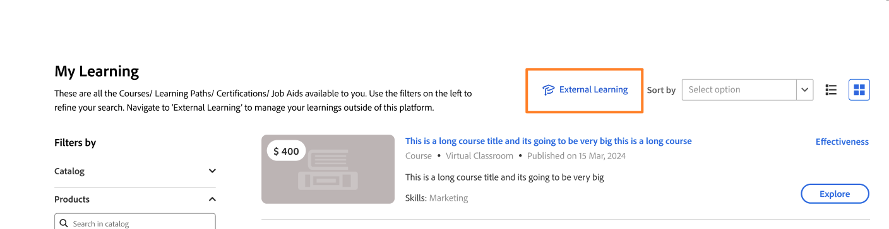
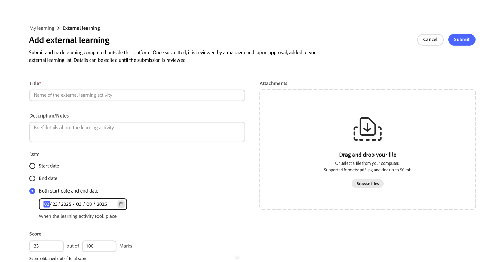

# Invia apprendimento esterno come Allievo

In Adobe Learning Manager puoi registrare i corsi di formazione completati al di fuori della piattaforma, ad esempio workshop, esami di certificazione, seminari o corsi online, utilizzando la funzione **Apprendimento esterno**. Ogni invio viene inviato al tuo manager per la revisione. Una volta approvata, l’attività viene visualizzata nella Trascrizione Allievo.

## Funzionamento del processo di invio dell’apprendimento esterno

Gli invii per l’apprendimento esterno seguono un processo in tre fasi:

1. Compila un modulo di invio con i dettagli sul corso di formazione completato e, facoltativamente, caricane una prova.

2. Il tuo manager riceve una notifica nella piattaforma e esamina il tuo invio.

3. Il tuo manager approva o rifiuta la richiesta. Riceverai una notifica della decisione sulla piattaforma.

Gli invii approvati vengono visualizzati nella **Trascrizione Allievo** come attività di apprendimento esterne completate.

Puoi inviare tutte le richieste di apprendimento esterno che desideri. Non esiste alcun limite al numero di inoltri che è possibile creare.

**Ricerca di apprendimento esterno nella navigazione**

L&#39;apprendimento esterno è disponibile da **Il mio apprendimento** nella navigazione principale. Seleziona **Apprendimento esterno** per visualizzare la cronologia di invio e creare nuovi invii.

<!---->

Se l’opzione **Apprendimento esterno** non è visualizzata, è possibile che l’amministratore non abbia abilitato la funzione per l’account. Contatta l&#39;amministratore per assistenza.

### Invia una richiesta di apprendimento esterna

1. Nella barra di navigazione a sinistra, seleziona **Il mio apprendimento**.

2. Seleziona l&#39;opzione **Apprendimento esterno**.

3. Seleziona **Aggiungi apprendimento esterno**.
   

4. Compila il modulo di invio:

   1. **Titolo:** Immetti il nome del corso di formazione. Questo campo è obbligatorio.

   2. **Descrizione/note:** aggiungi tutti i dettagli che aiutano il manager a comprendere il corso di formazione, ad esempio il nome del provider o gli obiettivi di apprendimento.

   3. **Data di inizio:** Selezionare la data di inizio del corso di formazione.

   4. **Data di fine:** Selezionare la data di completamento del corso di formazione.

   5. **Durata:** Immettere il tempo totale (in ore) dedicato al corso di formazione.

   6. **Punteggio:** Immetti il punteggio se il corso di formazione include una valutazione.

   7. **Allegati:** Caricare un certificato, una trascrizione o un altro documento come prova. I tipi di file supportati sono PDF, DOC, DOCX, PNG, JPEG e JPG. La dimensione massima del file è di 50 MB.
      

   8. Compila eventuali campi personalizzati aggiuntivi configurati dall’amministratore.

5. Seleziona **Invia**.

Il Manager riceve una notifica in-app che segnala che una nuova richiesta di apprendimento esterno è in attesa di revisione. L&#39;invio viene visualizzato nell&#39;elenco **Apprendimento esterno** con lo stato **In attesa di revisione**.
<!---->

>[!NOTE]
>
>Riceverai una notifica sulla piattaforma quando il tuo manager approva o rifiuta l’invio.

### Modificare un inoltro in sospeso

È possibile modificare un inoltro mentre il relativo stato è **In attesa di approvazione**. Una volta che il Manager lo approva o lo rifiuta, non puoi più modificare quell&#39;invio.

1. Nella scheda **Apprendimento esterno**, individua l’invio che desideri aggiornare.

2. Selezionare l&#39;inoltro per aprirlo.

3. Seleziona **Modifica**.

4. Aggiorna eventuali campi in base alle esigenze. Il modulo mostra l’ultima configurazione di campi impostata dall’amministratore, che potrebbe includere campi non presenti al momento dell’invio originale.

5. Seleziona **Invia**.

Il tuo manager riceve una nuova notifica e esamina il tuo invio aggiornato.

**Se l&#39;invio è stato rifiutato:** Non è possibile modificare un invio rifiutato. Per inviare nuovamente, crea una nuova richiesta di apprendimento esterno e fai riferimento a qualsiasi feedback fornito dal manager nel commento di revisione.

### Stati di invio dell’apprendimento esterno

| **Stato** | **Cosa significa** | **È possibile modificare?** |
|-----------------|----------------------------------------------------------------------------------|---------------------------------------------------------|
| In attesa di revisione | L&#39;invio è in attesa di revisione da parte del manager. | Sì. Seleziona **Modifica** dalla pagina dei dettagli dell&#39;invio. |
| Approvato | Il Manager ha approvato l’invio; è incluso nella Trascrizione Allievo. | N. |
| Rifiutato | Il tuo manager ha rifiutato l&#39;invio; rivedi il loro commento per ricevere indicazioni. | N. Crea una nuova richiesta di apprendimento esterno da inviare nuovamente. |
