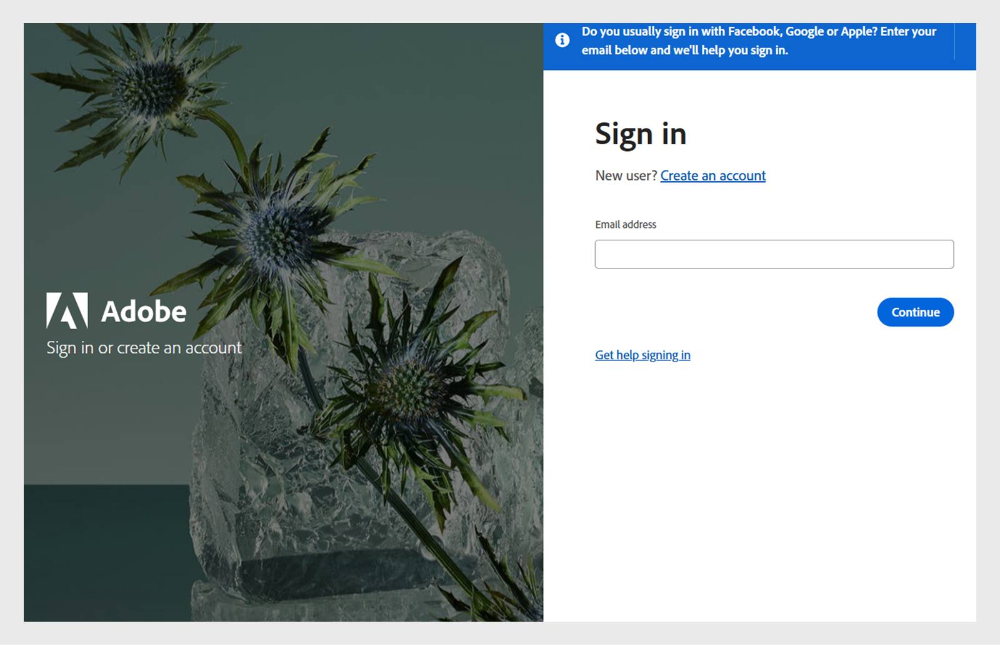

# Accesso

Accedi come Allievo in Learning Manager.

Quando si utilizza Adobe Learning Manager per la prima volta, gli allievi devono creare un account. Puoi farlo in uno dei due modi seguenti:

* Registrazione autonoma: utilizza l’URL fornito nell’e-mail di benvenuto per creare il tuo account.
* Account creato dall’amministratore: un amministratore può creare un account per tuo conto.

## Creare un account utilizzando l’URL di benvenuto

Segui questi passaggi per creare il tuo account utilizzando l&#39;URL dell&#39;e-mail di benvenuto:

1. Avvia Adobe Learning Manager tramite il collegamento sicuro ricevuto nell’e-mail di benvenuto dell’Amministratore.

   Viene visualizzata la schermata di accesso.

1. Seleziona Accedi.

   

   *Accedi con nome utente e password*

1. Digita Adobe ID, password e fai clic su Accedi.

   Se hai dimenticato la password, fai clic su Password dimenticata? e fornisci l’id e-mail utilizzato per la creazione di Adobe ID.

   <!--
   If you do not have an Adobe ID, [click here](../../../manage-account.md) to learn how to create an Adobe ID.
   -->

1. Digita le tue informazioni nei campi Attivi per completare il tuo profilo.

   
   _Digitare le informazioni sui campi attivi per completare la configurazione del profilo_

1. In alternativa, puoi utilizzare l’Enterprise ID facendo clic sul collegamento Accedi con un’Enterprise ID.

>[!NOTE]
>
>Una volta effettuato l’accesso per la prima volta, il tuo Adobe ID è associato al tuo account aziendale. Per tutti i successivi accessi, puoi assegnare un segnalibro all’URL dell’account (secondo url) ricevuto nell’e-mail di benvenuto.
