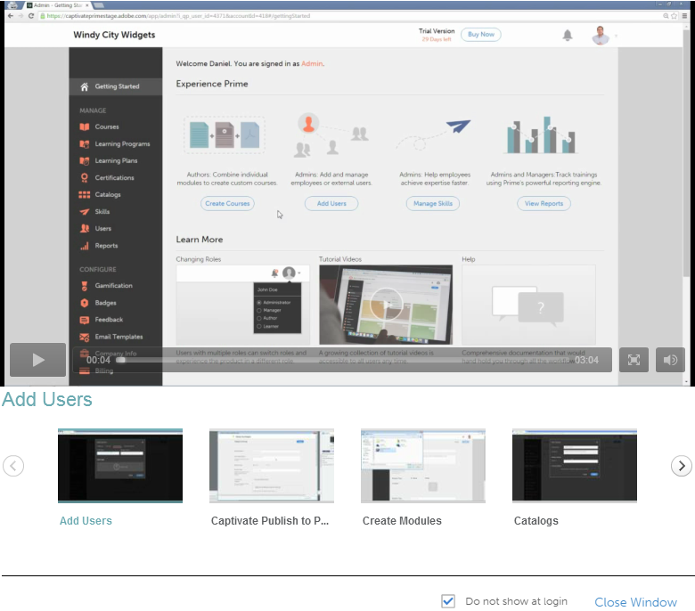

# Guida introduttiva per i Manager

La pagina della guida introduttiva illustra le funzionalità principali dell’applicazione.

Non appena accedi come Manager, puoi visualizzare la finestra a comparsa con un elenco di video.

## Visualizza video di esempio {#viewsamplevideos}

Sfoglia le esercitazioni video di esempio per comprendere le funzionalità chiave del tuo ruolo di Manager. Se non desideri visualizzare la finestra a comparsa durante l’accesso, puoi disattivarla facendo clic sull’opzione Non mostrare di nuovo all’accesso nell’angolo inferiore destro della finestra a comparsa.

Fai clic **[!UICONTROL Chiudi finestra]** per chiudere la finestra a comparsa.

<!-- -->

## Pagina introduttiva {#gettingstartedpage}

Dalla pagina iniziale, puoi eseguire le seguenti attività:

* Visualizza report: tieni traccia delle prestazioni del team utilizzando i report.
* Gestione team: nomina, approva e fornisce feedback per i corsi.

Puoi inoltre ottenere ulteriori informazioni sull’applicazione Learning Manager scegliendo di visualizzare video di esercitazione, contenuti della guida e informazioni sui diversi ruoli.

<!---->

