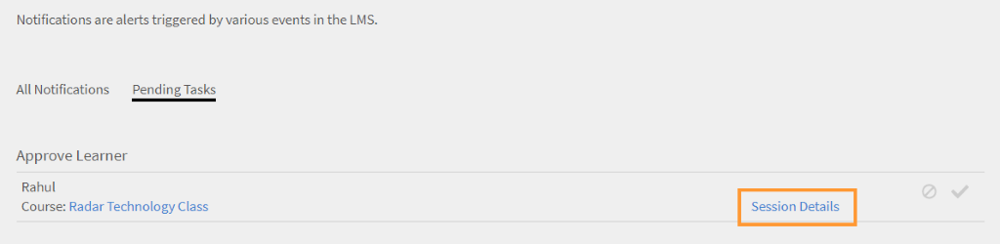

# Oggetti di apprendimento

Questo documento contiene informazioni sugli oggetti di apprendimento per i Manager.

Un Manager può iscrivere gli Allievi che lo seguono a corsi, programmi di apprendimento e certificazioni. Per ulteriori informazioni e i passaggi da seguire per l’iscrizione, consulta [Iscrivi Allievi.](../../administrators/feature-summary/courses.md#main-pars_header_1058138132)

## Corsi {#courses}

## Visualizzazione dei corsi {#viewingcourses}

In qualità di Manager, puoi visualizzare un elenco di tutti i corsi disponibili. Fai clic **[!UICONTROL Corsi]** nel riquadro a sinistra per visualizzare l’elenco dei corsi con opzioni di ricerca e filtro. Puoi anche visualizzare la percentuale di efficacia di ogni corso nelle miniature dei corsi. Tieni presente che puoi iscrivere i membri del team solo ai corsi che sono visibili nell’applicazione per allievi.

>[!NOTE]
>
>È possibile visualizzare l’elenco di tutti i corsi ritirati facendo clic sul pulsante **Ritirato** scheda.

## Visualizzare i punteggi dei quiz {#viewquizscores}

1. Fai clic sul nome del corso sulla miniatura del corso.
1. Fai clic sul punteggio del quiz nel riquadro a sinistra.

Puoi visualizzare i punteggi dei quiz di qualsiasi corso in base al nome utente o a ciascuna domanda. Scegli di conseguenza le schede Per utente o Per domanda. Puoi visualizzare solo il punteggio del quiz dei membri del team.

Scegli il tipo di istanza dall’elenco a discesa per visualizzare i punteggi in base a ciascuna istanza del corso.

## Gestire l’elenco degli Allievi per un corso {#managelearnerslistforacourse}

In qualità di Manager, puoi gestire l’elenco degli Allievi per i membri del team.

1. Fai clic sul nome del corso sulla miniatura del corso.
1. Nel riquadro a sinistra, fai clic su **[!UICONTROL Allievi]**.

*Seleziona un’azione Allievo*

Puoi eseguire le seguenti azioni dalla pagina Allievi:

* Seleziona l’Allievo da rimuovere e fai clic su Azioni > Rimuovi.
* Seleziona l’Allievo di cui desideri contrassegnare la partecipazione e fai clic su Azioni > Contrassegna come completato.

Per consentire agli Allievi di ripristinare un modulo e di utilizzarlo di nuovo, fai clic su Ripristina. Nella finestra a comparsa, fai clic su Sì per confermare la reimpostazione. I moduli completati non possono essere ripristinati. È possibile ripristinare solo i moduli non riusciti o incompleti.

Puoi anche esportare l’elenco degli Allievi in un foglio Excel. Per esportare l’elenco degli Allievi, fai clic su Azioni > Esporta.

>[!NOTE]
>
>Se sono presenti più istanze per un corso, l’elenco degli Allievi in Excel viene fornito separatamente in ogni scheda. L’elenco degli Allievi comprende il nome, lo stato e i criteri di selezione degli Allievi. Lo stato degli Allievi può essere **Non avviato** o **In corso** o **Completato**.

## Visualizza feedback L1 e L3 {#viewl1andl3feedback}

Puoi visualizzare il feedback L1 fornito dagli allievi per un corso e il feedback L3 fornito agli iscritti al team.

1. Fai clic su qualsiasi riquadro del corso nell’elenco Corsi.
1. Fai clic su Feedback L1 o Feedback L3 nel riquadro a sinistra per visualizzare il feedback ricevuto.
1. Seleziona l’istanza dall’elenco a discesa per visualizzare il feedback per quella particolare istanza.

## Anteprima dei corsi {#previewcourses}

Il Manager può visualizzare in anteprima i corsi facendo clic sul pulsante **Anteprima come Allievo** durante la visualizzazione dei moduli del corso.

1. Fai clic **[!UICONTROL Corsi]** nel riquadro a sinistra dopo l’accesso.
1. Fai clic su un riquadro del corso nell’elenco dei corsi presenti nella pagina.
1. Fai clic su Anteprima come Allievo dal riquadro a sinistra e fai clic sul nome del modulo nella pagina per visualizzare in anteprima il modulo del corso nel lettore.

## Efficacia dei corsi {#courseeffectiveness}

L’efficacia dei corsi viene valutata per comprendere l’utilità di un corso per gli allievi. È una combinazione di risultati dei feedback degli allievi sul contenuto del corso, risultati del quiz sul corso per un Allievo e feedback del Manager che valuta un Allievo in base agli allievi del corso.

Puoi visualizzare la valutazione dell’efficacia del corso nelle miniature, come mostrato nell’immagine seguente. Puoi visualizzare la valutazione di questo corso su 100.

<!---->

Il valore di valutazione dell’efficacia del corso viene ottenuto tenendo conto dei valori di feedback L1, L2 e L3. Per visualizzare la suddivisione di ogni feedback, fai clic sul valore di efficacia del corso. Viene visualizzata una finestra a comparsa come illustrato di seguito.

*Visualizza l’efficacia del corso per feedback*

In questa immagine di esempio, 1 utente su 1 ha ricevuto tutti e tre i feedback, pertanto il punteggio è 100/100. In questa tabella, puoi vedere come se uno qualsiasi dei tre feedback (L1, L2 e L3 ) non viene fornito per un corso, l’efficacia globale avrà risultato negativo. Fai clic sulla freccia rivolta verso il basso nell’angolo in basso a destra della finestra a comparsa per vedere come vengono effettuati i calcoli dell’efficacia dei corsi.

*Calcolo dell’efficacia del corso*

Come per il grafico a torta mostrato sopra, viene dato un maggiore peso al feedback L3 dal manager.

## Ricerca di corsi, programmi di apprendimento e certificazioni {#searchingcourseslearningprogramsandcertifications}

Adobe Learning Manager consente di individuare i corsi/programmi di apprendimento che cerchi rapidamente e con facilità. Puoi cercare i tuoi corsi in due modi:

1. Utilizzo del campo di ricerca. Fai clic sull’icona di ricerca visualizzata nell’angolo in alto a destra. Viene visualizzato un campo di ricerca. Digita il nome del corso o le parole chiave associate ai tuoi corsi per individuare i corsi/programmi di apprendimento. Puoi anche eseguire ricerche utilizzando tag predefiniti come Captivate, C, Java e HTML. I tag sono ricercabili all’interno del campo di ricerca, il che significa che vengono visualizzati nel campo di ricerca durante la digitazione. La ricerca può essere eseguita anche utilizzando un ID univoco.
1. Applicando un filtro all’elenco di corsi/programmi di apprendimento/certificazioni. Puoi filtrare i corsi per stato come Tutti, Pubblicati e Ritirati.

Puoi eseguire una ricerca in base alle competenze facendo clic su Competenze e poi scegliendole. In qualità di Manager, puoi ordinare i corsi in quattro modi, per meglio individuare il corso richiesto. Fai clic su Ordina per e scegli l’ordine alfabetico crescente o decrescente, la data di aggiornamento del corso o l’efficacia dei corsi:

*Ricerca basata sulle competenze*

Puoi ordinare i programmi di apprendimento in tre modi: ordine alfabetico crescente, decrescente e basato sulla data di aggiornamento.

## Iscrizione degli Allievi ai corsi {#enrollinglearnersintocourses}

I Manager iscrivono alcuni Allievi ai corsi obbligatori in base ai requisiti dell’organizzazione:

1. Passa il mouse su qualsiasi riquadro del corso pubblicato e fai clic su Iscrivi Allievi.

   In alternativa, fai clic su qualsiasi riquadro del corso pubblicato e fai clic sugli Allievi nel riquadro a sinistra. Viene visualizzata una pagina con un elenco di Allievi. Fai clic su Iscrizione.\
   Viene visualizzata la finestra di dialogo di iscrizione degli Allievi.

1. Immetti il profilo o il nome degli Allievi per scegliere gli Allievi e fai clic su Salva.

>[!NOTE]
>
>Puoi iscrivere solo gli Allievi che appartengono al team.

## Programmi di apprendimento {#learningprograms}

Il Manager può iscriversi, visualizzare i punteggi dei quiz, i feedback L1 e L3 e annullare l’iscrizione solo dei suoi giornalisti.

## Aggiunta di Allievi a un programma di apprendimento {#addlearnerstoalearningprogram}

1. In modalità Manager, fai clic su Programmi di apprendimento nel riquadro a sinistra.
1. Seleziona il programma di apprendimento pubblicato dall’elenco dei riquadri a cui desideri aggiungere gli Allievi.
1. Fai clic su Allievi nel riquadro a sinistra nella categoria Report programma. Nota: prima di aggiungere Allievi, è necessario pubblicare il programma di apprendimento.
1. Fai clic sul collegamento di iscrizione nella pagina.
1. Inizia a digitare il profilo o il nome degli Allievi e scegli gli Allievi dall’elenco a discesa degli Allievi. Fai clic su Salva.

## Visualizzare i punteggi dei quiz {#Viewquizscores-1}

1. Fai clic su un riquadro qualsiasi del programma di apprendimento.
1. Fai clic sul punteggio del quiz nel riquadro a sinistra.

Puoi visualizzare i punteggi dei quiz di qualsiasi programma di apprendimento in base al nome utente o a ciascuna domanda. Scegli di conseguenza le schede Per utente o Per domanda. I punteggi dei quiz vengono visualizzati per un corso alla volta. Modifica il nome del corso dal menu a discesa per visualizzare i punteggi del quiz per gli altri corsi. Puoi anche esportare i punteggi dei quiz di ogni corso. Scegli il tipo di istanza dall’elenco a discesa per visualizzare i punteggi in base a ciascuna istanza del programma di apprendimento.

## Annullamento dell’iscrizione per gli Allievi {#unenrollmentforlearners}

Il Manager può annullare l’iscrizione di un Allievo se l’Allievo non ha ancora avviato il programma di apprendimento.

## Contrassegna completamento {#markcompletion}

Un Manager può contrassegnare un LP come completo per gli Allievi. Per ulteriori informazioni, consulta [Contrassegna completamento](../../administrators/feature-summary/learning-paths.md).

## Certificazioni {#certifications}

## Iscrizione degli Allievi alla certificazione {#enrolllearnerstothecertification}

Puoi iscrivere gli Allievi alla certificazione in due modi. Segui i passaggi riportati di seguito per iscrivere gli Allievi.

1. Dopo aver effettuato l’accesso come Manager, fai clic su Certificazioni nel riquadro a sinistra. Dall’elenco della scheda Pubblicati, passa il mouse su ogni certificazione e fai clic su Iscrivi Allievi. In alternativa, fai clic su qualsiasi riquadro della certificazione pubblicato e fai clic su Allievi nel riquadro a sinistra. Fai clic su + Iscriviti sul lato destro della pagina Allievi per iniziare ad aggiungere gli Allievi.
1. È possibile visualizzare la finestra di dialogo a comparsa Iscrivi Allievi dopo aver fatto clic sull’opzione Iscrivi Allievi in ciascuno dei due passaggi precedenti. Inizia a digitare il nome dell’Allievo, il profilo e scegli il nome dell’Allievo dall’elenco a discesa, quindi fai clic su Salva.

## Annullamento dell’iscrizione per gli Allievi {#Unenrollmentforlearners-1}

Il Manager può annullare l’iscrizione di un Allievo se lo stesso non ha ancora avviato la certificazione.

## Contrassegna completamento {#Markcompletion-1}

Un Manager può contrassegnare il completamento della certificazione. Per ulteriori informazioni, consulta [Contrassegna completamento](../../administrators/feature-summary/certifications.md#main-pars_header_303097138).

## Notifiche del Manager per l’approvazione del corso per Allievi {#manager-notifications-course-approval}

Quando tenta di accettare o rifiutare l’iscrizione di un Allievo, ora un Manager può visualizzare i dettagli della sessione (**Videoconferenze** oppure **Aula**) nella finestra pop.

*Approva o rifiuta la richiesta di iscrizione di un Allievo*

Vengono visualizzati i seguenti dettagli della sessione:

* Nome sessione
* Nome dell’istruttore
* Posizione
* Data e ora

Flusso di lavoro:

1. Il manager riceve una notifica dopo che un Allievo ha richiesto l’approvazione di un corso.

1. Il manager fa clic su **Dettagli della sessione**.

   

   *Visualizza attività in sospeso*

1. Il manager quindi approva o rifiuta la richiesta.
1. Il Manager riceve una conferma o un messaggio di errore se l&#39;approvazione o il rifiuto non sono stati eseguiti come previsto.
1. L’Allievo riceve una notifica in merito all’approvazione o al rifiuto dell’iscrizione al corso.

## Invio opzionale per certificazioni esterne {#optional}

Nelle versioni precedenti di Learning Manager, per il completamento di una certificazione esterna, un Manager accettava il file inviato da un Allievo. Il Manager riceve una notifica solo dopo che l’Allievo ha inviato il file.

Un Manager può ora visualizzare un elenco di Allievi che hanno effettuato l’iscrizione alla certificazione esterna in una pagina di invio presente all’interno della certificazione esterna e può Accettare o Rifiutare dalla pagina stessa senza attendere una notifica.

Quando il Manager accetta senza attendere l’invio del file, l’Allievo riceve un nuovo messaggio che il Manager ha accettato e non deve inviare il file. Se il Manager rifiuta senza inviare il file, può scegliere di accettarlo di nuovo senza attendere il file.

Se l’Allievo invia il file, il Manager può visualizzare il file dalla pagina di invio e può accettare o rifiutare in base al file inviato.

*Accetta o rifiuta in base all&#39;invio di file*

Quando i corsi sono impostati come obbligatori:

* La pagina di invio elenca gli Allievi solo dopo che gli Allievi hanno completato i corsi.
* L’Allievo può caricare un file solo dopo aver completato il corso.

## Risorse formative {#jobaids}

Il manager può gestire l’assegnazione delle risorse formative per i suoi giornalisti. Tuttavia, in qualità di Manager, puoi visualizzare solo le risorse formative pubblicate, mentre un Amministratore può visualizzare anche le risorse formative ritirate.
