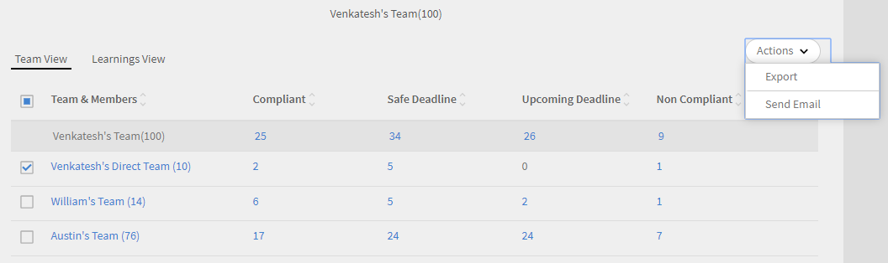
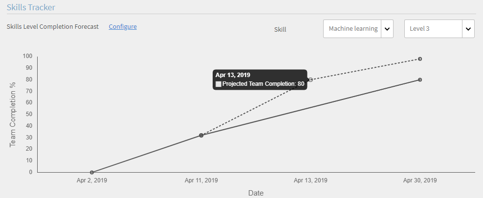
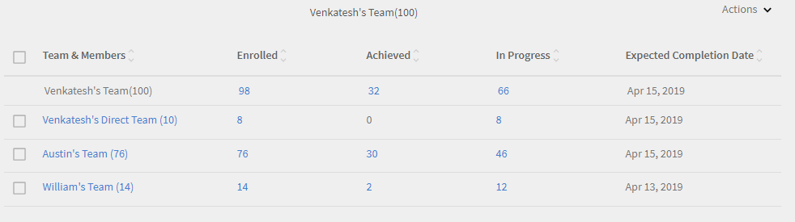

# Dashboard per i Manager

Scopri come visualizzare e tenere traccia degli apprendimenti dal dashboard per i Manager.

I Manager svolgono un ruolo importante nelle iniziative di apprendimento di un team. Per aiutarlo al meglio, la piattaforma di apprendimento fornisce al Manager una vista dashboard per tenere traccia degli apprendimenti all’interno del proprio team.

*Report dashboard per un Manager*

Per visualizzare i dettagli di un grafico, fai clic sul grafico o sul collegamento ipertestuale **[!UICONTROL Dettagli]**.

## Riepilogo apprendimento {#learningsummary}

Il Manager può visualizzare il riepilogo delle attività di apprendimento del suo team relative a un periodo di tempo selezionato. Seleziona mese, trimestre o anno dal menu a discesa.

“Mese” e “Anno” si basano sull’anno solare, mentre “Trimestre” si basa sull’esercizio finanziario configurato dall’Amministratore nelle impostazioni dell’account.

*Visualizza le attività di apprendimento in un periodo di tempo*

## Vista team {#teamview}

Nella vista team sono visualizzati i team, i relativi membri e le rispettive iscrizioni, i progressi e i completamenti per gli oggetti di apprendimento.

*Nella visualizzazione Team sono visualizzati i team, i relativi membri e le rispettive iscrizioni*

Facendo clic sui nomi dei team, ad esempio Team di Venkatesh, è possibile visualizzare i membri del team di Venkatesh insieme al numero totale di iscrizioni, progressi e completamenti per un oggetto di apprendimento.

*Selezionare un membro del team*

Per visualizzare il riepilogo dell’apprendimento per ciascun membro del team, fai clic nella rispettiva colonna sul numero corrispondente al Manager del team. Si apre una tabella nella quale è riportato l’elenco degli oggetti di apprendimento con Data di iscrizione, Scadenza e Informazioni sull’avanzamento.

*Selezionare un team manager*

Allo stesso modo, puoi visualizzare gli oggetti di apprendimento insieme al numero di iscrizioni, progressi o completamenti facendo clic sui valori riportati sotto le colonne corrispondenti.

*Visualizza corsi e riepilogo apprendimento*

Facendo ulteriormente clic sul numero di iscrizioni, progressi o completamenti per ciascun apprendimento, è possibile visualizzare i seguenti dettagli: persone, data di iscrizione/completamento, data di scadenza e progressi compiuti.

*Visualizza la data di iscrizione/completamento, la data di scadenza e lo stato di avanzamento*

## Vista apprendimenti {#learningsview}

La vista apprendimenti mostra il numero di iscrizioni, progressi e completamenti per un oggetto di apprendimento.

Per visualizzare dettagli quali persone, date di iscrizione, date di scadenza e avanzamento per i rispettivi oggetti di apprendimento, fai clic sui valori corrispondenti nelle colonne relative a iscrizioni, progressi e completamenti.

*Visualizzazione Allievi*

## Esportazione di report {#exportreport}

Per generare un report Excel, selezionare **[!UICONTROL Azioni] > [!UICONTROL Report]**

## Stato di conformità {#compliancestatus}

Nel dashboard di conformità, i Manager possono visualizzare lo stato di conformità complessivo del team per gli apprendimenti configurati in categorie specifiche (ad esempio, vendite, marketing e legale). Gli amministratori possono creare un dashboard con corsi di conformità, percorsi di apprendimento o certificazioni e condividerlo con i Manager. I manager possono visualizzare il dashboard condiviso dall’amministratore nelle loro istanze.

### Visualizzare il dashboard

Per visualizzare il dashboard, seleziona **[!UICONTROL dashboard di conformità]** dall’app di gestione.

_App per la gestione del dashboard di conformità_

Il dashboard di conformità include i seguenti stati di conformità:

* **[!UICONTROL Allievi non conformi]**: mostra il numero di allievi che non hanno rispettato le scadenze.
* **[!UICONTROL Allievi in prossimità di scadenze]**: mostra il numero di Allievi con scadenze in meno di 30 giorni.
* **[!UICONTROL Allievi con scadenze sicure]**: mostra il numero di Allievi con scadenze più lontane (più di 30 giorni).
* **[!UICONTROL Allievi completamente conformi]**: mostra il numero di Allievi completamente conformi.
* **[!UICONTROL Allievi non iscritti da nessuna parte]**: mostra il numero di Allievi non iscritti a corsi, percorsi di apprendimento o certificazioni.

### Responsabili e-mail e Allievi

**Gestione di più team**

Se gestisci più team, puoi comunicare ai tuoi manager lo stato di apprendimento dei membri del team selezionando l&#39;opzione **[!UICONTROL Responsabili e-mail]** disponibile nella sezione **[!UICONTROL Visualizzazione team]**.

_Responsabili della posta elettronica_

**[!UICONTROL Email Manager]** offre le seguenti opzioni:

* **[!UICONTROL Responsabili e-mail di Allievi non conformi]**: invia una notifica ai Manager i cui membri del team hanno mancato le scadenze.
* **[!UICONTROL Responsabili e-mail degli Allievi che si avvicinano alle scadenze]**: invia una notifica ai Manager i cui membri del team hanno scadenze imminenti.

**Gestione di un singolo team**

Se gestisci un singolo team, puoi informare gli Allievi dello stato di apprendimento selezionando l’opzione **[!UICONTROL Invia e-mail agli Allievi]** disponibile nella sezione **[!UICONTROL Visualizzazione team]**.

_Invia e-mail agli Allievi_

L’opzione **[!UICONTROL Invia e-mail agli Allievi]** offre le seguenti opzioni:

* **[!UICONTROL Invia un’e-mail agli Allievi non conformi]**: invia una notifica agli Allievi che non hanno rispettato le scadenze.
* **[!UICONTROL Invia un messaggio e-mail agli Allievi che si avvicinano alle scadenze]**: invia una notifica agli Allievi con scadenze imminenti.

### Scarica report

Per scaricare il report, effettua le seguenti operazioni:

1. Nell’app per manager, accedi a **[!UICONTROL Dashboard di conformità]** > **[!UICONTROL Visualizzazione team]**.
1. Seleziona **[!UICONTROL Scarica report]** per salvare il dashboard come report.
Ciò ti consente di monitorare l&#39;avanzamento complessivo dell&#39;apprendimento del tuo team.

_Download dei report_

<!--On this dashboard, managers can also view the learners who are compliant, in a safe deadline, approaching deadline, and non-compliant for a selected learning object. 

Learning Objects with completion deadlines can be configured in compliance dashboard for tracking. 

**Compliant**: Displays the number of learners who have completed the learning object within completion deadline.

**Safe deadline**: Displays the number of learners who have less than 30 days available to complete a learning object.

**Upcoming Deadline**: Displays the number of learners with more than 30 days available to complete a learning object.

**Non-compliant**: Displays the number of learners who did not complete the learning object within the completion deadline.

*View compliance dashboard*

## Team View {#TeamView-1}

Displays the compliance status of a course for respective teams. Compliant, Safe Deadline, Upcoming Deadline, and Non-Compliant are columns in the Team View table.

*compliance status of a course for respective teams*

To display names of the members in a team and the individual number of courses for which their status is Compliant, in Safe Deadline, reaching Upcoming Deadline, and Non Compliant, click the corresponding values in the table.

*Select individual teams*

On further clicking the values in the compliant, safe deadline, upcoming deadline, and non-compliant column, the corresponding course details are displayed: Learning object name, enrollment/ completion date, due date, and progress in percentage.

 

*View progress of courses*

## Learnings View {#LearningsView-1}

In the Compliance Status Learnings View, the list of Learning Objects and the corresponding number of team members that are Compliant, within a Safe Deadline, have an Upcoming Deadline, or are Non Compliant is displayed.

*View deadline and compliance status*

On further clicking the values in the compliant, safe deadline, upcoming deadline, and non compliant columns, the following data is displayed: People, Enrollment Date, Completion date, and Progress.

*View details of compliance*

## Export data & send emails {#exportdataampsendemails}

* To export the compliance status for team and learnings view, click **[!UICONTROL Actions]** > **[!UICONTROL Export]**.

* To send an email to team members, click **[!UICONTROL Actions]** > **[!UICONTROL Send Email]**.

*Export and email data*-->

## Abilità del team {#teamskills}

I Manager possono visualizzare il grafico di completamento delle abilità e configurare una previsione di completamento delle abilità a diversi livelli. L’elenco a discesa delle abilità include cinque abilità. Il manager conosce le competenze acquisite dai membri del team e identifica i forti talenti in determinate abilità.

I manager possono anche guidare determinate abilità in un team impostando un obiettivo e prevedendo quanto tempo occorrerebbe per raggiungere un’abilità per una percentuale specifica di un team entro una tempistica.

Questa previsione si basa su calcoli di sistema che forniscono una prospettiva futura in merito allo sviluppo di quella specifica abilità.

*Visualizza previsione abilità*

Per visualizzare lo stato delle abilità di un team, segui i passaggi seguenti:

1. Fai clic su **[!UICONTROL Abilità team]** dal riquadro a sinistra nella sezione Visualizzazione team personale.
1. Per visualizzare le abilità mostrate, fai clic sul filtro Abilità e selezionane una dall’elenco a discesa.
1. Per selezionare un livello (Livello 1, Livello 2 o Livello 3), fai clic sul menu a discesa del livello.
1. In base all’abilità e al livello selezionato, viene visualizzato un grafico con lo stato dell’abilità. Passando il mouse sul grafico, è possibile visualizzare le seguenti percentuali relative allo stato dell’abilità: **Acquisizione in corso** e **Acquisita**.

   

   *Visualizza percentuale dello stato delle abilità*

## Come prevedere la % di completamento di un’abilità da parte del team {#howtoforecasttheteamcompletionforaskill}

Per prevedere la % di completamento di un’abilità da parte del team, procedi come indicato di seguito:

1. Per visualizzare lo strumento di tracciamento della configurazione, fai clic sul collegamento ipertestuale di configurazione.

   

   *Selezionare il collegamento ipertestuale Configura*

1. Dalla finestra di dialogo di configurazione a comparsa, inserisci un valore percentuale per l’abilità che desideri configurare nel campo **% di completamento prevista** e la data entro la quale desideri venga raggiunta la % di completamento stabilita nel campo **Data stabilita**.****

   

   *Immettere la percentuale di completamento prevista*

1. Per visualizzare l’output relativo alla previsione, fai clic sul pulsante **Stima**. L’output è simile a quello riportato nella schermata seguente.

   

   *Visualizza output di skill tracxker*

## Previsione del completamento del livello di abilità {#skilllevelcompletionforecast}

Il Manager di un team può visualizzare e configurare la percentuale di completamento di un’abilità da parte del team per un particolare periodo di tempo in base alla percentuale di completamento prevista e alla data indicata nello strumento di tracciamento delle abilità.

Nel grafico di previsione vi sono due tipi di linee (linea continua e linea tratteggiata) con tre vertici ciascuna.

Sulla linea continua, il primo punto visualizza la data della prima iscrizione per un livello di abilità.

*Visualizza prima iscrizione per un livello di abilità*

Il secondo punto mostra la data e il livello % di completamento dell’abilità da parte del team correnti.

*Visualizza la data corrente e il livello di % di completamento del team dell&#39;abilità*

Il terzo punto sulla linea mostra la percentuale di completamento prevista e la data di completamento stimata.

*Visualizza la % prevista di completamento della destinazione e la data prevista di completamento*

## Linea della previsione {#forecastline}

La linea tratteggiata è la linea relativa alla previsione, che visualizza la previsione a seconda della % di completamento corrente di un’abilità da parte del team in un determinato periodo di tempo.

Il primo punto sulla linea tratteggiata rappresenta la % di completamento e la % di completamento prevista per una data abilità in quella data.

*Visualizza la % di completamento team e la % di completamento team prevista per un&#39;abilità*

Il secondo punto visualizza la data in cui è stata raggiunta la % di completamento prevista di un’abilità da parte del team.

*Visualizza la data in cui è stata raggiunta la % di completamento del team previsto per un&#39;abilità*

Il terzo punto sulla linea relativa alla previsione mostra la % di completamento raggiunta alla data stabilita specificata nello strumento di tracciamento delle abilità.

*Visualizza la % di completamento del team raggiunta alla data di destinazione specificata nel tracciatore delle abilità*

Sotto il grafico, viene visualizzata una tabella con la vista del team e il numero di abilità a cui è stata effettuata l’iscrizione, che sono state acquisite o sono in corso di acquisizione. Se per un apprendimento è stata specificata una data di completamento, viene visualizzata anche la data di completamento prevista.

*Tabella con visualizzazione del team e numero di abilità registrate, acquisite e in corso*

Facendo clic sul nome del team, viene visualizzato l’elenco dei membri che si sono iscritti all’abilità, lo stato dell’abilità e la data di completamento.

*Visualizza elenco di membri*

Facendo clic sul team, puoi visualizzare i membri in esso contenuti e i dettagli corrispondenti per l’abilità selezionata, ad esempio l’eventuale iscrizione, lo stato (se in corso di acquisizione o acquisita) e la data di completamento, se impostata.

*Visualizza abilità degli iscritti*

Selezionando i valori relativi a un team nelle colonne Iscrizione, Acquisita e In corso di acquisizione, è possibile visualizzare il numero di utenti che si sono iscritti all’abilità. È anche possibile visualizzare la data in cui l’utente si è iscritto all’abilità, lo stato e la data di completamento, se l’abilità è stata completata dall’utente.

<!-- -->

## Esportazione di report {#Exportreport-1}

* Fai clic su **[!UICONTROL Azioni]** > **[!UICONTROL Esporta]** per esportare i dati come file Excel.

*Esportare i dati*
