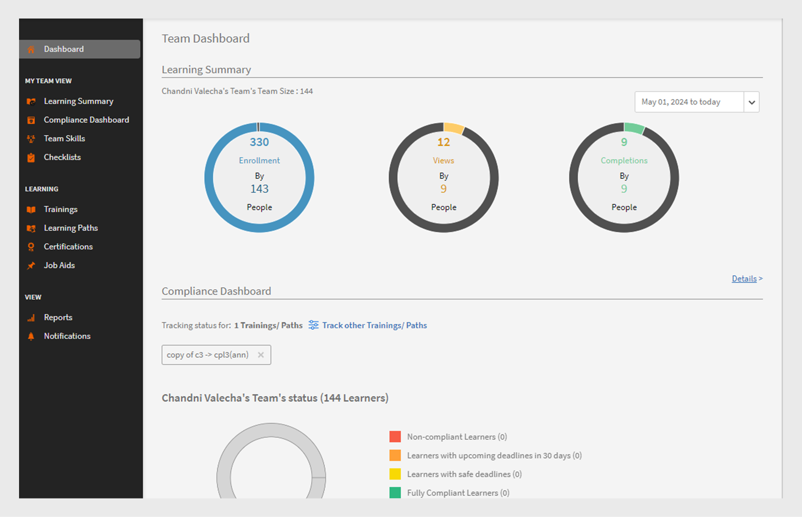
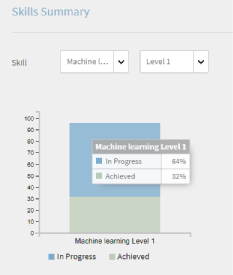
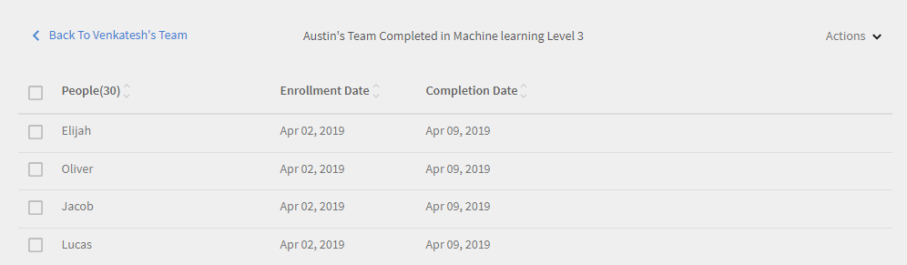

# Dashboard per i Manager

Scopri come visualizzare e tenere traccia degli insegnamenti dal dashboard dei Manager.

I Manager svolgono un ruolo importante nelle iniziative di apprendimento di un team. Per guidarli meglio, la piattaforma di apprendimento fornisce al manager una visualizzazione della dashboard per tenere traccia dei corsi di apprendimento nel team.

*Report dashboard per un Manager*

Per visualizzare i dettagli di un grafico, fate clic sul grafico o su **[!UICONTROL Dettagli]** collegamento ipertestuale.

## Riepilogo dell’apprendimento {#learningsummary}

Un Manager può visualizzare il riepilogo delle attività di apprendimento per il proprio team in un periodo di tempo selezionato. Seleziona mese, trimestre o anno dal menu a discesa.

&quot;Mese&quot; e &quot;Anno&quot; sono basati sull’anno solare, mentre &quot;Trimestre&quot; è basato sull’anno finanziario configurato dall’Amministratore nelle impostazioni dell’account.

*Visualizza le attività di apprendimento in un periodo di tempo*

## Visualizzazione team {#teamview}

La visualizzazione Team mostra i team, i relativi membri e le rispettive iscrizioni, progressi e completamenti per gli oggetti di apprendimento.

*La visualizzazione Team mostra i team, i relativi membri e le rispettive iscrizioni*

Facendo clic sui nomi dei team, ad esempio Team di Venkatesh, è possibile visualizzare i membri del team di Venkatesh insieme al numero totale di iscrizioni, progressi e completamenti per un oggetto di apprendimento.

*Selezionare un membro del team*

Per visualizzare il Riepilogo apprendimento per ogni membro del team, fai clic sul numero nella rispettiva colonna che corrisponde al team manager. Viene visualizzata una tabella che mostra l’elenco degli oggetti di apprendimento con informazioni sulla data di iscrizione, la data di scadenza e l’avanzamento.

*Seleziona un team manager*

Allo stesso modo, puoi visualizzare gli oggetti di apprendimento insieme al numero di iscrizioni, progressi o completamenti facendo clic sui valori nelle colonne corrispondenti.

*Visualizzazione dei corsi e del riepilogo dell’apprendimento*

Facendo ulteriormente clic sul numero di iscrizioni, progressi o completamenti per ciascun apprendimento, è possibile visualizzare i seguenti dettagli: persone, data di iscrizione/completamento, data di scadenza e progressi compiuti.

*Visualizza la data di iscrizione/completamento, la data di scadenza e lo stato di avanzamento*

## Visualizzazione Allievi {#learningsview}

La vista Apprendimento visualizza il numero di iscrizioni, progressi e completamenti per un oggetto di apprendimento.

Per visualizzare i dettagli, tra cui persone, date di iscrizione, date di scadenza e avanzamento per i rispettivi oggetti di apprendimento, fai clic sui valori corrispondenti nelle colonne Iscrizioni, progressi e completamenti.

*Visualizzazione Allievi*

## Esportare un report {#exportreport}

Per generare un report Excel, fare clic su **[!UICONTROL Azioni] > [!UICONTROL Report]**

## Stato conformità {#compliancestatus}

I Manager possono visualizzare lo stato di conformità complessivo del team per gli Allievi configurati nel dashboard di conformità. L’elenco degli Allievi è configurabile e il Manager può selezionare gli Allievi per tenere traccia dello stato di conformità.

In questa dashboard, i Manager possono anche visualizzare gli Allievi conformi, in una scadenza sicura, prossimi alla scadenza e non conformi per un oggetto di apprendimento selezionato.

Gli oggetti di apprendimento con scadenze di completamento possono essere configurati nel dashboard di conformità per il tracciamento.

**Conforme**: visualizza il numero di Allievi che hanno completato l’oggetto di apprendimento entro la scadenza di completamento.

**Scadenza sicura**: visualizza il numero di Allievi con meno di 30 giorni di disponibilità per completare un oggetto di apprendimento.

**Prossima scadenza**: visualizza il numero di Allievi con più di 30 giorni disponibili per completare un oggetto di apprendimento.

**Non conforme**: visualizza il numero di Allievi che non hanno completato l’oggetto di apprendimento entro la scadenza di completamento.

*Visualizza dashboard di conformità*

## Visualizzazione team {#TeamView-1}

Visualizza lo stato di conformità di un corso per i rispettivi team. Le colonne Conforme, Scadenza sicura, Scadenza imminente e Non conforme sono incluse nella tabella Visualizzazione team.

*stato di conformità di un corso per i rispettivi team*

Per visualizzare i nomi dei membri di un team e il numero individuale di corsi il cui stato è Conforme, in Scadenza sicura, Scadenza imminente e Non conforme fare clic sui valori corrispondenti nella tabella.

*Seleziona singoli team*

Facendo ulteriormente clic sui valori nella colonna relativa a conformità, scadenza sicura, scadenza imminente e non conforme, vengono visualizzati i dettagli del corso corrispondente: nome dell’oggetto di apprendimento, data di iscrizione/completamento, data di scadenza e avanzamento in percentuale.

 

*Visualizzare lo stato di avanzamento dei corsi*

## Visualizzazione Allievi {#LearningsView-1}

Nella Visualizzazione Allievi dello stato di conformità, viene visualizzato l’elenco degli Oggetti di apprendimento e il numero corrispondente di membri del team che sono Conformi, entro una Scadenza sicura, hanno una Scadenza imminente o non conformi.

*Visualizzare la scadenza e lo stato di conformità*

Facendo ulteriormente clic sui valori nelle colonne Conformità, Scadenza sicura, Scadenza imminente e Non conforme, vengono visualizzati i seguenti dati: Persone, Data iscrizione, Data completamento e Avanzamento.

*Visualizza dettagli di conformità*

## Esportare dati e inviare e-mail {#exportdataampsendemails}

* Per esportare lo stato di conformità per la visualizzazione Team e Allievi, fai clic su **[!UICONTROL Azioni]** > **[!UICONTROL Esporta]**.

* Per inviare un&#39;e-mail ai membri del gruppo, fai clic su **[!UICONTROL Azioni]** > **[!UICONTROL Invia e-mail]**.

*Esportazione e invio di dati tramite e-mail*

## Abilità team {#teamskills}

I Manager possono visualizzare il grafico di completamento delle abilità e configurare una previsione di completamento delle abilità a diversi livelli. Nell’elenco a discesa Abilità sono elencate cinque abilità. Il manager conosce le competenze acquisite dai membri del team e identifica i forti talenti in determinate abilità.

I manager possono anche guidare determinate abilità in un team impostando un obiettivo e prevedendo quanto tempo occorrerebbe per raggiungere un’abilità per una percentuale specifica di un team entro una tempistica.

Questa previsione si basa su calcoli di sistema che forniscono una visione in futuro per un progresso di quella specifica abilità.

*Visualizza previsione abilità*

Per visualizzare lo stato delle abilità di un team, segui i passaggi seguenti:

1. Fai clic **[!UICONTROL Abilità team]** dal riquadro sinistro nella sezione Visualizzazione team personale.
1. Per visualizzare le abilità visualizzate, fai clic sul filtro delle abilità e selezionane una dall’elenco a discesa.
1. Per selezionare un livello (Livello 1, Livello 2 o Livello 3), fare clic sul menu a discesa Livello.
1. In base all’abilità e al livello selezionati, viene visualizzato un grafico con lo stato dell’abilità. Passando il cursore del mouse sul grafico, puoi visualizzare le seguenti percentuali dello stato delle abilità: **In corso** e **Ottenuto**.

   

   *Visualizza percentuale dello stato delle abilità*

## Come prevedere la % di completamento del team per un’abilità {#howtoforecasttheteamcompletionforaskill}

Per prevedere la % di completamento del team per un’abilità, segui i passaggi riportati di seguito:

1. Per visualizzare il tracciatore di configurazione, fate clic sul collegamento ipertestuale di configurazione.

   

   *Seleziona il collegamento ipertestuale Configura*

1. Nella finestra di dialogo di configurazione a comparsa, immetti un valore percentuale per l’abilità che desideri configurare nel **% completamento obiettivo** e la data entro la quale si desidera raggiungere la % di completamento prevista nel **Data di scadenza** campo.****

   

   *Immetti percentuale di completamento obiettivo*

1. Per visualizzare l&#39;output della previsione, fare clic sul pulsante **Stima** pulsante. L’output è simile a quello riportato nella schermata seguente.

   

   *Visualizzare l’output di skill tracxker*

## Previsione di completamento a livello di abilità {#skilllevelcompletionforecast}

Il manager di un team può visualizzare e configurare la percentuale di completamento del team di un’abilità per un determinato periodo di tempo in base alla % e all’ora di completamento previste nel tracciatore delle abilità.

Nel grafico di previsione sono presenti due tipi di linee (linea continua e tratteggiata) con tre vertici ciascuno.

Sulla linea continua, il primo punto visualizza la data della prima iscrizione per un livello di abilità.

*Visualizzare la prima iscrizione per un livello di abilità*

Il secondo punto mostra la data corrente e il livello di % di completamento del team dell’abilità.

*Visualizza la data corrente e il livello di % di completamento del team dell’abilità*

Il terzo punto della linea mostra la percentuale di completamento prevista e la data di completamento prevista.

*Visualizza la percentuale di completamento prevista e la data di completamento prevista*

## Linea di previsione {#forecastline}

La linea punteggiata è la linea di previsione che visualizza la previsione in base alla % di completamento del team corrente per un&#39;abilità in un determinato periodo di tempo.

Il primo punto della linea tratteggiata rappresenta la % di completamento del team e la % di completamento del team prevista per un’abilità in quella data.

*Visualizza la % di completamento del team e la % di completamento del team previsto per un&#39;abilità*

Il secondo punto mostra la data in cui è stata raggiunta la % di completamento prevista del team per un’abilità.

*Visualizza la data in cui la % di completamento del team previsto è stata raggiunta per un’abilità*

Il terzo punto nella riga di previsione mostra la % di completamento del team raggiunta alla data di destinazione indicata nel tracciatore delle abilità.

*Visualizza la % di completamento del team raggiunta alla data di destinazione indicata nel tracciatore delle abilità*

Sotto il grafico, viene visualizzata una tabella con la vista del team e il numero di abilità registrate, acquisite e in corso. Se un corso di formazione ha una data di completamento, viene visualizzata anche la data di completamento prevista.

*Tabella con la vista del team e il numero di abilità registrate, acquisite e in corso*

Facendo clic sul nome del team, vengono visualizzati l’elenco dei membri iscritti all’abilità, lo stato dell’abilità e la data di completamento.

*Visualizza elenco di membri*

Facendo clic sul team, puoi visualizzare i membri in esso contenuti e i dettagli corrispondenti per l’abilità selezionata, ad esempio l’eventuale iscrizione, lo stato (se in corso di acquisizione o acquisita) e la data di completamento, se impostata.

*Visualizzare le abilità dei membri*

Quando selezioni i valori per un team nella colonna Iscrizione, ottenuto e in corso, puoi visualizzare il numero di utenti che si sono iscritti all’abilità. Puoi anche visualizzare la data di iscrizione, lo stato e la data di completamento dell’abilità da parte dell’utente se questa è stata completata.

<!-- -->

## Esportare un report {#Exportreport-1}

* Fai clic **[!UICONTROL Azioni]** > **[!UICONTROL Esporta]** per esportare i dati come file excel.

*Esportare i dati*
