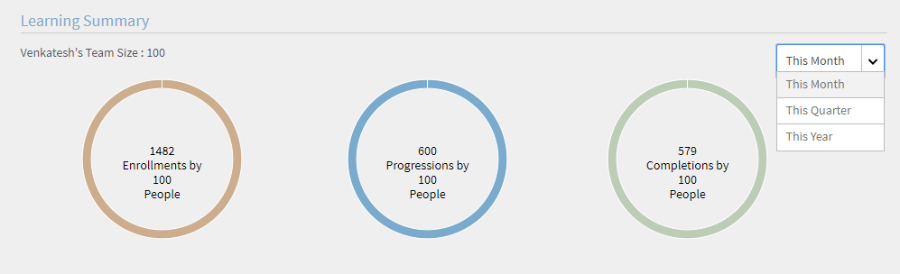

# Dashboard per i Manager

Scopri come visualizzare e tenere traccia degli apprendimenti dal dashboard per i Manager.

I Manager svolgono un ruolo importante nelle iniziative di apprendimento di un team. Per aiutarlo al meglio, la piattaforma di apprendimento fornisce al Manager una vista dashboard per tenere traccia degli apprendimenti all’interno del proprio team.

*Report dashboard per un Manager*

Per visualizzare i dettagli di un grafico, fai clic sul grafico o sul collegamento ipertestuale **[!UICONTROL Dettagli]**.

## Riepilogo apprendimento {#learningsummary}

Il Manager può visualizzare il riepilogo delle attività di apprendimento del suo team relative a un periodo di tempo selezionato. Seleziona mese, trimestre o anno dal menu a discesa.

“Mese” e “Anno” si basano sull’anno solare, mentre “Trimestre” si basa sull’esercizio finanziario configurato dall’Amministratore nelle impostazioni dell’account.

*Visualizza le attività di apprendimento in un periodo di tempo*

## Vista team {#teamview}

Nella vista team sono visualizzati i team, i relativi membri e le rispettive iscrizioni, i progressi e i completamenti per gli oggetti di apprendimento.

*La visualizzazione Team mostra i team, i relativi membri e le rispettive iscrizioni*

Facendo clic sui nomi dei team, ad esempio Team di Venkatesh, è possibile visualizzare i membri del team di Venkatesh insieme al numero totale di iscrizioni, progressi e completamenti per un oggetto di apprendimento.

*Selezionare un membro del team*

Per visualizzare il riepilogo dell’apprendimento per ciascun membro del team, fai clic nella rispettiva colonna sul numero corrispondente al Manager del team. Si apre una tabella nella quale è riportato l’elenco degli oggetti di apprendimento con Data di iscrizione, Scadenza e Informazioni sull’avanzamento.

*Seleziona un team manager*

Allo stesso modo, puoi visualizzare gli oggetti di apprendimento insieme al numero di iscrizioni, progressi o completamenti facendo clic sui valori riportati sotto le colonne corrispondenti.

*Visualizzazione dei corsi e del riepilogo dell’apprendimento*

Facendo ulteriormente clic sul numero di iscrizioni, progressi o completamenti per ciascun apprendimento, è possibile visualizzare i seguenti dettagli: persone, data di iscrizione/completamento, data di scadenza e progressi compiuti.

*Visualizza la data di iscrizione/completamento, la data di scadenza e lo stato di avanzamento*

## Vista apprendimenti {#learningsview}

La vista apprendimenti mostra il numero di iscrizioni, progressi e completamenti per un oggetto di apprendimento.

Per visualizzare dettagli quali persone, date di iscrizione, date di scadenza e avanzamento per i rispettivi oggetti di apprendimento, fai clic sui valori corrispondenti nelle colonne relative a iscrizioni, progressi e completamenti.

*Visualizzazione Allievi*

## Esportazione di report {#exportreport}

Per generare un report Excel, fare clic su **[!UICONTROL Azioni] > [!UICONTROL Report]**

## Stato di conformità {#compliancestatus}

I Manager possono visualizzare lo stato di conformità complessivo del team per gli Allievi configurati nel dashboard di conformità. L’elenco degli apprendimenti è configurabile e il Manager può selezionare gli apprendimenti per monitorare lo stato di conformità.

In questo dashboard, i Manager possono anche visualizzare gli Allievi conformi, con scadenza sicura, con scadenza imminente e non conformi per un oggetto di apprendimento selezionato.

Gli oggetti di apprendimento con date di completamento possono essere configurati nel dashboard di conformità per il tracciamento.

**Conforme**: visualizza il numero di Allievi che hanno completato l’oggetto di apprendimento entro la data di completamento.

**Scadenza sicura**: visualizza il numero di Allievi che hanno più di 30 giorni a disposizione per completare un oggetto di apprendimento.

**Prossimo alla scadenza**: visualizza il numero di Allievi che hanno meno di 30 giorni a disposizione per completare un oggetto di apprendimento.

**Non conforme**: visualizza il numero di Allievi che non hanno completato l’oggetto di apprendimento entro la data di completamento.

*Visualizza dashboard di conformità*

## Vista team {#TeamView-1}

Mostra lo stato di conformità di un corso per i rispettivi team. Conforme, Scadenza sicura, Prossimo alla scadenza e Non conforme sono colonne della tabella Vista team.

*stato di conformità di un corso per i rispettivi team*

Per visualizzare i nomi dei membri di un team e il numero individuale di corsi il cui stato è Conforme, in Scadenza sicura, Scadenza imminente e Non conforme fare clic sui valori corrispondenti nella tabella.

*Seleziona singoli team*

Facendo ancora clic sui valori nella colonna Conforme, Scadenza sicura, Prossimo alla scadenza e Non conforme, vengono visualizzati i dettagli del corso corrispondente: nome dell’oggetto di apprendimento, data di iscrizione/completamento, data di scadenza e avanzamento in percentuale.

 

*Visualizzare lo stato di avanzamento dei corsi*

## Vista apprendimenti {#LearningsView-1}

In Stato di conformità: Vista apprendimenti, viene visualizzato l’elenco degli oggetti di apprendimento e il numero corrispondente di membri del team conformi, entro una scadenza sicura, con scadenza imminente o non conformi.

*Visualizzare la scadenza e lo stato di conformità*

Facendo ancora clic sui valori riportati nelle colonne Conforme, Scadenza sicura, Prossimo alla scadenza e Non conforme, vengono visualizzate le seguenti informazioni: Persone, Data di iscrizione, Data di completamento e Avanzamento.

*Visualizza dettagli di conformità*

## Esportazione di dati e invio di e-mail {#exportdataampsendemails}

* Per esportare lo stato di conformità per la visualizzazione Team e Allievi, fai clic su **[!UICONTROL Azioni]** > **[!UICONTROL Esporta]**.

* Per inviare un&#39;e-mail ai membri del gruppo, fai clic su **[!UICONTROL Azioni]** > **[!UICONTROL Invia e-mail]**.

*Esportazione e invio di dati tramite e-mail*

## Abilità del team {#teamskills}

I Manager possono visualizzare il grafico di completamento delle abilità e configurare una previsione di completamento delle abilità a diversi livelli. Nell’elenco a discesa delle abilità sono elencate cinque abilità. Il Manager viene a conoscenza del livello di esperienza acquisito dai membri del team e identifica i talenti migliori in determinate abilità.

I Manager possono anche stimolare l’acquisizione di determinate abilità all’interno di un team fissando un obiettivo e prevedendo il tempo necessario per l’acquisizione di una data abilità da parte di una percentuale specifica del team all’interno di una linea temporale.

Questa previsione si basa su calcoli di sistema che forniscono una prospettiva futura in merito allo sviluppo di quella specifica abilità.

*Visualizza previsione abilità*

Per visualizzare lo stato delle abilità di un team, segui i passaggi seguenti:

1. Fai clic **[!UICONTROL Abilità team]** dal riquadro sinistro nella sezione Visualizzazione team personale.
1. Per visualizzare le abilità mostrate, fai clic sul filtro Abilità e selezionane una dall’elenco a discesa.
1. Per selezionare un livello (Livello 1, Livello 2 o Livello 3), fai clic sul menu a discesa del livello.
1. In base all’abilità e al livello selezionato, viene visualizzato un grafico con lo stato dell’abilità. Passando il mouse sul grafico, è possibile visualizzare le seguenti percentuali relative allo stato dell’abilità: **Acquisizione in corso** e **Acquisita**.

   

   *Visualizza percentuale dello stato delle abilità*

## Come prevedere la % di completamento di un’abilità da parte del team {#howtoforecasttheteamcompletionforaskill}

Per prevedere la % di completamento di un’abilità da parte del team, procedi come indicato di seguito:

1. Per visualizzare lo strumento di tracciamento della configurazione, fai clic sul collegamento ipertestuale di configurazione.

   

   *Seleziona il collegamento ipertestuale Configura*

1. Nella finestra di dialogo di configurazione a comparsa, immetti un valore percentuale per l’abilità che desideri configurare nel **% completamento obiettivo** e la data entro la quale si desidera raggiungere la % di completamento prevista nel **Data di scadenza** campo.****

   

   *Immetti percentuale di completamento obiettivo*

1. Per visualizzare l’output relativo alla previsione, fai clic sul pulsante **Stima**. L’output è simile a quello riportato nella schermata seguente.

   

   *Visualizzare l’output di skill tracxker*

## Previsione del completamento del livello di abilità {#skilllevelcompletionforecast}

Il Manager di un team può visualizzare e configurare la percentuale di completamento di un’abilità da parte del team per un particolare periodo di tempo in base alla percentuale di completamento prevista e alla data indicata nello strumento di tracciamento delle abilità.

Nel grafico di previsione vi sono due tipi di linee (linea continua e linea tratteggiata) con tre vertici ciascuna.

Sulla linea continua, il primo punto visualizza la data della prima iscrizione per un livello di abilità.

*Visualizzare la prima iscrizione per un livello di abilità*

Il secondo punto mostra la data e il livello % di completamento dell’abilità da parte del team correnti.

*Visualizza la data corrente e il livello di % di completamento del team dell’abilità*

Il terzo punto sulla linea mostra la percentuale di completamento prevista e la data di completamento stimata.

*Visualizza la percentuale di completamento prevista e la data di completamento prevista*

## Linea della previsione {#forecastline}

La linea tratteggiata è la linea relativa alla previsione, che visualizza la previsione a seconda della % di completamento corrente di un’abilità da parte del team in un determinato periodo di tempo.

Il primo punto sulla linea tratteggiata rappresenta la % di completamento e la % di completamento prevista per una data abilità in quella data.

*Visualizza la % di completamento del team e la % di completamento del team previsto per un&#39;abilità*

Il secondo punto visualizza la data in cui è stata raggiunta la % di completamento prevista di un’abilità da parte del team.

*Visualizza la data in cui la % di completamento del team previsto è stata raggiunta per un’abilità*

Il terzo punto sulla linea relativa alla previsione mostra la % di completamento raggiunta alla data stabilita specificata nello strumento di tracciamento delle abilità.

*Visualizza la % di completamento del team raggiunta alla data di destinazione indicata nel tracciatore delle abilità*

Sotto il grafico, viene visualizzata una tabella con la vista del team e il numero di abilità a cui è stata effettuata l’iscrizione, che sono state acquisite o sono in corso di acquisizione. Se per un apprendimento è stata specificata una data di completamento, viene visualizzata anche la data di completamento prevista.

*Tabella con la vista del team e il numero di abilità registrate, acquisite e in corso*

Facendo clic sul nome del team, viene visualizzato l’elenco dei membri che si sono iscritti all’abilità, lo stato dell’abilità e la data di completamento.

*Visualizza elenco di membri*

Facendo clic sul team, puoi visualizzare i membri in esso contenuti e i dettagli corrispondenti per l’abilità selezionata, ad esempio l’eventuale iscrizione, lo stato (se in corso di acquisizione o acquisita) e la data di completamento, se impostata.

*Visualizzare le abilità dei membri*

Selezionando i valori relativi a un team nelle colonne Iscrizione, Acquisita e In corso di acquisizione, è possibile visualizzare il numero di utenti che si sono iscritti all’abilità. È anche possibile visualizzare la data in cui l’utente si è iscritto all’abilità, lo stato e la data di completamento, se l’abilità è stata completata dall’utente.

<!-- -->

## Esportazione di report {#Exportreport-1}

* Fai clic **[!UICONTROL Azioni]** > **[!UICONTROL Esporta]** per esportare i dati come file excel.

*Esportare i dati*
