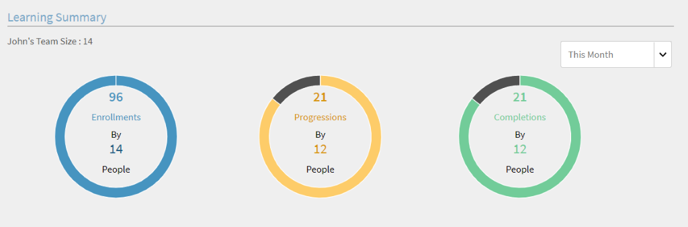
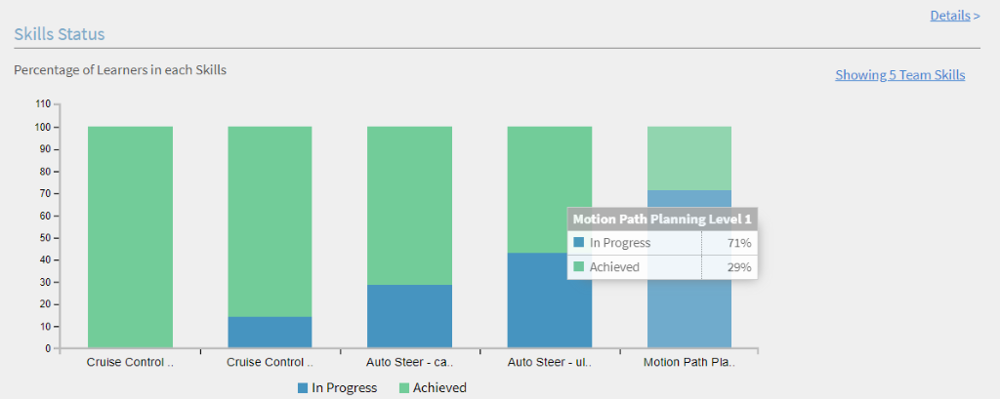
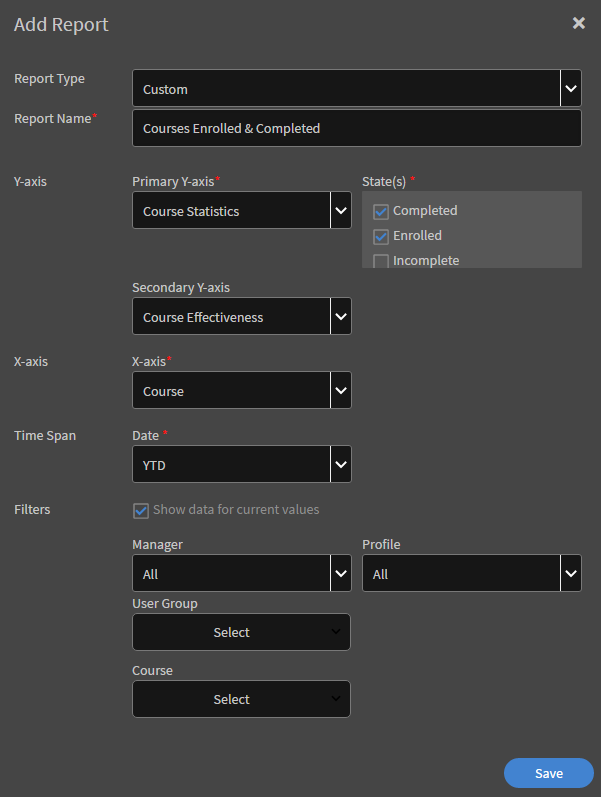
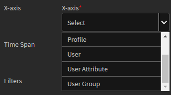

# Rapporti

Creazione e gestione dei report per i Manager.

Adobe Learning Manager consente di creare vari report per tracciare, monitorare e controllare le attività degli Allievi. Le attività degli allievi vengono tracciate e acquisite automaticamente nel database. I report Manager e Amministratore sono generati dal database.

## Panoramica {#overview}

Il processo di generazione dei report è lo stesso sia per gli Amministratori che per i Manager. I Manager possono visualizzare i report corrispondenti ai loro subordinati mentre l’Amministratore può visualizzare tutti i report a livello di organizzazione.

I report sono aggregati in un dashboard. Un report deve esistere all’interno di un dashboard. Un **dashboard predefinito** esiste per impostazione predefinita nella pagina dei report. Qualsiasi report aggiunto viene spostato nel dashboard predefinito. Per aggiungere report ai singoli dashboard, utilizza la freccia a discesa e scegli Aggiungi Report. Per ulteriori informazioni sulla creazione dei dashboard, fai riferimento alla sezione Dashboard in questa pagina.

## Dashboard di gestione {#manager-dashboards}

Un manager può visualizzare le informazioni sul suo team diretto o indiretto, come riepilogo.

Il manager può quindi filtrare il report in base a intervalli quali trimestre, mese corrente, ultimi tre mesi interi e ultimi 12 mesi interi.

## Riepilogo apprendimento {#learningsummary}

*Visualizza riepilogo apprendimento*

*Filtra riepilogo apprendimento per data*

## Dashboard di conformità {#compliancedashboard}

Verifica la conformità del tuo team e quale membro del team è confinante con la non conformità. Scegli gli oggetti di apprendimento e visualizza lo stato di ciascuno di essi.

*Visualizza dashboard di conformità*

## Stato delle abilità {#skillsstatus}

Visualizza la percentuale degli allievi per ogni abilità. Scegli al massimo cinque abilità da visualizzare per gli allievi. Verranno visualizzate sotto forma di un istogramma sovrapposto. Facendo scorrere il mouse sopra ogni barra del grafico, puoi vedere come è suddiviso lo stato per tale abilità.

*Visualizzare lo stato delle abilità di un Allievo*

## Strumento di tracciamento delle abilità {#skilstracker}

Visualizza una proiezione del completamento delle abilità in un team. Scegli la percentuale e la data di completamento stabilita di un’abilità.

In base ai dati storici, puoi visualizzare una rappresentazione grafica della proiezione del completamento delle abilità alla data selezionata.

*Visualizza proiezione completamento abilità*

## Creazione di report {#creatingreports}

1. Fai clic su Report nel riquadro a sinistra. Viene visualizzata la pagina di riepilogo del report.\
   **Nota**
Per impostazione predefinita, almeno tre report di esempio vengono visualizzati nella pagina di riepilogo del report. Puoi visualizzare questi report di esempio solo per avere un’idea di come è possibile crearli e personalizzarli.

1. Nella pagina di riepilogo del report, fai clic su Aggiungi. Viene visualizzata la finestra di dialogo di creazione del report.
1. Fai clic su Salva per completare la creazione di un report. Di seguito, è riportato un report di esempio come riferimento.

*Finestra di dialogo Aggiungi report*

In Tipo di report, puoi scegliere un set predefinito di report o personalizzarlo. Puoi visualizzare i seguenti report nell’ambito di un set predefinito di report:

* Abilità assegnate e acquisite
* Corso registrato e completato
* Efficacia per i corsi
* Programmi di apprendimento registrati e completati
* Tempo di apprendimento impiegato per il corso
* Tempo di apprendimento impiegato per il trimestre

Puoi utilizzare i tipi di report sopra menzionati per generare report di oltre 300 varianti.

Nome report Digitare un titolo per il report.

**Asse Y principale** Scegliere il primo criterio principale per il report dalle opzioni a discesa. Per alcuni dei criteri selezionati, è possibile scegliere uno o più stati dalla casella a discesa Stati adiacenti. Ad esempio, per un criterio principale relativo alle statistiche di iscrizione a un corso, gli stati possono essere completati, incompleti, registrati e così via. I dati dell’intervallo principale sono rappresentati sotto forma di grafici a barre nel report.

**Asse Y secondario** Scegliere l&#39;intervallo/il criterio asse Y secondario per il report dalle opzioni a discesa. Ad esempio, nell’opzione di iscrizione al programma di apprendimento, scegli uno o più stati dall’elenco a discesa Stati adiacenti. I dati dell’intervallo secondario sono rappresentati sotto forma di grafici a linea.

**Asse X** Scegliere i criteri dell&#39;asse X appropriati per il report dalle opzioni del menu a discesa. Se l’asse X viene scelto come data, è disponibile un’opzione per raggruppare i criteri dell’asse X per giorno, mese, trimestre e anno.

**Data** Scegliere l&#39;opzione appropriata dal menu a discesa. Opzioni: ultimo mese, trimestre, anno, dall’inizio del trimestre a oggi (ultimi 90 giorni), da inizio anno a oggi (ultimi 365 giorni) e intervallo di date. Se selezioni l’intervallo di date, indica le date di inizio e fine come di seguito:

**Da** Scegliere la data di inizio a partire dalla quale si desidera visualizzare il report.

**A** Scegliere la data di fine del report.

## Filtri {#filters}

I filtri vengono visualizzati nella finestra di dialogo Aggiungi report nella parte inferiore in base ai tipi di report scelti. Alcuni dei principali filtri sono indicati di seguito.

**Manager** puoi scegliere uno qualsiasi dei manager in base alla gerarchia. Per alcuni Manager, possono essere presenti Manager secondari e più dipendenti che fanno riferimento a ciascun Manager secondario.

**Profilo** scegli il titolo del dipendente. Potrebbe essere utile nella visualizzazione dei report dei dipendenti in base a profilo/titolo. Ad esempio, informatico, ingegnere e così via.

**Gruppo utenti** scegli il gruppo utenti in base al quale filtrare i report. Learning Manager recupera i gruppi di utenti definiti per il tuo account dalla funzione Utenti.

**Corso** puoi filtrare il report in base a qualsiasi corso scegliendolo dal menu a discesa.

*Visualizza il grafico dei corsi registrati e completati*

>[!NOTE]
>
>Sopra la legenda per il grafico, puoi visualizzare una casella di zoom. Puoi spostare il cursore su di essa, fare clic e trascinare la barra trasversale su qualsiasi parte dell’area della casella di zoom da ingrandire.

Puoi visualizzare i valori dell’asse Y secondario sotto forma di una linea attraverso le barre del grafico. Ad esempio, nell’esempio sopra, puoi visualizzare i valori dell’efficacia nella linea grigia attraverso il grafico.

## Report gruppo utenti {#user-group-reporting}

Tieni traccia di come i gruppi di utenti come reparti, partner esterni e ruoli si comportano rispetto ad altri gruppi di utenti o rispetto ad altri obiettivi di apprendimento.

### Gruppi utente {#usergroups}

Per generare report basati su gruppi di utenti, seleziona **Gruppo utenti** nell’asse X dall’elenco di opzioni a discesa, come mostrato nella schermata seguente.

*Genera report gruppo utenti*

Un altro menu a discesa **Seleziona** viene visualizzato accanto all’asse X con un elenco di gruppi di utenti disponibili per l’account. In questo menu a discesa è possibile selezionare uno o più gruppi di utenti.

Dopo aver salvato e generato questo report, se hai selezionato più gruppi di utenti, il report viene generato con tutti i gruppi di utenti rappresentati in un grafico a barre l’uno accanto all’altro nell’asse X.

Questo report sui gruppi di utenti consente di confrontare le prestazioni di un reparto/divisione/ruolo con l’altro per valutare i risultati dell’apprendimento.

### Gruppi di utenti personalizzati/attributi utente {#customusergroupsuserattributes}

Inoltre, puoi creare gruppi di utenti personalizzati mediante la funzione Aggiungi utenti/gruppi utenti in Learning Manager. Dopo aver creato i gruppi di utenti è possibile generare report per tali gruppi di utenti personalizzati con l’aiuto di un elenco di attributi come posizione, ramo e così via.

Nell&#39;asse X, scegliere l&#39;opzione dell&#39;attributo utente e selezionare l&#39;attributo dall&#39;elenco a discesa **seleziona** accanto ad esso. Per creare un report gruppo di utenti personalizzato in base a questi attributi, è inoltre necessario scegliere il gruppo di utenti appropriato nel filtro.

I Manager possono creare report di gruppi di utenti solo per i propri membri del team come Allievi.

## Tipi di report {#typesofreports}

* Statistiche di consegna del corso per allievi
* Efficacia del report sui corsi
* Report basato sulle abilità dell’Allievo
* Statistiche di iscrizione al programma di apprendimento per Allievi
* Tempo di apprendimento impiegato dagli Allievi
* Completamento certificazione

## I miei report {#myreports}

Un dashboard è una raccolta di report. I report possono essere raggruppati in una dashboard a tua scelta.

**Report di esempio**

Fare clic su questa scheda per visualizzare alcuni rapporti indicativi basati su punti dati di esempio. Esplora questi report per avere un’idea dei diversi tipi di report ricchi di funzionalità che puoi generare utilizzando i dati del tuo account.

**I miei report**

Fai clic sulla scheda di questa bacheca per visualizzare tutte le bacheche che hai creato. Dall’elenco a discesa della bacheca di visualizzazione, puoi selezionare la bacheca predefinita o uno qualsiasi dei dashboard creati.

**Aggiungi dashboard**

1. Fai clic su Aggiungi dashboard sul lato destro della pagina, per iniziare a creare le tue bacheche.

   

   *Crea una bacheca personalizzata*

1. Fornisci nome e descrizione del dashboard e fai clic su **[!UICONTROL Salva]**.

Puoi visualizzare la bacheca creata di recente nell’elenco I miei dashboard.

Per aggiungere report alla bacheca, fai clic sul menu a discesa nell’angolo superiore destro della finestra delle bacheche e fai clic su Aggiungi report. Il report creato in questo modo è associato al dashboard.

>[!NOTE]
>
>I report creati facendo clic su Aggiungi nell’angolo superiore destro della pagina Report vengono aggiunti al dashboard predefinito.

**Report condivisi**

I report condivisi sono una raccolta di report condivisi con te da altri utenti all’interno della tua organizzazione. Se disponi delle autorizzazioni, puoi scaricare o duplicare i report condivisi. Contatta l’Amministratore dell’organizzazione per scaricare/duplicare i diritti di accesso ai report condivisi.

**Report sottoscritti**

Puoi iscriverti ai tuoi report preferiti indicando qui l’ID e-mail. I report sottoscritti ti vengono inviati tramite e-mail.

Fai clic sull&#39;icona **Modifica** nell&#39;angolo destro del nome del report dall&#39;elenco dei report per modificare il tuo abbonamento in qualsiasi momento.

## Visualizzazione dei report {#viewingreports}

Nella pagina di riepilogo Report, puoi visualizzare tutti i report. Puoi ridurre ogni report facendo clic sull’icona meno (-) nell’angolo superiore destro di ogni report. Fai clic sull’icona + per visualizzare nuovamente il report.

**Visualizzazione rapida con date diverse**

I valori di data utilizzati per visualizzare il report sono temporanei. Questa visualizzazione del report non viene scaricata quando scegli l’opzione di download. Si tratta di una visualizzazione solo temporanea.

Puoi modificare valore/intervallo di data per ogni report e visualizzare rapidamente una data diversa senza modificare e salvare il report. Fai clic sull’icona di modifica (come mostrato con una freccia nell’istantanea seguente) accanto all’intervallo di date, come dall’inizio del trimestre a oggi, ultimo anno e così via. Scegli il nuovo valore dal menu a discesa e fai clic sul segno di spunta per confermare la modifica. Puoi annullare la modifica facendo clic sul segno X.

**Visualizzazione rapida con diversi Manager**

Se più Manager ti inviano report, puoi visualizzare rapidamente i report per ogni Manager. Scegli il nome del manager dall’elenco a discesa per visualizzare un report univoco per ciascun manager.
**Modifica/Sposta nella bacheca/Crea una copia/Elimina/Ridimensiona i report** Fai clic sulla freccia a discesa nell&#39;angolo superiore destro di ogni report per visualizzare le opzioni a discesa come Modifica/Sposta nel dashboard/Crea una copia/Elimina/Ridimensiona.

<!---->

**Modifica** Durante la modifica dei dati, per tornare ai valori iniziali, fare clic su Ripristina. Fai clic su Salva dopo aver modificato i valori.

**Sposta nel dashboard** Puoi spostare il report corrente in un altro dashboard, scelto nell&#39;elenco dei dashboard.

**Crea una copia** Puoi copiare il report sullo stesso dashboard o su uno diverso, scelto nell&#39;elenco dei dashboard.

**Elimina** Fare clic su Elimina per rimuovere il report. Viene visualizzato un messaggio di conferma/avviso prima di poter eliminare il report.

**Ridimensiona** puoi ridimensionare i report nei formati 1×1 (medio) e 2×2 (grande).

## Iscrizioni e-mail {#emailsubscriptions}

Puoi ottenere i tuoi report preferiti tramite e-mail iscrivendoti.

Nella pagina Report, fai clic sull’opzione di iscrizione tramite e-mail accanto al pulsante Aggiungi nell’angolo in alto a destra della pagina. Viene visualizzata la pagina di iscrizione ai report.

Per selezionare il nome del report dall’elenco a discesa, inizia a digitare il nome del report nel campo Report. Scegli la frequenza di invio dei messaggi di posta elettronica giornaliera, settimanale, mensile in base alla tua scelta, aggiungi l’oggetto dell’e-mail e fai clic su Aggiungi per abbonarti.

Fare clic su Modifica per modificare la sottoscrizione. Fai clic su Rimuovi per eliminare l’iscrizione.
