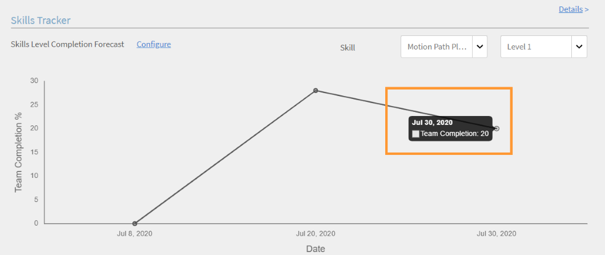

# Report

Creazione e gestione di report per i Manager.

Adobe Learning Manager consente di creare vari report per tracciare, monitorare e controllare le attività degli Allievi. Le attività degli Allievi vengono monitorate e acquisite automaticamente nel database. I report Manager e Amministratore vengono generati dal database.

## Panoramica {#overview}

Il processo di generazione dei report è lo stesso sia per gli Amministratori che per i Manager. I Manager possono visualizzare i report corrispondenti ai loro subordinati, mentre l’Amministratore può visualizzare tutti i report a livello di organizzazione.

I report vengono aggregati in un dashboard. Un report deve esistere all&#39;interno di un dashboard. A **Dashboard predefinito** esiste per impostazione predefinita nella pagina dei report. Qualsiasi report aggiunto viene spostato nel dashboard predefinito. Per aggiungere report ai singoli dashboard, utilizza la freccia a discesa e scegli Aggiungi Report. Per ulteriori informazioni sulla creazione dei dashboard, consulta la sezione Dashboard in questa pagina.

## Dashboard per i Manager {#manager-dashboards}

Un manager può visualizzare le informazioni sul suo team diretto o indiretto, come riepilogo.

Il manager può quindi filtrare il report in base a intervalli quali trimestre, mese corrente, ultimi tre mesi interi e ultimi 12 mesi interi.

## Riepilogo dell’apprendimento {#learningsummary}

*Visualizzare il riepilogo della formazione*

*Filtra il riepilogo dell’apprendimento per data*

## Dashboard di conformità {#compliancedashboard}

Verifica la conformità del tuo team e quale membro del team è confinante con la non conformità. Scegli gli oggetti di apprendimento e visualizza lo stato di ciascuno di essi.

*Visualizza dashboard di conformità*

## Stato delle abilità {#skillsstatus}

Vedi la percentuale di Allievi per ogni abilità. Scegli al massimo cinque abilità per le quali desideri visualizzare le abilità per gli Allievi. La visualizzazione è sotto forma di grafico a barre sovrapposte. Quando passi il mouse su ogni barra, puoi visualizzare la suddivisione dello stato per tale abilità.

*Visualizzare lo stato delle abilità di un Allievo*

## Skils Tracker {#skilstracker}

Visualizza una proiezione del completamento delle abilità in un team. Scegli la percentuale e la data di completamento stabilita di un’abilità.

In base ai dati storici, puoi visualizzare una rappresentazione grafica della proiezione del completamento delle abilità alla data selezionata.

*Visualizza proiezione completamento abilità*

## Creazione di report {#creatingreports}

1. Fai clic su Report nel riquadro a sinistra. Viene visualizzata la pagina di riepilogo del report.\
   **Nota**
Per impostazione predefinita, almeno tre report di esempio vengono visualizzati nella pagina di riepilogo del report. Puoi visualizzare questi report di esempio solo per avere un’idea di come è possibile crearli e personalizzarli.

1. Nella pagina di riepilogo del report, fai clic su Aggiungi. Viene visualizzata la finestra di dialogo per la creazione del report.
1. Fai clic su Salva per completare la creazione di un report. Di seguito è riportato un report di esempio come riferimento.

*Finestra di dialogo Aggiungi report*

In Tipo di report, puoi scegliere un set predefinito di report o personalizzato. Puoi visualizzare i seguenti report come parte di un set predefinito di report:

* Abilità assegnate e acquisite
* Corso registrato e completato
* Efficacia per i corsi
* Programmi di apprendimento registrati e completati
* Tempo di apprendimento impiegato per il corso
* Tempo di apprendimento impiegato per il trimestre

Puoi utilizzare i tipi di report sopra indicati per generare report di oltre 300 varianti.

Nome report Digitare un titolo per il report.

**Asse Y principale** Scegli il primo/i criteri principali per il report dalle opzioni a discesa. Per alcuni dei criteri selezionati, è possibile scegliere uno o più stati dalla casella a discesa Stati adiacenti. Ad esempio, per un criterio principale relativo alle statistiche di iscrizione a un corso, gli stati possono essere completati, incompleti, registrati e così via. I dati dell’intervallo principale sono rappresentati sotto forma di grafici a barre nel report.

**Asse Y secondario** Scegli l’intervallo/il criterio asse Y secondario per il report dalle opzioni a discesa. Ad esempio, nell’opzione di iscrizione al programma di apprendimento, scegli uno o più stati dall’elenco a discesa Stati adiacenti. I dati dell’intervallo secondario sono rappresentati sotto forma di grafici a linee.

**Asse X** Scegli i criteri dell’asse x appropriati per il report dalle opzioni a discesa. Se l’asse X viene scelto come data, è disponibile un’opzione per raggruppare i criteri dell’asse X per giorno, mese, trimestre e anno.

**Data** Scegli l’opzione appropriata dal menu a discesa. Opzioni: ultimo mese, trimestre, anno, progressivo trimestre (ultimi 90 giorni), progressivo anno (ultimi 365 giorni) e intervallo di date. Se si sceglie l&#39;intervallo di date, specificare le date Da e A come indicato di seguito:

**Da** Scegli la data di inizio a partire dalla quale desideri visualizzare il report.

**A** Scegli la data di fine per il report.

## Filtri {#filters}

I filtri vengono visualizzati nella finestra di dialogo Aggiungi report nella parte inferiore in base ai tipi di report scelti. Alcuni dei principali filtri sono elencati di seguito.

**Manager** Puoi scegliere uno qualsiasi dei Manager in base alla gerarchia. Per alcuni manager, possono essere presenti manager subordinati e più dipendenti che fanno riferimento a ciascun manager subordinato.

**Profilo** Scegli il titolo del dipendente. Potrebbe essere utile nella visualizzazione dei report dei dipendenti in base al loro profilo/qualifica. Ad esempio, informatico, ingegnere e così via.

**Gruppo di utenti** Scegli il gruppo di utenti in base al quale filtrare i report. Learning Manager recupera i gruppi di utenti definiti per il tuo account dalla funzione Utenti.

**Corso** Puoi filtrare il report in base a qualsiasi corso scegliendolo dal menu a discesa.

*Visualizzare il grafico dei corsi registrati e completati*

>[!NOTE]
>
>Sopra la legenda del grafico, puoi visualizzare una casella di zoom. Potete spostare il cursore su di esso, fare clic e trascinare la barra trasversale su qualsiasi parte dell&#39;area della casella di zoom che desiderate ingrandire.

Potete visualizzare i valori secondari dell’asse y sotto forma di linea sulle barre del grafico. Ad esempio, nell’esempio precedente, puoi visualizzare i valori di Efficacia nella linea grigia attraverso il grafico.

## Report gruppo utenti {#user-group-reporting}

Tieni traccia di come i gruppi di utenti come reparti, partner esterni e ruoli si comportano rispetto ad altri gruppi di utenti o rispetto ad altri obiettivi di apprendimento.

### Gruppi di utenti {#usergroups}

Per generare report basati su gruppi di utenti, seleziona **Gruppo di utenti** nell’asse X dall’elenco di opzioni a discesa, come mostrato nella schermata seguente.

*Genera report gruppo di utenti*

Altro **Seleziona** Il menu a discesa viene visualizzato accanto all’asse X con un elenco di gruppi di utenti disponibili per l’account. In questo menu a discesa è possibile selezionare uno o più gruppi di utenti.

Una volta salvato e generato questo report, se hai selezionato più gruppi di utenti, il report viene generato con tutti i gruppi di utenti rappresentati in un grafico a barre l’uno accanto all’altro nell’asse X.

Questo report sui gruppi di utenti consente di confrontare le prestazioni di un reparto/divisione/ruolo con l’altro per valutare i risultati dell’apprendimento.

### Gruppi di utenti personalizzati/attributi utente {#customusergroupsuserattributes}

Puoi anche creare gruppi di utenti personalizzati utilizzando la funzione Aggiungi utenti/gruppi utenti in Learning Manager. Dopo aver creato i gruppi di utenti, puoi generare report per tali gruppi di utenti personalizzati con l’aiuto di un elenco di attributi come posizione, filiale e così via.

Nell&#39;asse X, scegliere l&#39;opzione dell&#39;attributo utente e selezionare l&#39;attributo da **seleziona** nell&#39;elenco a discesa accanto. Per creare un report gruppo di utenti personalizzato in base a questi attributi, è inoltre necessario scegliere il gruppo di utenti appropriato nel filtro.

I Manager possono creare report sui gruppi di utenti solo per i membri del proprio team come Allievi.

## Tipi di report {#typesofreports}

* Statistiche di consegna del corso per gli Allievi
* Efficacia del report sui corsi
* Report basato sulle abilità dell’Allievo
* Statistiche di iscrizione al programma di apprendimento per gli Allievi
* Tempo di apprendimento impiegato dagli Allievi
* Completamento certificazione

## I miei report {#myreports}

Un dashboard è una raccolta di report. I report possono essere raggruppati in una dashboard a tua scelta.

**Report di esempio**

Fare clic su questa scheda per visualizzare alcuni rapporti indicativi basati su punti dati di esempio. Esplora questi report per avere un’idea dei diversi tipi di report ricchi di funzionalità che puoi generare utilizzando i dati del tuo account.

**I miei report**

Fai clic sulla scheda di questa bacheca per visualizzare tutte le bacheche che hai creato. Dall’elenco a discesa della bacheca di visualizzazione, puoi selezionare la bacheca predefinita o uno qualsiasi dei dashboard creati.

**Aggiungi dashboard**

1. Fai clic su Aggiungi dashboard sul lato destro della pagina per iniziare a creare le tue bacheche.

   

   *Crea la tua bacheca*

1. Fornisci il nome e la descrizione del dashboard e fai clic su **[!UICONTROL Salva]**.

Puoi visualizzare la bacheca creata di recente nell’elenco Dashboard personali.

Per aggiungere report alla bacheca, fai clic sul menu a discesa nell’angolo superiore destro della finestra delle bacheche e fai clic su Aggiungi report. Il report creato in questo modo è associato al dashboard.

>[!NOTE]
>
>I report creati facendo clic su Aggiungi nell’angolo superiore destro della pagina Report vengono aggiunti al dashboard predefinito.

**Report condivisi**

I report condivisi sono una raccolta di report condivisi con te da altri utenti all’interno della tua organizzazione. Se disponi delle autorizzazioni necessarie, puoi scaricare o duplicare i report condivisi. Contatta l’amministratore della tua organizzazione per ottenere i diritti di accesso per download/duplicazione ai report condivisi.

**Report sottoscritti**

Puoi iscriverti ai tuoi report preferiti fornendo il tuo ID e-mail qui. I report sottoscritti ti ti verranno inviati tramite e-mail.

Fare clic sul pulsante **Modifica** nell’angolo destro del nome del report dall’elenco dei report per modificare l’abbonamento in qualsiasi momento.

## Visualizzazione dei report {#viewingreports}

Nella pagina di riepilogo del report, puoi visualizzare tutti i report. È possibile ridurre ogni report facendo clic sull’icona meno (-) nell’angolo superiore destro di ogni report. Fai clic sull’icona + per visualizzare di nuovo il report.

**Visualizzazione rapida con date diverse**

I valori di data utilizzati per visualizzare il report sono temporanei. Questa visualizzazione del report non viene scaricata quando scegli l’opzione di download. Si tratta solo di una visualizzazione temporanea.

Puoi modificare il valore o l’intervallo di date per qualsiasi report e visualizzare rapidamente date diverse senza modificare e salvare il report. Fai clic sull’icona di modifica (come mostrato con una freccia nell’istantanea seguente) accanto all’intervallo di date, ad esempio QTD, ultimo anno e così via. Scegli il nuovo valore dal menu a discesa e fai clic sul segno di spunta per confermare la modifica. È possibile annullare la modifica facendo clic sul segno X.

**Visualizzazione rapida con diversi manager**

Se più Manager ti inviano report, puoi visualizzare rapidamente i report per ogni Manager. Scegli il nome del manager dall’elenco a discesa per visualizzare un report univoco per ciascun manager.
**Modifica/Sposta nella bacheca/Crea una copia/Elimina/Ridimensiona i report** Fai clic sulla freccia a discesa nell’angolo superiore destro di ogni report per visualizzare le opzioni a discesa come Modifica/Sposta nel dashboard/Crea una copia/Elimina/Ridimensiona.

<!---->

**Modifica** Durante la modifica dei dati, per tornare ai valori iniziali, fare clic su Ripristina. Dopo aver modificato i valori, fai clic su Salva.

**Sposta nel dashboard** Puoi spostare il report corrente in un altro dashboard, scelto nell’elenco dei dashboard.

**Crea una copia** Puoi copiare il report sullo stesso dashboard o su uno diverso, scelto nell’elenco dei dashboard.

**Elimina** Fai clic su Elimina per rimuovere il report. Prima di poter eliminare il report, viene visualizzato un messaggio di avvertenza/conferma.

**Ridimensiona** Puoi ridimensionare i report nei formati 1×1 (medio) e 2×2 (grande).

## Sottoscrizioni posta elettronica {#emailsubscriptions}

È possibile ottenere i report preferiti tramite posta elettronica sottoscrivendoli.

Nella pagina Report, fai clic su Iscrizione tramite e-mail accanto al pulsante Aggiungi nell’angolo in alto a destra della pagina. Viene visualizzata la pagina di iscrizione ai report.

Per selezionare il nome del report dall’elenco a discesa, inizia a digitare il nome del report nel campo Report. Scegli la frequenza di invio dei messaggi di posta elettronica giornaliera, settimanale, mensile in base alla tua scelta, aggiungi l’oggetto dell’e-mail e fai clic su Aggiungi per abbonarti.

Fare clic su Modifica per modificare la sottoscrizione. Fare clic su Rimuovi per eliminare la sottoscrizione.
