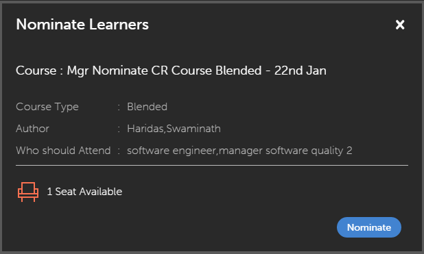

# Notifiche utente

Impostazione delle notifiche utente per i Manager.

La funzione Notifiche è applicabile a tutti gli utenti di Adobe Learning Manager 1.0. Tuttavia, ogni utente ottiene diversi tipi di notifiche in diversi scenari in base al proprio ruolo. Tutti gli avvisi e le notifiche per gli utenti vengono visualizzati tramite la finestra a comparsa delle notifiche.

## Notifiche di accesso {#accessnotifications}

Gli utenti possono visualizzare le notifiche facendo clic sull’icona delle notifiche nell’angolo superiore destro della finestra. Nell’accesso Manager, puoi anche fare clic su Notifiche nel riquadro a sinistra per accedere a queste notifiche.

Snapshot delle notifiche di Gestione esempi:

*Visualizza tutte le notifiche*

Questa finestra a comparsa mostra un riepilogo di tutte le notifiche, insieme all’ora in cui sono state inviate e a una barra di scorrimento. Per visualizzare ulteriori informazioni su tutte le notifiche, fai clic su Mostra tutte le notifiche nella parte inferiore della finestra a comparsa. Viene visualizzata la pagina delle notifiche.

Un manager può visualizzare le attività in sospeso e tutte le notifiche in un formato a schede nella pagina delle notifiche. Le notifiche delle attività in sospeso sono suddivise in categorie in base ad approvazioni, candidature e così via. Per visualizzare tutte le notifiche, fai clic su **[!UICONTROL Tutte le notifiche]** scheda. In tutte le notifiche scheda, le notifiche sono ordinate in base alla data e all’ora ed elencate.

*Visualizza tutte le attività in sospeso*

Puoi scoprire il numero delle notifiche più recenti in base al numero evidenziato sopra l’icona delle notifiche. Ad esempio, se sono presenti cinque notifiche più recenti dopo l’accesso precedente, il numero cinque viene visualizzato sopra l’icona delle notifiche. Questi numeri scompaiono una volta lette tutte le ultime notifiche.

## Candidatura degli Allievi ai corsi {#nominatelearnersforcourses}

Nella finestra delle notifiche, come mostrato nell’istantanea sopra, fai clic sul collegamento Candida. Viene visualizzata una finestra a comparsa. Fai clic su Candida.

*Candidatura degli Allievi ai corsi*

**Tipi di notifiche per i Manager**

I Manager possono ricevere notifiche quando vengono attivati i seguenti eventi:

1. Un Allievo si iscrive a un corso o a un programma di apprendimento
1. Un Allievo completa un corso o un programma di apprendimento
1. Un amministratore iscrive un Allievo a un corso o programma di apprendimento
1. Per fornire un feedback L3 all’Allievo, è necessario un Manager
1. Un Manager deve assegnare gli Allievi a un corso
1. Un Manager deve approvare un Allievo per un corso.
1. Un manager deve approvare il documento di prova della certificazione caricato dall’Allievo
1. Un Allievo non completa il corso anche dopo la data di scadenza. (questo evento viene attivato solo quando il promemoria di notifica per l’istanza del corso è impostato con livello di escalation per il manager dell’allievo)

>[!NOTE]
>
>I Manager possono anche ricevere notifiche quando hanno il ruolo di Allievo. Per ulteriori informazioni, fai riferimento alle notifiche per gli allievi.

## Invia feedback {#providefeedback}

Come mostrato nell’istantanea sopra, i Manager possono fare clic su Fornisci feedback per fornire il feedback L3 agli Allievi di ogni corso o programma di apprendimento.

>[!NOTE]
>
>Allievi e Manager possono ottenere l’opzione di feedback per i corsi solo quando l’Amministratore la attiva per un determinato corso.
