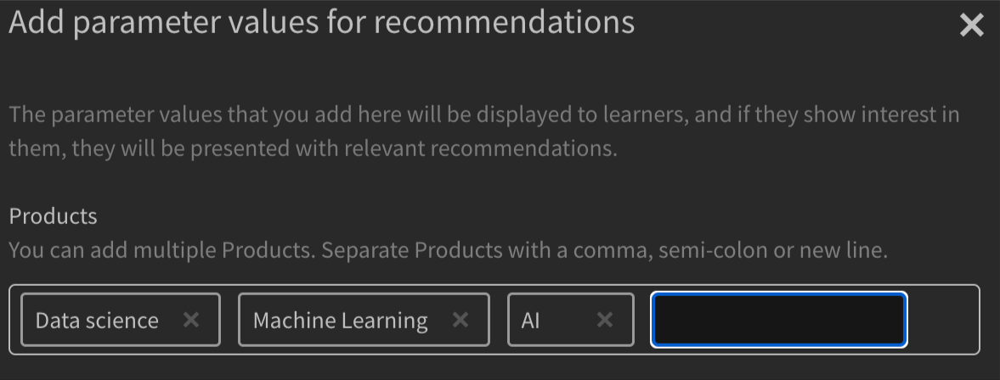
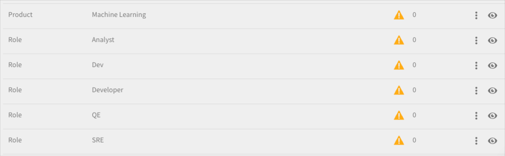
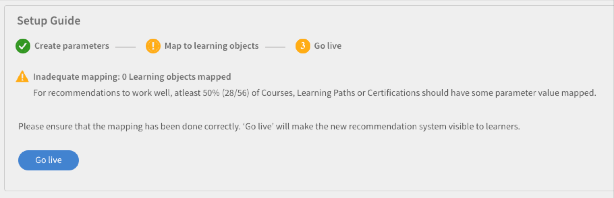
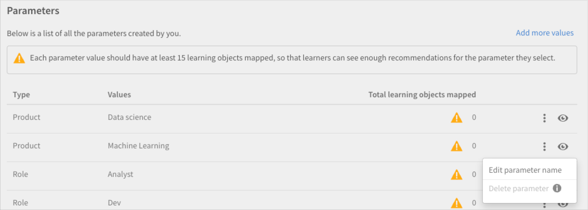
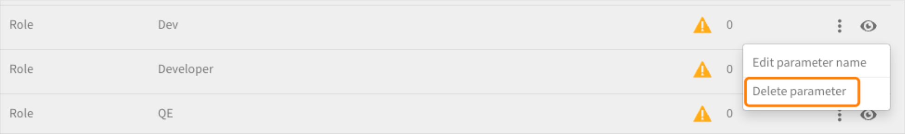

# Recommendations nell’Adobe di Learning Manager

Adobe Learning Manager ha introdotto un nuovo sistema di raccomandazione per i corsi. Questa funzione di consigli utilizza algoritmi di intelligenza artificiale e gli interessi degli utenti come Prodotti, Ruoli e Livelli per fornire consigli sui contenuti personalizzati.

Il nuovo sistema di consigli consente di creare parametri personalizzati che gli allievi possono selezionare per ricevere consigli personalizzati. Questi suggerimenti verranno visualizzati come Corsi, Percorsi di apprendimento e Certificazioni per gli Allievi nel feed della pagina principale.

Per iniziare con questa funzione, devi abilitarla nell&#39;app di amministrazione.

## Attivare e configurare i suggerimenti

1. Carica i dati del corso e dell’utente (facoltativo).
1. Apportate le modifiche in tempo reale.
1. Dopo aver abilitato e configurato i consigli, carica i dati in Adobe Learning Manager per ricevere consigli su come iniziare a lavorare. Tali dati comprendono:

   * Dati del corso
   * Dati utente (facoltativo)

## Algoritmo di classificazione del corso

Il nucleo del motore dei consigli è determinato dalle nuove funzioni di Learning Manager **[!UICONTROL Algoritmo di classificazione del corso]**. L’algoritmo utilizza 50 milioni di punti dati e cinque anni di dati di apprendimento aggregati su milioni di utenti per classificare i corsi in base alla probabilità di iscrizione. Questa classificazione garantisce che la maggior parte dei corsi a cui è possibile effettuare l’iscrizione sia visualizzata in anticipo agli Allievi.

## Termini chiave

Il nuovo motore di raccomandazione basato sull’intelligenza artificiale di Learning Manager offre ai learning leader un sistema di raccomandazione basato su parametri configurabile per creare un’esperienza personalizzata per gli Allievi.

I parametri sono: **Prodotti/argomenti**, **Ruoli** e **Livelli**. Inoltre, è possibile rinominare questi parametri in base alle proprie esigenze. Quindi, &quot;prodotti&quot; può diventare &quot;argomenti&quot; o &quot;ruoli&quot; può diventare &quot;area&quot;.

## Impostare il sistema di consigli

Adobe Il nuovo motore di consigli di Learning Manager semplifica il flusso di lavoro dell’Amministratore coinvolto nella configurazione di consigli personalizzati, perché i dati sui prodotti e i ruoli associati a un cliente/partner sono in genere disponibili per gli Amministratori (ad esempio, dai record di acquisto).

Nella configurazione del nuovo motore di consigli sono coinvolti principalmente tre flussi di lavoro:

* Amministratore
* Autore
* Allievo

Gli amministratori configurano i valori dei parametri Prodotti, Ruoli e Livelli dell’account. Ad esempio, un fornitore di soluzioni IT con banche come base clienti principale può configurare il parametro &quot;Prodotto&quot; in modo che abbia valori quali Gateway di pagamento, Archiviazione cloud sicura, Sistema di rilevamento delle frodi, Piattaforma di trading ecc. e il parametro &quot;Ruolo&quot; in modo che abbia valori come Specialista di integrazione, Amministratore di rete, Analista del rischio, Responsabile della conformità, ecc.

Gli amministratori dispongono di un flusso di lavoro guidato in Learning Manager per configurare in modo ottimale il motore dei consigli e personalizzarlo in base ai casi d’uso dell’account. Inoltre, gli amministratori hanno anche la possibilità di configurare i consigli PRL tramite un caricamento unico del file CSV.

1. Seleziona **[!UICONTROL Recommendations]** nell’app per amministratori.

   

   *Seleziona l’opzione Recommendations.*

1. Fai clic **[!UICONTROL Aggiorna]**.

   

   *Seleziona l’opzione Aggiorna.*

1. Fai clic **[!UICONTROL Procedi]** per eseguire l’aggiornamento al nuovo sistema di consigli.

   
   *Seleziona il pulsante Procedi.*

1. Creare i parametri dei suggerimenti per Prodotti e Ruoli.

   
   *Crea parametri per suggerimenti*

1. Fai clic **[!UICONTROL Aggiungi altri valori]**.
1. Aggiungi i prodotti. Digita il nome di un prodotto e premi INVIO.

   Per iniziare, devi aggiungere almeno due prodotti.

   
   *Aggiungi prodotti*

1. Aggiungi i ruoli. Digita i nomi dei ruoli e premi Invio.

   
   *Aggiungere i ruoli*

1. Fai clic **[!UICONTROL Continua]**.

   I prodotti e i ruoli sono ora presenti nell&#39;elenco dei parametri.

   
   *Elenco di prodotti e ruoli*

## Preparazione dei dati

Affinché i suggerimenti funzionino correttamente, è necessario caricare i dati di interesse utente, il prodotto, i ruoli e i livelli.

**Opzioni di caricamento dati**

La funzione dei suggerimenti è configurabile. Quindi, invece di prodotti/ruoli/livelli, puoi utilizzare argomenti/ruoli/livello o scegliere una di queste opzioni: solo prodotto/argomenti, solo ruoli, solo prodotto/argomenti e ruoli, solo ruoli-livelli o solo prodotti-livelli.

In base alla configurazione consigliata scelta, modificare di conseguenza i fogli dati.

Nella sezione seguente viene illustrata l&#39;opzione più ampia per l&#39;utilizzo di prodotti, ruoli e livelli.

L’Amministratore deve caricare i dati utente in un formato predeterminato. I dati caricati verranno quindi inseriti nell’algoritmo di raccomandazione, in modo che un Allievo riceva consigli per i corsi corretti in base ai suoi ruoli e livelli.

**Prerequisiti**

Per caricare i dati per il corretto funzionamento dei suggerimenti, compila i campi Prodotti, Ruoli e Livelli nei CSV Utente e ConsiglioLO.

Nell’ambito dell’esercizio di preparazione dei dati, forniamo due modelli CSV:

**RecUser.csv**

* ID utente
* Prodotti
* Ruoli
* Livelli (principiante, intermedio o avanzato)

Di seguito è riportato un esempio di record nel file CSV:

| ID utente | Prodotti | Ruoli | Livelli |
|--- |--- |--- |--- |
| 123 | Data Science | Analista | Analista: intermedio |
| 456 | Aerospace Engg | Tecnico | Tecnico: avanzato |

**RecLO.csv**

* Formazione
* Tipo di corso di formazione
* Nome del corso di formazione
* Prodotti
* Ruoli
* Livelli
* Tag
* Abilità

Di seguito è riportato un esempio di record nel file CSV:

| ID del corso di formazione | Tipo di corso di formazione | Nome del corso di formazione | Prodotti | Ruoli | Livelli | Tag | Abilità |
|---|---|---|---|---|---|---|---|
| 111 | CORSO | Python 101 | Data Science | Analista | Analista: intermedio | dati | Generale |
| 222 | CORSO | Julia 101 | Data Science | Analista | Analista: avanzato | dati | Generale |

Inserisci questi file CSV e contatta il team Customer Success per scaricare i formati e caricare i file CSV.

## Dai vita ai consigli

Dopo aver caricato entrambi i file CSV, fai clic su Vai in diretta. In questo modo, il nuovo sistema di consigli sarà visibile agli Allievi.

*Dai vita ai consigli*

Il sistema di consigli è ora disponibile per gli Allievi.

## Modificare un parametro

1. Nell’elenco dei parametri, selezionate l’icona dei tre punti e scegliete **[!UICONTROL Modifica nome parametro]**.

   

1. Modificare il nome del parametro e fare clic su **[!UICONTROL Salva]**.

   
   *Modificare il parametro*

## Eliminare un parametro

1. Nell’elenco dei parametri, selezionate l’icona dei tre punti e scegliete **[!UICONTROL Elimina parametro]**.

*Eliminare il parametro*

## Pagina delle impostazioni del corso

Nella pagina delle impostazioni di un corso, sono elencati i suggerimenti per Prodotti e Ruoli. Agli Allievi sarà consigliato questo corso se hanno espresso interesse per questi prodotti e ruoli.

*Pagina delle impostazioni del corso*

## Vista Allievo

Per un account con consigli basati su PRL impostati, quando un Allievo accede alla piattaforma di apprendimento, un flusso di lavoro guidato consente all’Allievo di configurare i consigli in base al prodotto, al ruolo e alle preferenze dei livelli. In questo modo viene creato il profilo Allievo da analizzare per il motore di consigli.

Gli Allievi che usano account passati al nuovo sistema di consigli possono visualizzare i corsi e i corsi di formazione consigliati.

Gli Allievi possono visualizzare quanto segue:

* Prodotti, ruoli - livelli: agli Allievi viene richiesto di selezionare prima i prodotti, quindi i ruoli e infine i livelli per ciascuno dei ruoli selezionati
* Prodotto - Livelli: agli Allievi viene richiesto di selezionare prima i prodotti, quindi i livelli per ciascuno dei prodotti selezionati
* Ruoli - Livelli: agli Allievi viene richiesto di scegliere prima i ruoli e quindi i livelli per ogni ruolo selezionato.
* Prodotti e ruoli: agli Allievi viene richiesto di scegliere prima i prodotti e quindi i ruoli.
* Prodotti: agli Allievi viene richiesto di selezionare solo i prodotti.
* Ruoli: agli Allievi viene richiesto di scegliere solo i ruoli.

Dopo aver selezionato Recommendations nel pannello a sinistra, l’Allievo visualizza una finestra a comparsa per configurare i consigli.

*L’Allievo imposta il consiglio*

Facendo clic su Configurazione Recommendations, l’Allievo viene reindirizzato al menu a comparsa di selezione del prodotto.

*Selezionare i prodotti*

Quindi, nella finestra a comparsa successiva, l’Allievo può selezionare il ruolo.

*Selezionare i ruoli*

L’Allievo può quindi aggiungere i livelli.

*Seleziona livelli*

## Strisce di apprendimento nell’app per Allievi

Un Allievo può visualizzare le seguenti strisce nell’app:

* La mia striscia di apprendimento
* Rimuovi con widget calendario, social e gamification
* Striscia salvata dall&#39;utente
* Striscia pertinente super
* Striscia di prodotto - 1
* Striscia di prodotto - 2
* Striscia di individuazione
* Striscia consigliata dall’amministratore
* Sfoglia per striscia del catalogo

### Schede nella striscia di apprendimento

*Schede nella striscia di apprendimento*

Ogni scheda contiene i pulsanti Valutazione, Immagine della scheda, Titolo, Abilità, Data di pubblicazione, Autore, Durata, Barra di avanzamento e Continua o Esplora.

### Schede salvate da me

*Schede salvate*

Ogni scheda contiene il pulsante Valutazione, Immagine della scheda, Titolo, Abilità, Data pubblicazione, Autore, Durata, Barra di avanzamento e Inizia o Esplora o Continua o Rivedi.

Dopo l’avvio del corso da parte di un Allievo, sulla scheda non viene visualizzata alcuna barra di avanzamento. Un Allievo può inoltre annullare il salvataggio del corso.

### Schede su striscia super rilevante

*Schede pertinenti*

Ogni scheda contiene il pulsante Valutazione, Immagine della scheda, Titolo, Abilità, Data pubblicazione, Autore, Durata, Barra di avanzamento e Inizia o Esplora o Continua o Rivedi.

Dopo l’avvio del corso da parte di un Allievo, sulla scheda non viene visualizzata alcuna barra di avanzamento.

Nel menu sono disponibili due opzioni: **[!UICONTROL Salva]** e **[!UICONTROL Non consigliare questo]**. Se l’Allievo fa clic **[!UICONTROL Salva]**, il corso viene salvato nella striscia &#39;Salvato da me&#39;. Se l’Allievo fa clic **[!UICONTROL Non consigliare questo]**, il corso di formazione consigliato viene rimosso dall’elenco.
