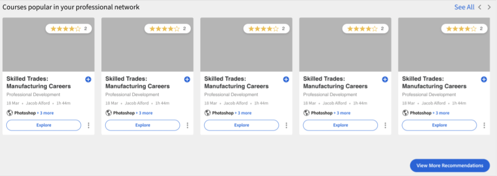

# Consigli in Adobe Learning Manager

Adobe Learning Manager ha introdotto un sistema nuovo e rinnovato di suggerimenti per i corsi. Questa funzione di consigli utilizza algoritmi di intelligenza artificiale e gli interessi degli utenti come Prodotti, Ruoli e Livelli per fornire consigli sui contenuti personalizzati.

Il nuovo sistema di consigli ti consente di creare parametri personalizzati che gli allievi possono selezionare per ricevere consigli personalizzati. Questi consigli veranno visualizzati dagli Allievi come Corsi, Percorsi di apprendimento e Certificazioni nel loro feed della pagina principale.

Per iniziare con questa funzione, attivala nell’app per Amministratori.

## Attivare e configurare i suggerimenti

1. Carica il corso e i dati utente (facoltativi).
1. Rendi visibili le modifiche.
1. Dopo aver attivato e configurato i suggerimenti, carica i dati in Adobe Learning Manager per ricevere consigli e iniziare a lavorare. Tali dati comprendono:

   * Dati del corso
   * Dati utente (facoltativo)

## Algoritmo di classificazione del corso

Il nucleo del motore dei consigli è basato sul nuovo **[!UICONTROL algoritmo di classificazione dei corsi]** di Learning Manager. L’algoritmo utilizza 50 milioni di punti dati e cinque anni di dati di apprendimento aggregati su milioni di utenti per classificare i corsi in base alla probabilità di iscrizione. Questa classificazione garantisce che la maggior parte dei corsi a cui è possibile effettuare l’iscrizione sia visualizzata in anticipo agli Allievi.

## Termini chiave

Il nuovo motore di raccomandazione basato sull’intelligenza artificiale di Learning Manager offre ai learning leader un sistema di raccomandazione basato su parametri configurabile per creare un’esperienza personalizzata per gli Allievi.

I parametri sono: **Prodotti/argomenti**, **Ruoli** e **Livelli**. Inoltre, puoi rinominare questi parametri in base alle tue esigenze. Quindi, &quot;prodotti&quot; può diventare &quot;argomenti&quot; o &quot;ruoli&quot; può diventare &quot;area&quot;.

## Imposta il sistema di consigli

Il nuovo motore di suggerimenti di Adobe Learning Manager semplifica il flusso di lavoro di amministrazione richiesto per configurare consigli personalizzati, perché i dati sui prodotti e i ruoli associati a un cliente/partner sono in genere disponibili per gli amministratori (ad esempio, dai record di acquisto).

Nella configurazione del nuovo motore di consigli sono coinvolti principalmente tre flussi di lavoro:

* Amministrazione
* Autore
* Allievo

Gli amministratori configurano i valori dei parametri Prodotti, Ruoli e Livelli dell’account. Ad esempio, un fornitore di soluzioni IT con banche come base clienti principale può configurare il parametro &quot;Prodotto&quot; in modo che abbia valori quali Gateway di pagamento, Archiviazione cloud sicura, Sistema di rilevamento delle frodi, Piattaforma di trading ecc. e il parametro &quot;Ruolo&quot; in modo che abbia valori come Specialista di integrazione, Amministratore di rete, Analista del rischio, Responsabile della conformità, ecc.

Gli amministratori dispongono di un flusso di lavoro guidato in Learning Manager per configurare in modo ottimale il motore dei consigli e personalizzarlo in base ai casi d’uso dell’account. Inoltre, gli Amministratori hanno anche la possibilità di configurare i consigli PRL tramite un caricamento unico del file CSV.

1. Seleziona **[!UICONTROL Recommendations]** nell&#39;app di amministrazione.

   

   *Selezionare l&#39;opzione Recommendations*

1. Fai clic su **[!UICONTROL Aggiorna]**.

   

   *Selezionare l&#39;opzione di aggiornamento*

1. Fai clic su **[!UICONTROL Procedi]** per passare al nuovo sistema di consigli aggiornato.

   <!--
   *Select the Proceed button*-->

1. Crea i parametri di consiglio per Prodotti e Ruoli.

   
   *Crea parametri per la raccomandazione*

1. Fai clic su **[!UICONTROL Aggiungi più valori]**.
1. Aggiungi i prodotti. Digita il nome di un prodotto e premi Invio.

   Per iniziare, aggiungi almeno due prodotti.

   
   *Aggiungi prodotti*

1. Aggiungi i ruoli. Digita i nomi dei ruoli e premi Invio.

   
   *Aggiungere i ruoli*

1. Fai clic su **[!UICONTROL Continua]**.

   Ora puoi visualizzare i Prodotti e i Ruoli nell’elenco dei Parametri.

   
   *Elenco di prodotti e ruoli*

## Preparazione dei dati

Affinché i suggerimenti funzionino correttamente, è necessario caricare i dati di interesse utente, il prodotto, i ruoli e i livelli.

**Opzioni di caricamento dati**

Configura la funzione consigli. Quindi, invece di prodotti/ruoli/livelli, puoi utilizzare argomenti/ruoli/livello o scegliere una di queste opzioni: solo prodotto/argomenti, solo ruoli, solo prodotto/argomenti e ruoli, solo ruoli-livelli o solo prodotti-livelli.

In base alla configurazione di consiglio scelta, modifica di conseguenza i fogli dati.

Nella sezione seguente viene illustrata l’opzione di utilizzo più ampia dei prodotti, dei ruoli e dei livelli.

L’Amministratore deve caricare i dati in un formato prestabilito. I dati caricati verranno quindi inseriti nell’algoritmo di Consiglio, in modo che un Allievo riceva consigli per i corsi adatti in base ai suoi ruoli e livelli.

**Prerequisiti**

Per caricare i dati per i consigli da utilizzare, compila Prodotti, Ruoli e Livelli nei file CSV User e RecommendationLO.

Nell’ambito dell’esercizio di preparazione dei dati, forniamo due modelli CSV:

**RecUser.csv**

* ID utente
* Prodotti
* Ruoli
* Livelli (Principiante, Intermedio o Avanzato)

Di seguito è riportato un esempio di record nel file csv:

| ID utente | Prodotti | Ruoli | Livelli |
|--- |--- |--- |--- |
| 123 | Data Science | Analista | Analista: livello intermedio |
| 456 | Ing. aerospaziale | Tecnico | Tecnico: livello avanzato |

**RecLO.csv**

* Formazione
* Tipo di formazione
* Nome formazione
* Prodotti
* Ruoli
* Livelli
* Tag
* Abilità

Di seguito è riportato un esempio di record nel file csv:

| ID del corso di formazione | Tipo di formazione | Nome formazione | Prodotti | Ruoli | Livelli | Tag | Abilità |
|---|---|---|---|---|---|---|---|
| 111 | CORSO | Python 101 | Data Science | Analista | Analista: livello intermedio | dati | Generale |
| 222 | CORSO | Julia 101 | Data Science | Analista | Analista: avanzato | dati | Generale |

Inserisci questi file CSV e contatta il team Customer Success per scaricare i formati e caricare i file CSV.

## Rendi visibili i consigli

Dopo aver caricato entrambi i file CSV, fai clic su Vai in diretta. Questo renderà visibile agli Allievi il nuovo sistema di consigli.

*Attivare i suggerimenti*

Il sistema di consigli è ora disponibile agli Allievi.

## Modifica un parametro

1. Nell’elenco dei parametri, seleziona l’icona con i tre puntini e seleziona **[!UICONTROL Modifica nome parametro]**.

   

1. Modifica il nome del parametro e fai clic su **[!UICONTROL Salva]**.

   
   *Modifica del parametro*

## Elimina un parametro

Gli amministratori possono eliminare un parametro facendo clic sull&#39;icona con tre punti e selezionando **[!UICONTROL Elimina parametro]**. Gli amministratori possono eliminare un parametro se non è collegato a un oggetto di apprendimento. Se è collegato, può solo nascondere il parametro. Tuttavia, non possono nascondere gli ultimi due parametri perché sono necessari almeno due parametri affinché i suggerimenti funzionino.

*Eliminare il parametro*

## Pagina delle impostazioni del corso

Nella pagina delle impostazioni di un corso sono elencati i consigli per Prodotti e Ruoli. Agli Allievi che avranno espresso interesse per questi Prodotti e Ruoli verrà consigliato questo Corso.

*Pagina delle impostazioni del corso*

## Vista Allievo

Per un account con consigli basati su PRL impostati, quando un Allievo accede alla piattaforma di apprendimento, un flusso di lavoro guidato consente all’Allievo di configurare i consigli in base al prodotto, al ruolo e alle preferenze dei livelli. In questo modo viene creato il profilo Allievo che il motore di consigli analizzerà.

Gli Allievi che usano account passati al nuovo sistema di consigli possono visualizzare i corsi e la formazione consigliati.

Gli Allievi possono vedere quanto segue:

* Prodotti, Ruoli - Livelli: agli Allievi viene richiesto di selezionare prima Prodotti, Ruoli e poi Livelli per ciascuno dei ruoli selezionati
* Prodotto - Livelli: agli Allievi viene richiesto di selezionare prima Prodotti e poi Livelli per ciascuno dei prodotti selezionati
* Ruoli - Livelli: agli Allievi viene richiesto di scegliere prima Ruoli poi Livelli per ogni ruolo selezionato.
* Prodotti e Ruoli: agli Allievi viene richiesto di scegliere prima Prodotti e poi Ruoli.
* Prodotti: agli Allievi viene richiesto di selezionare solo i prodotti.
* Ruoli: agli Allievi viene richiesto di scegliere solo i ruoli.

Dopo aver selezionato Consigli nel pannello a sinistra, l’Allievo visualizza una finestra a comparsa per configurare i consigli.

*L’Allievo imposta il consiglio*

Facendo clic su Imposta consigli, l’Allievo passa al popup di selezione del prodotto.

*Selezionare i prodotti*

Quindi, nel prossimo popup, l’Allievo può selezionare il ruolo.

*Selezionare i ruoli*

L’Allievo può quindi aggiungere i livelli.

*Seleziona livelli*

## Strisce di apprendimento nell’app per gli Allievi

Un Allievo può visualizzare le seguenti strisce nell’app:

* Striscia Il mio apprendimento
* Striscia con il widget calendario, social e gamification
* Striscia Salvato da me
* Striscia Super pertinente
* Striscia di prodotto - 1
* Striscia di prodotto - 2
* Striscia di Individuazione
* Striscia Consigliato dall’Amministratore
* Striscia Sfoglia per catalogo

### Schede nella striscia di apprendimento

*Schede nell&#39;area di apprendimento*

Ogni scheda contiene i pulsanti Valutazione, Immagine della carta, Titolo, Abilità, Data di pubblicazione, Autore, Durata, Barra di avanzamento e il pulsante Continua o Esplora.

### Schede salvate da me

*Schede salvate*

Ogni scheda contiene i pulsanti Valutazione, Immagine della scheda, Titolo, Abilità, Data di pubblicazione, Autore, Durata, Barra di avanzamento e il pulsante Avvia o Esplora o Continua o Revisiona.

Non sarà presente alcuna barra di avanzamento nella scheda dopo che un Allievo avvia il corso. Un Allievo può anche non salvare il corso.

### Schede su striscia super rilevante

*Schede pertinenti*

Ogni scheda contiene i pulsanti Valutazione, Immagine della scheda, Titolo, Abilità, Data di pubblicazione, Autore, Durata, Barra di avanzamento e il pulsante Avvia o Esplora o Continua o Revisiona.

Non sarà presente alcuna barra di avanzamento nella scheda dopo che un Allievo avvia il corso.

Dal menu sono disponibili due opzioni: **[!UICONTROL Salva]** e **[!UICONTROL Non consigliare]**. Se l’Allievo fa clic su **[!UICONTROL Salva]**, il corso viene salvato nella striscia &quot;Salvato da me&quot;. Se l’Allievo fa clic su **[!UICONTROL Non consigliare questo]**, il corso di formazione consigliato viene rimosso dall’elenco.
