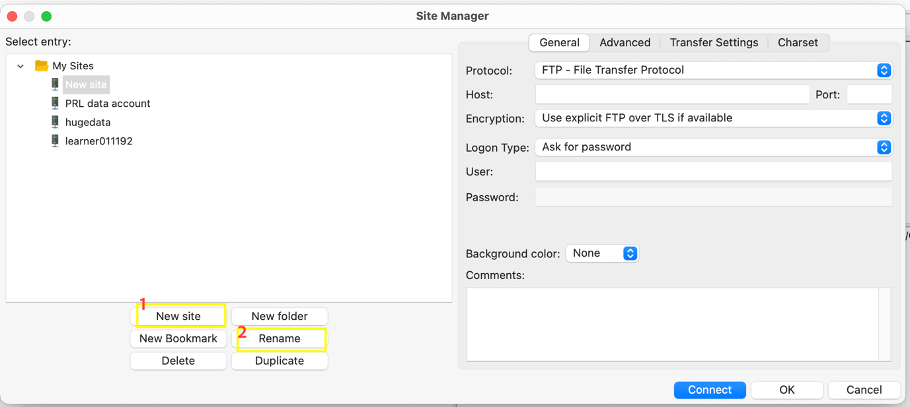
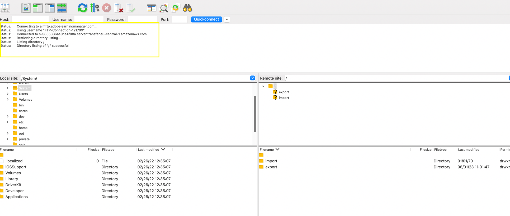

# Transizione dall’FTP di Adobe Manager

Adobe Learning Manager supporta un nuovo connettore utilizzando il protocollo SFTP della famiglia AWS Transfer.

Puoi sostituire qualsiasi client FTP open source con l’FTP di Adobe Manager.

[Di seguito](https://docs.aws.amazon.com/transfer/latest/userguide/transfer-file.html) sono elencati alcuni client FTP consigliati da AWS:

* FileZilla (Windows, macOS e Linux)
* OpenSSH (macOS e Linux) - Nota: questo client funziona solo con i server abilitati per il protocollo Secure Shell (SSH) File Transfer (SFTP).
* WinSCP (solo per Microsoft Windows)
* Cyberduck (Windows, macOS e Linux)

## Configurazione del connettore FTP basato su AWS

È necessario configurare il nuovo connettore FTP basato su AWS nell’Amministratore dell’integrazione.

*Seleziona l’opzione FTP*

Una volta effettuata la connessione, viene visualizzata la pagina Dettagli connessione.

*Visualizza la pagina dei dettagli della connessione*

Sono disponibili tre opzioni di autenticazione:

### Crea l’autenticazione generando nuove chiavi SSH

Puoi generare la chiave SSH nel sistema stesso. Fai clic su Genera chiave SSH.

La chiave privata viene scaricata nel tuo computer e la chiave pubblica viene salvata nei nostri servizi. Dopo aver fatto clic su Connetti, l’utente FTP viene creato con le chiavi pubbliche e private come autenticazione.

Hai creato una connessione FTP.

### Crea l’autenticazione utilizzando chiavi SSH esistenti

Se disponi già di una chiave SSH, incolla la chiave pubblica nel **[!UICONTROL Chiave pubblica FTP]** e quindi fare clic su Connetti.

*Incollare i tasti*

### Crea un’autenticazione di base utilizzando una password

Questo è il meccanismo di autenticazione di base. Selezionate la prima opzione, **[!UICONTROL Creare l’autenticazione di base utilizzando una password]**. Immettere la password e fare clic su **[!UICONTROL Connetti]**.

Hai creato una connessione.

## Passaggi successivi

### Configurazione del client FTP

Configura la connessione su un client FTP (consigliato nella sezione precedente) con le chiavi scaricate, le chiavi esistenti o la password.

### Esportazione di test di esempio

* Nel client FTP, modifica la posizione dell’FTP ExaVault nel nuovo percorso FTP. Il nuovo dominio è `http://almftp.adobelearningmanager.com/`.
* È inoltre necessario autorizzare l&#39;IP, `18.195.107.67`.
* Dopo l’autenticazione, carica e scarica alcuni file di esempio nella e dalla nuova posizione FTP utilizzando client FTP esterni o script di automazione.
* Trasferisci i dati dalla posizione precedente a quella nuova.
* Il criterio di conservazione dei dati per il connettore rimane lo stesso. ExaVault ha inoltre supportato alcuni criteri di conservazione dei dati oltre a quelli ufficiali. Tali criteri di conservazione dei dati non saranno disponibili per il nuovo connettore. Verifica se il connettore utilizza eventuali altri tipi di conservazione dei dati oltre ai criteri ufficialmente supportati.

### Cosa succede ai progetti di migrazione

| Stato | Consiglio |
|---|---|
| Nuova migrazione | Non puoi avviare nuove migrazioni dall’FTP precedente. Utilizza il nuovo FTP per le nuove migrazioni. Per ulteriore supporto, contatta il team Customer Success. |
| Migrazione in corso | Creazione di uno sprint: puoi continuare a utilizzare il vecchio FTP, ma ti consigliamo di utilizzare il nuovo FTP. Contatta il team Customer Success per qualsiasi sprint esistente che non possa essere spostato. |
| Migrazione chiusa | Nessuna azione. |

## Connettiti ad Adobe Learning Manager tramite il client FTP FileZilla

1. Connettiti al nuovo connettore FTP ALM. Fai clic su Connetti.

   
   *Collegamento al nuovo connettore FTP ALM*

1. Per connetterti tramite autenticazione di base con password, immetti il nome di dominio, il nome utente FTP e imposta la password che soddisfa i criteri di convalida della password. Fai clic su Connetti. La nuova connessione FTP verrà creata e sarà accessibile tramite qualsiasi client SFTP.

   
   *tramite autenticazione di base tramite password*

1. Installa qualsiasi client SFTP, ad esempio FileZilla. Avvia File Zilla e fai clic su Apri Gestione siti nell&#39;angolo in alto a sinistra.

   
   *Connessione tramite client SFTP*

1. Fai clic su **[!UICONTROL Nuovo sito]** per creare un nuovo sito. Rinomina il sito a seconda delle necessità.

   
   *Creare un sito*

1. Mappa i dettagli dalla pagina delle credenziali del connettore.

   * Selezionare il protocollo come &#39;SFTP - SSH File Transfer Protocol&#39;
   * Host come dominio FTP
   * Tipo di accesso: &#39;Richiedi password&#39;
   * Utente come Nome utente FTP

1. Fai clic su Connetti.

   
   *Immettere le credenziali*

   >[!NOTE]
   >
   >Esegui questo passaggio nel client FileZilla.

1. Immetti la password.

   (Facoltativo) Seleziona la casella di controllo Ricorda password per memorizzare la password.

   
   *Immetti la password*

   (Facoltativo) Selezionate **[!UICONTROL Considera sempre attendibile l&#39;host]** casella di controllo per considerare attendibile l&#39;host.

1. Fai clic su OK.

   
   *Chiave host*

1. Controlla lo stato e l’avanzamento della connessione nella parte superiore.

   La metà sinistra fa riferimento al sito locale, mentre la metà destra al sito remoto.

   Per spostare i file da locale a remoto e viceversa:

   * Puoi trascinare e rilasciare i file.
   * Fai doppio clic sul file.

   
   *Controllare lo stato della connessione*

Puoi modificare e aggiornare il tipo di autenticazione in qualsiasi momento.

Altre modalità di autenticazione sono tramite le chiavi SSH:

incolla la chiave pubblica nella casella di testo per utilizzare le chiavi SSH esistenti. Fai clic su Connetti/Salva.

Per generare nuove chiavi SSH, fare clic sul pulsante &#39;**[!UICONTROL Genera chiave SSH]**&#39;. La chiave privata verrà scaricata. Fai clic su **[!UICONTROL Connetti/Salva]**.

*Genera chiave SSH*

Mappa i dettagli. Seleziona il tipo di accesso come file di chiave. Seleziona il file di chiave privata.

Fai clic su **[!UICONTROL Connetti]**.

## Cosa accade dopo che ExaVault è stato dichiarato obsoleto

Dopo l’eliminazione di ExaVault, tutti i progetti di migrazione esistenti in corso passeranno al nuovo percorso di origine FTP. Quindi configura il nuovo connettore FTP e continua il processo di migrazione.

## Consigli per migrare gli sprint

Durante la creazione di un progetto di migrazione, Adobe consiglia di crearlo utilizzando il nuovo connettore SFTP AWS per evitare la migrazione sprint da ExaVault ad AWS in una fase successiva.

Se è in corso una migrazione, chiudere lo sprint corrente che utilizza Exavault come origine dati. Crea la connessione SFTP AWS, verifica la configurazione e contatta il team Customer Success per passare alla nuova origine dati SFTP AWS. Dopo il passaggio, crea un nuovo sprint nello stesso progetto di migrazione. Le cartelle sprint vengono create nel nuovo percorso e puoi caricare i file CSV di migrazione per continuare l’attività.

**Casi in cui non è possibile chiudere un progetto di migrazione**

* La mappatura dell’ID corso viene eseguita nel progetto corrente per i corsi migrati da sistemi legacy esterni ad Adobe Learning Manager. Puoi farlo solo se desideri aggiornare gli stessi corsi nello stesso progetto. Una volta chiuso il progetto, non puoi modificarne i dettagli.
* Per i progetti di migrazione basati su API, in cui non devi chiudere un progetto.
