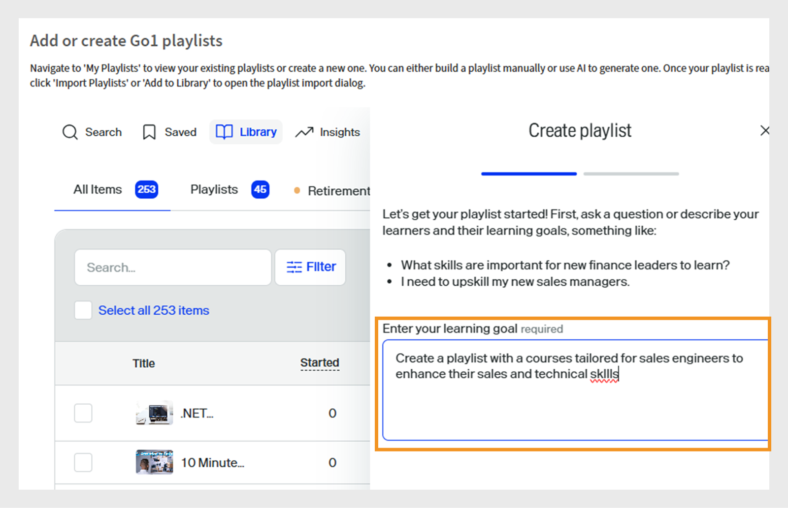
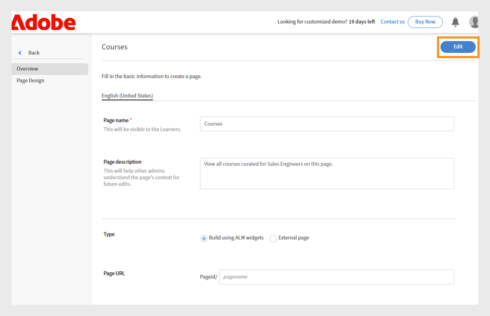

# Prossime modifiche in Adobe Learning Manager

<!-- >>[!IMPORTANT]
>
>The Adobe Learning Manager October 2025 release is now live. View [What's New](/help/migrated/whats-new.md) for more information on the latest features and enhancements. This page will be updated with the new features and enhancements for the next release. Stay tuned for more updates. -->

## Panoramica della versione

La versione di aprile 2026 di Adobe Learning Manager introduce un ampio set di miglioramenti che semplificano l’apprendimento per gli Allievi, semplificano la gestione per gli Amministratori e rendono più flessibile l’attività degli Istruttori. Tra questi, una navigazione più chiara nel lettore Fluidic con un’etichetta &quot;Modulo successivo&quot; e un pulsante di uscita dedicato, supporto per più sessioni Zoom simultanee che consentono ai team di eseguire classi virtuali parallele senza configurazione manuale e una migliore visibilità per i corsi condivisi, mostrando l’autore reale anziché l’autore esterno negli account condivisi tra pari. L’aggiornamento espone anche le date di scadenza degli oggetti di apprendimento nelle API degli Allievi per consentire ai LXP di evidenziare i corsi di formazione sensibili al tempo, aggiunge il supporto multilingue per le risorse formative in modo che una risorsa formativa possa contenere tutte le versioni linguistiche e consente agli Amministratori di limitare l’avvio dei moduli definendo finestre di inizio/fine utili per coorti o programmi a tempo.

I sistemi esterni che utilizzano l’LTI possono ora impostare automaticamente la lingua del lettore, offrendo agli allievi un’esperienza linguistica uniforme su tutte le piattaforme. Sono disponibili anche diversi aggiornamenti dell’elenco di controllo, tra cui punteggio ponderato, testo multilingue delle domande e commenti facoltativi dei revisori per ottenere feedback più approfonditi. ALM ora acquisisce più tentativi di quiz controllati all&#39;interno dei contenuti SCORM e segnala ogni tentativo in modo pulito nel reporting L2. Gli istruttori possono inoltre generare essi stessi codici QR per l’iscrizione istantanea e il tracciamento della partecipazione durante le sessioni di persona e il contenuto delle Captivate viene riprodotto in modo più pulito con un sommario unificato, tacche di completamento a livello di diapositiva ed esportazioni di note affidabili. In generale, la versione è incentrata su chiarezza, coerenza, preparazione multilingue, efficienza dell&#39;amministratore e fornitura di formazione più flessibile.

## Navigazione lettore Fluidic: mostra il nome del modulo successivo

### Panoramica

Questo miglioramento era già incluso nella versione di novembre 2025 di Adobe Learning Manager.

L’azione &quot;Avanti&quot; nel lettore indica cosa succede quando si fa clic visualizzando il nome del modulo o corso successivo e segnalando esplicitamente quando l’Allievo sta per uscire dal lettore.

### Novità

**&quot;Modulo successivo: etichetta {ModuleName}&quot; nel lettore**

L’icona Avanti nel lettore Fluidic ora mostra il nome del modulo successivo nel corso. Ad esempio, Modulo successivo: Lezione 2- Guida introduttiva.

Ciò si applica a tutti i casi in cui l’Allievo si sposta da un modulo all’altro all’interno dello stesso corso.

**Cancella azione uscita nell&#39;ultimo modulo**

Quando l’Allievo si trova sull’ultimo modulo di un corso, viene visualizzato un nuovo pulsante di azione Esci, che indica che facendo clic su di esso il lettore verrà chiuso e tornerà al contesto del corso.

**Comportamento reattivo per contenuti per dispositivi mobili e PDF**

Nelle finestre di visualizzazione più piccole (ad esempio, larghezza ~320 px), l’etichetta Avanti può essere abbreviata o nascosta, mostrando solo l’icona, per evitare la sovrapposizione con i controlli PDF.

Per i moduli PDF, il lettore regola i controlli su una riga separata, in modo che le etichette di navigazione e i controlli PDF non interferiscano tra loro.

**Aggiornamento amministratore > Branding > Anteprima lettore**

L’anteprima del lettore in Amministratore > Branding ora riflette la nuova etichetta, ad esempio Modulo successivo: lezione 2. Ciò consente agli amministratori di visualizzare il comportamento di navigazione aggiornato.

### Vantaggi principali

**Navigazione più chiara per gli Allievi**

Gli Allievi non devono più indovinare cosa accadrà quando selezioneranno &quot;Avanti&quot;. L’etichetta specifica chiaramente cosa viene dopo, che si tratti di un modulo o di un corso. Questa riduzione dell’ambiguità aiuta ad attenuare l’esitazione e la confusione, in particolare nel grande pubblico di formazione del cliente in cui molti allievi potrebbero non avere familiarità con le interfacce LMS.

**Percentuali di completamento del corso più elevate**

Il passaggio successivo (modulo successivo: {ModuleName}) e l’aggiunta di un’azione di uscita distinta per il modulo finale riducono la probabilità che gli Allievi abbandonino il corso o trascurino l’ultimo passaggio di completamento.

**Esperienza utente più prevedibile sui vari dispositivi**

Le etichette aggiornate si allineano al comportamento e alle icone Successivo o Precedente su desktop, tablet e dispositivi mobili. I vincoli di layout vengono rispettati nei dispositivi e nei flussi di PDF in modo che i controlli rimangano utilizzabili e accessibili.

Ciò è particolarmente importante per le implementazioni headless in cui il lettore Fluidic è incorporato in un&#39;esperienza di apprendimento personalizzata.

### Casi d’uso

**Portali didattici per clienti e partner (headless o AEM integrato)**

Account che utilizzano Adobe Learning Manager in una configurazione headless, indirizzando gli Allievi da canali di marketing esterni. Questi Allievi:

* Utilizzano spesso contenuti video in sequenze lunghe.

* Ci si aspetta un’esperienza in stile curriculum in cui il sistema indichi chiaramente l’episodio o il modulo successivo.

In questi ambienti, l&#39;etichetta **Modulo successivo:{ModuleName}**:

* Rafforza la natura guidata del viaggio.

* Riduce al minimo il drop-off tra i moduli.

**Corsi di conformità e certificazione con i moduli ordinati**

In scenari regolamentati o con requisiti elevati:

* Gli Allievi devono completare una rigida sequenza di moduli.

* Gli autori spesso disattivano il sommario per evitare di saltarlo.

Qui, viene visualizzato **Modulo successivo:{ModuleName}**:

* Conferma agli Allievi che stanno seguendo la sequenza corretta.

* Rende meno probabile che interpretino in modo errato l&#39;azione successiva e che escano presto.

**Percorsi di apprendimento in cui i corsi si susseguono**

Dove percorsi di apprendimento o equivalenti concatenano più corsi. Questo è utile quando si creano sequenze in stile curriculum per un pubblico numeroso.

**Primo utilizzo per dispositivi mobili**

Per gli Allievi che utilizzano principalmente telefoni o tablet:

* Le etichette aggiornate e il comportamento reattivo garantiscono che la navigazione rimanga comprensibile senza dipendere da icone di chiusura o controlli nascosti.

* Questo è importante per la formazione dei clienti, gli addetti ai lavori o gli Allievi in prima linea che possono accedere ai contenuti in sessioni brevi su dispositivi mobili.

## Connettore Zoom - Creare più sessioni Zoom simultanee

### Panoramica

Il prossimo aggiornamento al connettore Zoom migliorerà notevolmente il modo in cui Adobe Learning Manager gestisce il training VILT (Virtual Instructor-Led Training). In precedenza, gli utenti potevano creare una sola sessione di Zoom alla volta. Con il nuovo aggiornamento, amministratori e autori possono pianificare più sessioni di Zoom contemporaneamente utilizzando l’integrazione standard.

### Novità

#### Supporto per più sessioni Zoom simultanee tramite il connettore

* Il connettore Zoom ora consente di creare più sessioni VILT alla stessa data/ora da ALM.

* La logica di pianificazione non applica più un vincolo di tipo &quot;uno zoom alla volta&quot; a livello di account/connettore.

* Amministratori e autori possono configurare sessioni VILT sovrapposte (ad esempio, aule regionali, tracce parallele o sessioni ripetute per diversi gruppi di partner) senza soluzioni alternative.

#### Le riunioni vengono create utilizzando l’identità Zoom dell’istruttore (non il super amministratore Zoom).

Per supportare in modo sicuro le riunioni simultanee, il connettore è stato aggiornato in modo che:

* Le riunioni con Zoom vengono ora create utilizzando l’indirizzo e-mail dell’istruttore, invece dell’e-mail dell’amministratore con privilegi di Zoom.

* L’account Zoom di ogni istruttore può ospitare le proprie riunioni in parallelo con gli altri istruttori, fatti salvi i limiti del piano Zoom esistente.

**Nota**:

* È ancora supportato un solo istruttore per riunione.

* Se l’indirizzo e-mail di un istruttore viene successivamente aggiornato in Adobe Learning Manager, le riunioni esistenti restano associate all’indirizzo e-mail originale utilizzato al momento della creazione.

#### Non dovrai più incollare manualmente l’URL di Zoom per le sessioni simultanee

In precedenza, quando doveva essere eseguita una seconda o una terza sessione di Zoom contemporaneamente:

* Gli Autori dovevano creare manualmente le riunioni Zoom al di fuori di ALM e quindi incollare l’URL di Zoom join nella configurazione dell’istanza del corso.

* Si tratta di un comportamento soggetto a errori che non ha tratto vantaggio da funzioni di connessione come il tracciamento della frequenza.

Con il connettore aggiornato:

* Tutte le sessioni possono essere create direttamente dall’interfaccia utente di ALM utilizzando il connettore Zoom, anche se si sovrappongono nel tempo.

* Il ciclo di vita delle sessioni (creazione/annullamento) continua a essere gestito centralmente tramite l&#39;integrazione.

### Vantaggi principali

#### Migliore pianificazione VILT su larga scala

Le organizzazioni possono ora:

* Esecuzione simultanea di più aule virtuali basate su Zoom (ad esempio, percorsi paralleli in un vertice virtuale, coorti regionali o sessioni di formazione separate per i partner).

* Evita i colli di bottiglia che in precedenza forzavano gli amministratori a serializzare le sessioni o che si affidavano alla gestione manuale dello zoom.

#### Riduzione del sovraccarico di lavoro per amministratori e autori

Il miglioramento elimina:

* Creazione manuale di riunioni con Zoom esterne a Adobe Learning Manager.

* Copia e incolla gli URL di Zoom in ogni istanza del corso per le sessioni sovrapposte.

* Rischio di collegamenti non configurati correttamente, riunioni errate o monitoraggio di presenze mancate.

Amministratori e Autori possono gestire tutte le sessioni di Zoom da Adobe Learning Manager, utilizzando flussi di lavoro familiari.

#### Migliore allineamento con il provisioning di Zoom e i ruoli di istruttore

Legando le riunioni ai singoli account Zoom del docente:

* Ogni istruttore può operare entro i propri limiti di licenza Zoom.

* Le organizzazioni possono utilizzare il modello di provisioning Zoom esistente (un account per istruttore, per BU, ecc.) continuando a integrarsi completamente con Adobe Learning Manager.

* Evita il collo di bottiglia a punto singolo che comporta l’utilizzo di un utente Zoom condiviso con amministratore privilegiato per tutte le sessioni.

### Casi d’uso

#### Eventi e vertici virtuali a più tracce

I team di formazione dei clienti che eseguono eventi di grandi dimensioni (ad esempio, bootcamp di prodotti, vertici con i partner o settimane di certificazione) possono:

* Configurare più sessioni basate su Zoom nello stesso intervallo di tempo (per tracce o argomenti diversi).

* Puoi gestirli tutti come moduli VILT nei corsi e percorsi di apprendimento Adobe Learning Manager.

* Offre agli Allievi un’esperienza unificata, mentre il connettore gestisce tutta la creazione della riunione Zoom sottostante.

#### Formazione globale per partner e clienti

Le organizzazioni che formano clienti e partner in diverse aree geografiche possono:

* Eseguire sessioni di Zoom separate per EMEA, APAC e Americhe a orari sovrapposti in modo che corrispondano agli orari di lavoro locali.

* Evitate di forzare una singola fascia oraria globale o la configurazione manuale dello zoom per altre coorti.

#### Abilitazione interna

I team di abilitazione interni (vendite, supporto e così via) possono:

* Pianifica sessioni di onboarding parallele o breakout basati sui ruoli (ad esempio, sale Zoom separate per sviluppatori, amministratori e stakeholder aziendali) in ALM.

* Mantenere tutte le sessioni all&#39;interno del modello VILT di ALM per scopi di reporting e conformità, piuttosto che passare parzialmente a riunioni Zoom non gestite.

## Mostrare l’autore originale per i corsi condivisi negli account condivisi tra pari

### Panoramica

Quando un corso viene condiviso tramite il catalogo con un account condiviso tra pari, Adobe Learning Manager attualmente etichetta l’autore come &quot;Autore esterno&quot; nelle viste Allievo, Amministratore e Autore dell’account di ricezione. Ciò può creare difficoltà per gli Allievi e gli Amministratori, in particolare nelle grandi aziende, poiché diventa difficile identificare e contattare il proprietario dei contenuti appropriato quando si verificano problemi o domande.

Questo miglioramento garantisce che le informazioni dell’Autore vengano conservate e rese disponibili per i corsi condivisi negli account condivisi tra pari, anziché essere sostituite da un segnaposto generico.

### Novità

Mostra il nome dell’autore effettivo per i corsi condivisi negli account condivisi tra pari

Per i corsi condivisi tramite cataloghi esterni o condivisi tra pari, il nome dell’autore originale dall’account di origine viene ora visualizzato nell’account di destinazione anziché come &quot;Autore esterno&quot;.

Questo vale per:

* App Allievo (scheda del corso o dettagli del corso).

* Visualizzazioni Amministratore e Autore durante l’anteprima come Allievo.

### Vantaggi principali

#### Visibilità diretta del proprietario per il contenuto condiviso

Gli Allievi e gli Amministratori degli account condivisi tra pari ora possono:

* Scopri chi ha creato il corso, anche quando viene acquisito tramite un catalogo condiviso.

* Evitate l’etichetta generica e inutile &quot;Autore esterno&quot;.

#### Esperienza più coerente con più tenant e account condivisi tra pari

Per i clienti che eseguono scenari multi-tenant o extended-enterprise:

* Lo stesso corso viene visualizzato con un branding autore coerente tra gli account.

* L’esperienza dell’Allievo è in linea con le aspettative dell’account principale (ad esempio, viene visualizzato &quot;Cloud Academy Team&quot; invece di &quot;Autore esterno&quot;).

### Casi d’uso

#### Grande azienda con account condivisi tra pari

L&#39;azienda utilizza ALM con:

* Un account principale a cui appartengono i corsi canonici e

* Account condivisi tra pari che acquisiscono contenuti tramite cataloghi condivisi.

Gli Allievi negli account condivisi tra pari devono sapere quale team aziendale ha creato un corso per indirizzare correttamente domande o suggerimenti di miglioramento.

Con questo miglioramento:

* I corsi condivisi ora visualizzano il nome dell’autore enterprise corretto negli account condivisi tra pari.

* Il carico di supporto interno dell’azienda viene ridotto perché gli Allievi e gli Amministratori locali sanno a chi rivolgersi.

#### Condivisione interna multi-BU

Dove una Business Unit cura l&#39;apprendimento per gli altri:

* Il BU proprietario può essere identificato nel campo Autore in tutti gli account di consumo.

* Gli amministratori L&amp;D locali possono vedere rapidamente se un corso viene gestito localmente o da un altro BU e collaborare di conseguenza.

## Esponi la data di scadenza (ritiro automatico) degli Oggetti di apprendimento nelle API degli Allievi

### Panoramica

Questo miglioramento rende disponibile la data di ritiro automatico di un oggetto di apprendimento (LO) direttamente tramite le API rivolte agli Allievi di Adobe Learning Manager. Quando un corso, un percorso di apprendimento o una certificazione sono configurati con una data di scadenza o ritiro automatico, tali informazioni fanno ora parte dei dati LO restituiti dagli endpoint principali dell’Allievo.

### Novità

#### Nuovo campo per scadenza/ritiro automatico nelle API degli oggetti di apprendimento degli Allievi

* Le API degli LO degli Allievi (ad esempio, gli endpoint che restituiscono gli oggetti di apprendimento all’esperienza dell’Allievo e a piattaforme esterne) ora includono la data di scadenza dell’LO (data di ritiro automatico configurata per tale oggetto di apprendimento).

* Questo campo viene restituito come parte dell&#39;entità LO in risposte quali:

   * Ottieni oggetto di apprendimento (dettagli LO).

   * Dati LO utilizzati per popolare la pagina principale dell’Allievo, il catalogo e i risultati della ricerca.

* Il campo integra l’attuale completamentoScadenza già esistente a livello di istanza; il nuovo campo è specificamente la data di smobilizzo automatico a livello di LO.

#### Disponibilità in esperienze di apprendimento basate su ricerca

Poiché la data di scadenza è esposta come parte della rappresentazione LO basata su ricerca, è ora disponibile ovunque ALM o una piattaforma esterna utilizzi:

* API di ricerca o

* cataloghi e suggerimenti basati sulla ricerca per creare visualizzazioni per gli allievi.

**Ambito ed esclusioni**

Il miglioramento si applica solo alle API degli Allievi.

### Vantaggi principali

#### Esperienza in base alla scadenza degli Allievi in LXP personalizzati

Per le grandi e medie imprese, il LXP personalizzato può ora ottenere informazioni sulla scadenza degli oggetti di apprendimento direttamente da ALM, consentendo loro di:

* Mostra le etichette &quot;In scadenza il {date}&quot; o &quot;In scadenza a breve&quot; sulle schede dei corsi e sulle pagine dei dettagli.

* Comunicare con urgenza in modo più chiaro, così gli Allievi danno priorità ai corsi di formazione che stanno per essere ritirati.

Ciò è particolarmente importante per la conformità o per la formazione sul prodotto vincolata nel tempo, in cui gli oggetti di apprendimento vengono regolarmente aggiornati e le versioni precedenti vengono ritirate.

#### Migliore orientamento per gli Allievi sui corsi di formazione da seguire ora

Rendendo visibile la scadenza dell’LO, l’esperienza dell’Allievo può:

* Evidenzia i corsi ancora validi rispetto a quelli che stanno per essere ritirati.

* Aiuta gli Allievi a evitare di iscriversi a corsi di formazione che non saranno più disponibili o validi nel prossimo futuro.

#### Coerenza con i dati di scadenza di completamento esistenti

In precedenza, le API degli Allievi esponevano già il completamento a livello di istanzaScadenza, ma non la data di ritiro automatico a livello di LO. Con questa modifica:

Sono disponibili i seguenti aspetti della formazione:

* &quot;Entro quando devo completare questa istanza?&quot; (scadenza per il completamento).

* &quot;Fino a quando sarà offerto questo corso di formazione?&quot; (ritiro automatico/data di scadenza).

### Casi d’uso

#### Un&#39;azienda globale con una rigorosa gestione del ciclo di vita dei corsi

Le aziende che ritirano e sostituiscono regolarmente i corsi (ad esempio, aggiornamenti normativi, di prodotto o metodologici) possono:

* Evitare di confondere gli Allievi circa la graduale eliminazione di un corso di formazione.

* Indirizzare gli Allievi verso le offerte più recenti e di lunga durata.

I portali personalizzati e gli strumenti interni possono ora leggere la data di scadenza direttamente da ALM tramite le API degli Allievi.

#### Accademie esterne di clienti o partner

Per la formazione dei clienti e dei partner, le pagine di marketing e i portali spesso enfatizzano la formazione aggiornata.

L’aggiunta di date di scadenza nell’API LO consente ai creatori di esperienze di:

* Nascondere o attenuare i contenuti prossimi al pensionamento.

* Costruisci campagne &quot;Ultima occasione per completare&quot;.

## Supporto multilingue per risorse formative

### Panoramica

Questo miglioramento estende il modello di localizzazione di Adobe Learning Manager alle risorse formative, consentendo agli autori di allegare file di contenuto diversi per lingua a una singola risorsa formativa. Invece di creare risorse formative separate per ogni lingua, gli autori possono ora gestire tutte le versioni localizzate come una risorsa formativa logica.

### Novità

#### Caricamento di contenuti specifici per ogni lingua per le risorse formative

Gli autori possono allegare file diversi per lingua supportata a una singola risorsa formativa, come corsi e altri LO.

L’esperienza di creazione/modifica della risorsa formativa ora supporta:

* Selezione di una lingua.

* Caricamento del file specifico della lingua per la stessa lingua nella stessa entità Risorsa formativa.

#### Gestione coerente della lingua nell’interfaccia utente del lettore e dell’Allievo

Il lettore Fluidic è stato aggiornato in modo che quando un Allievo apre una risorsa formativa, viene visualizzata la variante di contenuto corrispondente alla lingua dell’Allievo (se disponibile).

Gli Amministratori e gli Autori possono visualizzare le risorse formative come singoli oggetti con varianti di lingua, anziché come elementi separati per lingua.

### Vantaggi principali

#### Risorsa formativa unica per tutte le lingue

Gli autori possono evitare di creare risorse formative separate per lingua.

Tutte le varianti della lingua della stessa risorsa formativa (ad esempio, una procedura, un SOP, un PDF dell’elenco di controllo o una guida di riferimento) possono essere gestite in un’unica posizione.

#### Migliore esperienza per gli Allievi globali

Gli Allievi visualizzano automaticamente la risorsa formativa nella lingua preferita, ovvero:

* Meno confusione sulla versione da aprire.

* Riduzione del rischio di accesso a copie fuori dalle impostazioni locali o obsolete.

Ciò è particolarmente utile nelle organizzazioni multilingue in cui la stessa documentazione relativa a processi o prodotti deve essere disponibile in più lingue.

### Casi d’uso

#### Implementazione globale del contenuto di riferimento

Un’azienda deve fornire risorse formative in diverse lingue agli Allievi in tutto il mondo, ad esempio:

* Schede di riferimento del prodotto.

* Elabora elenchi di controllo.

* Supporta i playbook

Invece di creare risorse formative separate come &quot;Product Quick Start - EN&quot;, &quot;Product Quick Start - DE&quot;, &quot;Product Quick Start - JP&quot;, ecc., possono creare una risorsa formativa, allegare file localizzati per ogni lingua e consentire ad ALM di fornire la versione corretta a ciascun Allievo in base alle impostazioni della lingua.

#### Documentazione rivolta ai clienti o ai partner per più mercati

Per le accademie di clienti e partner, le risorse formative possono includere:

* Schede di imbroglio di prodotti

* Guide di integrazione

* Flussi di lavoro di supporto

Con risorse formative multilingue:

* Ogni partner vede la versione localizzata senza essere costretto a scegliere tra voci specifiche della lingua.

* I team di marketing e abilitazione possono gestire una risorsa formativa per argomento in tutte le lingue.

## Imposta la restrizione sull&#39;ora di inizio del modulo

### Panoramica

Il miglioramento consente agli Autori e agli Amministratori di Adobe Learning Manager di definire una finestra temporale durante la quale gli Allievi possono avviare un modulo. Al di fuori della finestra di inizio/fine configurata, il modulo rimane visibile nella struttura del corso, ma gli allievi non possono avviarlo.

Questa funzionalità è fondamentale per gli utenti che necessitano di un controllo più rigoroso per verificare quando determinati contenuti diventano disponibili o non devono più essere avviati, ad esempio in programmi a tempo determinato, corsi di formazione basati su coorti o esercizi sensibili al fattore tempo.

### Novità

Gli Autori possono ora configurare, a livello di modulo all’interno di un corso, una data/ora di inizio e una data/ora di fine che determinano quando agli Allievi è consentito avviare tale modulo. All’interno di questa finestra, il modulo funziona come al solito; prima dell’ora di inizio o dopo l’ora di fine, l’Allievo vede il modulo nella struttura del corso ma non può avviarlo.

La configurazione viene visualizzata nell’interfaccia utente di creazione del corso come controlli di pianificazione aggiuntivi per tipi di modulo specifici, ad esempio contenuti autonomi, quiz o attività. Gli amministratori possono utilizzare questi controlli per creare moduli che si aprono in fasi o per evitare l&#39;avvio tardivo di programmi in cui il contenuto deve essere utilizzato entro un periodo di tempo definito.

#### Vantaggi principali

Il vantaggio principale è la possibilità di controllare quando i moduli sono accessibili. I team di formazione possono sincronizzare la disponibilità dei moduli con eventi reali, quali il lancio di nuovi prodotti, le scadenze normative e i programmi interni. Ciò garantisce che gli Allievi completino i contenuti dei prerequisiti prima di poter accedere ai moduli successivi.

Ad esempio, la coorte 1 può accedere al modulo 2 solo nella settimana 2, mentre il modulo 3 rimarrà bloccato fino alla settimana 3, eliminando la necessità di nascondere e scoprire manualmente i contenuti o di creare versioni del corso separate.

Ciò migliora l’esperienza dell’Allievo: invece di affrontare moduli a cui è tecnicamente possibile accedere ma che non dovrebbero essere in quel momento (o che dovrebbero già essere completati), gli Allievi vedono una struttura del corso in cui i moduli a cui è consentito avviare sono chiaramente allineati alla pianificazione prevista.

#### Casi d’uso

* **Programma di abilitazione basato su coorte**: in questo programma, ogni settimana sblocca un nuovo modulo. Il contenuto per la Settimana 1 è disponibile immediatamente, mentre la Settimana 2 è visibile ma non può essere avviata fino a una data specificata. La Settimana 3 segue lo stesso processo di controllo. Gli Allievi possono visualizzare l’intero percorso di apprendimento, ma il sistema controlla quando possono effettivamente iniziare ciascun passaggio.

* **Corso di formazione su prodotti o campagne con scadenze precise**: i team di marketing o di prodotto possono creare un modulo di formazione a cui accedere solo quando è attiva una campagna o quando è ancora disponibile una versione specifica di un prodotto. Questa finestra iniziale assicura che gli allievi non inizino un modulo su una versione del prodotto fuori produzione dopo l’ora di fine specificata.

* **Ambienti di valutazione o esame**: le organizzazioni possono aprire un modulo (ad esempio un test) per una breve finestra ben definita (ad esempio, &quot;è possibile avviare l&#39;esame in qualsiasi momento tra il 9:00 e il 12:00 in una data specifica&quot;). Gli Allievi non possono iniziare l’esame al di fuori di tale finestra, il che supporta una pianificazione equa per fusi orari e coorti.

## Controllare la lingua del lettore tramite il parametro LTI personalizzato

### Panoramica

Il miglioramento consente alle piattaforme esterne che utilizzano LTI (Learning Tools Interoperability) di specificare la lingua per i contenuti Adobe Learning Manager al momento del lancio. Invece di dipendere dall’Allievo che deve modificare la lingua nel lettore Fluidic, il consumatore di LTI può inviare un codice della lingua tramite un parametro LTI personalizzato. Adobe Learning Manager utilizzerà quindi questo codice per selezionare la variante della lingua appropriata.

### Novità

Le piattaforme esterne che fungono da consumer LTI possono ora passare un parametro di lingua personalizzato (e le relative impostazioni del lettore) quando avviano il contenuto ALM. ALM legge questo parametro e:

* Imposta la lingua del lettore di conseguenza.

* Avvia la variante della lingua corrispondente del modulo, quando è configurato un contenuto multilingue.

Ciò significa che un Allievo alla prima volta, che seleziona il francese sulla piattaforma esterna, vedrà il lettore e il modulo ALM lanciarsi direttamente in francese, senza dover regolare nulla all&#39;interno di ALM.

Il miglioramento consente inoltre di gestire scenari in cui la piattaforma esterna considera ALM come un lettore di contenuti headless. Ad esempio, consente di nascondere gli elementi di navigazione e il sommario inviando parametri personalizzati aggiuntivi per regolare alcune impostazioni dell&#39;interfaccia utente. Queste impostazioni funzionano in combinazione con il parametro del linguaggio, consentendo alla piattaforma esterna di fornire un&#39;esperienza uniforme e personalizzata mentre si utilizza ancora ALM per la riproduzione e il tracciamento.

### Vantaggi principali

* **Esperienza linguistica coerente nei sistemi**: quando un Allievo seleziona una lingua nel portale esterno, tale scelta viene immediatamente riflessa in ALM. In questo modo, gli allievi non riscontreranno alcuna discrepanza tra la lingua del portale e il corso. Di conseguenza, non dovranno cercare un cambio di lingua all&#39;interno del lettore.

* **Report specifici per la lingua**: nella piattaforma, la selezione della lingua è coerente con ALM, che migliora la precisione delle analisi e il tracciamento degli allievi. Questo allineamento supporta anche le configurazioni in cui i controlli della lingua di ALM sono intenzionalmente disabilitati o nascosti nel lettore Fluidic per corsi specifici. In questi casi, la piattaforma esterna serve come unica fonte di verità per il linguaggio.

### Casi d’uso

* Un caso di utilizzo significativo coinvolge le grandi aziende che utilizzano integrazioni basate su LTI. Gli Allievi si iscrivono prima e selezionano una lingua sulla piattaforma. Quindi avviano le sessioni di formazione ALM tramite LTI. Con questo miglioramento, quando un Allievo seleziona lo spagnolo, il modulo ALM si apre automaticamente in spagnolo. Ciò significa che gli Allievi non devono regolare le impostazioni della lingua in ALM. Inoltre, il reporting basato sulla lingua rimane coerente con ciò che gli Allievi vedono e hanno esperienza in ALM.

* Un&#39;altra applicazione è la distribuzione di esperienze di corso headless all&#39;interno di un portale per clienti o partner. In questa configurazione, il portale può incorporare il contenuto ALM utilizzando un iframe, mentre tutta la navigazione e l&#39;esperienza utente della lingua (UX) sono gestite al di fuori di ALM. Utilizzando i parametri LTI personalizzati, il portale può garantire che il lettore ALM sia visualizzato nella lingua corretta e che eventuali elementi dell&#39;interfaccia utente non necessari (ad esempio il sommario e i pulsanti di navigazione) siano nascosti. Ciò consente agli Allievi di percepire un’unica applicazione coerente anziché una raccolta disgiunta di strumenti.

* Questo è utile per le organizzazioni che conducono corsi di formazione su larga scala in più lingue utilizzando un altro LMS o piattaforma di apprendimento. Possono standardizzare l’utilizzo di tale piattaforma per la gestione dei profili degli Allievi, la selezione delle lingue e la presentazione dei cataloghi. Nel frattempo, ALM funge da motore di contenuti e tracciamento affidabile, rispettando le preferenze della lingua e le interazioni degli utenti specificate dal sistema esterno durante ogni avvio di LTI.

## Ponderazione delle domande nell’elenco di controllo per le valutazioni dell’istruttore

### Panoramica

Il miglioramento introduce liste di controllo ponderate, consentendo a istruttori e manager di valutare gli Allievi utilizzando scale graduate e punteggi totali, invece di trattare ogni domanda dell’elenco di controllo come uguale. L’obiettivo è facilitare la creazione di liste di controllo mediante l’attuazione di valutazioni ponderate delle domande, che consentano di riflettere l’importanza relativa delle diverse azioni o competenze all’interno di una singola lista di controllo.

### Novità

Gli elenchi di controllo supportano i seguenti tipi:

1. Sì/No
Il comportamento rimane lo stesso di oggi: ogni domanda è Sì/No e i criteri di superamento sono basati sul numero di risposte &quot;Sì&quot;.

2. Domande dello stesso peso

   * Le domande vengono valutate su una scala numerica (0-10 per impostazione predefinita), dove:

      * I valori max/min nella scala sono personalizzabili a livello di elenco di controllo.

      * La scala può ora iniziare da 0 (il punteggio minimo precedente era 1).

   * Tutte le domande hanno lo stesso punteggio massimo, quindi l’elenco di controllo si comporta come una scala graduata uniforme per ogni domanda.

3. Domande a peso diverso

   * Ogni domanda ha il proprio punteggio massimo (peso).

   * I criteri di superamento dipendono dalla percentuale del punteggio totale possibile che l’Allievo ottiene nell’elenco di controllo (ad esempio, &quot;supera se l’Allievo ottiene ≥ 70% del punteggio totale disponibile&quot;).

Per tutti i tipi di elenco di controllo:

* **Il revisore** (istruttore o manager) valuta l’allievo in base al tipo di elenco di controllo configurato:

   * Selezionare Sì/No.

   * Scegliere i punteggi nella scala definita.

* Il report **Elenco di controllo** è stato aggiornato per includere, per domande con peso diverso:

   * Punteggio massimo per ogni domanda.

   * Il punteggio ottenuto da ciascun Allievo per tale domanda.

Ciò consente l&#39;analisi delle prestazioni complessive e delle prestazioni specifiche delle domande in base agli spessori previsti.

### Vantaggi principali

* **Valutazioni più complete e realistiche**: gli istruttori possono riflettere le priorità reali fornendo più punti ai comportamenti critici e meno a quelli minori, pur utilizzando un flusso di lavoro di elenco di controllo adatto alle attività osservate o pratiche.

* **Passaggio/fallimento basato sul punteggio totale**: le valutazioni possono essere basate sul punteggio percentuale complessivo, non solo sul numero di domande che superano una soglia, ma anche su un maggiore allineamento con le competenze o gli schemi di valutazione tipici.

* **Migliore reporting**: i report dell&#39;elenco di controllo aggiornati espongono il punteggio massimo e il punteggio raggiunto per domanda, consentendo ai proprietari dei programmi e ai team di qualità di identificare punti deboli specifici e perfezionare la formazione o la guida alla valutazione.

### Casi d’uso

* **Valutazioni delle competenze aziendali**: gli ingegneri vengono valutati mediante elenchi di controllo pratici basati su scenari in cui determinate fasi diagnostiche o di comunicazione devono avere un peso maggiore rispetto alle fasi cosmetiche o a basso rischio. Le domande ponderate e i criteri di superamento del punteggio totale rendono queste valutazioni più credibili e predittive delle prestazioni reali.

* **Osservazioni sulla sicurezza e sulla conformità**: nel settore sanitario, manifatturiero o dell&#39;assistenza sul campo, è possibile assegnare punteggi massimi più elevati alle fasi di sicurezza critiche, in modo da garantire che l&#39;assenza di un&#39;azione critica per la sicurezza abbia un impatto maggiore sul punteggio totale rispetto all&#39;assenza di una fase procedurale minore.

* **Coaching e calibrazione**: con il numero massimo di punteggi per domanda raggiunti, i manager possono vedere esattamente dove gli Allievi hanno ottenuto risultati insoddisfacenti e calibrare gli Istruttori su come ottenere punteggi uniformi.

## Supporto multilingue per domande dell&#39;elenco di controllo

### Panoramica

Il miglioramento introduce il supporto multilingue per le domande sugli elenchi di controllo, consentendo ai revisori di valutare e assegnare un punteggio agli elenchi di controllo nella lingua preferita. Questa funzione è particolarmente utile nelle aree multilingue e nelle distribuzioni globali, in quanto consente agli autori di creare domande di elenchi di controllo localizzate per ogni lingua di contenuto supportata, mantenendo un singolo modulo di elenchi di controllo e un processo di valutazione coerente.

In Adobe Learning Manager oggi:

* Tutti i moduli rivolti agli Allievi (SCORM, PDF, HTML, ecc.) possono essere forniti in più lingue di contenuto, consentendo agli Allievi di scegliere la lingua preferita.

* In un modulo di elenco di controllo, i revisori (istruttori/manager) valutano gli allievi in base alle domande definite in tale elenco di controllo.

### Novità

**Authoring**

* Gli Autori ora possono aggiungere domande dell’elenco di controllo in tutte le lingue selezionate a livello di corso.

* Per ogni elenco di controllo:

   * L’Autore deve fornire un testo di domanda equivalente in ogni lingua di contenuto in cui si trova il corso.

   * Gli autori hanno la responsabilità di garantire che il significato di ogni domanda sia coerente in tutte le lingue.

**Esperienza di revisione**

* I revisori visualizzeranno le domande dell’elenco di controllo e l’interfaccia utente di valutazione nella lingua del contenuto selezionato.

* Quando una domanda viene valutata in una lingua:

   * La valutazione (punteggio, Sì/No, stato) è logicamente la stessa in tutte le lingue. Si tratta di un elenco di controllo singolo con visualizzazioni in più lingue, non di elenchi di controllo separati per lingua.

**Report**

Il report Elenco di controllo visualizzerà il testo della domanda nella lingua del contenuto dell&#39;utente:

* Un amministratore o un revisore che esegue il report in ciascuna lingua visualizza i nomi delle domande localizzate per tale lingua.

* Le risposte e i punteggi sottostanti rimangono invariati; vengono tradotte solo le etichette delle domande.

### Vantaggi principali

* **Migliore esperienza di revisione**: i revisori possono lavorare interamente nella propria lingua, leggendo domande e registrando valutazioni senza barriere linguistiche.

* **Allineamento normativo e delle policy**: nelle aree con requisiti di uguaglianza linguistica (ad esempio, olandese/francese in Belgio), le liste di controllo ora possono soddisfare gli stessi standard di altri materiali di apprendimento, riducendo i rischi di conformità.

* **Logica di valutazione coerente**: mentre il testo è localizzato, la valutazione e il punteggio vengono condivisi in tutte le lingue, assicurando che i risultati siano confrontabili e gestiti a livello centrale.

### Casi d’uso

* I franchising di più paesi che operano in più lingue possono distribuire un singolo corso e una checklist fornendo al contempo esperienze di revisione localizzate in ogni territorio.

* Qualsiasi azienda globale con istruttori locali (ad esempio, EMEA, LATAM, APAC) può fare in modo che i revisori lavorino nella propria lingua locale condividendo la stessa progettazione e creazione di report dell&#39;elenco di controllo globale.

## Elenco di controllo con funzionalità di creazione dei commenti per il revisore

### Panoramica

Il miglioramento introduce una funzione di inserimento dei commenti per le valutazioni degli elenchi di controllo, che consente ai revisori, come istruttori e manager, di fornire un feedback qualitativo insieme ai punteggi numerici. Questo feedback può essere reso visibile agli Allievi quando necessario.

L&#39;obiettivo è quello di supportare valutazioni basate su liste di controllo in cui il feedback del mentore è cruciale quanto il risultato numerico. Ciò include evidenziare punti di forza specifici, aree di miglioramento o fornire il contesto per il punteggio fornito.

Oggi i revisori possono:

* Valuta un elenco di controllo per ogni Allievo, domanda per domanda.

* Visualizzare i risultati e rivalutare gli Allievi con esito negativo.

In scenari reali, come l&#39;aviazione, i formatori sul campo valutano gli agenti del reparto produttivo e il personale aeroportuale. Analogamente, gli istruttori e i tutori delle piccole e medie imprese (PMI) utilizzano spesso liste di controllo per valutare le prestazioni lavorative. Tuttavia, questi elenchi di controllo in genere non includono una sezione strutturata per acquisire il feedback narrativo correlato alla valutazione.

### Novità

#### Opzioni di authoring

Gli Autori possono configurare ogni elenco di controllo per:

* Attivare o disattivare la funzionalità Commenti per i revisori.

* Decidi se il nome del revisore deve essere mostrato agli Allievi insieme ai commenti.

Ciò consente alle organizzazioni di personalizzare la visibilità dei commenti in base ai requisiti di cultura e privacy.

#### Esperienza del revisore

Quando è attivata l’opzione di aggiunta di commenti:

* I revisori (istruttori/manager) possono aggiungere commenti facoltativi durante la valutazione di un elenco di controllo.

* In base alle impostazioni dell’elenco di controllo, gli Allievi possono scegliere se visualizzare o meno i commenti.

Se rivalutano un Allievo, può aggiornarlo o modificarlo per riflettere la valutazione più recente.

#### Relazioni e notifiche

* Il report Elenco di controllo acquisisce una nuova colonna per le osservazioni del revisore, acquisendo il commento fornito durante la valutazione.

* Gli Allievi ricevono notifiche (tramite piattaforma e e-mail) ogni volta che viene eseguita una valutazione dell’elenco di controllo. Queste notifiche includono:

   * Il commento e

   * Il nome del revisore, se configurato per essere visibile.

In questo modo, il feedback non viene solo archiviato, ma viene trasmesso attivamente agli Allievi.

### Vantaggi principali

* **Feedback più ricco e simile a un coach**: i punteggi numerici sono integrati da osservazioni contestuali, rendendo le liste di controllo uno strumento più efficace per l&#39;allenamento, non solo la conformità.

* **Tracciabilità e verificabilità**: le organizzazioni ottengono un record persistente di chi ha valutato chi, quando e cosa hanno detto, che è importante in ambienti regolamentati e ruoli ad alto rischio.

* **Migliore coinvolgimento degli Allievi**: gli Allievi ricevono indicazioni chiare collegate a valutazioni specifiche, che migliorano la comprensione delle aspettative e dei passaggi successivi.

### Casi d’uso

* Le organizzazioni con ambienti regolamentati possono utilizzare i commenti per documentare il giudizio clinico o il feedback procedurale per il personale che viene osservato sul campo.

* Le organizzazioni del settore dell&#39;aviazione e dell&#39;assistenza a terra possono allegare note dettagliate sulle prestazioni operative, sulle pratiche di sicurezza e sul comportamento dei clienti, trasformando una lista di controllo in uno strumento strutturato di debrief.

* Nel tutoraggio e nella valutazione di PMI, gli istruttori possono acquisire osservazioni sfumate che non si adattano a un punteggio da soli, ad esempio, &quot;l’escalation gestita bene ma deve migliorare la gestione del tempo&quot; o &quot;un flusso di risoluzione dei problemi eccellente; non è stato completato un passaggio della documentazione&quot;.

## Creazione di report dei quiz e tentativi multipli a livello di contenuto

### Panoramica

>[!IMPORTANT]
>
>Tieni presente che la funzione sarà disponibile solo dopo averla abilitata nell’account. Contatta il supporto ALM o il Customer Success Manager.


Attualmente, ALM supporta tentativi multipli a livello di LMS tramite la funzione MQA (Multiple Quiz Attempt):

* Gli Autori possono configurare i tentativi a livello di corso (applicato a tutti i moduli quiz del corso) o a livello di modulo (per modulo quiz).

* I tentativi possono essere:

   * Un numero specifico (ad esempio, 3 tentativi) oppure

   * Tentativi infiniti, controllati a livello LMS.

* Quando un Allievo utilizza un modulo tramite il lettore Fluidic e quindi lo chiude o lo completa, la sessione viene trattata come un singolo tentativo di LMS.

* Ogni tentativo di LMS viene acquisito nel report del quiz L2 come nuova riga.

Tuttavia, se il file di contenuti stesso (ad esempio, un quiz Articola SCORM) implementa la propria logica dei tentativi multipli, il report del quiz L2 di ALM al momento non distingue o traccia correttamente tali tentativi interni.

Questo miglioramento introduce il monitoraggio a livello di contenuto di più tentativi per i quiz, consentendo a Adobe Learning Manager di acquisire con precisione ogni tentativo all’interno del contenuto stesso nel report del quiz L2. È progettato per situazioni in cui lo strumento di authoring dei contenuti (come Articola SCORM) gestisce i tentativi di quiz in modo indipendente. Con questa funzione, i tentativi verranno riportati correttamente nel report ALM senza dipendere dalle impostazioni MQA (Multiple Quiz Attempt) di livello LMS.

### Novità

#### Flag Autore per i tentativi a livello di contenuto

* Quando si carica del contenuto nella libreria dei contenuti, gli autori possono ora indicare che un file di contenuto specifico contiene più tentativi incorporati.

* Si tratta di un&#39;impostazione per contenuto che indica ad ALM di trattare i tentativi definiti all&#39;interno del contenuto come la fonte di verità.

#### Comportamento del corso/modulo

Quando tali contenuti vengono utilizzati in un corso:

* I tentativi del modulo verranno ricavati dal contenuto e non da LMS MQA.

* Gli Allievi vedranno un solo tentativo a livello di LMS:

   * La panoramica del corso e la vista del modulo non mostreranno un pulsante &quot;ritenta&quot; LMS per quel modulo.

   * La gestione dei tentativi (ad esempio, i tentativi all’interno del quiz) è regolata dal contenuto stesso.

#### Report

Il report del quiz L2 verrà aggiornato per considerare ogni tentativo a livello di contenuto come una riga di tentativo separata:

* Ogni tentativo di quiz interno configurato nel contenuto viene visualizzato come propria riga nel report del quiz L2, ad esempio come sono rappresentati oggi i tentativi a livello di LMS.

* Il formato di ogni riga rimane lo stesso delle righe a tentativi multipli esistenti nei report L2 (stesse colonne, struttura e semantica).

* In questo modo si ottiene un&#39;esperienza di reporting coerente:

   * Sia che i tentativi siano controllati da LMS MQA o dal contenuto, il report del quiz L2 mostra una riga per tentativo.

#### Vantaggi principali

* Cronologia accurata dei tentativi per i quiz SCORM in cui i tentativi sono controllati internamente da strumenti come Articola, senza forzare la configurazione MQA di livello LMS in primo piano.

* Esperienza di apprendimento più pulita: per i tentativi controllati dal contenuto, gli Allievi vedono un singolo spazio a livello LMS e non devono interagire con i controlli dei tentativi LMS; tutti i tentativi vengono gestiti all’interno dell’interfaccia utente del quiz che già conoscono.

* Architettura flessibile: gli utenti possono scegliere se ALM MQA o i tentativi a livello di contenuto debbano guidare il comportamento per modulo, a seconda di come è stato creato il loro contenuto e di come preferiscono gestire i tentativi.

* Modello di reporting coerente: i consumatori a valle del report quiz L2 possono trattare ogni riga come &quot;un tentativo&quot;, indipendentemente da dove ha origine la logica del tentativo.

#### Casi d’uso

* Le organizzazioni che utilizzano Articulate SCORM possono mantenere la logica dei quiz indipendente all&#39;interno del pacchetto SCORM, ottenendo al contempo report accurati a livello di tentativo in ALM senza ulteriori configurazioni LMS.

* Le organizzazioni che utilizzano contenuti SCORM forniti dal fornitore possono evitare la necessità di modificare o implementare la logica dei tentativi e tentativi aggiuntivi con MQA a livello LMS.

## Codici QR dell’Istruttore per iscrizione e partecipazione a sessioni di esempio

### Panoramica

Questo miglioramento consente agli istruttori di generare essi stessi codici QR per:

* Iscrizione istanza del corso,

* la partecipazione alla sessione, o

* Iscrizione e partecipazione insieme

a livello di sessione. È progettato per le situazioni in cui gli Allievi entrano in un’aula fisica o ibrida e richiedono un’opzione rapida e autonoma per iscriversi e registrare la partecipazione utilizzando un codice QR.

### Novità

#### Codici QR generati dall’istruttore

* Gli istruttori potranno generare codici QR a livello di sessione per:

   * Iscriviti all’istanza: gli Allievi eseguono la scansione per iscriversi all’istanza che include la sessione corrente.

   * Contrassegna partecipazione alla sessione: gli Allievi eseguono la scansione durante/dopo la sessione per registrare la partecipazione a una sessione specifica.

   * Iscriviti alla sessione di istanza + contrassegna la partecipazione : Un QR combinato per i walk-in che non sono ancora iscritti e la cui partecipazione deve essere contrassegnata in un unico passaggio.

* Gli istruttori possono esportare i codici QR necessari in base allo scenario (iscrizione, partecipazione o entrambi).

#### Confezionamento di codici QR

Il PDF del codice QR esportato includerà:

* Nome del corso

* Nome dell’istanza

* Nome sessione

Ciò consente agli istruttori e ai coordinatori di identificare e stampare il codice QR corretto per ogni sessione.

### Vantaggi principali

* **Autonomia degli istruttori**: gli istruttori non devono più attendere che gli amministratori creino codici QR. Possono generarli direttamente per ogni sessione, migliorando l&#39;agilità e riducendo il sovraccarico di coordinamento.

* **Migliore logistica delle aule**: per gli assistenti vocali o in loco (come gli operatori sul campo, il personale del negozio o i partecipanti esterni), gli istruttori possono gestire le iscrizioni e la frequenza sul posto utilizzando i codici QR.

* **Carico di lavoro amministrativo ridotto**: i team di amministrazione possono concentrarsi sulla configurazione e sulla governance invece di gestire le richieste di generazione di codici QR di routine per ogni sessione.

### Casi d’uso

* Le organizzazioni che eseguono grandi volumi di sessioni in loco (ad esempio, formazione sul prodotto per professionisti) possono consentire agli istruttori di stampare codici QR specifici per sessione che registrano e contrassegnano la partecipazione con una scansione.

* Nei corsi di formazione per la vendita al dettaglio, la produzione industriale e l’assistenza sanitaria, in cui gli Allievi spesso partecipano alle sessioni direttamente dal pavimento o senza pre-iscrizione, è possibile inserire un codice QR &quot;Iscrizione + Partecipazione&quot; sulla porta. Ciò consente agli Allievi di provvedere autonomamente all’iscrizione e alla partecipazione tramite telefono.

* Gli eventi di formazione per partner o clienti consentono al formatore on-site di adattarsi facilmente alle modifiche della stanza, a sessioni aggiuntive o a partecipanti aggiuntivi senza dover consultare l&#39;amministratore per nuovi codici QR.

## Miglioramenti a Captivate e al lettore ALM

### Panoramica

Questo miglioramento migliora l’esperienza di riproduzione dei contenuti Adobe Captivate all’interno del lettore Adobe Learning Manager (ALM), in particolare in seguito alle recenti modifiche apportate all’architettura di Captivate. L&#39;obiettivo è consentire agli Allievi di interagire con i moduli Captivate in modalità nativa in ALM, garantendo al contempo che la navigazione, il tracciamento del completamento e la creazione di note siano chiari, coerenti e affidabili.

### Novità

#### Esperienza sommario unificata

* Sul lato sinistro del lettore viene visualizzato solo il sommario ALM.

* Il sommario di Captivate verrà nascosto quando il modulo viene riprodotto all&#39;interno di ALM.

* In questo modo si eliminano le duplicazioni, si garantisce un&#39;unica fonte di verità per la navigazione e si libera spazio su schermo.

#### Feedback sul completamento visivo

* Il sommario ALM mostrerà segni di graduazione verdi (o indicatori visivi equivalenti) che indicano il completamento a livello di diapositiva.

* Man mano che gli Allievi avanzano nelle diapositive Captivate, il sommario ALM riflette le diapositive completate, in linea con le aspettative degli Allievi per i lettori del corso moderni.

#### Controlli di avanzamento contestuali

* I controlli del lettore verranno adattati in base al tipo di diapositiva:

   * Per le diapositive video:

      * Mostra una barra di avanzamento temporale che riflette la riproduzione del video.

* Per diapositive non video:

   * Visualizza i controlli di spostamento tra diapositive (diapositiva successiva/precedente, ecc.) anziché una barra temporale non funzionale.

      * In questo modo si evita di mostrare controlli irrilevanti o non funzionanti su alcuni tipi di diapositive.

#### Navigazione semplificata

* La barra di navigazione separata del modulo (ALM) e la barra di navigazione del corso verranno unite in un&#39;unica barra intuitiva.

* Questa navigazione unificata:

   * Distingue chiaramente lo spostamento all’interno del modulo Captivate rispetto al ritorno al livello del corso o del modulo.

   * Riduce la confusione causata da più barre con scopi sovrapposti.

#### Collegamento note affidabile

* Le note verranno collegate ai numeri delle diapositive anziché alle marche temporali.

* Questa modifica:

   * Corregge gli errori di esportazione causati da timestamp mancanti o errati.

   * Assicura che le note possano essere esportate in modo coerente come PDF, con una mappatura affidabile tra le note e il contesto della diapositiva a cui appartengono.

### Vantaggi principali

* Esperienza più pulita per un singolo giocatore: gli allievi interagiscono con un sommario e un modello di navigazione, riducendo la confusione e il carico cognitivo.

* Indicazioni precise di completamento e avanzamento: le tacche a livello di diapositiva e i controlli contestuali aiutano gli allievi a capire dove si trovano e cosa resta.

* Creazione di note ed esportazioni più affidabili: legando le note alle diapositive anziché a timestamp fragili, gli utenti possono recuperare un flusso di lavoro affidabile da note a PDF, anche con il contenuto di Captivate basato su diapositive.

* Flusso di lavoro dell’autore mantenuto: gli autori mantengono la semplicità della pubblicazione diretta su ALM di Captivate, mentre gli Allievi ottengono un’esperienza di riproduzione moderna e integrata senza costi di authoring aggiuntivi.

### Casi d’uso

* I programmi di abilitazione che si basano su Captivate per le simulazioni interattive possono distribuire i contenuti in ALM, garantendo che la navigazione, il tracciamento del completamento e le note funzionino in modo coerente per gli Allievi.

* Le organizzazioni che utilizzano Captivate come strumento principale di authoring dei contenuti possono gestire la pubblicazione con un clic ed evitare di confondere i doppi sommari e i controlli non funzionali per gli Allievi.

* Le organizzazioni che si basano sulle note esportate dal contenuto Captivate in ALM (per coaching, conformità o record) possono accedere a quanto segue:

   * Le note sono collegate correttamente alle diapositive.

   * I PDF vengono generati come previsto.

## Miglioramento del tempo di apprendimento impiegato per il calcolo nelle Trascrizioni Allievi

### Panoramica

Con la versione di aprile 2026 di Adobe Learning Manager è stato aggiornato il modo in cui vengono calcolati i tempi di apprendimento nelle Trascrizioni allievi. In precedenza, la logica di reporting poteva portare a tempi imprecisi se gli Allievi lasciavano il lettore aperto senza interagire con il contenuto, causando discrepanze. Il nuovo metodo ora tiene traccia del tempo attivo in base al coinvolgimento dell’utente, in particolare quando la scheda è attiva e quando c’è attività dell’utente. Questa modifica consente di ottenere dati più accurati.

Questo aggiornamento migliora i report e i dashboard, aiutando gli amministratori a garantire una migliore conformità e a tenere traccia dei progressi degli Allievi. Dopo l’aggiornamento, rivedi le Trascrizioni Allievi per vedere questi miglioramenti.

Il metodo di calcolo aggiornato si concentra sul coinvolgimento effettivo, ad esempio l&#39;attivazione della scheda attiva e le recenti interazioni degli utenti, migliorando in tal modo la precisione dei report temporali nelle seguenti aree:

* Trascrizioni Allievi (interfaccia utente)
* Metriche Admin Dashboard
* Report di iscrizione al corso
* API e connettori

### Cosa è cambiato

La colonna **Tempo impiegato per l’apprendimento** nelle trascrizioni degli allievi ora utilizza una logica migliorata per calcolare il tempo in modo più accurato. Invece di tenere traccia degli orari di apertura e chiusura del lettore, il sistema ora distingue tra periodi di inattività e di attività in base al coinvolgimento dell&#39;utente.

* **Tempo di attività**: tempo in cui l’Allievo è attivamente coinvolto (ad esempio, nella scheda corretta, eseguendo azioni come scorrere o guardare video).
* **Tempo di inattività**: tempo in cui l’allievo non è impegnato (ad esempio, tabulazione attivata, nessuna attività da oltre 10 minuti), che viene escluso dal totale.

Ciò si applica alla maggior parte dei tipi di modulo, con eccezioni per i moduli SCORM, Captivate e XAPI, che mantengono la logica originale.

### Come funziona

Il nuovo calcolo varia in base al tipo di modulo:

* **Moduli video e audio**: attivo durante la riproduzione del contenuto, anche se l’Allievo passa a un’altra scheda. L&#39;attivazione tramite tabulazione non è richiesta per tenere traccia del tempo di riproduzione.
* **Moduli statici (PDF, PPT, Excel e così via)**: attivi se nella scheda ed eseguono attività (movimento del mouse, scorrimento, clic, input da tastiera) negli ultimi 10 minuti. Se non viene rilevata alcuna attività per 10 minuti, il sistema passa al modo inattivo.
* **SCORM e Captivate** mantengono la logica di apertura/chiusura originale.
* **xAPI** ora utilizza il rilevamento del tempo attivo basato su schede, in cui il tempo viene conteggiato solo quando la scheda è attiva. Il contenuto AICC **non è supportato**.
* **HTML, LTI e altro contenuto**: può variare; verifica l’accuratezza delle Trascrizioni Allievi.

Il tempo di inattività viene sottratto, in modo da registrare solo il tempo di coinvolgimento effettivo.

>[!NOTE]
>
>Se il notebook entra in modalità di sospensione, il tempo di apprendimento potrebbe non essere monitorato correttamente. Ciò è dovuto al fatto che il tracciamento delle attività si interrompe durante il sonno e riprende solo alla riattivazione del notebook.


### Tabella riassuntiva

| **Tipo modulo** | **Ora di attivazione (contata)** | **Tempo di inattività (escluso)** |
| --- | --- | --- |
| **Video/Audio** | Tempo di riproduzione | Non avviato; terminato; sospeso **\>10 min** |
| **Statico (PDF/PPT/DOC)** | Attività **e** della scheda attiva negli ultimi **10 min** | Nessuna attività **\>10 min**; scheda inattiva |
| **SCORM** | Tempo segnalato per runtime di contenuto | Impossibile rilevare lo stato inattivo |
| **Captivate** | Intervallo basato su diapositive | Impossibile rilevare lo stato inattivo |
| **nell’istruzione xAPI** | Scheda attiva | Tabulazione inattiva |
| **HTML** | Tempo di apertura del lettore con scheda attiva | Tabulazione inattiva |
| **Produttore/consumatore LTI** | Se il contenuto LTI viene riprodotto all&#39;interno del lettore di ALM (ovvero, ALM utilizza il contenuto LTI ospitato su un altro LMS che funge da produttore), viene applicata questa logica relativa al tempo impiegato.<br><br>Tuttavia, se il contenuto viene riprodotto al di fuori dell&#39;LMS (ovvero, se il contenuto è ospitato in ALM, ALM è il produttore, ma la riproduzione avviene in un lettore esterno), questa parte della logica di calcolo del tempo non si applica.  <br>**Nota**: consumer LTI non supportato in Adobe Learning Manager. | Tabulazione inattiva |

**Nota**:

* **Revisioni e sessioni parallele**: conta come attive quando vengono soddisfatte le condizioni sopra riportate.
* **Tutti i dispositivi, i browser e le lingue**: incluso; l&#39;utilizzo offline dei dispositivi mobili viene aggiunto dopo la sincronizzazione.

### Vantaggi del nuovo calcolo

* **Report accurati**: elimina i tempi di apprendimento eccessivi dovuti ai giocatori incustoditi, fornendo durate di apprendimento realistiche.
* **Migliore conformità**: supporta il monitoraggio accurato per la formazione obbligatoria (ad esempio, il requisito mensile di 5 ore di un&#39;azienda).
* **Dashboard migliorati**: i grafici delle attività degli utenti e i report sul tempo impiegato ora riflettono il coinvolgimento effettivo.
* **Insight sugli Allievi**: consente agli Amministratori di identificare i progressi effettivi e di indirizzare gli Allievi disimpegnati.

### Impatto su report e analisi

* **Trascrizioni Allievi:** &quot;Tempo impiegato per l’apprendimento&quot; riflette ora il **coinvolgimento effettivo**.
* **Admin Dashboard:** le metriche che includono il tempo (ad esempio, riquadri &quot;tempo impiegato&quot; e tendenze) mostreranno valori **più bassi ma più realistici** in scenari in cui il tempo di inattività ha gonfiato i risultati in precedenza.
* **Report di iscrizione al corso:** i campi relativi al tempo adottano il **nuovo calcolo** dopo l’avvio.
* **Nota sulla comparabilità:** poiché i dati cronologici non vengono ricalcolati, le analisi delle serie temporali che si estendono oltre la data di rilascio potrebbero mostrare un **cambiamento di passaggio**. Considerare l&#39;annotazione o la segmentazione per data negli strumenti di analisi.

### API e connettori

* **Nessuna modifica dello schema** in endpoint/campi esistenti che segnalano il tempo impiegato.
* **La semantica dei campi** è stata aggiornata per riflettere il _calcolo del tempo attivo_ per le sessioni **successive** all&#39;avvio della funzione.
* **I connettori e le esportazioni** che utilizzano campi lunghi riceveranno automaticamente i valori aggiornati in futuro.

### Compatibilità con le versioni precedenti e migrazione dei dati

* **Sessioni cronologiche:** non ricalcolate.
* **Nuove sessioni:** Utilizzare il calcolo del tempo attivo **nuovo**.
* **Periodi misti:** per gli audit o i report longitudinali, suddividere per **pre-/post-lancio** per evitare errori di interpretazione.

### Limitazioni note

* **I contenuti interattivi** (SCORM/Captivate) continuano a dipendere dalla tempistica fornita dal contenuto; il rilevamento di inattività all&#39;interno del contenuto non è disponibile.
* **I contenuti basati su Iframe** (HTML/xAPI) limitano il rilevamento di interazioni granulari; in alternativa, viene utilizzato lo stato attivo della scheda.

### Domande frequenti

**Questo aggiornamento modifica i record cronologici?**

N. La modifica si applica solo alle sessioni successive all’avvio della funzione.

**Come verificare le modifiche?**

Controlla le Trascrizioni Allievi per i moduli recenti; confronta i tempi con le durate previste.

**Questa operazione influisce su tutti gli account?**

Sì, è un aggiornamento globale per tutti gli account Adobe Learning Manager.

**Gli Allievi devono intraprendere un’azione?**

N. La modifica è automatica e trasparente per gli Allievi.

**Cosa succede se gli Allievi lasciano aperto il contenuto?**

Il tempo di inattività è stato escluso, impedendo la creazione di rapporti eccessivi.

**Le sessioni video/audio vengono messe in pausa automaticamente quando la scheda è inattiva?**

N. Il comportamento di riproduzione è invariato. Il tempo viene escluso quando si è in pausa per più di 10 minuti o quando non si sta riproducendo attivamente.

**Verrà riflessa l&#39;attività mobile offline?**

Sì. Quando il dispositivo viene sincronizzato, viene incluso l&#39;utilizzo offline.

**Come devo procedere se i dashboard ora mostrano medie inferiori?**

Ciò è previsto nei casi in cui il tempo di inattività ha avuto risultati gonfiati in precedenza. Annota i dashboard e regola le destinazioni in base alle esigenze.

**Sono presenti prerequisiti?**

Nessuno; la modifica è automatica.


<!-- See this [article](/help/migrated/administrators/feature-summary/reports/learner-transcripts.md) for more information on Learner Transcript report.

The downloaded Learner Transcript report contains the new column: Mark Completed Date (UTC TimeZone).


_Learner Transcript report displays a new column in yellow highlighting individual completion dates for each user_

## Enhanced User Report with extended data fields

**Overview**

The User Report now includes additional fields to improve user tracking and organizational mapping.

**What's new**

* Internal User ID column: Provides unique internal identifiers for smooth user tracking across different systems and API endpoints.
* Manager Email column: Includes direct manager contact information for organizational hierarchy tracking.

**Key benefits**

* Simplified user identification and eliminates issues when mapping users across multiple systems.
* Supports downstream user management workflows through integration capabilities.
* Improved organizational mapping and better understanding of reporting relationships.
* Maintains organizational boundaries and prevents accidental cross-communication.

### User Report with the new column

See this [article](/help/migrated/administrators/feature-summary/reports.md#user-activity-dashboards) to learn how to download the User Report. 

The downloaded User Report file contains the new columns: Internal User ID and Manager Email.

 
_User Reports highlighting internal user IDs and manager email addresses to streamline user management_

## FTP User Report with Internal User ID support

**Overview**

The FTP-based User Report now includes Internal User ID support, providing a unified approach to data export and integration for headless implementations.

**What's new**

* User Reports are now available through [Custom FTP](/help/migrated/integration-admin/feature-summary/connectors.md#custom-ftp) alongside existing reports (Gamification Transcripts, Learner Transcripts, Trainings Report).
* The Internal User ID column is now consistent across all export methods (FTP, Jobs API, and UI).

**Key benefits**

* Simplified data management with a single source for all necessary reports.
* Better data consistency by ensuring uniform user identification across reporting periods.
* Automated workflow support by enabling bulk operations and analytics workflows with consistent identifiers.
The User Report downloaded from FTP folder contains the new column, Internal User ID.

## Include suspended users in Learner Transcripts

**Overview**

Organizations can now include suspended users (those with disabled external profiles) in Learner Transcripts, ensuring comprehensive historical learning data retention.

**What's new**

* Configurable suspended user visibility with an account-level flag to include suspended users in the Learner Transcripts.
* Historical data retention even after deactivation of suspended external profiles.

**Implementation requirements**

* Contact your Customer Success Manager (CSM) to enable the account-level flag.

>[!NOTE]
>
>This flag is disabled by default for existing accounts and must be explicitly requested for new accounts.

## Scoped announcement permissions for custom administrators

**Overview**

Custom administrators can now create announcements, but only for their assigned user groups or catalogs. This prevents unintended communication across organizational boundaries.

**What's new**

* Custom administrators can only create announcements for users within their assigned scope.
* Announcements can be scoped to specific user groups or catalogs.
* Full administrators maintain visibility and control over all announcements, including those created by scoped custom administrators.

**Key benefits**

* Targeted communication ensuring announcements reach only relevant audiences.
* Reduced information overload by preventing irrelevant notifications from reaching unintended users.
* Maintains organizational boundaries and prevents accidental cross-communication.

**Important considerations**

* If a custom administrator's scope changes, affected announcements display a warning icon and require individual scope resets.
* Each announcement must be updated individually when scope changes occur.
* The Notification Announcement report shows only learners within the custom administrator's assigned scope.

**Use cases**

* Franchise organizations where regional managers need to communicate only with their franchisees.
* Large organizations with regional or departmental administrators targeting announcements to their teams.

### Create announcement for the assigned scope

A custom administrator can create announcements limited to their assigned user groups and catalogs, ensuring messages reach the right audience and preventing unnecessary notifications.

To create an announcement for the assigned scope:

1. Log in to Adobe Learning Manager as an administrator.
2. Select **[!UICONTROL Announcement]** in the left navigation pane.
3. Select **[!UICONTROL Add]**. 
   
   
   _Announcements page in Adobe Learning Manager, where administrators can create and manage announcements for targeted user groups_

4. Select the **[!UICONTROL Announcement Type]** from the dropdown menu.
        a. **[!UICONTROL As Notification]**
        b. **[!UICONTROL As Masthead]**
        c. **[!UICONTROL As Recommendation]**
        d. **[!UICONTROL As Email]**
5. Select **[!UICONTROL As Masthead]**. 
6. Select the language and upload an image for the masthead. 
7. Optionally, add a URL for the action button. 
   
   
   _Create Announcement screen allowing administrators to set announcement type, upload attachments, and add action buttons_

    The assigned scope is pre-selected in the **[!UICONTROL Scope]** section and cannot be modified by administrators.
    
    >[!NOTE]
    >
    >**[!UICONTROL For Notification]** and **[!UICONTROL Email]** announcements, they can include additional user groups and catalogs if these overlap with their assigned scope.

8. Select **[!UICONTROL Save]**.

Only learners within the custom administrator's scope will be able to view the announcement. See this [article](/help/migrated/administrators/feature-summary/announcements.md) to learn how to create multiple types of announcements. 

### Reset the scope by Custom administrators

Custom administrators can reset the scope of their published announcements if an administrator has changed the scope of them. Once the scope is reset, the updated scope will be applied to the announcement, and only learners within the new scope will be able to see the announcement.

To reset the scope:

1. Log in to Adobe Learning Manager as a custom administrator.
2. Select **[!UICONTROL Announcement]** in the left navigation pane.
3. Select **[!UICONTROL Published]** tab.
4. Select any announcement and then select setting icon. 
5. Select **[!UICONTROL Edit]**. 

   
   _Announcement screen showing the published announcements with edit, publish and other options_

6. Select **Reset**. 

   
   _Announcement showing a scope change notification, with an option for custom administrators to reset and update the scope selection to reflect new access permissions_

The scope will be updated, and only users within the updated scope will be able to view the announcement.

### Edit the announcement through administrator UI

Administrators can view announcements created by custom administrators through their interface. They have the ability to edit these announcements only by modifying or removing the assigned scope. If scope changes are not made, administrators cannot make further edits to the announcement.

To edit the announcement through administrator UI:

1. Log in to Adobe Learning Manager as an administrator.
2. Select **[!UICONTROL Announcement]** in the left navigation pane.
3. Select **[!UICONTROL Published]** tab.
4. Select any announcement and then select setting icon.
5. Select **[!UICONTROL Edit]**. 

   
   _Announcement screen showing the published announcements with edit, publish and other options_

6. Select **[!UICONTROL Remove]**. 
   
   
   _Announcement screen indicating that scope must be removed to allow administrators to edit announcements created for scoped user groups_

Administrator can edit the announcement after removing the scope.

## Tag users in social boards

**Overview**

Social learning boards now support user tagging functionality, enabling more targeted discussions and improved collaboration within learning communities. Learners can be tagged in social learning posts and comments through the learner app, APIs, and Adobe Learning Manager reference site.

**What's new**

* **@username tagging**: Users can tag other board members using the "@username" format.
* **Scope-restricted tagging**: Only users with access to the specific board can be tagged, ensuring privacy and relevance.
* **Multi-channel notifications**: Tagged users receive both in-app and email notifications with direct links to relevant posts or comments.

**Key features**

* Users outside the board's scope cannot be tagged, preventing unwanted notifications.
* If a tagged user is deleted from the system, their mention appears as "anonymous".
* Tagging user groups or "@all" is not permitted to prevent notification spam.

**Use cases**

* Healthcare professionals seeking input from specific colleagues on medical cases.
* Subject matter experts being consulted on specialized topics.
* Team discussions requiring input from specific stakeholders.
* Knowledge sharing sessions with targeted expert involvement.

### Tag users in social board posts

Learners can now tag specific board members in posts or comments using @username. Tagging is limited to members with access to that board.

To tag users in a social board:

1. Log in to Adobe Learning Manager as a learner. 
2. Select **[!UICONTROL Social Learning]** in the left navigation pane.
   
   
   _Enable collaborative learning by selecting Social Learning to access discussion boards, share insights, and tag users for interactive engagement_

3. Select **[!UICONTROL New Post]**.
   
   
   _Start a new discussion by selecting New Post in Social Learning to share knowledge with the tagged users_

4. Before tagging users, select the board from the **[!UICONTROL Post this to a Discussion Board]** option.

   
   _Select a discussion board to post and tag users, enabling targeted collaborative conversations in Social Learning_

5. Type your post details, then tag a user by entering the @ symbol followed by their name (for example, @andrew). When you type @ followed by the first three letters of the user's name, it displays a list of matching users.
 
   
   _Tag users in your discussion post by typing @ followed by the username to enable targeted collaboration within Social Learning boards_

6. Select the desired user from the list.
7. Select **[!UICONTROL Post]**. 

The tagged users receive both in-app and email notifications with a direct link to the post, making discussions more targeted and collaborative.

### Tag users based on the board's scope

Scope-restricted tagging allows users to tag only those learners who have permission to access a specific board. This helps maintain privacy by preventing tagging of users outside the scope. 

If you try tagging learners who are outside the board's scope, no suggestions will appear, and you won't be able to tag them. Refer to this [article](/help/migrated/administrators/feature-summary/social-learning-configurations-as-an-admin.md) to learn more about Social Learning Scope. 

## Tag deleted users in comments

If a user who has been deleted is tagged in a Social Learning post, their name will show as Anonymous in the post. The comment and tag remain visible for context, but profile link or details are not shown.

 
_Social Learning post highlighting how a deleted user appears as Anonymous when tagged_

## Job Aids report with direct access links

**Overview**

The Job Aids report has been enhanced to include direct download links to job aids, streamlining content management and audit processes for administrators and authors.

**What's new**

* Job Aid Link column: Direct access to job aid files and external URLs from within the report.
* Role-based access control: Link accessibility depends on user roles and catalog permissions.
* Deleted job aids remain accessible if still linked to active courses.

**Key benefits**

* Direct file downloads and URL access from within the report.
* Eliminates manual effort in locating and downloading job aids for compliance or accessibility audits. 

**Use cases**

* Authors or administrators conduct regular accessibility audits on job aids, as required by large organizations.
* Any scenario where quick, role-based access to job aid files is needed for review or compliance.

### Job Aids Report with the new column

See this [article](/help/migrated/administrators/feature-summary/reports.md#job-aids-report) to learn how to download Job Aids Report.

The Job Aids Report can be downloaded from the Reports section and now includes direct download links for each job aid.

 
_Job Aids Report displays direct download links, making it easy to access and download job aids in Adobe Learning Manager_

## API updates

### Learner API enhancements for quiz performance tracking

**Overview**

The `GET /loResourceGrades` API has been enhanced to provide detailed quiz performance data, enabling more sophisticated analytics and automated decision-making.

**What's new**

The API response now includes two additional fields:

* **[!UICONTROL highestScore]**: The best score achieved by a learner across all quiz attempts
* **[!UICONTROL maxScore]**: The total possible score for the quiz

**API response example**

```
{
    "links": {
        "self": "https://learningmanagerstage1.adobe.com/primeapi/v2/loResourceGrades/course:15067_30122_41715_1_3400468"
    },
    "data": {
        "id": "course:15067_30122_41715_1_3400468",
        "type": "learningObjectResourceGrade",
        "attributes": {
            "completed": false,
            "duration": 0,
            "hasPassed": false,
            "highestScore": 0,
            "maxScore": 0,. 
            "progressPercent": 0,
            "score": 0
        },
        "relationships": {
            "loResource": {
                "data": {
                    "id": "course:15067_30122_41715_1",
                    "type": "learningObjectResource"
                }
            }
        }
    }
}
```

In response, **course:15067_30122_41715_1_3400468** is the ID of the Learning Object resource grade for which the information is being requested. The `learningObjectResourceGrad`e id can be obtained from the `GET /enrollments/{id}` API.  

**Key benefits**

* Enables detailed quiz performance analysis for learning effectiveness measurement.
* Supports progression rules based on highest achievement rather than most recent attempts.
* Provides complete picture of learner quiz performance over time.

**How the API works**

1. A user attempts a quiz multiple times; each attempt is recorded.
2. The API provides both the highest score achieved and the maximum possible score for the quiz.
3. External systems can use this data to trigger automated actions, such as enrolling users in new courses based on their best performance.

**Use cases**

* Headless learning systems require automated enrollment decisions.
* Learning analytics platforms tracking learner achievement patterns.
* Compliance systems with performance-based progression requirements.

### Migration API enhancements

**Overview**
Adobe Learning Manager now supports the migration of various data objects into an account via the migration process. This process can be initiated via both APIs and the User Interface. When a migration fails, errors are available for download via the interface. These errors are useful in debugging migration errors and managing the migration runs. 

With this release, the error logs will also be available to download via the APIs for efficient, programmatic error tracking and debugging.

**API changes**

There is a new migration API, `runStatus`, which allows integration administrators to check the status of migration runs triggered via the API, something not possible in previous versions of Adobe Learning Manager. 

Additionally, `runStatus` API now provides a direct link to download error logs (CSV) for completed runs. Note that the link is valid for seven days only, and the logs are retained for one month.

The `startRun` API's response has been updated to include the migration project ID, sprint ID, and sprint run ID, which are required to query the new status endpoint. 

#### runStatus API

**Description**

Retrieves the status of an existing migration run.

**Endpoint**

```
GET /bulkimport/runStatus
```

**Parameters**

* **migrationProjectId**: (Required). A unique identifier for a migration project. A migration project is used to transfer data and content from an existing Learning Management System (LMS) to Adobe Learning Manager. Each migration project can consist of multiple sprints, which are smaller units of migration tasks.

* **sprintId**: (Required). A unique identifier for a sprint within a migration project. A sprint is a subset of migration tasks that includes specific learning items (e.g., courses, modules, learner records) to be migrated from an existing LMS to Adobe Learning Manager. Each sprint can be executed independently, allowing for phased migration.

* **sprintRunId**: (Required). A unique identifier used to track the execution of a specific sprint within a migration project. It's associated with the actual migration process for the items defined in a sprint. The sprintRunId helps in monitoring, troubleshooting, and managing the migration job.

**Response**

```
{
  "sprintId": 2510080,
  "sprintRunId": 2740845,
  "migrationProjectId": 2509173,
  "startTime": 1746524711052,
  "endTime": 1746524711052,
  [
    {
      "id": 2609923,
      "lastHeartbeatTime": 1746524711052,
      "objectName": "content",
      "jobState": "COMPLETED",
      "errorCsvLink": "",
      "errorLogLink": "migration/5830/2509173/2510080/2740845/content_err.csv",
      "sequenceNumber": 1
    },
    {
      "id": 2609922,
      "lastHeartbeatTime": 1746524713577,
      "objectName": "course",
      "jobState": "WAITING_IN_QUEUE",
      "errorCsvLink": "",
      "errorLogLink": null,
      "sequenceNumber": 2
    }
  ]
}
```

#### startRun API

The `startRun` API response was updated to include three additional fields- migrationProjectId, sprintId, and sprintRunId. These fields allow users to track and query the status of specific migration runs using the new runStatus API.

```
curl -X GET --header 'Accept: text/html' 'https://learningmanager.adobe.com/primeapi/v2/bulkimport/runStatus?migrationProjectId=001&sprintId=10001&sprintRunId=7'
```

Produces the following response. The response contains:

* migrationId
* sprintId
* sprintRunId

**Response**

```
{
  "status": "OK",
  "title": "BULKIMPORT_RUN_INITIATED_SUCCESSFULLY",
  "source": {
    "info": "Success",
    "migrationInfo": {
      "migrationProjectId": "001",
      "sprintId": "10001",
      "sprintRunId": "7"
    }
  }
}
```

### Social API changes (user tag, comments, and replies)

**Overview**

Adobe Learning Manager now supports @user tagging functionality in Social Learning boards, enabling learners to mention and notify peers within posts, comments, and replies. This feature enhances collaboration and content discovery across the platform.

This release introduces new API capabilities to support user mentions, including enhanced POST and GET endpoints, as well as a new search functionality for tagged users.

**API changes overview**

* Updated POST APIs for creating posts/comments/replies with user mentions
* Updated GET APIs with user mention data in responses

**Format of user mentions**

A user is mentioned using the format: @(user:userId)

#### Create post with mentions

**Endpoint**

```
POST /primeapi/v2/posts
```

**Description**

Create a new social learning post with user mentions.

**Request body**

```
{
  "data": {
    "type": "post",
    "attributes": {
      "boardId": 13282,
      "accountId": 11152,
      "text": "<p>This is a new post mentioning @[user:11257229]</p>",
      "createdByUserId": 11257228,
      "postType": "discussion"
    },
    "id": null
  }
}
```

**Response**

Standard post creation response with mention data included in the _userMentions_ relationship.

#### Create comment with mentions

**Endpoint**

```
POST /primeapi/v2/comments
```

**Description** 

Add a comment to a post with user mentions.

**Request body**

```
{
  "data": {
    "type": "comment",
    "attributes": {
      "postId": 20746,
      "accountId": 11152,
      "text": "<p>Test Comment @[user:11257229]</p>",
      "createdByUserId": 11257228,
      "commentLevel": 0
    },
    "id": null
  }
}
```

#### Create reply with mentions

**Endpoint**

```
POST /primeapi/v2/replies
```

**Description**

Reply to a comment with user mentions.

**Request body**

```
{
  "data": {
    "type": "reply",
    "attributes": {
      "postId": 20746,
      "accountId": 11152,
      "text": "<p>Thanks for the update @[user:11257229]</p>",
      "createdByUserId": 11257228,
      "commentLevel": 1,
      "parentCommentId": 55621
    },
    "id": null
  }
}
```

#### Retrieve posts with mentions

**Endpoint**

```
GET /primeapi/v2/posts/{id}
```

**Description**

Retrieve post details, including mentioned users.

**Response**

```
{
  "links": {
    "self": "https://learningmanager.adobe.com/primeapi/v2/posts/7522"
  },
  "data": {
    "id": "7522",
    "type": "post",
    "attributes": {
      "commentCount": 3,
      "dateCreated": "2025-06-10T11:33:29.000Z",
      "dateUpdated": "2025-06-25T14:52:04.000Z",
      "downVote": 0,
      "postingType": "DEFAULT",
      "richText": "<p>my updated fourth post @[user:14707776] second mention my first post</p>",
      "state": "ACTIVE",
      "text": "my updated fourth post @[user:14707776] second mention my first post",
      "upVote": 0,
      "viewsCount": 0
    },
    "relationships": {
      "createdBy": {
        "data": {
          "id": "14707776",
          "type": "user"
        }
      },
      "parent": {
        "data": {
          "id": "3971",
          "type": "board"
        }
      },
      "userMentions": {
        "data": [
          {
            "id": "14707776",
            "type": "user"
          }
        ]
      }
    }
  },
  "included": [
    {
      "id": "14707776",
      "type": "user",
      "attributes": {
        "avatarUrl": "https://cpcontents.adobe.com/public/images/default_user_avatar.svg",
        "binUserId": "45664b87-75a3-43ec-b0b7-5064958eac6f",
        "email": "user@example.com",
        "enrollOnClick": false,
        "fields": {
          "Location": "BLR"
        },
        "gamificationEnabled": true,
        "lastLoginDate": "2025-06-27T11:21:17.000Z",
        "name": "John Doe",
        "pointsEarned": 1690,
        "pointsRedeemed": 0,
        "preferredResolution": "AUTO",
        "profile": "admin",
        "roles": [
          "Learner",
          "Admin",
          "Author",
          "Instructor",
          "Integration Admin",
          "Manager"
        ],
        "state": "ACTIVE",
        "userType": "Internal"
      },
      "relationships": {
        "account": {
          "data": {
            "id": "9238",
            "type": "account"
          }
        }
      }
    }
  ]
}
```

### Social API changes (user search)

**Endpoint**

```
GET /primeapi/v2/users/search?q={searchTerm}&context=tagging
```

**Description**

Search for users available for tagging based on social scope settings.

**Request parameters**


* q (required): Search term (minimum 3 characters).
* context: Set to "tagging" to get users eligible for mentions.
* boardId (optional): Board ID to filter users based on access permissions.

**Response**

```
{
  "data": [
    {
      "id": "11257229",
      "type": "user",
      "attributes": {
        "name": "Jane Smith",
        "email": "jane.smith@example.com",
        "avatarUrl": "https://cpcontents.adobe.com/public/images/default_user_avatar.svg",
        "userType": "Internal",
        "state": "ACTIVE"
      }
    }
  ]
}
```

### Implementation guidelines

#### Character limits

* Posts: 4000-character limit applies, with each tagged user reducing available characters by a fixed amount.
* Comments: 1000-character limit.

#### Mention validation

* Users can only be tagged by username or email (not UUID).
* Internal users cannot tag external users and vice versa.
* Tagging availability follows existing social scope settings.
* Board permissions determine tagging eligibility (Public/Private).

#### Notifications

* Multiple mentions of the same user in one post result in a single notification.
* Original post owner receives notifications only when specifically tagged.

#### Error handling

* Invalid user IDs in mentions return validation errors.
* GDPR and soft-deleted users appear anonymous in tagged content.

### Language-based learner progress

Currently, learner progress is tracked only for the selected locale language, causing significant progress loss when switching languages/locales in the player. This limitation creates poor user experience where learners lose their learning progress when exploring content in different languages.

**Current issues**

* **Progress override**: The progress for each module in the player is tracked at both the user and module levels. This leads to a situation where a user's progress is overridden when they switch back to a previously used locale for the same module.
* **Progress reset**: For instance, if a learner achieves 75% progress in Locale A (English) and then switches to Locale B (Spanish), upon returning to Locale A, their progress resets to 0% instead of resuming from 75%.

To resolve these limitations, the API has been enhanced to support locale-specific progress tracking:

* **Locale-specific storage**: When a learner switches locales (for example, from Locale A to Locale B) within the player, the system now saves the progress state separately for each locale of the content.
* **Progress resumption**: When the user switches back to a previously used locale (from Locale B back to Locale A), the content resumes from where they left off in that specific locale.
* **Independent progress tracking**: Each locale maintains its own state of progress, allowing learners to explore content in multiple languages without losing their individual progress in each language.

#### API changes

The following APIs have been enhanced to support the new locale parameter:

* GET Player State API
* POST Player State API

#### GET Player State API

**Endpoint**

```
GET /primeapi/v2/users/{userId}/playerState
```

**Description**

Retrieves the current state of a learning object for a specific user and locale.

**Parameters**

|Parameter |Type |Location |Required |Description |
|---|---|---|---|---|
|userId |String |Path |Yes |Unique identifier of the user |
|loId |String |Query |Yes |Learning Object identifier in format lo:{id} |
|loResourceId |String |Query |Yes |Learning Object resource identifier in format course:{loId_loInstanceId_moduleId_moduleVersion}|
|csrf_token |String |Query |Yes |CSRF protection token |
|locale |String |Query |Optional |Locale identifier for language-specific progress (e.g., "en-US", "es-ES") |

**Example request**

```
GET /primeapi/v2/users/12345/playerState?loId=lo:67890&loResourceId=course:67890_1_mod123_v2&csrf_token=abc123&locale=en-US
```

**Response behavior**

* If the locale parameter is provided and a locale-specific state exists, the API returns the progress for that locale.
* If the locale parameter is provided but no locale-specific state exists, the API performs a fallback search for the default state.
* If the locale parameter is omitted, the API returns the default state (maintains backward compatibility).
* For headless requests where the locale is null, the API falls back to the default state lookup.

#### POST Player State API

**Endpoint**

POST /primeapi/v2/users/{userId}/playerState

**Description**

Updates or creates the current state of a learning object for a specific user and locale.

**Parameters**

|Parameter |Type |Location |Required |Description |
|---|---|---|---|---|
|userId |String |Path |Yes |Unique identifier of the user |
|loId |String |Query |Yes |Learning Object identifier in format lo:{id} |
|loResourceId |String |Query |Yes |Learning Object resource identifier in format course:{loId_loInstanceId_moduleId_moduleVersion} |
|csrf_token |String |Query |Yes |CSRF protection token |
|locale |String |Query |Optional |Locale identifier for language-sp|

**Request body**

The request body contains the Learning Object state data specific to the locale.

**Example request**

```
POST /primeapi/v2/users/12345/playerState?loId=lo:67890&loResourceId=course:67890_1_mod123_v2&csrf_token=abc123&locale=en-US
```

```
{
  "progress": 75,
  "completionStatus": "incomplete",
  "timeSpent": 1800,
  "lastAccessedPage": 5,
  // Additional state data
}
```

The API creates or updates the Learning Object state for the specified locale.

## Go1 integration enhancements

**Overview**

Go1 integration is enhanced to allow direct curation of Go1 courses for creating Learning Programs (LP) within Adobe Learning Manager. This update supports the inclusion of Go1 courses in recurring certifications and introduces a new version of the Go1 content hub experience, enabling more efficient course curation.

**What's new**

* Create and manage playlists directly within Go1 using AI chat assistance or manual selection.
* Include Go1 courses in recurring certification cycles with automatic progress reset.
* Upgraded content discovery interface for improved browsing and content curation.

**Key benefits**

* AI-assisted playlist creation significantly speeds content grouping and delivery.
* Enables use of Go1 content for recurring regulatory training requirements.
* Clear preview-and-purchase model supports informed content investment decisions.
* Improved discovery and curation tools for better content management.

**Important notes**

* All Go1 features require an active Go1 license.
* Previous free Go1 content will be decommissioned. Organizations must preview and purchase required content bundles.
* Administrators and authors can create and manage playlists; learners maintain view-only access.

**Use cases**

* Organizations requiring extensive external content libraries for comprehensive training programs.
* Compliance-focused training programs needing regular content updates and delivery cycles.
* Learning teams are seeking to reduce content curation overhead through AI assistance.

### Add Go1 playlist to a Learning Path

Administrators can create a learning path that includes a Go1 playlist, so learners can access selected third-party courses as part of their training.

To create a learning path:

1. Log in to Adobe Learning Manager as an administrator.
2. Select **[!UICONTROL Learning Paths]** in the left navigation pane. 
3. Select **[!UICONTROL Add]**. 

   
   _Select Add in the Learning Paths section to create and organize new structured training programs for your learners_

4. Type the required details and select **[!UICONTROL Save]**. See this [article](/help/migrated/administrators/feature-summary/learning-paths.md) for more information. 
5. Select **[!UICONTROL Add Go1 Courses]**.

   
   _Add Go1 courses to your Sales Engineers Skill Development playlist to expand learning options with curated third-party content_

6. In the **[!UICONTROL Library]**, search for and select **[!UICONTROL Create playlist]** and choose from one of the following:
    a. **[!UICONTROL with AI]**: Create a playlist with the help of AI.
    b. **[!UICONTROL by myself]**: Create a playlist by manually adding courses to it. 

**Create a playlist with AI**

Administrators can type the playlist description in the AI prompt. The AI will curate the related courses and create a playlist based on the requirements. AI generates playlists by interpreting the learning goal or prompt provided by the user. When creating a playlist, admins can select to curate content 'with AI' which allows the system to use large language models to understand the specified learning objectives and content preferences like duration and type. The AI then searches the content library for relevant learning objects that match these criteria.

To create a playlist with AI:

1. Select **[!UICONTROL Create playlist]** and then select **[!UICONTROL with AI]**.
   
   
   _Create curated playlists with AI, which enables automated course recommendations tailored to learner needs_

2. Type a short description about your playlist in the **[!UICONTROL Enter your learning goal]** text field.
3. Select **[!UICONTROL Next]**. 
   
   
   _Type your learning goal to create a custom playlist, helping Adobe Learning Manager recommend targeted courses tailored to your learners' needs_

4. Choose the skills from the list.
   
   
   _Choose the skills from the list to curate the courses for the Sales Engineer_
5. Select the course duration and type for your playlist.
6. Select **[!UICONTROL Generate playlist]**. The playlist is created with 10 courses, and administrators can use it to create a Learning Path.
   
   
   _Review your curated Sales Engineer Skills Enhancement Playlist in Adobe Learning Manager_
7. Select **[!UICONTROL Add to Library]**.
8. Select **Yes** in the confirmation prompt.
9. Select the playlist from the **[!UICONTROL Select playlist to import prompt]**. 

   
   _Select and import the Sales Engineer Skills Enhancement Playlist from the Go1 Library in Adobe Learning Manager_

10. Select **[!UICONTROL Add Playlists to Learning Path]** and then **[!UICONTROL Publish]**. 

The courses in the playlist will be added to the Learning Path. Administrators can then enroll learners, who can immediately begin taking the courses.

**Create a playlist manually**

Manually select courses that best match learners' requirements and curate additional relevant courses.

To create a playlist manually:

1. Select **[!UICONTROL Create playlist]** and then select **[!UICONTROL by myself]**.
   
   
   _Manually create a playlist giving administrators full control to curate courses based on specific learner needs_

2. Type the title and description of your playlist.
 
   
   _Add a title and description to your playlist in Adobe Learning Manager to clearly define its purpose and help guide learners toward targeted skill development_

3. Select **[!UICONTROL Create]**. 
4. Select **[!UICONTROL Add item]** to add the related courses. 
   
   
   _Add items to your Sales Engineers Skill Development playlist in Adobe Learning Manager to curate targeted courses_

5. Search and select the required courses. 

The playlist has been created with related courses, and administrators can use it to create a learning path. 

## Save player state progress for languages

**Overview**

The Fluidic Player now saves your progress separately for each language within a module. This means you can switch between languages and pick up exactly where you left off in each one, instead of losing your progress and starting over.

**Key benefits**

* Jump between languages and resume from your exact position in each one.
* Perfect for learners who need to access content in multiple languages during their learning journey.
* Complete the module in any language while maintaining progress in all languages you've accessed.

**Use cases**

* Global organizations with employees who speak multiple languages and may need to reference content in their native language and English.
* Compliance training where learners might start in one language but need to complete in another for certification purposes.
* Technical training programs where learners might understand concepts better in their native language but need English terminology for their work.

**Important notes**

* The Fluidic Player's language preference is retained within a session. If a learner changes the language and moves to another module, the new language is used for subsequent modules, as long as the player remains open.
* The grade (completion status) is still tracked at the module level, not per locale. The first locale in which the completion criteria are met will update the grade for the module. If a learner completes the module in one language and then switches to another, any further grade updates will be overwritten from the previous grade, but progress for each locale is still preserved.

## Custom roles import support in incremental user import

Adobe Learning Manager now supports custom role imports in the existing multi-incremental user import workflow (regular full user import + incremental enabled flow). This enhancement allows role.csv and user_role.csv files to be uploaded and processed incrementally, without requiring full data uploads each time.

Previously, role.csv and user_role.csv files could only be uploaded in full mode, meaning administrators had to include all previously added role definitions and assignments in every upload. With this new incremental support, only new or modified role data needs to be uploaded, reducing overheads and improving efficiency.

**What's new**

1. Incremental support for custom roles and role assignments:

    * role.csv  and  user_role.csv can now be processed incrementally in the multi-file incremental workflow.
    * No need to upload all existing role and user role data with every import.

2. Enhanced multi-incremental workflow implementation:

    * Create separate folders in FTP for each uploaded user import file.
    * Each folder contains:

        * The user import file- (File1.csv)
        * Corresponding role and role assignment files- (File1_role.csv, File1_user_role.csv)

    For example, user1.csv corresponds to user1_role.csv (custom roles) and user1_user_roles.csv (user-role mapping).

    **Example FTP structure before processing:**

    ```
    import/user/internal/  
         File1.csv  
         File2.csv  
        File3.csv  

    UserRole/  
        File1_role.csv  
        File1_user_role.csv  
        File2_role.csv  
        File2_user_role.csv  
        File3_role.csv  
        File3_user_role.csv  
    ```
 
3. Adobe Learning Manager also supports up to 20 incremental user CSVs and their corresponding custom roles CSVs, making it suitable for large-scale operations.

**Use cases**

* Global companies manage regional teams by uploading multiple incremental user files for each region (EU, America, Asia), allowing administrators to update users and assign new roles for each region in a single workflow.
* Large enterprises automate onboarding and permissions by regularly ingesting incremental user updates from HR systems. This supports seamless updates to user profiles and granular role assignments without manual intervention.

### New columns added to CSV files

Three new columns have been introduced to enhance the data captured in user, role, and user-role CSV exports/imports:

* **User Registration State (user.csv)**: Indicates the current registration status of the user.
* **Role State (role.csv)**: Indicates the current status of roles within the system.
* **User Role State (user_role.csv)**: Indicates the status of the user-role association. 

>[!NOTE]
>
>The above CSV changes apply only to the accounts that use incremental users.

Download the [sample CSVs](assets/sample-csv-Incremnetal.zip) here. 

## Reset recommendations in Salesforce app

**Overview**

Previously, learners using the Adobe Learning Manager Salesforce app could only select roles and recommendation preferences once. If their role changed, they were required to access the native Adobe Learning Manager app to update their profile and receive relevant course recommendations. This made the learning experience and contributed to lower engagement within the Salesforce environment.

**What's new**

Adobe Learning Manager now features a  **[!UICONTROL Reset Interests]** button within the Salesforce app. Learners can now reset their roles and learning preferences without needing to leave Salesforce or sign in into the native Adobe Learning Manager app. This enhancement streamlines access to personalized learning content, ensuring recommendations remain relevant as users' roles evolve.

**Use cases**

* Learners who change job roles, teams, or responsibilities can quickly reset their preferences to receive updated and relevant course recommendations all within the Salesforce app.
* By removing the need to switch to the native Adobe Learning Manager app, the learning journey is smoother, encouraging ongoing engagement and consumption of recommended content through Salesforce.
* Administrators benefit from higher rates of learning completion and better alignment between user roles and recommended content, without extra support or guidance on switching platforms.

### Reset interest in the Salesforce app

To reset the interests and recommendations from the Salesforce app:

1. Log in to Adobe Learning Manager app for Salesforce as a learner.
2. Select **[!UICONTROL Reset Interests]** option at the bottom.

The learner's recommendation or interest will be reset from the Adobe Learning Manager Salesforce app. 

## Create learning portals with Experience Builder

>[!IMPORTANT]
>
>We are excited to announce that Experience Builder, the innovative tool for creating customizable learning portals, will be available following the October 2025 release of Adobe Learning Manager.
>
>Stay tuned for more updates as we approach the release date. We look forward to seeing how you use Experience Builder to transform your learning portals.
>
>For any questions or additional information, contact your Customer Success Manager.

**Introduction**

Experience Builder is a no-code/low-code tool in Adobe Learning Manager that helps you create customized learning portals. It allows you to design branded, user-friendly learning portals without needing technical skills or extensive coding knowledge.
With Experience Builder, you can create new pages, menus, and widgets to deliver personalized learning experiences for your audience quickly and easily. With Experience Builder, you can quickly create new pages, menus, and widgets to deliver personalized learning experiences for your audience.

**Problem statement**

Before Experience Builder, organizations faced several challenges:

1. **Limited customization**: Portals had fixed designs with few options to reflect your brand. Administrators could only make basic changes, such as modifying headers, footers, or colors, which limited the ability to create unique experiences.
2. **Cost**: Building custom portals required expensive developers and long timelines, often taking 6 to 9 months to complete. This approach increased the total cost of ownership and delayed deployment.
3. **Generic experiences**: Everyone saw the same content, even if it wasn't relevant to their role or needs. This lack of personalization reduced learner engagement and satisfaction.
4. **Technical barriers**: Non-technical administrators struggled to create or update portals because they needed coding knowledge or external support.

Experience Builder solves these problems by providing a simple, no-code/low-code solution for creating personalized, branded portals.

It allows administrators to design portals that meet their organization's needs without relying on technical expertise or external developers.

**Key benefits**

**Easy customization**

* Design portals that match your brand with custom headers, footers, logos, and layouts.
* Use widgets to add dynamic content like courses, categories, and HTML elements.
* Create pages and menus tailored to specific audiences, ensuring learners see relevant content.

**No-code/low-code solution**

* Administrators can create and manage portals without coding knowledge, making it accessible to non-technical users.
* Drag-and-drop functionality simplifies the process of building pages and menus.

**Personalized learning**

* Configure pages and menus to display content relevant to specific user groups, such as sales teams, designers, or engineers.
* Use hidden pages to provide exclusive content accessible only through direct links.

**Global reach**

* Create multilingual pages to support learners around the world.
* Localize content to cater to diverse audiences and improve accessibility.

**Mobile-friendly**

* Learners can access content on any device, including phones and tablets.
* Preview pages in both desktop and mobile views to ensure a smooth experience.

**Real-world use cases**

**Branded portals**

* Create a learning portal that looks like your company's website, complete with logos, colors, and layouts.
* For example, a healthcare company can design a portal that matches its corporate branding while integrating learning content.

**Role-based learning**

* Build pages for specific roles, like engineers, sales teams, or designers.
* For instance, sales teams might see product training, while engineers access technical courses.

**Product training**

* Set up separate pages for different products, such as Photoshop, Illustrator, or other offerings.
* Each page can include widgets displaying courses, certifications, and resources related to the product.

**Employee and customer training**

* Use the portal for onboarding new employees, training external partners, or educating customers about your products.
* For example, a software company can create a portal for customer tutorials and troubleshooting guides.

**Localized content**

* Offer content in multiple languages for global learners.
* For instance, a multinational company can create pages in English, Spanish, and French to cater to its diverse workforce.

### Building blocks of Experience Builder

The main components and building blocks of Experience Builder are structured to provide flexibility, ease of use, and targeted learning experiences. Below is a detailed breakdown:

#### Pages

Pages are the foundation of building a learning portal in Experience Builder. Administrators can create new pages tailored to specific audiences or purposes. Additionally, administrators can:

* Create custom pages with flexible layouts (rows and columns).
* Add widgets to populate pages with content.
* Manage page lifecycle with draft and published states.
* Hide pages from menus while keeping them accessible via direct links.

For example, a page for sales training might include widgets displaying relevant courses, testimonials, and a calendar of upcoming sessions.

#### Menus

Menus organize pages into navigable structures for learners. Administrators can:

* Create custom menus to group pages for specific user groups.
* Add hierarchy and ordering to prioritize visibility for specific audiences.
* Include submenus for grouping related pages.

For example, a menu called Resources might include pages for eBooks, videos, and FAQs.

#### Widgets

Widgets allow administrators to add dynamic content and functionality to pages. The following widgets are available:

* Calendar
* Categories
* Compliance Status
* Courses & Paths
* Content Box
* Gamification
* HTML
* Iframe
* My Learning
* Social Learning

For example, a page might include a Courses & Paths widget to display recommended courses and a Calendar widget for upcoming training sessions.

#### Branding tools

Experience Builder provides tools to customize the appearance of the portal. Administrators can:

* Customize headers, footers, and layouts to match corporate branding.
* Use CSS and JavaScript for advanced styling.

For example, a healthcare company might use branding tools to create a portal that matches their corporate website's look and feel.

### Get started with Experience Builder

A software company wants to build a training portal for its customers. The portal will have pages for different products like Photoshop and Illustrator, organized in menus. It will include widgets that show courses, certifications, and upcoming training sessions.

#### Create a page

To create a page in Adobe Learning Manager:

1. Log in to Adobe Learning Manager as an administrator. 
2. Select **[!UICONTROL Branding]** in the left navigation pane. 
3. Select **[!UICONTROL Custom Pages]**.
4. Select **[!UICONTROL Create page]**.

   
   _Custom Pages screen showing the Create page option to design new custom learning experiences_

5. Type the **[!UICONTROL Page name]** (for example, Photoshop training).
6. Type the **[!UICONTROL Page description]** (for example, Learn how to use Photoshop effectively). 
7. Select the page type from the following:

    * **[!UICONTROL Build using ALM widgets]**: Administrator can create a page using the existing Adobe Learning Manager widgets.
    * **[!UICONTROL External page]**: The administrator can add a URL for the external page. If you select the page type as external, add the URL in the Page URL text field.

8. Select the **[!UICONTROL Change icon]** to change the page's icon.
 
   
   _Courses page creation screen displaying options to type the page name, description, type, and icon for a customized learner page_
9. Select **[!UICONTROL Add New Language]** to add the default language for the page. 
10. Select **[!UICONTROL Save]**. 

The page has been created and saved as a draft in the Custom Pages section. Administrators can edit and design the drafted pages using the widgets. 

#### Design page in Experience Builder

Adobe Learning Manager enables administrators to design pages tailored to their requirements using customizable widgets.
To design the page in Experience Builder:

1. Log in to Adobe Learning Manager as an administrator. 
2. Select **[!UICONTROL Branding]** in the left navigation pane. 
3. Select **[!UICONTROL Custom Pages]** and then select the required page. 
4. Select **[!UICONTROL Page Design]**.  
5. Select **[!UICONTROL Edit]**. 
 
   
   _Edit mode allows administrators to design course pages by organizing sections and adding widgets in their preferred language_

6. Choose the options from **[!UICONTROL Select section layout]** dropdown.
7. Select a section from the following based on the number and size of the widgets you want to add in the section:

    * **[!UICONTROL 1 column-Full section width]**: Content spans the entire section width for maximum space.
    * **[!UICONTROL 2 columns-1/2 section width each]**: Two equal-width columns split the section evenly.
    * **[!UICONTROL 2 columns-2/3 and 1/3 section width respectively]**: Main content takes two-thirds, side content one-third.
    * **[!UICONTROL 2 columns-1/3 and 2/3 section width respectively]**: Side content takes one-third, main content two-thirds.
    * **[!UICONTROL 3 columns-1/3 section width each]**: Three equal-width columns divide the section into thirds.
 
   
   _Section layout selection dialog allows administrators to choose single or multi-column widget arrangements for custom page design_

8. Select **[!UICONTROL Proceed]**.
9. Select **[!UICONTROL Add widget]**.
 
   
   _The page design screen allows administrators to select and add widgets to customize their course pages_

10. Choose the required widget and then select **[!UICONTROL Proceed]**. 
11. Configure the widget and select **[!UICONTROL Add widget]**. See this [section](#add-and-configure-widgets) for adding and configuring the widgets.
12. Select **[!UICONTROL Save]** and choose from the following options:

    * **[!UICONTROL Save as Draft]**: The page will be saved as a draft. The administrator can edit the page later.
    * **[!UICONTROL Save & Publish]**: The page will be published, and the administrator can add this page to the Menu. 
   
   
   _Save options allow administrators to choose between saving a page as a draft for future editing or publishing it for learner access_

The page can be saved as a draft or published. Administrators can edit drafts before publishing and can also update and republish published pages.

#### Add and configure widgets

**Calendar widget**

This widget visually presents courses and schedules in calendar format. It supports filters by catalog, enrollment status, location, product, and role. The responsive design adapts to various grid sizes.

To configure the Calendar widget:

1. Follow steps 1-9 from the [Design page in Experience Builder](#design-page-in-experience-builder). 
2. Select **[!UICONTROL Calendar]** and then select **[!UICONTROL Proceed]**.
 
   
   _Widget selection screen highlighting the Calendar widget option to display training sessions in a calendar_

3. Type a **[!UICONTROL Widget title]** and **[!UICONTROL Widget description]**.
 
   
   _Calendar widget customization screen, where administrators can set the widget title, description, and select catalogs_

4. Select a catalog by searching to display its courses and learning paths within the **[!UICONTROL Calendar]** widget.
5. Select **[!UICONTROL Add Widget]**.

The Calendar widget will be added to the page. Administrator can add other widgets and publish the page.

**Categories widget**

This widget displays categories (e.g., roles, catalogs) as tiles, leading to filtered views or specific pages.

To configure the Categories widget:

1. Follow steps 1-9 from the [Design page in Experience Builder](#design-page-in-experience-builder).  
2. Select **[!UICONTROL Categories]** and then select **[!UICONTROL Proceed]**. 
 
   
   _Widget selection screen highlighting the Categories widget option to organize learning content by catalog, product, or role for easy navigation_

3. Select the details to display on the category cards:

    * **[!UICONTROL Category Image]**
    * **[!UICONTROL Category Description]**

4. Type a **[!UICONTROL Widget title]** and **[!UICONTROL Widget description]**.
5. Search for and choose a catalog from the **[!UICONTROL Category source]**.
 
   
   _Configure Categories widget options to set widget title and description, and select the category source_

6. Select **[!UICONTROL Add Widget]**.

The Categories widget will be added to the page. Administrators can add other widgets and publish the page.

**Compliance widget**

This widget supports filtering similar to a calendar, but is focused on compliance-related learning objects. It allows learners to modify or remove compliance label filters dynamically.

To configure the Compliance widget:

1. Follow steps 1-9 from the [Design page in Experience Builder](#design-page-in-experience-builder).  
2. Select **[!UICONTROL Compliance Status]** and then select **[!UICONTROL Proceed]**.
 
   
   _Widget selection screen highlighting the Compliance Status widget used to display learner enrollments with deadlines and status indicators_

3. Type a **[!UICONTROL Widget title]** and **[!UICONTROL Widget description]**.
 
   
   _Compliance Status widget screen, where administrators can set the widget title and description to display enrollment deadlines and status for learners_

4. Select **[!UICONTROL Add widget]**.

The Compliance status widget will be added to the page. Administrators can add other widgets and publish the page.

**Courses and paths widget**

This widget displays a strip of course or path tiles, customizable to show different details. 

To configure the Courses and Paths widget:

1. Follow steps 1-9 from the [Design page in Experience Builder](#design-page-in-experience-builder). 
2. Select **[!UICONTROL Courses & Paths]**.
 
   
   _Widget selection screen highlighting the Courses & Paths widget for displaying courses, learning paths, certifications, and job aids as interactive cards for learners_

3. Select **[!UICONTROL Proceed]**. 
4. Type **[!UICONTROL Widget title]** and **[!UICONTROL Widget description]**. 
5. Select the catalogs or manually choose up to 25 courses to display.
    
   
   _Courses & Paths widget where administrators set the widget title, description, and select courses or learning paths to display as interactive cards_

6. Select **[!UICONTROL Add widget]**. 

The Courses & Paths widget will be added to the page. Administrators can add other widgets and publish the page.

**Content Box widget**

This widget allows creating sections with titles, descriptions, images, and CTAs. 

To configure Content Box widget:

1. Follow steps 1-9 from the [Design page in Experience Builder](#design-page-in-experience-builder).
2. Select **[!UICONTROL Content Box]** and then select **[!UICONTROL Proceed]**. 
 
   
   _Widget selection screen highlighting the Content Box widget for displaying custom images, text, and action buttons to enhance learner engagement_

3. Type the **[!UICONTROL Title]** and **[!UICONTROL Description]**.
4. Type the text into the **[!UICONTROL Action button label]** and provide a link. 
5. Select any of the options for Background fill:

    * **[!UICONTROL Color]**: Select the color from the color picker or type the color code in the text field.
    * **[!UICONTROL Image]**: Browse and upload a picture.

6. Adjust the box height using the **[!UICONTROL Content box height]** option. 
7. Select the text formatting options.
 
   
   _Content Box widget customization screen, where administrators can enter a title, description, action button label, and link_

8. Select **[!UICONTROL Add widgets]**. 

The Content Box widget will be added to the page. Administrators can add other widgets and publish the page.

**Gamification widget**

This widget shows gamification and points earned by learners in a leaderboard format. It has been updated for Experience Builder with a name, description, and localization customization.

To configure the Gamification widget:

1. Follow steps 1-9 from the [Design page in Experience Builder](#design-page-in-experience-builder).
2. Select **[!UICONTROL Gamification]** and then select **[!UICONTROL Proceed]**. 
 
   
   _Widget selection screen highlighting the Gamification widget used to display learning activities and achievements on the leaderboard_

3. Type the **[!UICONTROL Widget title]** and **[!UICONTROL Widget description]**. 
4. Select **[!UICONTROL Add widgets]**. 

The Gamification widget will be added to the page. Administrators can add other widgets and publish the page.

**HTML widget**

This widget allows custom HTML, CSS, and JS code to be embedded, providing flexibility for static content like testimonials. 

To configure the HTML widget:

1. Follow steps 1-9 from the [Design page in Experience Builder](#design-page-in-experience-builder).
2. Select **[!UICONTROL HTML]** and then select **[!UICONTROL Proceed]**. 
 
   
   _Widget selection screen highlighting the HTML widget for customizing pages using HTML, CSS, and JavaScript code_

3. Type your **[!UICONTROL HTML]**, **[!UICONTROL CSS]**, and **[!UICONTROL JavaScript]** code in the respective fields. 
4. Select **[!UICONTROL Add widget]**. 

The HTML widget will be added to the page. Administrators can add other widgets and publish the page.

**IFrame widget**

This widget allows embedding external web applications or webpages directly within the page. Includes options to name, describe, and localize the iframe content.

To configure the Iframe widget:

1. Follow steps 1-9 from the [Design page in Experience Builder](#design-page-in-experience-builder).
2. Select **[!UICONTROL Iframe]** and then select **[!UICONTROL Proceed]**. 
 
   
   _Widget selection screen highlighting the Iframe widget for embedding external applications or web pages within a selected section_

3. Type the URL in the **[!UICONTROL Page linked to Action button]** option.
4. Adjust the Iframe height using the **[!UICONTROL Iframe height]** option.     
 
   
   _Iframe widget customization screen, where administrators can enter a page URL and specify iframe height to embed external content_

5. Select **[!UICONTROL Add widget]**. 

The Iframe widget will be added to the page. Administrators can add other widgets and publish the page.

**My Learning widget**

This widget is similar to the Courses and Paths widget, but filters content specifically for each learner, showing their personalized set of enrolled learning objects.

To configure the My Learning widget:

1. Follow steps 1-9 from the [Design page in Experience Builder](#design-page-in-experience-builder). 
2. Select **[!UICONTROL My Learning]** and then select **[!UICONTROL Proceed]**. 
 
   
   _Widget selection screen, highlighting the My Learning widget used to display the learner's personalized list of enrolled courses_

3. Type the **[!UICONTROL Widget title]** and **[!UICONTROL Widget description]**.
4. Select **[!UICONTROL Add widget]**.

My Learning widget will be added to the page. Administrators can add other widgets and publish the page.

**Social Learning widget**

This widget enables social collaboration functionalities such as posts, comments, and user tagging within the platform. It is enhanced for Experience Builder with customization options, including name and localization.

To configure the Social Learning widget:

1. Follow steps 1-9 from the [Design page in Experience Builder](#design-page-in-experience-builder). 
2. Select **[!UICONTROL Social Learning]** and then select **[!UICONTROL Proceed]**. 
 
    
   _Widget selection screen highlighting the Social Learning widget for displaying a posts to encourage collaboration and engagement_

3. Type the **[!UICONTROL Widget title]** and **[!UICONTROL Widget description]**.
4. Select **[!UICONTROL Add widget]**. 

The Social Learning widget will be added to the page. Administrators can add other widgets and publish the page.

#### Organize pages into a menu

Menus help organize and link pages in Experience Builder, making it easy for learners to navigate your learning portal. Administrators can create menus, add pages to them, and customize which menus are shown to specific audiences. 

**Create a menu**

To create a menu:

1. Log in to Adobe Learning Manager as an administrator.
2. Select **[!UICONTROL Branding]** in the left navigation pane.
3. Select **[!UICONTROL Menu]** and then select **[!UICONTROL Create]**.
 
   
   _Menu screen showing options to view, organize, and create customized menus for different learner groups_

4. Type the **[!UICONTROL Menu name]** (for example, Product Training) and select the user group in the **[!UICONTROL Visible to]** option.
   
   
   _Create menu screen, where administrators can enter a menu name for internal use and specify user groups to control menu visibility_

5. Choose the custom page from the **[!UICONTROL Select pages]** option. 
 
   
   _Page selection screen, highlighting the option to include the custom page for user groups and customize the menu order_

6. Select **[!UICONTROL Preview menu]** to view the menu before saving it. 
7. Select **[!UICONTROL Save]**.

The created menu will be visible for the selected learners. They can access the custom pages through their Learner UI. 
 

_Learner UI displaying the custom page with featured training modules and easy navigation from the sidebar menu_

#### Manage pages lifecycle

Administrators can use the Custom Pages section to edit, delete, and duplicate the pages.

**Edit the page**

To edit the custom pages:

1. Log in to Adobe Learning Manager as an administrator.
2. Select **[!UICONTROL Branding]** in the left navigation pane.
3. Select **[!UICONTROL Custom Pages]**.
4. Select the required page and then select **[!UICONTROL Edit]**. 
5. Select **[!UICONTROL Save]**.

The page will be updated with the changes. 


_Edit the custom page, allowing administrators to update the page name, description, and type_

**Delete the page**

To delete the page:

1. Log in to Adobe Learning Manager as an administrator.
2. Select **[!UICONTROL Branding]** in the left navigation pane.
3. Select **[!UICONTROL Custom Pages]**.
4. Select the required page.
5. Select **[!UICONTROL Action]** and then select **[!UICONTROL Delete]**. 
 

_Custom Pages screen displaying options to delete custom pages created for product training_

**Duplicate the page**

To duplicate the page:

1. Log in to Adobe Learning Manager as an administrator.
2. Select **[!UICONTROL Branding]** in the left navigation pane.
3. Select **[!UICONTROL Custom Pages]**.
4. Select the required page.
5. Select **[!UICONTROL Action]** and then select **[!UICONTROL Duplicate]**. 
 

_Custom Pages screen displaying options to duplicate the custom pages created for product training_

#### Preview the pages

To preview the pages:

1. Log in to Adobe Learning Manager as an administrator.
2. Select **[!UICONTROL Branding]** in the left navigation pane.
3. Select **[!UICONTROL Custom Pages]**.
4. Select the required page and then select **[!UICONTROL Page Design]**
5. Select **[!UICONTROL Edit]** and then select **[!UICONTROL Preview page]** to view the portal's preview. 


_Page preview showing a custom page layout with a banner, featured courses_

#### Localize the pages

When an admin adds multiple languages to the custom pages, add the widget details for each language in the corresponding language tab next to the default language tab.

 
_Administrators can add widget details for additional languages, such as French, alongside the default language_

#### Set up hidden pages

The hide pages option allows administrators to keep the Learner UI clean by showing fewer pages. Administrators can hide pages from the menu so learners don't see them in learner UI, but learners can still reach those pages in other ways. For example, the Catalog page can be hidden from the menu but accessed through other navigation paths.
 

_Menu configuration screen showing hidden pages such as Catalog, Social Learning, Skills, and Badges_ -->


<!-- We're excited to share several important updates coming to Adobe Learning Manager with the upcoming releases. These enhancements aim to streamline admin workflows, improve data reporting accuracy, and strengthen role-based controls.

These changes are designed to reduce manual effort, support automation, and improve governance across training operations.

## Capture instructor-marked completions in Learner Transcript

### Audience  

Administrator and automation owners 

### Overview 

In Adobe Learning Manager, when using incremental Learner Transcripts (LT) for automation workflows, instructor-marked completions made after the session date are not captured. The completion timestamp reflects the original session end time (not the time the instructor marked the completion). Since these updates fall outside the one-day change window used for incremental LT generation, as a result, learners' attendance and completion data are excluded from reports, leading to inaccurate or incomplete downstream reporting and potential compliance gaps. 

### What has changed 

Learner Transcript (LT) reports include completions marked by instructors after the session date. This ensures that any delayed attendance marking is correctly reflected in the transcript export. 

Attendance states like "Attended with pass/fail" will appear automatically in incremental LT exports. 

### What's new 

* New column: Mark Completed Date (UTC TimeZone). 
* Completion Source is available at module level. 
* Compatible with connector-based or job API-generated LT reports. 


**Action required**

* If your automation depends on column positions, ensure logic accounts for the new column. 
* If using column names, no changes are required. 
* Retrofitted completions (manual imports) are not included. 

## Download links in Job Aids report

### Audience 

Administrator, custom administrator, and automation owners 

### Overview 

The Job Aids report includes a direct download link for each job aid, allowing quick access from the report itself. 

### What's new  

A new column, **[!UICONTROL Job Aid Link]**, has been added to the third position in the report. It links directly to the job aid if it's a file or shows the external URL provided by the author. 

Users with access (admin/authors and custom roles) can download the job aid using this link. 

 

### Action required 

* Review automated workflows using Job Aids reports (using Jobs API). 
* If the script is based on column position, update scripts accordingly. 
* No action is needed if using column names. 

## Internal User ID and Manager Email columns added to User Report

### Audience 

Administrators (and custom administrators) using the **[!UICONTROL User Report]** (**[!UICONTROL Admin]** > **[!UICONTROL Users]** > **[!UICONTROL Internal]** > **[!UICONTROL Export User data]**) downloaded from the administrator User Interface. 

### Overview 

To assist in user identification and integration workflows, two columns, **[!UICONTROL Internal User ID]** and **[!UICONTROL Manager Email]** have been added to the User report, exported via the User Interface. 

### What's new 

The User report includes a user's internal user ID and their manager's email address, to map them uniquely across different tools or API endpoints. 

### Action required 

* If using this report in automated flows, then this newly added column should be taken care of in automation.  
* No changes are needed if workflows are not impacted. 

## Scoped announcement permissions for custom administrators

### Audience 

Custom administrators 

### Overview 

Custom administrators can create announcements only for the user groups or catalogs within their defined scope. 

### What's new 

* Scoping rules allow custom administrators to create announcements for specific user groups or catalogs only. 
* When defining a custom role, administrators can assign announcement permissions with scope on user groups or catalogs. 
* Custom administrators are limited to creating announcements within their given scope. 
* The notification announcement report for custom administrators will display learners only within their assigned scope. 

### Action required 

* The format of the report will remain unchanged. If custom administrators download it from the User Interface, the content of the report will be subject to their scope. 
* No modifications are necessary if this report is not utilized in any automated or downstream workflow.

See the [Release notes](https://experienceleague.adobe.com/en/docs/learning-manager/using/introduction/release-notes) article for a cumulative list of new features and changes to Adobe Learning Manager.-->
