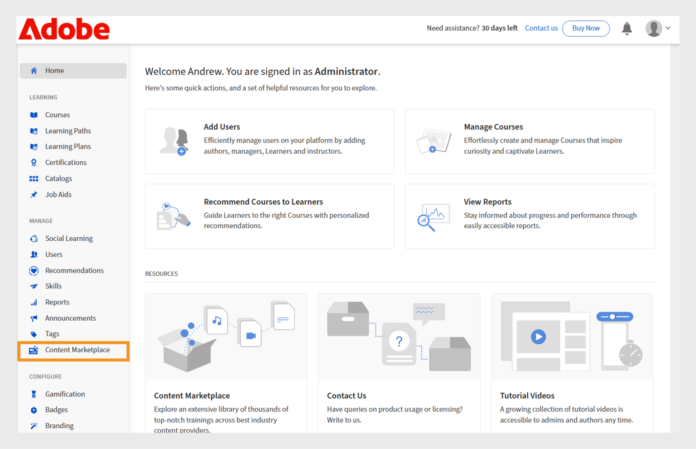
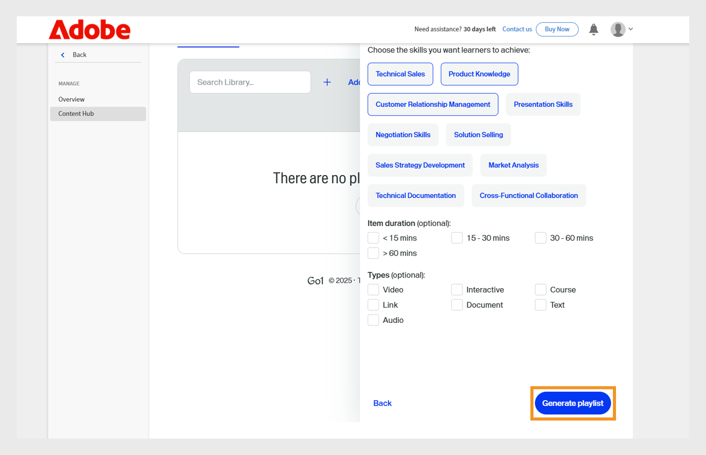

# Novità della versione di ottobre 2025 di Adobe Learning Manager

>[!IMPORTANT]
>
>Le funzioni descritte sono indicative e soggette a modifiche. Per ulteriori informazioni e conferma, rivolgiti al tuo Customer Success Manager. In caso di problemi, contatta il nostro team di assistenza clienti all&#39;indirizzo [learningmanagersupport@adobe.com](mailto:learningmanagersupport@adobe.com)

## Panoramica della versione

La versione di ottobre 2025 di Adobe Learning Manager introduce miglioramenti significativi progettati per migliorare l’accuratezza dei report, espandere le funzionalità di integrazione e migliorare l’esperienza di apprendimento per amministratori, autori e allievi. I miglioramenti principali includono Trascrizioni Allievi migliorate che acquisiscono con precisione i completamenti contrassegnati dall’Istruttore, Report utente estesi con campi di identificazione aggiuntivi e Report risorse formative con collegamenti diretti al download.

Questa versione introduce anche le autorizzazioni di annuncio con ambito per gli amministratori personalizzati, la funzionalità di assegnazione di tag agli utenti nelle bacheche di apprendimento sociale e il tracciamento dell’avanzamento basato sulla lingua, che preserva l’avanzamento dell’Allievo in diverse lingue. Ulteriori funzionalità includono miglioramenti dell&#39;integrazione Go1 con creazione di playlist basata sull&#39;intelligenza artificiale, gestione migliorata dei ruoli personalizzata con supporto per l&#39;importazione incrementale e API migliorate per il tracciamento delle prestazioni dei quiz e il monitoraggio dello stato della migrazione.

## Completamenti contrassegnati dall’Istruttore nelle Trascrizioni allievi

**Panoramica**

Le Trascrizioni Allievi incrementali ora acquisiscono i completamenti contrassegnati dall’Istruttore, anche se la partecipazione viene registrata dopo la data della sessione.
Questo miglioramento risolve una lacuna critica nelle Trascrizioni Allievi incrementali in cui i completamenti contrassegnati dall’Istruttore non venivano rispettati in precedenza se la partecipazione veniva registrata dopo la data della sessione originale.

Le Trascrizioni allievi incrementali sono report pianificati che acquisiscono solo le modifiche (ad esempio i completamenti o gli aggiornamenti di avanzamento) che si verificano entro un periodo specificato, anziché fornire un dump completo dei dati cronologici. Sono comunemente utilizzati per l’automazione, i dashboard e le integrazioni, consentendo agli utenti di tenere traccia in modo efficiente delle attività di apprendimento recenti senza elaborare ogni volta l’intera cronologia delle trascrizioni.

**Novità**

* **Colonna Contrassegna data di completamento (fuso orario UTC)**: nuova colonna timestamp che acquisisce la data e l’ora esatte in cui un istruttore contrassegna una sessione o un modulo come completato.
* **Monitoraggio avanzato dell’origine del completamento**: tiene traccia dell’istruttore e del modulo specifici (ad esempio, &quot;Aula&quot;) in cui sono stati registrati i completamenti.

Queste modifiche garantiscono che i completamenti contrassegnati dopo la data della sessione vengano riflessi correttamente nelle Trascrizioni Allievi incrementali.

**Vantaggi principali**

* Acquisisce tutti i completamenti nei report incrementali, indipendentemente da quando viene contrassegnata la partecipazione.
* Fornisce un audit trail chiaro per la conformità e la creazione di report.
* Supporto di automazione e dashboard per i requisiti normativi.

**Casi di utilizzo**

* Organizzazioni con sessioni in aula in cui gli istruttori possono contrassegnare le presenze giorni dopo la sessione effettiva.
* Sistemi automatizzati o dashboard basati su Trascrizioni Allievi incrementali per conformità o reporting.

### Trascrizione Allievo con la nuova colonna

Consulta questo [articolo](/help/migrated/administrators/feature-summary/learner-transcripts.md) per scoprire come scaricare Trascrizione Allievo.

Il report Trascrizione Allievo scaricato contiene la nuova colonna: Contrassegna data completamento (fuso orario UTC).


_Il report Trascrizione Allievo mostra una nuova colonna in giallo che evidenzia le date di completamento individuali per ogni utente_

## Report utente avanzato con campi dati estesi

**Panoramica**

Il Report utente ora include campi aggiuntivi per migliorare il tracciamento degli utenti e la mappatura dell’organizzazione.

**Novità**

* Colonna ID utente interno: fornisce identificatori interni univoci per il tracciamento uniforme dell’utente su diversi sistemi ed endpoint API.
* Colonna E-mail Manager: include le informazioni di contatto del Manager diretto per il tracciamento della gerarchia organizzativa.

**Vantaggi principali**

* Identificazione semplificata degli utenti ed eliminazione dei problemi associati alla mappatura degli utenti su più sistemi.
* Supporta i flussi di lavoro di gestione degli utenti a valle attraverso le funzionalità di integrazione.
* Mappatura organizzativa migliorata e migliore comprensione delle relazioni di reporting.
* Mantiene i confini dell&#39;organizzazione e impedisce la comunicazione incrociata accidentale.

**Considerazioni importanti**

* Se l’ambito di un amministratore personalizzato cambia, gli annunci interessati visualizzano un’icona di avviso e richiedono la reimpostazione dei singoli ambiti.
* Ogni annuncio deve essere aggiornato singolarmente quando si verificano modifiche dell’ambito.
* Il report Annuncio notifica mostra solo gli Allievi nell’ambito assegnato dall’Amministratore personalizzato.

### Report utente con la nuova colonna

Consulta questo [articolo](/help/migrated/administrators/feature-summary/reports.md#user-activity-dashboards) per scoprire come scaricare il report utente.

Il file del report utente scaricato contiene le nuove colonne: ID utente interno ed e-mail del manager.


_Report utente che evidenziano gli ID utente interni e gli indirizzi e-mail del manager per semplificare la gestione degli utenti_

## Report utente FTP con supporto ID utente interno

**Panoramica**

Il Report utente basato su FTP ora include il supporto per l’ID utente interno, fornendo un approccio unificato all’esportazione e all’integrazione dei dati per implementazioni headless.

**Novità**

* I report utente sono ora disponibili tramite [FTP personalizzato](/help/migrated/integration-admin/feature-summary/connectors.md#custom-ftp) insieme ai report esistenti (trascrizioni gamification, trascrizioni allievi, report dei corsi di formazione).
* La colonna ID utente interno è ora coerente in tutti i metodi di esportazione (FTP, API dei processi e interfaccia utente).

**Vantaggi principali**

* Gestione dei dati semplificata con un&#39;unica origine per tutti i report necessari.
* Migliore coerenza dei dati garantendo l&#39;identificazione uniforme degli utenti in tutti i periodi di riferimento.
* Supporto automatizzato dei flussi di lavoro grazie all&#39;attivazione di operazioni in blocco e flussi di lavoro di analisi con identificatori coerenti.
Il Report utente scaricato dalla cartella FTP contiene la nuova colonna, ID utente interno.

## Includere gli utenti sospesi nelle Trascrizioni Allievo

**Panoramica**

Le organizzazioni possono ora includere gli utenti sospesi (quelli con profili esterni disattivati) nelle Trascrizioni allievi, garantendo la conservazione completa dei dati storici di apprendimento.

**Novità**

* Visibilità utente sospesa configurabile con un flag a livello di account per includere gli utenti sospesi nelle Trascrizioni allievi.
* Conservazione dei dati cronologica anche dopo la disattivazione dei profili esterni sospesi.

**Requisiti di implementazione**

* Per attivare il flag a livello di account, contatta il Customer Success Manager (CSM).

>[!NOTE]
>
>Questo flag è disabilitato per impostazione predefinita per gli account esistenti e deve essere richiesto esplicitamente per i nuovi account.

## Autorizzazioni di annuncio con ambito per amministratori personalizzati

**Panoramica**

Gli amministratori personalizzati possono ora creare annunci, ma solo per i gruppi di utenti o i cataloghi assegnati. In questo modo si evita la comunicazione involontaria oltre i confini dell’organizzazione.

**Novità**

* Gli amministratori personalizzati possono creare annunci solo per gli utenti all’interno dell’ambito assegnato.
* È possibile definire l’ambito degli annunci per specifici gruppi di utenti o cataloghi.
* Gli amministratori completi mantengono la visibilità e il controllo di tutti gli annunci, inclusi quelli creati da amministratori personalizzati con ambito.

**Vantaggi principali**

* Una comunicazione mirata per garantire che gli annunci raggiungano solo il pubblico di riferimento.
* È stato ridotto il sovraccarico di informazioni impedendo alle notifiche irrilevanti di raggiungere utenti indesiderati.
* Mantiene i confini dell&#39;organizzazione e impedisce la comunicazione incrociata accidentale.

**Considerazioni importanti**

* Se l’ambito di un amministratore personalizzato cambia, gli annunci interessati visualizzano un’icona di avviso e richiedono la reimpostazione dei singoli ambiti.
* Ogni annuncio deve essere aggiornato singolarmente quando si verificano modifiche dell’ambito.
* Il report Annuncio notifica mostra solo gli Allievi nell’ambito assegnato dall’Amministratore personalizzato.

**Casi di utilizzo**

* Organizzazioni di affiliazione in cui i manager regionali devono comunicare solo con i loro affiliati.
* Grandi organizzazioni con amministratori regionali o di reparto che hanno come obiettivo gli annunci ai propri team.

### Crea annuncio per l&#39;ambito assegnato

Un amministratore personalizzato può creare annunci limitati ai gruppi di utenti e ai cataloghi assegnati, garantendo che i messaggi raggiungano il pubblico corretto e impedendo notifiche non necessarie.

Per creare un annuncio per l&#39;ambito assegnato:

1. Accedi a Adobe Learning Manager come amministratore.
2. Seleziona **[!UICONTROL Annuncio]** nel riquadro di navigazione a sinistra.
3. Seleziona **[!UICONTROL Aggiungi]**.

   
   _Pagina Annunci in Adobe Learning Manager, in cui gli amministratori possono creare e gestire gli annunci per i gruppi di utenti di destinazione_

4. Seleziona **[!UICONTROL Tipo di annuncio]** dal menu a discesa.
a. **[!UICONTROL Come notifica]**
b. **[!UICONTROL Come masthead]**
c. **[!UICONTROL Come consiglio]**
d. **[!UICONTROL Come e-mail]**
5. Seleziona **[!UICONTROL Come Masthead]**.
6. Seleziona la lingua e carica un&#39;immagine per il masthead.
7. Facoltativamente, puoi aggiungere un URL per il pulsante di azione.

   
   _Creare una schermata di annuncio che consente agli amministratori di impostare il tipo di annuncio, caricare allegati e aggiungere pulsanti di azione_

   L&#39;ambito assegnato è preselezionato nella sezione **[!UICONTROL Ambito]** e non può essere modificato dagli amministratori.

   >[!NOTE]
   >
   >**[!UICONTROL Per gli annunci]** e **[!UICONTROL Email]** di Notification, possono includere ulteriori gruppi di utenti e cataloghi se questi si sovrappongono all&#39;ambito assegnato.

8. Seleziona **[!UICONTROL Salva]**.

Solo gli Allievi nell’ambito dell’Amministratore personalizzato potranno visualizzare l’annuncio. Per informazioni sulla creazione di più tipi di annunci, consulta questo [articolo](/help/migrated/administrators/feature-summary/announcements.md).

## Applicare tag agli utenti nelle bacheche social

**Panoramica**

Le bacheche di apprendimento sociale ora supportano la funzionalità di assegnazione di tag agli utenti, consentendo discussioni più mirate e una migliore collaborazione all’interno delle comunità di apprendimento. Agli Allievi possono essere aggiunti tag nei post e nei commenti di Apprendimento sociale tramite l’app per Allievi, le API e il sito di riferimento di Adobe Learning Manager.

**Novità**

* **@username dei tag**: gli utenti possono assegnare tag ad altri membri della bacheca utilizzando il formato &quot;@username&quot;.
* **Tag con ambito limitato**: solo gli utenti con accesso alla bacheca specifica possono essere contrassegnati, garantendo la privacy e la pertinenza.
* **Notifiche multicanale**: gli utenti con tag ricevono notifiche in-app e e-mail con collegamenti diretti a post o commenti pertinenti.

**Funzioni principali**

* Non è possibile assegnare tag agli utenti esterni all’ambito della bacheca, impedendo notifiche indesiderate.
* Se un utente con tag viene eliminato dal sistema, la sua menzione viene visualizzata come &quot;anonimo&quot;.
* L’assegnazione di tag a gruppi di utenti o &quot;@all&quot; non è consentita per impedire la posta indesiderata delle notifiche.

**Casi di utilizzo**

* Operatori sanitari che richiedono il contributo di colleghi specifici su casi medici.
* Consultazione di esperti in materia su temi specifici.
* Discussioni di gruppo che richiedono il contributo di parti interessate specifiche.
* Sessioni di condivisione delle conoscenze con il coinvolgimento di esperti mirati.

### Applicare tag agli utenti nei post delle bacheche social

Gli Allievi ora possono assegnare tag a specifici membri della bacheca in post o commenti utilizzando @username. L’assegnazione di tag è limitata ai membri con accesso a quella bacheca.

Per assegnare tag agli utenti in una bacheca social:

1. Accedi a Adobe Learning Manager come Allievo.
2. Seleziona **[!UICONTROL Apprendimento sociale]** nel riquadro di navigazione a sinistra.

   
   _Abilita l’apprendimento collaborativo selezionando Apprendimento sociale per accedere alle aree discussioni, condividere approfondimenti e assegnare tag agli utenti per il coinvolgimento interattivo_

3. Seleziona **[!UICONTROL Nuovo post]**.

   
   _Avvia una nuova discussione selezionando Nuovo post in Apprendimento sociale per condividere le conoscenze con gli utenti con tag_

4. Prima di assegnare i tag agli utenti, selezionare la bacheca dall&#39;opzione **[!UICONTROL Pubblica in un&#39;area discussioni]**.

   
   _Seleziona un&#39;area discussioni per pubblicare post e assegnare tag agli utenti, consentendo conversazioni collaborative mirate in Apprendimento sociale_

5. Digita i dettagli del post, quindi assegna un tag a un utente inserendo il simbolo @ seguito dal suo nome (ad esempio, @andrew). Quando si digita @ seguito dalle prime tre lettere del nome dell&#39;utente, viene visualizzato un elenco di utenti corrispondenti.

   
   _Per aggiungere tag agli utenti nel post di discussione, digita @ seguito dal nome utente per abilitare la collaborazione mirata nelle bacheche di apprendimento sociale_

6. Seleziona l’utente desiderato dall’elenco.
7. Seleziona **[!UICONTROL Post]**.

Gli utenti con tag ricevono notifiche in-app e e-mail con un collegamento diretto al post, rendendo le discussioni più mirate e collaborative.

### Applicazione di tag agli utenti in base all’ambito della bacheca

L’assegnazione di tag con restrizioni di ambito consente agli utenti di assegnare tag solo agli Allievi autorizzati ad accedere a una bacheca specifica. In questo modo è possibile mantenere la privacy impedendo l’aggiunta di tag agli utenti esterni all’ambito.

Se tenti di assegnare tag agli Allievi che non rientrano nell’ambito della bacheca, non verrà visualizzato alcun suggerimento e non potrai assegnarli. Per ulteriori informazioni sull’ambito di apprendimento sociale, consulta questo [articolo](/help/migrated/administrators/feature-summary/social-learning-configurations-as-an-admin.md).

## Applicare tag agli utenti eliminati nei commenti

Se a un utente eliminato vengono aggiunti tag in un post di Apprendimento sociale, il suo nome verrà visualizzato come Anonimo nel post. Il commento e il tag rimangono visibili per il contesto, ma il collegamento o i dettagli del profilo non vengono visualizzati.


_Post di Apprendimento sociale che evidenzia come un utente eliminato appare anonimo quando viene taggato_

## Report risorse formative con collegamenti di accesso diretto

**Panoramica**

Il report Risorse formative è stato migliorato per includere collegamenti diretti al download delle risorse formative, semplificando la gestione dei contenuti e i processi di audit per amministratori e autori.

**Novità**

* Colonna Collegamento risorsa formativa: accesso diretto ai file della risorsa formativa e agli URL esterni dal report.
* Controllo dell&#39;accesso basato sui ruoli: l&#39;accessibilità del collegamento dipende dai ruoli utente e dalle autorizzazioni del catalogo.
* Le risorse formative eliminate restano accessibili se sono ancora collegate a corsi attivi.

**Vantaggi principali**

* Download diretto di file e accesso URL dall’interno del report.
* Eliminazione delle operazioni manuali di individuazione e download delle risorse formative per i controlli di conformità o accessibilità.

**Casi di utilizzo**

* Autori o amministratori eseguono controlli regolari sull’accessibilità delle risorse formative, come richiesto dalle grandi organizzazioni.
* Qualsiasi scenario in cui sia necessario un accesso rapido e basato sui ruoli ai file delle risorse formative per la revisione o la conformità.

### Report risorse formative con la nuova colonna

Consulta questo [articolo](/help/migrated/administrators/feature-summary/reports.md#job-aids-report) per scoprire come scaricare il report risorse formative.

Il report Risorse formative può essere scaricato dalla sezione Report e ora include collegamenti diretti per il download per ogni risorsa formativa.


_Nel report Risorse formative sono visualizzati collegamenti diretti per il download, che semplificano l&#39;accesso e il download delle risorse formative in Adobe Learning Manager_

## Aggiornamenti API

### Miglioramenti delle API degli Allievi per il tracciamento delle prestazioni dei quiz

**Panoramica**

L&#39;API `GET /loResourceGrades` è stata migliorata per fornire dati dettagliati sulle prestazioni dei quiz, consentendo analisi più sofisticate e processi decisionali automatizzati.

**Novità**

La risposta API ora include due campi aggiuntivi:

* **[!UICONTROL punteggio più alto]**: il punteggio migliore ottenuto da un Allievo in tutti i tentativi di quiz
* **[!UICONTROL maxScore]**: punteggio totale possibile per il quiz

**Esempio di risposta API**

```
{
    "links": {
        "self": "https://learningmanagerstage1.adobe.com/primeapi/v2/loResourceGrades/course:15067_30122_41715_1_3400468"
    },
    "data": {
        "id": "course:15067_30122_41715_1_3400468",
        "type": "learningObjectResourceGrade",
        "attributes": {
            "completed": false,
            "duration": 0,
            "hasPassed": false,
            "highestScore": 0,
            "maxScore": 0,. 
            "progressPercent": 0,
            "score": 0
        },
        "relationships": {
            "loResource": {
                "data": {
                    "id": "course:15067_30122_41715_1",
                    "type": "learningObjectResource"
                }
            }
        }
    }
}
```

In risposta, **corso:15067_30122_41715_1_3400468** è l’ID del livello di risorsa dell’oggetto di apprendimento per il quale vengono richieste le informazioni. È possibile ottenere l&#39;ID `learningObjectResourceGrad`e dall&#39;API `GET /enrollments/{id}`.

**Vantaggi principali**

* Analisi dettagliata delle prestazioni dei quiz per la misurazione dell&#39;efficacia dell&#39;apprendimento.
* Supporta le regole di progressione basate sui risultati più elevati piuttosto che sui tentativi più recenti.
* Fornisce un quadro completo delle prestazioni dei quiz degli Allievi nel tempo.

**Funzionamento dell&#39;API**

1. Un utente tenta di rispondere a un quiz più volte, ogni tentativo viene registrato.
2. L’API fornisce sia il punteggio più alto ottenuto sia il punteggio massimo possibile per il quiz.
3. I sistemi esterni possono utilizzare questi dati per attivare azioni automatizzate, ad esempio l’iscrizione di utenti a nuovi corsi in base alle loro prestazioni migliori.

**Casi di utilizzo**

* I sistemi di apprendimento headless richiedono decisioni di iscrizione automatizzate.
* Piattaforme di analisi dell’apprendimento che monitorano i modelli di conseguimento degli Allievi.
* Sistemi di conformità con requisiti di progressione basati sulle prestazioni.

### Miglioramenti dell’API di migrazione

**Panoramica**
Adobe Learning Manager ora supporta la migrazione di vari oggetti dati in un account tramite il processo di migrazione. Questo processo può essere avviato sia tramite API che tramite l’interfaccia utente. Quando una migrazione non riesce, gli errori possono essere scaricati dall’interfaccia. Questi errori sono utili per il debug degli errori di migrazione e la gestione delle esecuzioni della migrazione.

Con questa versione, i registri degli errori saranno disponibili anche per il download tramite le API per il rilevamento e il debug efficiente e programmatico degli errori.

**Modifiche API**

È presente una nuova API di migrazione, `runStatus`, che consente agli amministratori di integrazione di controllare lo stato delle esecuzioni della migrazione attivate tramite l’API, condizione non possibile nelle versioni precedenti di Adobe Learning Manager.

Inoltre, l&#39;API `runStatus` fornisce ora un collegamento diretto per scaricare i registri degli errori (CSV) per le esecuzioni completate. Tieni presente che il collegamento è valido solo per sette giorni e i registri vengono conservati per un mese.

La risposta dell&#39;API `startRun` è stata aggiornata per includere l&#39;ID del progetto di migrazione, l&#39;ID sprint e l&#39;ID esecuzione sprint, necessari per eseguire una query sul nuovo endpoint di stato.

#### API runStatus

**Descrizione**

Recupera lo stato di un&#39;esecuzione di migrazione esistente.

**Endpoint**

```
GET /bulkimport/runStatus
```

**Parametri**

* **migrationProjectId**: (obbligatorio). Identificatore univoco di un progetto di migrazione. Un progetto di migrazione viene utilizzato per trasferire dati e contenuti da un sistema di gestione dell’apprendimento (LMS) esistente a Adobe Learning Manager. Ogni progetto di migrazione può essere costituito da più sprint, ovvero unità più piccole delle attività di migrazione.

* **sprintId**: (obbligatorio). Identificatore univoco di uno sprint all&#39;interno di un progetto di migrazione. Uno sprint è un sottoinsieme delle attività di migrazione che include elementi di apprendimento specifici (ad esempio, corsi, moduli, record dell’Allievo) da migrare da un LMS esistente a Adobe Learning Manager. Ogni sprint può essere eseguito in modo indipendente, consentendo una migrazione graduale.

* **sprintRunId**: (obbligatorio). Identificatore univoco utilizzato per tenere traccia dell&#39;esecuzione di uno sprint specifico in un progetto di migrazione. È associato al processo di migrazione effettivo per gli elementi definiti in uno sprint. Lo sprintRunId consente di monitorare, risolvere e gestire il processo di migrazione.

**Risposta**

```
{
  "sprintId": 2510080,
  "sprintRunId": 2740845,
  "migrationProjectId": 2509173,
  "startTime": 1746524711052,
  "endTime": 1746524711052,
  [
    {
      "id": 2609923,
      "lastHeartbeatTime": 1746524711052,
      "objectName": "content",
      "jobState": "COMPLETED",
      "errorCsvLink": "",
      "errorLogLink": "migration/5830/2509173/2510080/2740845/content_err.csv",
      "sequenceNumber": 1
    },
    {
      "id": 2609922,
      "lastHeartbeatTime": 1746524713577,
      "objectName": "course",
      "jobState": "WAITING_IN_QUEUE",
      "errorCsvLink": "",
      "errorLogLink": null,
      "sequenceNumber": 2
    }
  ]
}
```

#### API startRun

La risposta API `startRun` è stata aggiornata per includere tre campi aggiuntivi: migrationProjectId, sprintId e sprintRunId. Questi campi consentono agli utenti di tenere traccia delle esecuzioni di migrazioni specifiche e di eseguire query sullo stato tramite la nuova API runStatus.

```
curl -X GET --header 'Accept: text/html' 'https://learningmanager.adobe.com/primeapi/v2/bulkimport/runStatus?migrationProjectId=001&sprintId=10001&sprintRunId=7'
```

Fornisce la seguente risposta. La risposta contiene:

* migrationId
* sprintId
* sprintRunId

**Risposta**

```
{
  "status": "OK",
  "title": "BULKIMPORT_RUN_INITIATED_SUCCESSFULLY",
  "source": {
    "info": "Success",
    "migrationInfo": {
      "migrationProjectId": "001",
      "sprintId": "10001",
      "sprintRunId": "7"
    }
  }
}
```

### Modifiche alle API social (tag utente, commenti e risposte)

**Panoramica**

Adobe Learning Manager ora supporta @user funzionalità di assegnazione tag nelle bacheche di Apprendimento sociale, consentendo agli Allievi di citare e notificare i colleghi in post, commenti e risposte. Questa funzione migliora la collaborazione e l&#39;individuazione dei contenuti su tutta la piattaforma.

Questa versione introduce nuove funzionalità API per il supporto delle menzioni utente, tra cui POST ed endpoint GET avanzati, nonché una nuova funzionalità di ricerca per utenti con tag.

**Panoramica sulle modifiche API**

* API di POST aggiornate per la creazione di post/commenti/risposte con menzioni utente
* API GET aggiornate con dati di menzione utente nelle risposte

**Formato delle menzioni utente**

Un utente viene menzionato utilizzando il formato: @(utente:userId)

#### Crea post con menzioni

**Endpoint**

```
POST /primeapi/v2/posts
```

**Descrizione**

Crea un nuovo post di apprendimento sociale con le menzioni dell&#39;utente.

**Corpo della richiesta**

```
{
  "data": {
    "type": "post",
    "attributes": {
      "boardId": 13282,
      "accountId": 11152,
      "text": "<p>This is a new post mentioning @[user:11257229]</p>",
      "createdByUserId": 11257228,
      "postType": "discussion"
    },
    "id": null
  }
}
```

**Risposta**

Risposta standard post-creazione con dati di menzione inclusi nella relazione _userMentions_.

#### Crea commento con menzioni

**Endpoint**

```
POST /primeapi/v2/comments
```

**Descrizione**

Aggiungi un commento a un post con le menzioni dell&#39;utente.

**Corpo della richiesta**

```
{
  "data": {
    "type": "comment",
    "attributes": {
      "postId": 20746,
      "accountId": 11152,
      "text": "<p>Test Comment @[user:11257229]</p>",
      "createdByUserId": 11257228,
      "commentLevel": 0
    },
    "id": null
  }
}
```

#### Crea risposta con menzioni

**Endpoint**

```
POST /primeapi/v2/replies
```

**Descrizione**

Rispondi a un commento con le menzioni dell&#39;utente.

**Corpo della richiesta**

```
{
  "data": {
    "type": "reply",
    "attributes": {
      "postId": 20746,
      "accountId": 11152,
      "text": "<p>Thanks for the update @[user:11257229]</p>",
      "createdByUserId": 11257228,
      "commentLevel": 1,
      "parentCommentId": 55621
    },
    "id": null
  }
}
```

#### Recupera post con menzioni

**Endpoint**

```
GET /primeapi/v2/posts/{id}
```

**Descrizione**

Recupera i dettagli del post, inclusi gli utenti menzionati.

**Risposta**

```
{
  "links": {
    "self": "https://learningmanager.adobe.com/primeapi/v2/posts/7522"
  },
  "data": {
    "id": "7522",
    "type": "post",
    "attributes": {
      "commentCount": 3,
      "dateCreated": "2025-06-10T11:33:29.000Z",
      "dateUpdated": "2025-06-25T14:52:04.000Z",
      "downVote": 0,
      "postingType": "DEFAULT",
      "richText": "<p>my updated fourth post @[user:14707776] second mention my first post</p>",
      "state": "ACTIVE",
      "text": "my updated fourth post @[user:14707776] second mention my first post",
      "upVote": 0,
      "viewsCount": 0
    },
    "relationships": {
      "createdBy": {
        "data": {
          "id": "14707776",
          "type": "user"
        }
      },
      "parent": {
        "data": {
          "id": "3971",
          "type": "board"
        }
      },
      "userMentions": {
        "data": [
          {
            "id": "14707776",
            "type": "user"
          }
        ]
      }
    }
  },
  "included": [
    {
      "id": "14707776",
      "type": "user",
      "attributes": {
        "avatarUrl": "https://cpcontents.adobe.com/public/images/default_user_avatar.svg",
        "binUserId": "45664b87-75a3-43ec-b0b7-5064958eac6f",
        "email": "user@example.com",
        "enrollOnClick": false,
        "fields": {
          "Location": "BLR"
        },
        "gamificationEnabled": true,
        "lastLoginDate": "2025-06-27T11:21:17.000Z",
        "name": "John Doe",
        "pointsEarned": 1690,
        "pointsRedeemed": 0,
        "preferredResolution": "AUTO",
        "profile": "admin",
        "roles": [
          "Learner",
          "Admin",
          "Author",
          "Instructor",
          "Integration Admin",
          "Manager"
        ],
        "state": "ACTIVE",
        "userType": "Internal"
      },
      "relationships": {
        "account": {
          "data": {
            "id": "9238",
            "type": "account"
          }
        }
      }
    }
  ]
}
```

### Modifiche alle API social (ricerca utente)

**Endpoint**

```
GET /primeapi/v2/users/search?q={searchTerm}&context=tagging
```

**Descrizione**

Cerca gli utenti disponibili per i tag in base alle impostazioni dell’ambito social.

**Parametri richiesta**


* q (obbligatorio): Termine di ricerca (minimo 3 caratteri).
* contesto: imposta su &quot;tagging&quot; per ottenere gli utenti idonei per le menzioni.
* boardId (facoltativo): ID bacheca per filtrare gli utenti in base alle autorizzazioni di accesso.

**Risposta**

```
{
  "data": [
    {
      "id": "11257229",
      "type": "user",
      "attributes": {
        "name": "Jane Smith",
        "email": "jane.smith@example.com",
        "avatarUrl": "https://cpcontents.adobe.com/public/images/default_user_avatar.svg",
        "userType": "Internal",
        "state": "ACTIVE"
      }
    }
  ]
}
```

### Linee guida per l&#39;implementazione

#### Limiti caratteri

* Post: viene applicato un limite di 4000 caratteri, e ogni utente con tag riduce i caratteri disponibili di una quantità fissa.
* Commenti: massimo 1000 caratteri.

#### Convalida menzione

* Gli utenti possono ricevere tag solo per nome utente o e-mail (non UUID).
* Gli utenti interni non possono assegnare tag a utenti esterni e viceversa.
* La disponibilità dei tag segue le impostazioni esistenti dell’ambito social.
* Le autorizzazioni della bacheca determinano l’idoneità ai tag (Pubblica/Privata).

#### Notifiche

* Più citazioni dello stesso utente in un post generano una singola notifica.
* Il proprietario del post originale riceve notifiche solo quando riceve un tag specifico.

#### Gestione degli errori

* Gli ID utente non validi nelle citazioni restituiscono errori di convalida.
* Gli utenti GDPR e quelli con eliminazione temporanea appaiono anonimi nei contenuti con tag.

### Stato di avanzamento dell’Allievo basato sulla lingua

Attualmente, l’avanzamento dell’Allievo viene monitorato solo per la lingua locale selezionata, causando una perdita significativa di avanzamento quando si cambia lingua/lingua nel lettore. Questa limitazione crea una scarsa esperienza utente, in cui gli Allievi perdono i progressi nell’apprendimento quando esplorano contenuti in lingue diverse.

**Problemi correnti**

* **Override avanzamento**: l&#39;avanzamento per ogni modulo nel lettore viene monitorato sia a livello di utente che di modulo. Ciò porta a una situazione in cui l&#39;avanzamento di un utente viene sovrascritto quando torna a una lingua utilizzata in precedenza per lo stesso modulo.
* **Ripristino dell’avanzamento**: ad esempio, se un Allievo ottiene il 75% di avanzamento nella lingua A (inglese) e poi passa alla lingua B (spagnolo), al ritorno alla lingua A, l’avanzamento viene ripristinato allo 0% anziché riprendere dal 75%.

Per risolvere queste limitazioni, l’API è stata migliorata per supportare il tracciamento dell’avanzamento specifico per le impostazioni internazionali:

* **Archiviazione specifica per le impostazioni internazionali**: quando un Allievo cambia le impostazioni internazionali (ad esempio, da Impostazioni internazionali A a Impostazioni internazionali B) all’interno del lettore, il sistema ora salva lo stato di avanzamento separatamente per ciascuna impostazione internazionale del contenuto.
* **Ripresa dell&#39;avanzamento**: quando l&#39;utente torna a una lingua utilizzata in precedenza (dalla lingua B alla lingua A), il contenuto riprende da dove si era interrotto nella lingua specifica.
* **Monitoraggio indipendente dell’avanzamento**: ogni lingua mantiene il proprio stato di avanzamento, consentendo agli Allievi di esplorare i contenuti in più lingue senza perdere l’avanzamento individuale in ciascuna lingua.

#### Modifiche API

Le API seguenti sono state migliorate per supportare il nuovo parametro delle impostazioni internazionali:

* API stato GET Player
* API stato di POST Player

#### API stato GET Player

**Endpoint**

```
GET /primeapi/v2/users/{userId}/playerState
```

**Descrizione**

Recupera lo stato corrente di un oggetto di apprendimento per un utente e una lingua specifici.

**Parametri**

| Parametro | Tipo | Posizione | Obbligatorio | Descrizione |
|---|---|---|---|---|
| userId | Stringa | Tracciato | Sì | Identificatore univoco dell&#39;utente |
| loId | Stringa | Query | Sì | Identificatore oggetto di apprendimento nel formato lo:{id} |
| loResourceId | Stringa | Query | Sì | Identificatore risorsa oggetto di apprendimento nel corso di formato:{loId_loInstanceId_moduleId_moduleVersion} |
| csrf_token | Stringa | Query | Sì | Token di protezione CSRF |
| locale | Stringa | Query | Facoltativo | Identificatore delle impostazioni internazionali per l&#39;avanzamento specifico della lingua (ad esempio, &quot;en-US&quot;, &quot;es-ES&quot;) |

**Esempio di richiesta**

```
GET /primeapi/v2/users/12345/playerState?loId=lo:67890&loResourceId=course:67890_1_mod123_v2&csrf_token=abc123&locale=en-US
```

**Comportamento risposta**

* Se viene fornito il parametro locale ed esiste uno stato specifico della lingua, l’API restituisce lo stato di avanzamento per tale lingua.
* Se viene fornito il parametro locale ma non esiste uno stato specifico della lingua, l’API esegue una ricerca di fallback per lo stato predefinito.
* Se il parametro locale viene omesso, l’API restituisce lo stato predefinito (mantiene la compatibilità con le versioni precedenti).
* Per le richieste headless in cui la lingua è null, l’API torna alla ricerca dello stato predefinita.

#### API stato di POST Player

**Endpoint**

POST /primeapi/v2/users/{userId}/playerState

**Descrizione**

Aggiorna o crea lo stato corrente di un oggetto di apprendimento per un utente e una lingua specifici.

**Parametri**

| Parametro | Tipo | Posizione | Obbligatorio | Descrizione |
|---|---|---|---|---|
| userId | Stringa | Tracciato | Sì | Identificatore univoco dell&#39;utente |
| loId | Stringa | Query | Sì | Identificatore oggetto di apprendimento nel formato lo:{id} |
| loResourceId | Stringa | Query | Sì | Identificatore risorsa oggetto di apprendimento nel corso di formato:{loId_loInstanceId_moduleId_moduleVersion} |
| csrf_token | Stringa | Query | Sì | Token di protezione CSRF |
| locale | Stringa | Query | Facoltativo | Identificatore delle impostazioni internazionali per language-sp |

**Corpo della richiesta**

Il corpo della richiesta contiene i dati di stato dell’oggetto di apprendimento specifici per la lingua.

**Esempio di richiesta**

```
POST /primeapi/v2/users/12345/playerState?loId=lo:67890&loResourceId=course:67890_1_mod123_v2&csrf_token=abc123&locale=en-US
```

```
{
  "progress": 75,
  "completionStatus": "incomplete",
  "timeSpent": 1800,
  "lastAccessedPage": 5,
  // Additional state data
}
```

L’API crea o aggiorna lo stato dell’oggetto di apprendimento per le impostazioni locali specificate.

## Miglioramenti dell&#39;integrazione Go1

**Panoramica**

L’integrazione con Go1 è stata migliorata per supportare la gestione delle playlist, la creazione di percorsi di apprendimento e i flussi di lavoro di certificazione ricorrenti, durante la transizione a un modello di contenuto per l’anteprima e l’acquisto.

**Novità**

* Crea e gestisci le playlist direttamente in Go1 utilizzando l&#39;assistenza chat basata su IA o la selezione manuale.
* Converti facilmente le playlist Go1 in percorsi di apprendimento Adobe Learning Manager.
* Includi i corsi Go1 nei cicli di certificazione ricorrenti con ripristino automatico dell’avanzamento.
* Interfaccia di rilevamento dei contenuti aggiornata per una migliore navigazione e cura dei contenuti.
* Transizione dai contenuti gratuiti al modello di costo trasparente.

**Vantaggi principali**

* La creazione di playlist basate sull&#39;intelligenza artificiale accelera notevolmente il raggruppamento e la distribuzione dei contenuti.
* Consente l&#39;utilizzo del contenuto Go1 per i requisiti di formazione periodici a livello normativo.
* Un modello chiaro di anteprima e acquisto supporta le decisioni di investimento informate.
* Strumenti di individuazione e cura migliorati per una migliore gestione dei contenuti.

**Note importanti**

* Tutte le funzionalità Go1 richiedono una licenza Go1 attiva.
* I contenuti gratuiti precedenti di Go1 verranno smantellati. Le organizzazioni devono visualizzare in anteprima e acquistare i bundle di contenuti richiesti.
* Amministratori e Autori possono creare e gestire le playlist; gli allievi possono accedervi solo per visualizzarle.

**Casi di utilizzo**

* Organizzazioni che richiedono librerie di contenuti esterni estese per programmi di formazione completi.
* Programmi di formazione mirati alla conformità che richiedono aggiornamenti periodici dei contenuti e cicli di distribuzione.
* I team di apprendimento stanno cercando di ridurre il sovraccarico di cura dei contenuti tramite l&#39;assistenza IA.

### Creare una playlist Go1

Gli Amministratori possono creare playlist con corsi Go1 personalizzati in base a diversi gruppi di Allievi in base a posizione, ruolo, prodotto e altri criteri. Le sequenze di riproduzione possono essere create manualmente o generate utilizzando l&#39;intelligenza artificiale.

Per creare una sequenza brani:

1. Accedi a Adobe Learning Manager come amministratore.
2. Seleziona **[!UICONTROL Marketplace dei contenuti]** nel riquadro di navigazione a sinistra.

   
   _Esplora e aggiungi i migliori corsi Go1 alle tue playlist selezionando Contenuti del marketplace in Adobe Learning Manager_

3. Seleziona **[!UICONTROL Hub dei contenuti]** e quindi **[!UICONTROL Libreria]**.
4. Seleziona **[!UICONTROL Crea playlist]** e scegli una delle seguenti opzioni:
a. **[!UICONTROL con IA]**: crea una playlist con l&#39;aiuto di AI.
b. **[!UICONTROL da solo]**: crea una playlist aggiungendo manualmente i corsi.

   
   _Crea una nuova playlist in Adobe Learning Manager selezionando Crea playlist per organizzare e distribuire corsi mirati per gli Allievi_

**Creare una playlist con AI**

Gli amministratori possono digitare la descrizione della playlist nel prompt dell&#39;intelligenza artificiale. L’IA cura i corsi correlati e crea una playlist in base ai requisiti.

Per creare una playlist con IA:

1. Seleziona **[!UICONTROL Crea playlist]**, quindi seleziona **[!UICONTROL con IA]**.

   
   _Crea playlist selezionate con l’intelligenza artificiale, che consente di fornire suggerimenti sul corso automatizzati e personalizzati in base alle esigenze dell’Allievo_

2. Digita una breve descrizione della playlist nel campo di testo **[!UICONTROL Inserisci il tuo obiettivo di apprendimento]**.
3. Seleziona **[!UICONTROL Avanti]**.

   
   _Digita il tuo obiettivo di apprendimento per creare una playlist personalizzata, aiutando Adobe Learning Manager a consigliare corsi mirati su misura per le esigenze degli Allievi_

4. Scegli le abilità dall’elenco, quindi seleziona la durata del corso e digita la playlist.
5. Seleziona **[!UICONTROL Genera playlist]**.

   
   _Personalizza la tua playlist in Adobe Learning Manager selezionando le abilità e le abilità pertinenti, la durata del corso_


La playlist viene creata con 10 corsi e gli Amministratori possono utilizzarla per creare un percorso di apprendimento.


_Rivedi la tua playlist di miglioramento delle abilità del tecnico di vendita selezionata in Adobe Learning Manager_

**Creazione manuale di una playlist**

Seleziona manualmente i corsi che meglio corrispondono alle esigenze degli Allievi e organizza ulteriori corsi pertinenti.

Per creare manualmente una sequenza brani:

1. Seleziona **[!UICONTROL Crea playlist]**, quindi seleziona **[!UICONTROL da solo]**.

   
   _Creare manualmente una playlist che offra agli amministratori il pieno controllo per la cura dei corsi in base alle esigenze specifiche degli Allievi_

2. Digitare il titolo e la descrizione della playlist.

   
   _Aggiungere un titolo e una descrizione alla playlist in Adobe Learning Manager per definirne chiaramente lo scopo e aiutare gli allievi a sviluppare le abilità in modo mirato_

3. Selezionare **[!UICONTROL Crea]**.
4. Seleziona **[!UICONTROL Aggiungi elemento]** per aggiungere i corsi correlati.

   
   _Aggiungi elementi alla tua playlist di sviluppo delle competenze dei tecnici di vendita in Adobe Learning Manager per la cura dei corsi mirati_

5. Cerca e seleziona i corsi richiesti.

La playlist è stata creata con corsi correlati e gli Amministratori possono utilizzarla per creare un percorso di apprendimento.

### Aggiungere una playlist Go1 a un percorso di apprendimento

Gli Amministratori possono creare un percorso di apprendimento che include una playlist Go1, in modo che gli Allievi possano accedere a corsi di terze parti selezionati come parte del loro corso di formazione.

Per creare un percorso di apprendimento:

1. Accedi a Adobe Learning Manager come amministratore.
2. Seleziona **[!UICONTROL Percorsi di apprendimento]** nel riquadro di navigazione a sinistra.
3. Seleziona **[!UICONTROL Aggiungi]**.

   
   _Seleziona Aggiungi nella sezione Percorsi di apprendimento per creare e organizzare nuovi programmi di formazione strutturati per gli Allievi_

4. Digita i dettagli richiesti e seleziona **[!UICONTROL Salva]**. Per ulteriori informazioni, consulta questo [articolo](/help/migrated/administrators/feature-summary/learning-paths.md).
5. Seleziona **[!UICONTROL Aggiungi corsi Go1]**.

   
   _Aggiungere corsi Go1 alla playlist di sviluppo delle competenze dei tecnici di vendita per espandere le opzioni di apprendimento con contenuti di terze parti selezionati_

6. Nella **[!UICONTROL Libreria]**, cerca e seleziona la playlist nella schermata Seleziona **[!UICONTROL Corsi Go1]**.

   >[!NOTE]
   >
   >Assicurati di impostare il filtro Creato da me per trovare facilmente la tua playlist.

   
   _Selezionare una playlist per i tecnici delle vendite dalla libreria dei corsi Go1 in Adobe Learning Manager_

7. Seleziona **[!UICONTROL Aggiungi alla libreria]** e quindi **[!UICONTROL Salva]**.

   
   _Selezionare e importare la sequenza di riproduzione Miglioramento competenze tecnico commerciale dalla libreria Go1 in Adobe Learning Manager_

8. Seleziona **[!UICONTROL Aggiungi]** e quindi **[!UICONTROL Publish]**.

I corsi presenti nella playlist verranno aggiunti al percorso di apprendimento. Gli Amministratori possono quindi iscrivere gli Allievi, che possono iniziare immediatamente a seguire i corsi.

## Salvataggio dell’avanzamento dello stato del lettore per le lingue

**Panoramica**

Il lettore Fluidic ora salva i tuoi progressi separatamente per ogni lingua all&#39;interno di un modulo. Ciò significa che puoi passare da una lingua all&#39;altra e riprendere esattamente da dove avevi interrotto in ognuna di esse, invece di perdere i tuoi progressi e ricominciare da capo.

**Vantaggi principali**

* Passa da una lingua all&#39;altra e riprendi dalla tua esatta posizione in ciascuna di esse.
* Perfetto per gli Allievi che devono accedere ai contenuti in più lingue durante il percorso di apprendimento.
* Completa il modulo in qualsiasi lingua mantenendo l’avanzamento in tutte le lingue a cui hai effettuato l’accesso.

**Casi di utilizzo**

* Organizzazioni globali con dipendenti che parlano più lingue e potrebbero dover fare riferimento ai contenuti nella loro lingua nativa e in inglese.
* Corso di formazione sulla conformità in cui gli Allievi possono iniziare in una lingua ma devono completarla in un’altra per scopi di certificazione.
* Programmi di formazione tecnica in cui gli Allievi possono comprendere meglio i concetti nella loro lingua madre ma hanno bisogno della terminologia inglese per il loro lavoro.

**Note importanti**

* La preferenza per la lingua del lettore Fluidic viene mantenuta in una sessione. Se un Allievo cambia lingua e passa a un altro modulo, la nuova lingua viene utilizzata per i moduli successivi, a condizione che il lettore rimanga aperto.
* Il livello (stato di completamento) viene comunque registrato a livello di modulo, non in base alle impostazioni internazionali. La prima lingua in cui sono soddisfatti i criteri di completamento aggiornerà il livello per il modulo. Se un Allievo completa il modulo in una lingua e poi passa a un’altra, eventuali aggiornamenti di livello successivi verranno sovrascritti dal livello precedente, ma l’avanzamento per ciascuna lingua viene comunque mantenuto.

## Supporto per l&#39;importazione di ruoli personalizzati nell&#39;importazione incrementale di utenti

Adobe Learning Manager ora supporta le importazioni di ruoli personalizzati nel flusso di lavoro di importazione utente con incrementi multipli esistente (importazione utente completa regolare + flusso incrementale abilitato). Questo miglioramento consente ai file role.csv e user_role.csv di essere caricati ed elaborati in modo incrementale, senza richiedere ogni volta il caricamento completo dei dati.

In precedenza, i file role.csv e user_role.csv potevano essere caricati solo in modalità completa, il che significa che gli amministratori dovevano includere tutte le definizioni e le assegnazioni di ruolo aggiunte in precedenza in ogni caricamento. Con questo nuovo supporto incrementale, è necessario caricare solo i dati dei ruoli nuovi o modificati, riducendo i costi generali e migliorando l&#39;efficienza.

**Novità**

1. Supporto incrementale per ruoli personalizzati e assegnazioni di ruoli:

   * role.csv e user_role.csv possono ora essere elaborati in modo incrementale nel flusso di lavoro incrementale per più file.
   * Non è necessario caricare tutti i dati dei ruoli e dei ruoli utente esistenti ad ogni importazione.

2. Implementazione del flusso di lavoro con più incrementi:

   * Crea cartelle separate in FTP per ciascun file di importazione utente caricato.
   * Ogni cartella contiene:

      * File di importazione utente- (File1.csv)
      * File di assegnazione ruoli e ruoli corrispondenti: (File1_role.csv, File1_user_role.csv)

   Ad esempio, user1.csv corrisponde a user1_role.csv (ruoli personalizzati) e user1_user_roles.csv (mapping utente-ruolo).

   **Esempio di struttura FTP prima dell&#39;elaborazione:**

   ```
   import/user/internal/  
        File1.csv  
        File2.csv  
       File3.csv  
   
   UserRole/  
       File1_role.csv  
       File1_user_role.csv  
       File2_role.csv  
       File2_user_role.csv  
       File3_role.csv  
       File3_user_role.csv  
   ```

3. Adobe Learning Manager supporta inoltre fino a 20 CSV utente incrementali e i relativi ruoli personalizzati, rendendolo adatto per operazioni su larga scala.

**Casi di utilizzo**

* Le aziende globali gestiscono i team regionali caricando più file utente incrementali per ogni area geografica (UE, America, Asia), consentendo agli amministratori di aggiornare gli utenti e assegnare nuovi ruoli per ogni area geografica in un unico flusso di lavoro.
* Le grandi aziende automatizzano l&#39;onboarding e le autorizzazioni acquisendo regolarmente aggiornamenti utente incrementali dai sistemi HR. Ciò supporta aggiornamenti senza interruzioni dei profili utente e delle assegnazioni granulari dei ruoli senza intervento manuale.

## Ripristinare i consigli nell’app Salesforce

**Panoramica**

In precedenza, gli Allievi che utilizzavano l’app Adobe Learning Manager Salesforce potevano selezionare i ruoli e le preferenze dei consigli solo una volta. Se il loro ruolo è cambiato, è stato richiesto loro di accedere all&#39;app nativa Adobe Learning Manager per aggiornare il proprio profilo e ricevere consigli sui corsi pertinenti. Ciò ha reso possibile l’esperienza di apprendimento e ha contribuito a ridurre il coinvolgimento nell’ambiente Salesforce.

**Novità**

Adobe Learning Manager ora dispone di un pulsante **[!UICONTROL Ripristina interessi]** nell’app Salesforce. Gli Allievi possono ora ripristinare i ruoli e le preferenze di apprendimento senza dover lasciare Salesforce o accedere all’app nativa Adobe Learning Manager. Questo miglioramento semplifica l’accesso a contenuti di apprendimento personalizzati, garantendo che i consigli rimangano pertinenti con l’evoluzione dei ruoli degli utenti.

**Casi di utilizzo**

* Gli Allievi che cambiano ruoli, team o responsabilità possono reimpostare rapidamente le preferenze per ricevere consigli di corso pertinenti e aggiornati all’interno dell’app Salesforce.
* Rimuovendo la necessità di passare all’app nativa Adobe Learning Manager, il percorso di apprendimento è più fluido e incoraggia il coinvolgimento e l’utilizzo costanti dei contenuti consigliati tramite Salesforce.
* Gli amministratori traggono vantaggio da percentuali più elevate di completamento dell’apprendimento e da un migliore allineamento tra i ruoli utente e i contenuti consigliati, senza supporto o assistenza aggiuntivi sulle piattaforme di commutazione.

### Ripristinare l’interesse nell’app Salesforce

Per reimpostare gli interessi e i consigli dall’app Salesforce:

1. Accedi all’app Adobe Learning Manager per Salesforce come Allievo.
2. Seleziona l&#39;opzione **[!UICONTROL Ripristina interessi]** nella parte inferiore.

Il consiglio o l’interesse dell’Allievo verrà reimpostato dall’app Adobe Learning Manager Salesforce.

## Creazione di portali di apprendimento con Experience Builder

>[!IMPORTANT]
>
>Siamo lieti di annunciare che Experience Builder, lo strumento innovativo per la creazione di portali di apprendimento personalizzabili, sarà disponibile a partire dalla versione di ottobre 2025 di Adobe Learning Manager.
>
>Continua a seguirci per ricevere informazioni aggiornate in vista della data di rilascio. Ti aspettiamo per scoprire come utilizzare Experience Builder per trasformare i tuoi portali di apprendimento.
>
>Per qualsiasi domanda o informazione aggiuntiva, contatta il tuo Customer Success Manager.

**Introduzione**

Experience Builder è uno strumento senza codice o a basso codice in Adobe Learning Manager che consente di creare portali di apprendimento personalizzati. Consente di progettare portali di apprendimento di marca e intuitivi senza dover possedere competenze tecniche o conoscenze approfondite in materia di codifica.
Con Experience Builder, puoi creare nuove pagine, menu e widget per offrire esperienze di apprendimento personalizzate per il tuo pubblico in modo semplice e veloce. Con Experience Builder, puoi creare rapidamente nuove pagine, menu e widget per offrire esperienze di apprendimento personalizzate per il tuo pubblico.

**Istruzione del problema**

Prima di Experience Builder, le organizzazioni si trovavano ad affrontare diverse sfide:

1. **Personalizzazione limitata**: i portali hanno corretto i progetti con poche opzioni per riflettere il tuo marchio. Gli amministratori potevano solo apportare modifiche di base, ad esempio modificare intestazioni, piè di pagina o colori, che limitavano la possibilità di creare esperienze uniche.
2. **Costo**: la creazione di portali personalizzati ha richiesto sviluppatori costosi e tempi lunghi, il cui completamento richiede spesso dai 6 ai 9 mesi. Questo approccio ha aumentato il costo totale di proprietà e ritardato l&#39;installazione.
3. **Esperienze generiche**: tutti hanno visto lo stesso contenuto, anche se non pertinente al loro ruolo o alle loro esigenze. Questa mancanza di personalizzazione ha ridotto il coinvolgimento e la soddisfazione degli Allievi.
4. **Barriere tecniche**: gli amministratori non tecnici hanno avuto difficoltà a creare o aggiornare i portali perché necessitavano di conoscenze sulla codifica o supporto esterno.

Experience Builder risolve questi problemi fornendo una soluzione semplice, senza codice/a basso codice per la creazione di portali personalizzati con marchio.

Consente agli amministratori di progettare portali che soddisfino le esigenze della propria organizzazione senza affidarsi a competenze tecniche o sviluppatori esterni.

**Vantaggi principali**

**Personalizzazione semplificata**

* Progetta portali che corrispondano al tuo marchio con intestazioni, piè di pagina, loghi e layout personalizzati.
* Usa i widget per aggiungere contenuti dinamici come corsi, categorie ed elementi HTML.
* Crea pagine e menu personalizzati per gruppi di destinatari specifici, in modo che gli allievi possano visualizzare i contenuti pertinenti.

**Soluzione senza codice/a codice basso**

* Gli amministratori possono creare e gestire portali senza conoscenze di programmazione, rendendoli accessibili agli utenti non tecnici.
* La funzionalità di trascinamento semplifica la creazione di pagine e menu.

**Apprendimento personalizzato**

* Configura pagine e menu per visualizzare il contenuto relativo a gruppi di utenti specifici, ad esempio team di vendita, progettisti o ingegneri.
* Usa pagine nascoste per offrire contenuti esclusivi accessibili solo tramite collegamenti diretti.

**Portata globale**

* Crea pagine multilingue per supportare gli Allievi in tutto il mondo.
* Localizzare i contenuti per soddisfare i diversi tipi di pubblico e migliorare l&#39;accessibilità.

**Compatibile con i dispositivi mobili**

* Gli Allievi possono accedere ai contenuti su qualsiasi dispositivo, compresi telefoni e tablet.
* Visualizza in anteprima le pagine sia nella vista desktop che nella vista per dispositivi mobili per offrire un’esperienza ottimale.

**Casi d&#39;uso reali**

**Portali con marchio**

* Crea un portale di apprendimento simile al sito Web della tua azienda, completo di loghi, colori e layout.
* Ad esempio, un&#39;azienda del settore sanitario può progettare un portale che corrisponda al proprio branding aziendale, integrando al contempo i contenuti didattici.

**Apprendimento basato sui ruoli**

* Creare pagine per ruoli specifici, ad esempio ingegneri, team di vendita o designer.
* Ad esempio, i team di vendita possono assistere a corsi di formazione sul prodotto, mentre i tecnici possono accedere a corsi tecnici.

**Formazione sul prodotto**

* Imposta pagine separate per prodotti diversi, come Photoshop, Illustrator o altre offerte.
* Ogni pagina può includere widget che visualizzano corsi, certificazioni e risorse relative al prodotto.

**Formazione per dipendenti e clienti**

* Utilizza il portale per inserire nuovi dipendenti, formare partner esterni o informare i clienti sui tuoi prodotti.
* Ad esempio, una società di software può creare un portale per le esercitazioni per i clienti e le guide per la risoluzione dei problemi.

**Contenuto localizzato**

* Offri contenuti in più lingue per gli Allievi globali.
* Ad esempio, una multinazionale può creare pagine in inglese, spagnolo e francese per soddisfare le diverse esigenze della sua forza lavoro.

### Elementi fondamentali di Experience Builder

I componenti principali e gli elementi costitutivi di Experience Builder sono strutturati in modo da fornire flessibilità, facilità d’uso ed esperienze di apprendimento mirate. Di seguito una ripartizione dettagliata:

#### Pagine

Le pagine sono la base per creare un portale di apprendimento in Experience Builder. Gli amministratori possono creare nuove pagine personalizzate per gruppi di destinatari o scopi specifici. Inoltre, gli amministratori possono:

* Crea pagine personalizzate con layout flessibili (righe e colonne).
* Aggiungi widget per popolare le pagine con contenuti.
* Gestire il ciclo di vita della pagina con gli stati Bozza e Pubblicato.
* Nascondi le pagine dai menu, mantenendole accessibili tramite collegamenti diretti.

Ad esempio, una pagina di formazione sulle vendite potrebbe includere widget che mostrano corsi pertinenti, testimonianze e un calendario delle sessioni imminenti.

#### Menu

I menu organizzano le pagine in strutture navigabili per gli Allievi. Gli amministratori possono:

* Crea menu personalizzati per raggruppare le pagine per gruppi di utenti specifici.
* Aggiungi gerarchia e ordine per assegnare priorità alla visibilità per gruppi di destinatari specifici.
* Includete sottomenu per raggruppare le pagine correlate.

Ad esempio, un menu denominato Risorse può includere pagine per e-book, video e domande frequenti.

#### Widget

I widget consentono agli amministratori di aggiungere contenuto dinamico e funzionalità alle pagine. Sono disponibili i seguenti widget:

* Calendario
* Categorie
* Stato di conformità
* Corsi e percorsi
* Box contenuti
* Gamification
* HTML
* Iframe
* Il mio apprendimento
* Apprendimento sociale

Ad esempio, una pagina potrebbe includere un widget Corsi e percorsi per visualizzare i corsi consigliati e un widget Calendario per le sessioni di formazione future.

#### Strumenti di branding

Experience Builder fornisce strumenti per personalizzare l’aspetto del portale. Gli amministratori possono:

* Personalizza intestazioni, piè di pagina e layout in base al marchio aziendale.
* Usate CSS e JavaScript per uno stile avanzato.

Ad esempio, un&#39;azienda sanitaria potrebbe utilizzare strumenti di branding per creare un portale che corrisponda all&#39;aspetto del sito Web aziendale.

### Introduzione a Experience Builder

Un&#39;azienda di software desidera creare un portale di formazione per i propri clienti. Il portale conterrà pagine per diversi prodotti, come Photoshop e Illustrator, organizzate in menu. Include widget che mostrano corsi, certificazioni e sessioni di formazione imminenti.

#### Creare una pagina

Per creare una pagina in Adobe Learning Manager:

1. Accedi a Adobe Learning Manager come amministratore.
2. Seleziona **[!UICONTROL Branding]** nel riquadro di navigazione a sinistra.
3. Seleziona **[!UICONTROL Pagine personalizzate]**.
4. Seleziona **[!UICONTROL Crea pagina]**.

   
   _Schermata Pagine personalizzate che mostra l’opzione Crea pagina per progettare nuove esperienze di apprendimento personalizzate_

5. Digita il **[!UICONTROL Nome pagina]** (ad esempio, formazione Photoshop).
6. Digita la **[!UICONTROL descrizione della pagina]** (ad esempio, Scopri come utilizzare Photoshop in modo efficace).
7. Selezionare il tipo di pagina tra i seguenti:

   * **[!UICONTROL Compilazione tramite widget ALM]**: l&#39;amministratore può creare una pagina utilizzando i widget Adobe Learning Manager esistenti.
   * **[!UICONTROL Pagina esterna]**: l&#39;amministratore può aggiungere un URL per la pagina esterna. Se selezionate il tipo di pagina come esterno, aggiungete l’URL nel campo di testo URL pagina.

8. Selezionare l&#39;icona **[!UICONTROL Modifica]** per modificare l&#39;icona della pagina.

   
   _Schermata di creazione della pagina dei corsi che mostra le opzioni per digitare il nome della pagina, la descrizione, il tipo e l’icona per una pagina Allievo personalizzata_
9. Selezionare **[!UICONTROL Aggiungi nuova lingua]** per aggiungere la lingua predefinita per la pagina.
10. Seleziona **[!UICONTROL Salva]**.

La pagina è stata creata e salvata come bozza nella sezione Pagine personalizzate. Gli amministratori possono modificare e progettare le pagine bozza utilizzando i widget.

Segui gli stessi passaggi per creare pagine per altri prodotti come Illustrator.

#### Pagina di progettazione in Experience Builder

Adobe Learning Manager consente agli amministratori di progettare pagine personalizzate in base alle proprie esigenze utilizzando widget personalizzabili.
Per progettare la pagina in Experience Builder:

1. Accedi a Adobe Learning Manager come amministratore.
2. Seleziona **[!UICONTROL Branding]** nel riquadro di navigazione a sinistra.
3. Seleziona **[!UICONTROL Pagine personalizzate]**, quindi seleziona la pagina richiesta.
4. Seleziona **[!UICONTROL Progettazione pagina]**.
5. Seleziona **[!UICONTROL Modifica]**.

   
   _La modalità di modifica consente agli amministratori di progettare le pagine del corso organizzando sezioni e aggiungendo widget nella lingua preferita_

6. Scegli le opzioni dal menu a discesa **[!UICONTROL Seleziona layout di sezione]**.
7. Selezionate una sezione dai seguenti elementi in base al numero e alle dimensioni dei widget che desiderate aggiungere nella sezione:

   * **[!UICONTROL 1 colonna-Larghezza sezione completa]**: il contenuto si estende per l&#39;intera larghezza della sezione per ottenere lo spazio massimo.
   * **[!UICONTROL 2 colonne-1/2 larghezza sezione ciascuna]**: due colonne di larghezza uguale dividono la sezione in modo uniforme.
   * **[!UICONTROL 2 colonne-2/3 e 1/3 della larghezza di sezione rispettivamente]**: i contenuti principali richiedono due terzi, i contenuti secondari un terzo.
   * **[!UICONTROL 2 colonne-1/3 e 2/3 della larghezza di sezione rispettivamente]**: il contenuto laterale richiede un terzo, quello principale due terzi.
   * **[!UICONTROL 3 colonne-1/3 larghezza sezione ciascuna]**: tre colonne di larghezza uguale dividono la sezione in terzi.

   
   _La finestra di dialogo per la selezione del layout di sezione consente agli amministratori di scegliere la disposizione del widget a colonna singola o a più colonne per la progettazione di pagine personalizzate_

8. Seleziona **[!UICONTROL Procedi]**.
9. Seleziona **[!UICONTROL Aggiungi widget]**.

   
   _La schermata di progettazione della pagina consente agli amministratori di selezionare e aggiungere widget per personalizzare le pagine dei corsi_

10. Scegli il widget richiesto, quindi seleziona **[!UICONTROL Procedi]**.
11. Configura il widget e seleziona **[!UICONTROL Aggiungi widget]**. Per aggiungere e configurare i widget, vedere la [sezione](#add-and-configure-widgets).
12. Seleziona **[!UICONTROL Salva]** e scegli una delle seguenti opzioni:

   * **[!UICONTROL Salva come bozza]**: la pagina verrà salvata come bozza. L’amministratore può modificare la pagina in un secondo momento.
   * **[!UICONTROL Salva e Publish]**: la pagina verrà pubblicata e l&#39;amministratore potrà aggiungerla al menu.


_Le opzioni di salvataggio consentono agli amministratori di scegliere tra il salvataggio di una pagina come bozza per la modifica futura o la pubblicazione per l’accesso degli Allievi_

La pagina può essere salvata come bozza o pubblicata. Gli amministratori possono modificare le bozze prima della pubblicazione e possono anche aggiornare e ripubblicare le pagine pubblicate.

#### Aggiungere e configurare i widget

**Widget Calendario**

Questo widget presenta visivamente corsi e pianificazioni in formato calendario. Supporta i filtri per catalogo, stato di iscrizione, posizione, prodotto e ruolo. Il design reattivo si adatta a varie dimensioni della griglia.

Per configurare il widget Calendario:

1. Segui i passaggi 1-9 dalla [pagina Progettazione in Experience Builder](#design-page-in-experience-builder).
2. Seleziona **[!UICONTROL Calendario]**, quindi seleziona **[!UICONTROL Procedi]**.

   
   _Schermata di selezione del widget che evidenzia l&#39;opzione del widget Calendario per visualizzare le sessioni di formazione in un calendario_

3. Digitare un **[!UICONTROL titolo del widget]** e una **[!UICONTROL descrizione del widget]**.

   
   _Schermata di personalizzazione del widget Calendario, in cui gli amministratori possono impostare il titolo e la descrizione del widget e selezionare i cataloghi_

4. Seleziona un catalogo effettuando una ricerca per visualizzare i corsi e i percorsi di apprendimento nel widget **[!UICONTROL Calendario]**.
5. Seleziona **[!UICONTROL Aggiungi widget]**.

Il widget Calendario verrà aggiunto alla pagina. L’Amministratore può aggiungere altri widget e pubblicare la pagina.

**Widget Categorie**

Questo widget visualizza le categorie (ad esempio, ruoli, cataloghi) come porzioni, portando a visualizzazioni filtrate o pagine specifiche.

Per configurare il widget Categorie:

1. Segui i passaggi 1-9 dalla [pagina Progettazione in Experience Builder](#design-page-in-experience-builder).
2. Seleziona **[!UICONTROL Categorie]**, quindi seleziona **[!UICONTROL Procedi]**.

   
   _Schermata di selezione del widget che evidenzia l’opzione del widget Categorie per organizzare i contenuti di apprendimento per catalogo, prodotto o ruolo per una navigazione semplificata_

3. Selezionare i dettagli da visualizzare nelle schede delle categorie:

   * **[!UICONTROL Immagine categoria]**
   * **[!UICONTROL Descrizione categoria]**

4. Digitare un **[!UICONTROL titolo del widget]** e una **[!UICONTROL descrizione del widget]**.
5. Cercare e scegliere un catalogo dall&#39;**[!UICONTROL origine categoria]**.

   
   _Configurare le opzioni del widget Categorie per impostare il titolo e la descrizione del widget e selezionare l&#39;origine della categoria_

6. Seleziona **[!UICONTROL Aggiungi widget]**.

Il widget Categorie verrà aggiunto alla pagina. Gli amministratori possono aggiungere altri widget e pubblicare la pagina.

**Widget conformità**

Questo widget supporta filtri simili a quelli di un calendario, ma si concentra sugli oggetti di apprendimento relativi alla conformità. Consente agli Allievi di modificare o rimuovere dinamicamente i filtri delle etichette di conformità.

Per configurare il widget Conformità:

1. Segui i passaggi 1-9 dalla [pagina Progettazione in Experience Builder](#design-page-in-experience-builder).
2. Seleziona **[!UICONTROL Stato conformità]**, quindi seleziona **[!UICONTROL Procedi]**.

   
   _Schermata di selezione del widget che evidenzia il widget Stato conformità utilizzato per visualizzare le iscrizioni degli allievi con scadenze e indicatori di stato_

3. Digitare un **[!UICONTROL titolo del widget]** e una **[!UICONTROL descrizione del widget]**.

   
   _Schermata del widget Stato conformità, in cui gli amministratori possono impostare il titolo e la descrizione del widget per visualizzare le scadenze di iscrizione e lo stato per gli Allievi_

4. Seleziona **[!UICONTROL Aggiungi widget]**.

Il widget dello stato di conformità verrà aggiunto alla pagina. Gli amministratori possono aggiungere altri widget e pubblicare la pagina.

**Widget di corsi e percorsi**

Questo widget mostra una striscia di corsi o porzioni di percorso, personalizzabili per mostrare diversi dettagli.

Per configurare il widget Corsi e percorsi:

1. Segui i passaggi 1-9 dalla [pagina Progettazione in Experience Builder](#design-page-in-experience-builder).
2. Seleziona **[!UICONTROL Corsi e percorsi]**.

   
   _Schermata di selezione del widget che evidenzia il widget Corsi e percorsi per visualizzare corsi, percorsi di apprendimento, certificazioni e risorse formative come schede interattive per gli Allievi_

3. Seleziona **[!UICONTROL Procedi]**.
4. Digita **[!UICONTROL Titolo widget]** e **[!UICONTROL Descrizione widget]**.
5. Seleziona i cataloghi o scegli manualmente fino a 25 corsi da visualizzare.

   
   _Widget Corsi e percorsi in cui gli amministratori impostano il titolo e la descrizione del widget e selezionano corsi o percorsi di apprendimento da visualizzare come schede interattive_

6. Seleziona **[!UICONTROL Aggiungi widget]**.

Il widget Corsi e percorsi verrà aggiunto alla pagina. Gli amministratori possono aggiungere altri widget e pubblicare la pagina.

**Widget Casella dei contenuti**

Questo widget consente di creare sezioni con titoli, descrizioni, immagini e CTA.

Per configurare il widget Casella dei contenuti:

1. Segui i passaggi 1-9 dalla [pagina Progettazione in Experience Builder](#design-page-in-experience-builder).
2. Seleziona **[!UICONTROL Casella di contenuto]**, quindi seleziona **[!UICONTROL Procedi]**.

   
   _Schermata di selezione del widget che evidenzia il widget Casella dei contenuti per visualizzare immagini personalizzate, testo e pulsanti di azione per migliorare il coinvolgimento degli allievi_

3. Digitare **[!UICONTROL Titolo]** e **[!UICONTROL Descrizione]**.
4. Digitare il testo nell&#39;**[!UICONTROL etichetta del pulsante di azione]** e fornire un collegamento.
5. Selezionate una delle opzioni per Riempimento sfondo:

   * **[!UICONTROL Colore]**: selezionare il colore dal selettore colore o digitare il codice colore nel campo di testo.
   * **[!UICONTROL Immagine]**: individua e carica un&#39;immagine.

6. Regolare l&#39;altezza della casella utilizzando l&#39;opzione **[!UICONTROL Altezza casella contenuto]**.
7. Selezionate le opzioni di formattazione del testo.

   
   _Schermata di personalizzazione del widget Casella dei contenuti, in cui gli amministratori possono immettere un titolo, una descrizione, un&#39;etichetta del pulsante di azione e un collegamento_

8. Seleziona **[!UICONTROL Aggiungi widget]**.

Il widget Casella dei contenuti verrà aggiunto alla pagina. Gli amministratori possono aggiungere altri widget e pubblicare la pagina.

**Widget Gamification**

Questo widget mostra la gamification e i punti guadagnati dagli Allievi in formato classifica. È stato aggiornato per Experience Builder con un nome, una descrizione e la personalizzazione della localizzazione.

Per configurare il widget Gamification:

1. Segui i passaggi 1-9 dalla [pagina Progettazione in Experience Builder](#design-page-in-experience-builder).
2. Seleziona **[!UICONTROL Gamification]** e quindi **[!UICONTROL Procedi]**.

   
   _Schermata di selezione del widget che evidenzia il widget Gamification utilizzato per visualizzare le attività di apprendimento e i risultati nella classifica_

3. Digitare il **[!UICONTROL titolo widget]** e la **[!UICONTROL descrizione widget]**.
4. Seleziona **[!UICONTROL Aggiungi widget]**.

Il widget Gamification verrà aggiunto alla pagina. Gli amministratori possono aggiungere altri widget e pubblicare la pagina.

**widget HTML**

Questo widget consente di incorporare codice HTML, CSS e JS personalizzato, fornendo flessibilità per contenuti statici come le testimonianze.

Per configurare il widget HTML:

1. Segui i passaggi 1-9 dalla [pagina Progettazione in Experience Builder](#design-page-in-experience-builder).
2. Seleziona **[!UICONTROL HTML]**, quindi seleziona **[!UICONTROL Procedi]**.

   
   _Schermata di selezione del widget che evidenzia il widget HTML per personalizzare le pagine utilizzando codice HTML, CSS e JavaScript_

3. Digitate il codice **[!UICONTROL HTML]**, **[!UICONTROL CSS]** e **[!UICONTROL JavaScript]** nei rispettivi campi.
4. Seleziona **[!UICONTROL Aggiungi widget]**.

Il widget HTML verrà aggiunto alla pagina. Gli amministratori possono aggiungere altri widget e pubblicare la pagina.

**Widget IFrame**

Questo widget consente di incorporare applicazioni Web o pagine Web esterne direttamente all’interno della pagina. Include le opzioni per denominare, descrivere e localizzare il contenuto dell’iFrame.

Per configurare il widget Iframe:

1. Segui i passaggi 1-9 dalla [pagina Progettazione in Experience Builder](#design-page-in-experience-builder).
2. Seleziona **[!UICONTROL Iframe]** e quindi **[!UICONTROL Procedi]**.

   
   _Schermata di selezione del widget che evidenzia il widget Iframe per incorporare applicazioni o pagine Web esterne all&#39;interno di una sezione selezionata_

3. Digitare l&#39;URL nell&#39;opzione **[!UICONTROL Pagina collegata al pulsante Azione]**.
4. Regola l&#39;altezza dell&#39;Iframe utilizzando l&#39;opzione **[!UICONTROL Altezza Iframe]**.

   
   _Schermata di personalizzazione del widget Iframe, in cui gli amministratori possono immettere un URL di pagina e specificare l&#39;altezza dell&#39;iFrame per incorporare contenuto esterno_

5. Seleziona **[!UICONTROL Aggiungi widget]**.

Il widget Iframe verrà aggiunto alla pagina. Gli amministratori possono aggiungere altri widget e pubblicare la pagina.

**Widget Il mio apprendimento**

Questo widget è simile al widget Corsi e percorsi, ma filtra i contenuti in modo specifico per ogni Allievo, mostrando il proprio insieme personalizzato di oggetti di apprendimento a cui è stato iscritto.

Per configurare il widget Il mio apprendimento:

1. Segui i passaggi 1-9 dalla [pagina Progettazione in Experience Builder](#design-page-in-experience-builder).
2. Seleziona **[!UICONTROL Il mio apprendimento]**, quindi seleziona **[!UICONTROL Procedi]**.

   
   _Schermata di selezione del widget, che evidenzia il widget Il mio apprendimento utilizzato per visualizzare l’elenco personalizzato dei corsi a cui è iscritto l’Allievo_

3. Digitare il **[!UICONTROL titolo widget]** e la **[!UICONTROL descrizione widget]**.
4. Seleziona **[!UICONTROL Aggiungi widget]**.

Il mio widget di apprendimento verrà aggiunto alla pagina. Gli amministratori possono aggiungere altri widget e pubblicare la pagina.

**Widget Apprendimento sociale**

Questo widget abilita funzionalità di collaborazione social come post, commenti e tag degli utenti all&#39;interno della piattaforma. È stato migliorato per Experience Builder con opzioni di personalizzazione, tra cui nome e localizzazione.

Per configurare il widget Apprendimento sociale:

1. Segui i passaggi 1-9 dalla [pagina Progettazione in Experience Builder](#design-page-in-experience-builder).
2. Seleziona **[!UICONTROL Apprendimento sociale]**, quindi seleziona **[!UICONTROL Procedi]**.

   
   _Schermata di selezione del widget che evidenzia il widget di Apprendimento sociale per visualizzare un post per incoraggiare la collaborazione e l&#39;impegno_

3. Digitare il **[!UICONTROL titolo widget]** e la **[!UICONTROL descrizione widget]**.
4. Seleziona **[!UICONTROL Aggiungi widget]**.

Il widget Apprendimento sociale verrà aggiunto alla pagina. Gli amministratori possono aggiungere altri widget e pubblicare la pagina.

#### Organizzare le pagine in un menu

I menu consentono di organizzare e collegare le pagine in Experience Builder, semplificando la navigazione del portale di apprendimento da parte degli Allievi. Gli amministratori possono creare menu, aggiungere pagine e personalizzare i menu visualizzati per gruppi di destinatari specifici.

**Creare un menu**

Per creare un menu:

1. Accedi a Adobe Learning Manager come amministratore.
2. Seleziona **[!UICONTROL Branding]** nel riquadro di navigazione a sinistra.
3. Seleziona **[!UICONTROL Menu]**, quindi seleziona **[!UICONTROL Crea]**.

   
   _Schermata del menu che mostra le opzioni per visualizzare, organizzare e creare menu personalizzati per diversi gruppi di Allievi_

4. Digita il **[!UICONTROL Nome menu]** (ad esempio, Formazione sul prodotto) e seleziona il gruppo di utenti nell&#39;opzione **[!UICONTROL Visibile a]**.

   
   _Creare una schermata del menu, in cui gli amministratori possono immettere un nome di menu per uso interno e specificare i gruppi di utenti per controllare la visibilità dei menu_

5. Scegli la pagina personalizzata dall&#39;opzione **[!UICONTROL Seleziona pagine]**.

   
   _Schermata di selezione delle pagine, con evidenziazione dell&#39;opzione per includere la pagina personalizzata per i gruppi di utenti e personalizzare l&#39;ordine dei menu_

6. Selezionare **[!UICONTROL Anteprima menu]** per visualizzare il menu prima di salvarlo.
7. Seleziona **[!UICONTROL Salva]**.

Il menu creato sarà visibile per gli Allievi selezionati. Possono accedere alle pagine personalizzate tramite l’interfaccia utente dell’Allievo.


_L’interfaccia utente degli Allievi mostra la pagina personalizzata con i moduli di formazione in primo piano e una navigazione semplice dal menu della barra laterale_

#### Gestione del ciclo di vita delle pagine

Gli amministratori possono utilizzare la sezione Pagine personalizzate per modificare, eliminare e duplicare le pagine.

**Modifica pagina**

Per modificare le pagine personalizzate:

1. Accedi a Adobe Learning Manager come amministratore.
2. Seleziona **[!UICONTROL Branding]** nel riquadro di navigazione a sinistra.
3. Seleziona **[!UICONTROL Pagine personalizzate]**.
4. Seleziona la pagina richiesta, quindi seleziona **[!UICONTROL Modifica]**.
5. Seleziona **[!UICONTROL Salva]**.

La pagina verrà aggiornata con le modifiche.


_Modifica la pagina personalizzata, consentendo agli amministratori di aggiornare il nome, la descrizione e il tipo della pagina_

**Elimina la pagina**

Per eliminare la pagina:

1. Accedi a Adobe Learning Manager come amministratore.
2. Seleziona **[!UICONTROL Branding]** nel riquadro di navigazione a sinistra.
3. Seleziona **[!UICONTROL Pagine personalizzate]**.
4. Seleziona la pagina richiesta.
5. Seleziona **[!UICONTROL Azione]**, quindi seleziona **[!UICONTROL Elimina]**.


_Schermata Pagine personalizzate che mostra le opzioni per eliminare le pagine personalizzate create per la formazione sul prodotto_

**Duplicare la pagina**

Per duplicare la pagina:

1. Accedi a Adobe Learning Manager come amministratore.
2. Seleziona **[!UICONTROL Branding]** nel riquadro di navigazione a sinistra.
3. Seleziona **[!UICONTROL Pagine personalizzate]**.
4. Seleziona la pagina richiesta.
5. Seleziona **[!UICONTROL Azione]**, quindi seleziona **[!UICONTROL Duplica]**.


_Schermata Pagine personalizzate con opzioni per duplicare le pagine personalizzate create per la formazione sul prodotto_

#### Anteprima delle pagine

Per visualizzare in anteprima le pagine:

1. Accedi a Adobe Learning Manager come amministratore.
2. Seleziona **[!UICONTROL Branding]** nel riquadro di navigazione a sinistra.
3. Seleziona **[!UICONTROL Pagine personalizzate]**.
4. Seleziona la pagina richiesta, quindi seleziona **[!UICONTROL Progettazione pagina]**
5. Seleziona **[!UICONTROL Modifica]**, quindi seleziona **[!UICONTROL Anteprima pagina]** per visualizzare l&#39;anteprima del portale.


_Anteprima pagina con layout di pagina personalizzato e banner, corsi in primo piano_

#### Localizzare le pagine

Quando un amministratore aggiunge più lingue alle pagine personalizzate, aggiungi i dettagli del widget per ogni lingua nella scheda della lingua corrispondente accanto alla scheda della lingua predefinita.


_Gli amministratori possono aggiungere dettagli del widget per altre lingue, ad esempio il francese, insieme alla lingua predefinita_

#### Impostare le pagine nascoste

L’opzione Nascondi pagine consente agli Amministratori di mantenere pulita l’interfaccia utente dell’Allievo mostrando un numero inferiore di pagine. Gli Amministratori possono nascondere le pagine dal menu in modo che gli allievi non le vedano nell’interfaccia utente, ma possono comunque raggiungerle in altri modi. Ad esempio, la pagina Catalogo può essere nascosta dal menu, ma è possibile accedervi tramite altri percorsi di navigazione.


_Schermata di configurazione dei menu che mostra pagine nascoste come Catalogo, Apprendimento sociale, Abilità e Distintivi_


<!-- We're excited to share several important updates coming to Adobe Learning Manager with the upcoming releases. These enhancements aim to streamline admin workflows, improve data reporting accuracy, and strengthen role-based controls.

These changes are designed to reduce manual effort, support automation, and improve governance across training operations.

## Capture instructor-marked completions in Learner Transcript

### Audience  

Administrator and automation owners 

### Overview 

In Adobe Learning Manager, when using incremental Learner Transcripts (LT) for automation workflows, instructor-marked completions made after the session date are not captured. The completion timestamp reflects the original session end time (not the time the instructor marked the completion). Since these updates fall outside the one-day change window used for incremental LT generation, as a result, learners' attendance and completion data are excluded from reports, leading to inaccurate or incomplete downstream reporting and potential compliance gaps. 

### What has changed 

Learner Transcript (LT) reports include completions marked by instructors after the session date. This ensures that any delayed attendance marking is correctly reflected in the transcript export. 

Attendance states like "Attended with pass/fail" will appear automatically in incremental LT exports. 

### What's new 

* New column: Mark Completed Date (UTC TimeZone). 
* Completion Source is available at module level. 
* Compatible with connector-based or job API-generated LT reports. 


**Action required**

* If your automation depends on column positions, ensure logic accounts for the new column. 
* If using column names, no changes are required. 
* Retrofitted completions (manual imports) are not included. 

## Download links in Job Aids report

### Audience 

Administrator, custom administrator, and automation owners 

### Overview 

The Job Aids report includes a direct download link for each job aid, allowing quick access from the report itself. 

### What's new  

A new column, **[!UICONTROL Job Aid Link]**, has been added to the third position in the report. It links directly to the job aid if it's a file or shows the external URL provided by the author. 

Users with access (admin/authors and custom roles) can download the job aid using this link. 

 

### Action required 

* Review automated workflows using Job Aids reports (using Jobs API). 
* If the script is based on column position, update scripts accordingly. 
* No action is needed if using column names. 

## Internal User ID and Manager Email columns added to User Report

### Audience 

Administrators (and custom administrators) using the **[!UICONTROL User Report]** (**[!UICONTROL Admin]** > **[!UICONTROL Users]** > **[!UICONTROL Internal]** > **[!UICONTROL Export User data]**) downloaded from the administrator User Interface. 

### Overview 

To assist in user identification and integration workflows, two columns, **[!UICONTROL Internal User ID]** and **[!UICONTROL Manager Email]** have been added to the User report, exported via the User Interface. 

### What's new 

The User report includes a user's internal user ID and their manager's email address, to map them uniquely across different tools or API endpoints. 

### Action required 

* If using this report in automated flows, then this newly added column should be taken care of in automation.  
* No changes are needed if workflows are not impacted. 

## Scoped announcement permissions for custom administrators

### Audience 

Custom administrators 

### Overview 

Custom administrators can create announcements only for the user groups or catalogs within their defined scope. 

### What's new 

* Scoping rules allow custom administrators to create announcements for specific user groups or catalogs only. 
* When defining a custom role, administrators can assign announcement permissions with scope on user groups or catalogs. 
* Custom administrators are limited to creating announcements within their given scope. 
* The notification announcement report for custom administrators will display learners only within their assigned scope. 

### Action required 

* The format of the report will remain unchanged. If custom administrators download it from the User Interface, the content of the report will be subject to their scope. 
* No modifications are necessary if this report is not utilized in any automated or downstream workflow.

See the [Release notes](https://experienceleague.adobe.com/en/docs/learning-manager/using/introduction/release-notes) article for a cumulative list of new features and changes to Adobe Learning Manager.-->
