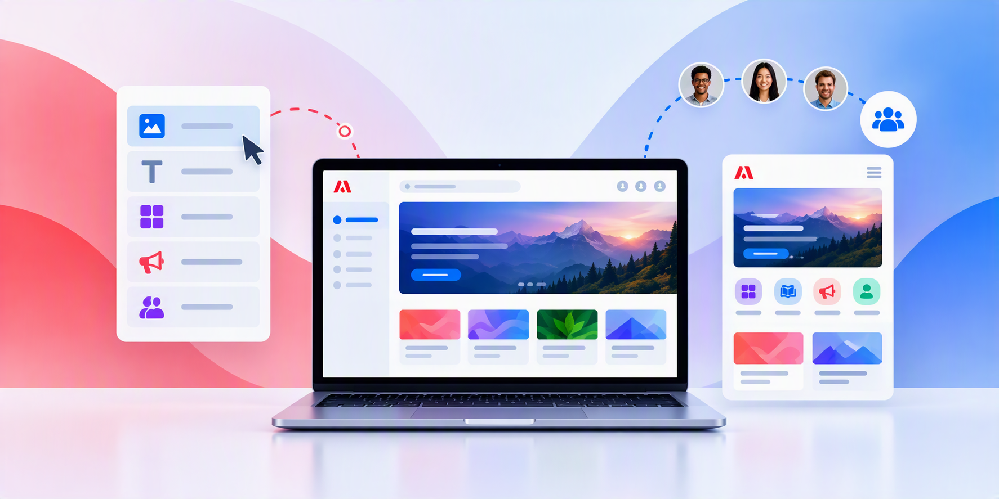

# Documentazione di Adobe Learning Manager

LMS aziendale per esperienze scalabili degli Allievi, formazione sulla conformità e sviluppo basato sulle competenze. Seleziona il tuo ruolo per passare direttamente alla tua guida. Sviluppa competenze pratiche sul prodotto con corsi esclusivi della Adobe Learning Manager Academy e percorsi di apprendimento guidati.

## Inizia con il tuo ruolo {#roles}

Accedi direttamente ai flussi di lavoro e ai concetti che corrispondono a ciò che devi realizzare.

    

        

            

                <figure class="image x-is-16by9">
                    
                </figure>
            

            

                

                    

                        <a href="/help/migrated/administrators/feature-summary/getting-started-admin.md" target="_blank" rel="referrer" title="L’Amministratore">Amministratore</a>
                    

                    
Configura account, utenti, accesso e percorsi di apprendimento.

                

                <a href="/help/migrated/administrators/feature-summary/getting-started-admin.md" target="_blank" rel="referrer" class="spectrum-Button spectrum-Button--fill spectrum-Button--accent spectrum-Button--sizeM" style="align-self: flex-start; margin-top: 1rem;">
                    Ulteriori informazioni
                </a>
            

        

    

    

        

            

                <figure class="image x-is-16by9">
                    
                </figure>
            

            

                

                    

                        <a href="/help/migrated/authors/feature-summary/getting-started-author.md" target="_blank" rel="referrer" title="Autore">Autore</a>
                    

                    
Creazione di corsi, certificazioni, contenuti e percorsi di apprendimento.

                

                <a href="/help/migrated/authors/feature-summary/getting-started-author.md" target="_blank" rel="referrer" class="spectrum-Button spectrum-Button--fill spectrum-Button--accent spectrum-Button--sizeM" style="align-self: flex-start; margin-top: 1rem;">
                    Ulteriori informazioni
                </a>
            

        

    

    

        

            

                <figure class="image x-is-16by9">
                    
                </figure>
            

            

                

                    

                        <a href="/help/migrated/learners/feature-summary/getting-started-learner.md" target="_blank" rel="referrer" title="Allievo">Allievo</a>
                    

                    
Scopri, riprendi e tieni traccia dell’apprendimento assegnato.

                

                <a href="/help/migrated/learners/feature-summary/getting-started-learner.md" target="_blank" rel="referrer" class="spectrum-Button spectrum-Button--fill spectrum-Button--accent spectrum-Button--sizeM" style="align-self: flex-start; margin-top: 1rem;">
                    Ulteriori informazioni
                </a>
            

        

    

    

        

            

                <figure class="image x-is-16by9">
                    
                </figure>
            

            

                

                    

                        <a href="/help/migrated/managers/feature-summary/getting-started-manager.md" target="_blank" rel="referrer" title="Manager">Manager</a>
                    

                    
Assegna l’apprendimento e monitora l’avanzamento del team.

                

                <a href="/help/migrated/managers/feature-summary/getting-started-manager.md" target="_blank" rel="referrer" class="spectrum-Button spectrum-Button--fill spectrum-Button--accent spectrum-Button--sizeM" style="align-self: flex-start; margin-top: 1rem;">
                    Ulteriori informazioni
                </a>
            

        

    

    

        

            

                <figure class="image x-is-16by9">
                    
                </figure>
            

            

                

                    

                        <a href="/help/migrated/integration-admin/feature-summary/connectors.md" target="_blank" rel="referrer" title="Amministratore di integrazione">Amministratore dell’integrazione</a>
                    

                    
Connessione di sistemi, API, dati e flussi di lavoro.

                

                <a href="/help/migrated/integration-admin/feature-summary/connectors.md" target="_blank" rel="referrer" class="spectrum-Button spectrum-Button--fill spectrum-Button--accent spectrum-Button--sizeM" style="align-self: flex-start; margin-top: 1rem;">
                    Ulteriori informazioni
                </a>
            

        

    

## Inizia il tuo percorso di apprendimento come Amministratore

Sviluppa le competenze necessarie per configurare e gestire Adobe Learning Manager.

            

                <figure class="image x-is-16by9">
                    
                </figure>
            

            

                

                    

                        <a href="https://content.adobelearningmanageracademy.com/app/learner?accountId=98632&amp;sdid=N7FDRBP4&amp;mv=partner#/learningProgram/168917" target="_blank" rel="referrer" title="Gestione dei corsi e dei contenuti">Gestione dei corsi e dei contenuti</a>
                    

                    
Scopri come creare, organizzare e gestire i contenuti di apprendimento in modo efficace attraverso questo percorso di apprendimento.

                

                <a href="https://content.adobelearningmanageracademy.com/app/learner?accountId=98632&amp;sdid=N7FDRBP4&amp;mv=partner#/learningProgram/168917" target="_blank" rel="referrer" class="spectrum-Button spectrum-Button--fill spectrum-Button--accent spectrum-Button--sizeM" style="align-self: flex-start; margin-top: 1rem;">
                    Apri percorso di apprendimento
                </a>
            

        

        

            

                <figure class="image x-is-16by9">
                    
                </figure>
            

            

                

                    

                        <a href="https://content.adobelearningmanageracademy.com/app/learner?accountId=98632&amp;sdid=NC5FR6Y3&amp;mv=partner#/learningProgram/168919" target="_blank" rel="referrer" title="Portale ed esperienza">Portale ed esperienza</a>
                    

                    
Scopri come creare portali con marchio personalizzato e coinvolgenti home page rivolti al pubblico con Experience Builder.

                

                <a href="https://content.adobelearningmanageracademy.com/app/learner?accountId=98632&amp;sdid=NC5FR6Y3&amp;mv=partner#/learningProgram/168919" target="_blank" rel="referrer" class="spectrum-Button spectrum-Button--fill spectrum-Button--accent spectrum-Button--sizeM" style="align-self: flex-start; margin-top: 1rem;">
                    Apri percorso di apprendimento
                </a>
            

        

        

            

                <figure class="image x-is-16by9">
                    
                </figure>
            

            

                

                    

                        <a href="https://content.adobelearningmanageracademy.com/app/learner?accountId=98632&amp;sdid=NGWGR372&amp;mv=partner#/learningProgram/168920" target="_blank" rel="referrer" title="Amministrazione e accesso">Amministrazione e accesso</a>
                    

                    
Scopri come strutturare i ruoli, gestire le autorizzazioni e stabilire framework di governance.

                

                <a href="https://content.adobelearningmanageracademy.com/app/learner?accountId=98632&amp;sdid=NGWGR372&amp;mv=partner#/learningProgram/168920" target="_blank" rel="referrer" class="spectrum-Button spectrum-Button--fill spectrum-Button--accent spectrum-Button--sizeM" style="align-self: flex-start; margin-top: 1rem;">
                    Apri percorso di apprendimento
                </a>
            

        

        

            

                <figure class="image x-is-16by9">
                    
                </figure>
            

            

                

                    

                        <a href="https://content.adobelearningmanageracademy.com/app/learner?accountId=98632&amp;sdid=NLMHQYH1&amp;mv=partner#/learningProgram/168921" target="_blank" rel="referrer" title="Riconoscimento e conformità">Riconoscimento e conformità</a>
                    

                    
Scopri come impostare certificazioni di conformità, progettare certificati personalizzati e distintivi che celebrano i risultati raggiunti dagli Allievi.

                

                <a href="https://content.adobelearningmanageracademy.com/app/learner?accountId=98632&amp;sdid=NLMHQYH1&amp;mv=partner#/learningProgram/168921" target="_blank" rel="referrer" class="spectrum-Button spectrum-Button--fill spectrum-Button--accent spectrum-Button--sizeM" style="align-self: flex-start; margin-top: 1rem;">
                    Apri percorso di apprendimento
                </a>
            

        

        

            

                <figure class="image x-is-16by9">
                    
                </figure>
            

            

                

                    

                        <a href="https://content.adobelearningmanageracademy.com/app/learner?accountId=98632&amp;sdid=NQCJQTQZ&amp;mv=partner#/learningProgram/168918" target="_blank" rel="referrer" title="Viaggi nell’esperienza di apprendimento">Percorsi dell’esperienza di apprendimento</a>
                    

                    
Scopri come organizzare i corsi in percorsi strutturati e automatizzare l’iscrizione tramite piani di apprendimento.

                

                <a href="https://content.adobelearningmanageracademy.com/app/learner?accountId=98632&amp;sdid=NQCJQTQZ&amp;mv=partner#/learningProgram/168918" target="_blank" rel="referrer" class="spectrum-Button spectrum-Button--fill spectrum-Button--accent spectrum-Button--sizeM" style="align-self: flex-start; margin-top: 1rem;">
                    Apri percorso di apprendimento
                </a>
            

        

        

            

                <figure class="image x-is-16by9">
                    
                </figure>
            

            

                

                    

                        <a href="https://content.adobelearningmanageracademy.com/app/learner?accountId=98632&amp;sdid=NV3KQPZY&amp;mv=partner#/learningProgram/168922" target="_blank" rel="referrer" title="Report e analisi">Creazione di rapporti e analisi</a>
                    

                    
Scopri come Trasforma dashboard e report in decisioni significative per la leadership.

                

                <a href="https://content.adobelearningmanageracademy.com/app/learner?accountId=98632&amp;sdid=NV3KQPZY&amp;mv=partner#/learningProgram/168922" target="_blank" rel="referrer" class="spectrum-Button spectrum-Button--fill spectrum-Button--accent spectrum-Button--sizeM" style="align-self: flex-start; margin-top: 1rem;">
                    Apri percorso di apprendimento
                </a>
            

        

Scegli corsi mirati per le funzionalità chiave o segui i percorsi di apprendimento guidato. I collegamenti dell’Accademia si aprono in una nuova scheda e potrebbero richiedere l’accesso.

    <a href="https://cdn.content.adobelearningmanageracademy.com/?sdid=PC1PQ72T&amp;mv=partner"
       target="_blank"
       rel="referrer"
       class="spectrum-Button spectrum-Button--outline spectrum-Button--primary spectrum-Button--sizeM" style="align-self: flex-start; margin-top: 1rem;">
        
            Esplora Accademia ALM
        
    </a>

## Esplora Adobe Learning Manager

Scopri le novità, esplora le funzionalità chiave e sviluppa le tue competenze.

    <!-- Check what's new -->
    

        

            

                <figure class="image x-is-16by9">
                    
                </figure>
            

            

                

                    Scopri le novità
                

                

                    Scopri le funzionalità più recenti 
                    e rilascia aggiornamenti.
                

                

                    <strong>
                        <a href="/help/migrated/whats-new.md">
                            Ulteriori informazioni
                        </a>
                    </strong>
                

                

                    <strong>
                        <a href="/help/migrated/authors/feature-summary/content-composer/content-composer-help.md">
                            Composizione contenuto (Beta)
                        </a>
                    </strong>
                

            

        

    

    <!-- Explore AI -->
    

        

            

                <figure class="image x-is-16by9">
                    
                </figure>
            

            

                <!-- Insights Agent -->
                

                    <strong>Agente Insights (Beta)</strong> 
                    <a href="/help/migrated/administrators/feature-summary/insights-agent.md">
                        Ulteriori informazioni
                    </a>
                    &amp;vert;
                    <a href="https://content.adobelearningmanageracademy.com/app/learner?accountId=98632&amp;sdid=MQH8RTM8&amp;mv=partner#/course/17286964">
                        Avvia corso
                    </a>
                

                <!-- Learning Path Agent -->
                

                    <strong>Agente percorso di apprendimento (Beta)</strong> 
                    <a href="/help/migrated/learners/feature-summary/learning-path-agent.md">
                        Ulteriori informazioni
                    </a>
                    &amp;vert;
                    <a href="https://content.adobelearningmanageracademy.com/app/learner?accountId=98632&amp;sdid=MLR7RYC9&amp;mv=partner#/course/17286956">
                        Avvia corso
                    </a>
                

                <!-- Live Hub -->
                

                    <strong>Hub live (Beta)</strong> 
                    <a href="/help/migrated/getting-started-with-live-hub/getting-started-live-hub.md">
                        Ulteriori informazioni
                    </a>
                    &amp;vert;
                    <a href="https://content.adobelearningmanageracademy.com/app/learner?accountId=98632&amp;sdid=MV79RPW7&amp;mv=partner#/course/17286962">
                        Avvia corso
                    </a>
                

            

        

    

    <!-- Learning Experience -->
    

        

            

                <figure class="image x-is-16by9">
                    
                </figure>
            

            

                <!-- Experience Builder -->
                

                    <strong>Experience Builder</strong> 
                    <a href="/help/migrated/administrators/feature-summary/experience-builder/overview.md">
                        Ulteriori informazioni
                    </a>
                    &amp;vert;
                    <a href="https://content.adobelearningmanageracademy.com/app/learner?accountId=98632#/course/17286967">
                        Avvia corso
                    </a>
                

                <!-- Report Builder -->
                

                    <strong>Report Builder</strong> 
                    <a href="/help/migrated/administrators/feature-summary/alm-report-builder.md">
                        Ulteriori informazioni
                    </a>
                    &amp;vert;
                    <a href="https://content.adobelearningmanageracademy.com/app/learner?accountId=98632&amp;sdid=MYYBRL56&amp;mv=partner#/course/17286960">
                        Avvia corso
                    </a>
                

                <!-- Email Builder -->
                

                    <strong>Generatore e-mail</strong> 
                    <a href="/help/migrated/administrators/feature-summary/email-builder.md">
                        Ulteriori informazioni
                    </a>
                    &amp;vert;
                    <a href="https://content.adobelearningmanageracademy.com/app/learner?accountId=98632&amp;sdid=N3PCRGF5&amp;mv=partner#/course/17286967">
                        Avvia corso
                    </a>
                

            

        

    

<!--
<table style="table-layout:fixed">
 <tbody>
  
  <tr style="border: 0;">
   <td>
   
   
<strong>Check what's new</strong>
    

    
Explore the latest features and release updates.

                

                    <strong>
                        <a href="/help/migrated/whats-new.md">Learn more</a>
                    </strong>
                

                

                    <strong>
                        <a href="/help/migrated/authors/feature-summary/content-composer/content-composer-help.md">Content Composer (Beta)</a>
                    </strong>
    

   
   </td>
   <td>
                    <strong>Insights Agent (Beta)</strong> 
                    <a href="/help/migrated/administrators/feature-summary/insights-agent.md">Learn more</a> &vert; <a href="https://content.adobelearningmanageracademy.com/app/learner?accountId=98632&sdid=MQH8RTM8&mv=partner#/course/17286964">Launch course</a>

                    <strong>Learning Path Agent (Beta)</strong> 
                    <a href="/help/migrated/learners/feature-summary/learning-path-agent.md">Learn more</a> &vert; <a href="https://content.adobelearningmanageracademy.com/app/learner?accountId=98632&sdid=MLR7RYC9&mv=partner#/course/17286956">Launch course</a>

                    <strong>Live Hub (Beta)</strong> 
                    <a href="/help/migrated/getting-started-with-live-hub/getting-started-live-hub.md">Learn more</a> &vert; <a href="https://content.adobelearningmanageracademy.com/app/learner?accountId=98632&sdid=MV79RPW7&mv=partner#/course/17286962">Launch course</a>

                
   
   </td>
   <td>
                    <strong>Experience Builder</strong> 
                    <a href="/help/migrated/administrators/feature-summary/experience-builder/overview.md">Learn more</a> &vert; <a href="https://content.adobelearningmanageracademy.com/app/learner?accountId=98632#/course/17286967">Launch course</a>
    

    

                    <strong>Report Builder</strong> 
                    <a href="/help/migrated/administrators/feature-summary/alm-report-builder.md">Learn more</a> &vert; <a href="https://content.adobelearningmanageracademy.com/app/learner?accountId=98632&sdid=MYYBRL56&mv=partner#/course/17286960">Launch course</a>
    

                    <strong>Email Builder</strong> 
                    <a href="/help/migrated/administrators/feature-summary/email-builder.md">Learn more</a> &vert; <a href="https://content.adobelearningmanageracademy.com/app/learner?accountId=98632&sdid=N3PCRGF5&mv=partner#/course/17286967">Launch course</a>
    

    </td>
  </tr>
  
 </tbody>
</table>
-->

Scopri come ALM può aiutarti a creare, gestire e fornire esperienze di apprendimento coinvolgenti. Registrati subito per una demo personalizzata.

    <a href="https://business.adobe.com/resources/demo/adobe-learning-manager-lms.html?sdid=P79NQBSV&amp;mv=partner#make-personalized-learning-the-new-normal"
       target="_blank"
       rel="referrer"
       class="spectrum-Button spectrum-Button--outline spectrum-Button--primary spectrum-Button--sizeM" style="align-self: flex-start; margin-top: 1rem;">
        
            Registrati
        
    </a>

## Risorse aggiuntive {#additional-resources}

- [Note sulla versione](/help/migrated/release-note/release-notes.md)
- [Chiedi alla community](https://community.adobe.com/adobe-learning-manager-466)
- [Invia feedback](https://github.com/AdobeDocs/learning-manager.en/issues)
