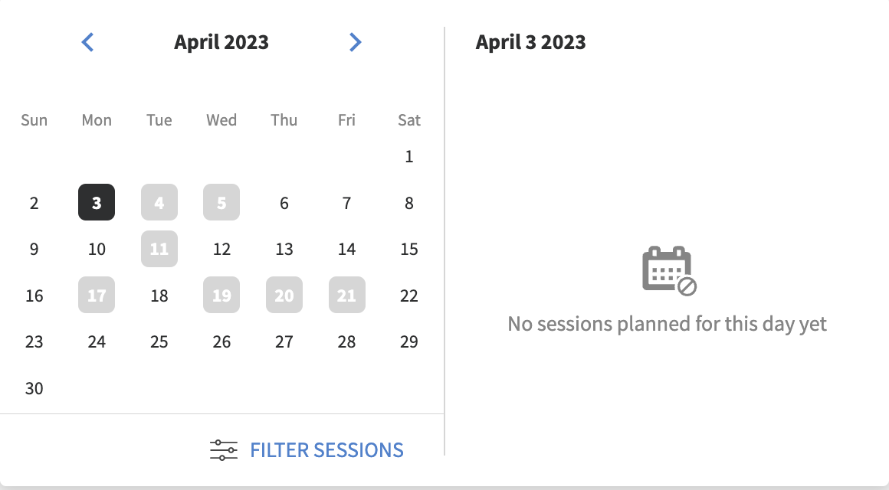
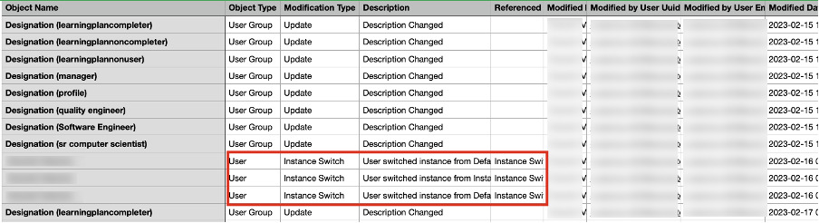
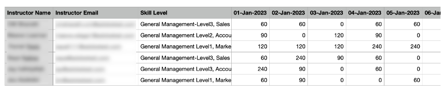

# Novità di questa versione (aprile 2023)

## App Adobe Learning Manager per Microsoft Teams

La nuova app Adobe Learning Manager su Microsoft Teams è progettata per favorire l’apprendimento nel flusso di lavoro e rendere più efficiente l’apprendimento sociale. Gli Allievi potranno accedere ai contenuti di apprendimento all’interno della piattaforma Microsoft Teams senza dover passare a un browser. Contatta il CSAM per la versione beta dell’app Adobe Learning Manager su MS Teams.

Per ulteriori informazioni, consulta [App Adobe Learning Manager per Microsoft Teams](/help/migrated/adobe-learning-manager-app-microsoft-teams.md).

## Miglioramenti apportati all’esperienza di formazione con Istruttore (ILT).

Sono stati apportati diversi miglioramenti all’esperienza di formazione con Istruttore (ILT). I miglioramenti principali includono: la possibilità di filtrare le sessioni in base alla posizione, la possibilità di cambiare istanza (VILT) senza perdere i progressi, un nuovo &quot;Assistente alla pianificazione&quot; per la gestione dei conflitti nelle sessioni di prenotazione, la possibilità di allegare &quot;Abilità&quot; agli Istruttori e scegliere Istruttori in base alle abilità.

### Cosa è cambiato

* La pagina Abilità dell’app dell’Amministratore consente di caricare la mappatura Abilità-Istruttore.
* Nella pagina Abilità è disponibile una nuova colonna, Istruttori. La colonna mostra il numero di istruttori rispetto all’abilità. Se fai clic sul numero nella colonna Istruttori, verrai reindirizzato a una finestra a comparsa che mostra il numero di istruttori assegnati a un’abilità.

Per ulteriori informazioni, consulta [Assegnazione di abilità agli Istruttori](/help/migrated/administrators/feature-summary/skills-levels.md#assign-skills-to-instructors).


### Assistente alla pianificazione

Gestire i conflitti nelle registrazioni di Istruttori e aule o aule virtuali. Se desideri sapere in quale data e ora è disponibile un istruttore prima di assegnarlo al corso, utilizza l’Assistente alla pianificazione.

Gli Autori, gli Amministratori e gli Amministratori/Autori personalizzati possono utilizzare l’Assistente pianificazione.

Per ulteriori informazioni, vedere [Assistente alla pianificazione](/help/migrated/authors/feature-summary/courses.md#scheduling-assistant).

## App per dispositivi mobili di Adobe Learning Manager

Una nuovissima app per dispositivi mobili Adobe Learning Manager per Android e iOS che consente agli Allievi di accedere senza problemi all’apprendimento ovunque si trovino. Grazie all’app, gli Allievi possono seguire corsi di formazione sui propri dispositivi mobili e riprenderli in un secondo momento su un computer desktop. L’app dispone di diverse funzionalità, ad esempio supporto per notifiche, caricamento di file, creazione di segnalibri facilitata, condivisione di contenuti di apprendimento, apprendimento sociale e altro ancora; offre dunque maggiore flessibilità agli Allievi e supporta l’apprendimento just-in-time.


Scarica il dispositivo mobile da Google Play Store e Apple App Store. Agli utenti della versione precedente dell’app verrà richiesto di scaricare e installare la nuova app.

In questa versione, l’app supporta le seguenti funzioni:

La nuova app per dispositivi mobili supporta le seguenti funzioni chiave in questa versione:

* Ricerca ottimizzata, inclusa la visualizzazione delle ricerche recenti degli Allievi e delle ricerche più frequenti nell’organizzazione nella casella di immissione della ricerca.
* Possibilità di scaricare le trascrizioni degli Allievi.
* Centro notifiche improvvisato: fornisce aggiornamenti importanti agli Allievi come notifiche all’interno dell’app
* Possibilità di ordinare e filtrare gli oggetti di apprendimento nelle pagine Catalogo/Il mio apprendimento.
* Possibilità di aggiungere segnalibri agli oggetti di apprendimento (LO): gli LO con segnalibro saranno disponibili nella sezione &quot;Salvati da me&quot; nella pagina principale dell’Allievo.
* Supporto per percorsi di apprendimento ottimizzati
* Possibilità di modificare la lingua dell’interfaccia mobile in qualsiasi lingua supportata da Adobe Learning Manager.
* Supporto per il caricamento di file per certificazioni esterne, sessioni di corsi in aula o virtuali e moduli di attività.
* Possibilità di inviare feedback sul corso L1 all’interno dell’app.
* Supporto per collegamenti diretti.
* Supporto per Apprendimento sociale.
* Supporto per i badge.
* Supporto per l’accesso di utenti esterni.

**Elementi non supportati in questa versione**

* Supporto per tentativi multipli di un modulo quiz in un corso quando viene seguito dall’app mobile.
* Opzioni di ricerca che consentono di specificare i parametri di ricerca, ad esempio i metadati del corso, i tag e le abilità per specificare l’ambito di ricerca.
* Annunci personalizzati abilitati all’amministratore che vengono mostrati come popup all’utente nell’app per dispositivi mobili.
* Non puoi aggiungere abilità alla pagina delle abilità nell’app.
* Seguire corsi in modalità offline.

Per ulteriori informazioni, consulta [App per dispositivi mobili di Adobe Learning Manager](/help/migrated/learners/feature-summary/ipad-android-tablet-users.md).

## Utilizzo di qualsiasi app di scansione del codice QR per acquisire i codici QR di Learning Manager

Adobe Learning Manager ora supporta un modo più intuitivo di scansionare i codici QR utilizzando l’app della fotocamera nativa senza doverne scaricare una apposita.

Per supportare il flusso di lavoro precedente, in cui era possibile scansionare un codice QR utilizzando il menu dell’app ALM, in questa versione abbiamo fornito informazioni su come passare al nuovo flusso di lavoro.

Con i miglioramenti ai flussi di lavoro basati su codici QR, i vecchi codici QR generati prima di questa versione non saranno più supportati. Pertanto, se hai generato un codice QR con una versione precedente di Learning Manager per una sessione in aula o un corso virtuale che verrà eseguita dopo questa versione, devi generare un nuovo codice QR.

### Miglioramenti relativi a Consiglio come annuncio

In questa versione, abbiamo aggiornato la striscia dei consigli di un’organizzazione in una raccomandazione basata sul gruppo di utenti, di cui fa parte l’Allievo, per mostrare i corsi pertinenti per l’Allievo.

Gli Amministratori possono indirizzare determinati corsi o sessioni di formazione agli Allievi in base ai profili degli stessi. Gli Allievi possono quindi cercare i corsi in base al profilo di cui fanno parte.

**Cosa è cambiato**

Nella pagina Annuncio è disponibile un’opzione che mostra all’Allievo il motivo per cui quel determinato corso o quella determinata sessione di formazione è stato/a consigliato/a.


### Nuova impostazione amministratore

L’Amministratore dispone di una nuova opzione denominata Gruppi in Impostazioni > Mostra pannelli filtri. Quando l’opzione Gruppi è attivata, viene visualizzato il filtro Gruppi nella pagina principale dell’Allievo. L’Allievo può quindi scegliere di visualizzare i corsi in base ai gruppi di utenti.

|   | Quando l’opzione è attivata | Quando l’opzione è disattivata |
|--- |--- |--- |
| L’opzione Gruppi è attivata | <ul><li> Visualizza il gruppo di utenti nella sezione insieme al collegamento alla pagina del catalogo.</li><li> Il gruppo di utenti viene visualizzato nel filtro catalogo.</li></ul> | <ul><li>Il nome del gruppo di utenti non viene visualizzato nella sezione.</li><li>Il gruppo di utenti non viene elencato nel filtro catalogo.</li></ul> |
| L’opzione Gruppi è disattivata | <ul><li>Visualizza il nome del gruppo di utenti nella sezione del corso come testo semplice.</li><li>Il gruppo di utenti non viene elencato nel filtro catalogo.</li></ul> | <ul><li>La sezione del corso non visualizza il testo o il nome del gruppo di utenti.</li><li>Il gruppo di utenti non viene elencato nel filtro catalogo.</li></ul> |

**Funzionamento**

L’Amministratore crea un annuncio aggiungendo il corso per qualsiasi gruppo di utenti e lo pubblica.

L’Allievo vede una striscia con i corsi consigliati sulla pagina principale e un collegamento al corso nella sezione.


Quando l’Allievo fa clic sul collegamento o sul pulsante Vai al catalogo, viene reindirizzato alla pagina del catalogo del corso. L’Allievo visualizza quindi l’elenco dei gruppi di utenti da filtrare in base ai gruppi di utenti nel catalogo e nella pagina Il mio apprendimento.


## Cercare le sessioni utilizzando le posizioni

### Gestire le posizioni delle aule

A volte è necessario che un Allievo filtri una sessione nel calendario in base alla posizione. Dopo aver aggiunto un percorso utilizzando la finestra di dialogo Aule o il file CSV, l’Allievo può impostare il filtro.


Per ulteriori informazioni, consulta [Aggiungere aule](/help/migrated/administrators/feature-summary/settings.md#classroom-locations).

### Widget Calendario

In qualità di Allievo, puoi filtrare le sessioni che ti vengono assegnate in base alla posizione. Passa al widget del calendario, seleziona Filtra sessioni e seleziona la posizione.





Inoltre, il percorso di formazione ora viene visualizzato nella pagina della panoramica del corso se viene aggiunto dall’Autore durante la creazione del corso.

### L’Amministratore

In qualità di Amministratore, puoi controllare se un Allievo può filtrare i corsi in base alle posizioni. In Impostazioni > Generali, attiva o disattiva Aule formazione.

Per ulteriori informazioni, consulta [Impostazioni dell’Amministratore](/help/migrated/administrators/feature-summary/settings.md).

## Modifiche all’esperienza di prova

Dopo aver creato l’account di prova, i corsi nel marketplace dei contenuti diventano disponibili senza alcun ritardo.

## Chatbot

Parla in chat con uno o più agenti utilizzando un chatbot. Questa funzione può essere utilizzata solo dagli amministratori e dagli amministratori personalizzati degli account di prova.

Il chatbot ha le seguenti funzioni:

* Dare il benvenuto con un messaggio.
* Fornisci un&#39;opzione per informazioni sul prodotto o una demo del prodotto.
* Trasferire la chat a un agente attivo.
* Mantenere intatta la cronologia delle chat.


## Miglioramenti dell’elenco di controllo di osservazione

Gli Autori ora possono selezionare i Manager e i Manager dei punti vendita/delle posizioni come Revisori per elenchi di controllo. I Manager e i Manager dei punti vendita/delle posizioni, se selezionati come Revisori, possono anche visualizzare e completare le liste di controllo dei propri team senza dover passare ai ruoli di Istruttore. Gli Istruttori continuano a rivedere gli elenchi di controllo. Una nuova notifica &quot;Elenco di controllo revisione&quot; viene inviata ai revisori (Istruttori/Manager) di un’istanza per l’elenco di controllo sulle iscrizioni.

Se un Manager viene aggiunto come revisore nel modulo dell’elenco di controllo, potrà esaminare l’elenco di controllo nell’app Manager. Gli Istruttori continuano a rivedere l’elenco di controllo come previsto.

Per ulteriori informazioni, vedere [Elenco di controllo Osservazione](/help/migrated/authors/feature-summary/courses.md#observation-checklist).

## Altri miglioramenti

### Ricerca di un Allievo

I risultati della ricerca sono suddivisi come indicato di seguito:

* Ricerche recenti effettuate da te
* Ricerche più frequenti nella tua organizzazione

La funzionalità di ricerca è stata migliorata anche per gli Allievi. Gli Allievi ora possono utilizzare le virgolette doppie &quot;...&quot;, più &quot;+&quot; e meno &quot;-&quot; operatori per trovare più rapidamente i risultati pertinenti e avere un’esperienza di ricerca di google.

* Utilizza le virgolette (&quot;...&quot;) per cercare i corsi che contengono la frase o la parola esatta. Ad esempio, inserendo “data science”, i risultati conterranno solo i corsi che iniziano con la frase “data science”.
* Utilizza l’operatore + per fare in modo che vengano visualizzati solo i risultati contenenti la frase o la parola specifica. Ad esempio, Programmazione computer +pitone mostrerà solo quei corsi di programmazione computer che contengono la parola &quot;pitone&quot;.
* Utilizzare l&#39;operatore - per assicurarsi che vengano visualizzati solo i risultati che non contengono la frase o la parola specifica. Ad esempio, Programmazione computer -python mostrerà tutti i corsi di programmazione computer ad eccezione di quelli che contengono la parola &quot;python&quot;.

### Popup in conflitto per gli oggetti di apprendimento

Quando un Allievo ha sessioni in conflitto, nella pagina Panoramica viene visualizzata una finestra a comparsa all’iscrizione. Se un Allievo si iscrive alla pagina del catalogo o della panoramica e ha già sessioni in conflitto, viene attivato un popup in conflitto con i dettagli della sessione in conflitto. Anche se un Allievo ha una sessione in conflitto, può iscriversi alla nuova sessione.


Nota: questo messaggio è solo un avvertenza. Puoi comunque iscriverti a un corso.

### Nuovo modello

Abbiamo aggiunto un nuovo modello e-mail denominato Sessione annullata a causa dell’annullamento dell’iscrizione. Quando un utente viene disiscritto da un corso di formazione, riceve l’e-mail di annullamento.

### Nuova funzione di determinazione dei prezzi per i corsi

Gli Amministratori ora possono impostare la valuta per l’account nella sezione Impostazioni amministratore > Informazioni di base. Gli Amministratori possono specificare sia il simbolo che il codice valuta ISO, ad esempio USD, GBP e così via. L&#39;impostazione predefinita per tutti i nuovi account sarà $. Questa modifica è applicabile solo alle app non Allievo. Gli Amministratori possono vedere la modifica quando visualizzano in anteprima il corso come Allievi. Il simbolo di valuta viene visualizzato anche nei rapporti Trascrizioni degli Allievi e Formazione.

Per ulteriori informazioni, consulta [Impostazioni dell’Amministratore](/help/migrated/administrators/feature-summary/settings.md).

### Commutazione di istanze

Un Allievo iscritto a una particolare istanza di un corso può visualizzare un elenco di tutte le istanze disponibili del corso e passare a un’altra istanza che trova più adatta alle sue esigenze. Il motivo del cambio potrebbe essere che l’Allievo non ha partecipato all’istanza precedente o che i tempi della sessione per la nuova istanza sono più adatti, oppure un altro motivo.

Tutti i progressi compiuti dall’Allievo come parte del corso, i punteggi dei quiz degli Allievi e altre informazioni vengono applicati alla nuova istanza. Questa funzione è principalmente destinata ai corsi in aula e a quelli misti, ma supporteremo tutti i tipi di corsi, compresi quelli autonomi.

L’opzione Visualizza tutte le istanze viene visualizzata indipendentemente dalle impostazioni di Commutazione istanza. Se sono presenti più istanze di un corso, gli Allievi visualizzeranno ora un’opzione per vedere tutte le istanze.

Se l’opzione Commutazione istanza è attivata, gli Allievi possono passare da un’istanza all’altra fino al completamento del corso. Se l’opzione è disattivata, gli Allievi possono visualizzare le istanze ma non potranno iscriversi al corso.

Quando l’Allievo seleziona **Visualizza tutte le istanze**, l’Allievo può visualizzare tutte le istanze del corso.


_Visualizza tutta la pagina dell’istanza dalla console dell’Allievo_


_Cambia istanza dalla pagina dell’Allievo_

Un amministratore può cambiare istanza per gli Allievi. Seleziona un corso da Admin Console, passa alla sezione **[!UICONTROL Allievi]**, scegli un utente e seleziona il pulsante **[!UICONTROL Azione]**. Quindi, seleziona **[!UICONTROL Cambia istanza]** e scegli l&#39;istanza desiderata.


_Cambia istanza da Admin Console_


_Messaggio per cambiare istanza_

Non puoi cambiare istanza finché nessuna istanza del corso non viene completata dall’app per Allievi o Amministratori.

Gli Autori, durante la creazione di un corso, possono alternare l’attivazione o la disattivazione di &quot;Instance Switch&quot;. Commutazione istanza è disponibile solo per i corsi gratuiti.

Per ulteriori informazioni, vedere [Configurazione istanza](/help/migrated/authors/feature-summary/courses.md).

**Allievi**

Gli Allievi possono passare da un’istanza del corso in lista d’attesa a un’altra. Questi possono anche passare da un’istanza del corso a un percorso di apprendimento o a una certificazione.

Dopo l’iscrizione al percorso di apprendimento o alla certificazione, nella pagina del corso gli allievi possono fare clic su Visualizza istanze, quindi cambiare istanza.

>[!NOTE]
>
>La configurazione di Commutazione istanza non è supportata per i tipi di iscrizione nominati dal Manager.
>
>Se stai commutando l’istanza da un programma di apprendimento Flex, l’avanzamento verrà riportato all’altra istanza.

### Prova di verifica dell’utente

Il report di prova di verifica dell’utente acquisirà informazioni sugli Allievi che hanno cambiato istanza, &quot;da istanza&quot; a &quot;istanza&quot;, cambiato per ora, data, ecc.



Per ulteriori informazioni, consulta [Report di verifica dell’utente](/help/migrated/administrators/feature-summary/reports.md#useraudittrailreports).

### Report sull’utilizzo degli istruttori

Questo report registra il tempo (in minuti) trascorso quotidianamente da un Istruttore che tiene le sessioni assegnate. Il report può essere scaricato per un periodo di tre mesi dalla data di inizio selezionata.

Per ulteriori informazioni, consulta [Rapporto sull’utilizzo degli istruttori](/help/migrated/administrators/feature-summary/reports.md#instructor-utilization-report).



### Report risorse formative

Un nuovo report per tenere traccia delle risorse formative presenti nell’account e varie informazioni sulle risorse formative, ad esempio lingua, tipo, durata, autore, tag e così via.

Per ulteriori informazioni, consulta [Report di iscrizione risorse formative](/help/migrated/administrators/feature-summary/reports.md).

### E-mail ad hoc mirate agli Allievi iscritti a un’istanza di corso specifica

Amministratori e Autori potranno inviare comunicazioni e-mail mirate ad hoc agli Allievi iscritti a un’istanza specifica di un corso. L’opzione per inviare e-mail a livello di istanza è stata aggiunta per corsi e programmi di apprendimento.


*Invia e-mail a livello di istanza*

Nella finestra di dialogo Crea annuncio, l’opzione Digita come e-mail e Formazione sono selezionate per impostazione predefinita, insieme all’istanza. Specificate l’oggetto, digitate il messaggio e fate clic su Salva.

Per ulteriori informazioni, consulta [E-mail a livello di istanza](/help/migrated/administrators/feature-summary/courses.md#send-instance-level-emails).

### E-mail ad hoc mirate agli Allievi tramite annunci dell’Amministratore

Per gli Amministratori, è stato aggiunto un nuovo tipo di annuncio: “Come e-mail”. Questa opzione può essere usata per inviare e-mail mirate ad hoc agli utenti in formazione di un gruppo di utenti selezionato o agli utenti in formazione iscritti a un corso di formazione specifico.

Amministratore personalizzato e Autori possono anche visualizzare questa opzione a livello di istanza, se dispongono dell’accesso necessario.

Per ulteriori informazioni, consulta [Annunci](/help/migrated/administrators/feature-summary/announcements.md#as-email).

### Nuovi modelli e-mail

In questa versione sono stati aggiunti modelli e-mail per i manager di alto livello. Questi modelli sono pensati per i manager che ricevono e-mail relative ai loro report di secondo livello che non rispettano le scadenze del corso, del percorso di apprendimento o della certificazione. Inoltre, riceveranno e-mail quando i loro report di secondo livello si avvicinano a qualsiasi scadenza di completamento per questi corsi, percorsi di apprendimento o certificazioni.

* Ignora l’escalation del livello per il completamento del corso - Prima della scadenza
* Ignora l’escalation del livello per la scadenza del corso non rispettata
* Ignora l’escalation del livello per il completamento del Percorso di apprendimento - Prima della scadenza
* Ignora l’escalation del livello per la scadenza del Percorso di apprendimento non rispettata
* Ignora l’escalation del livello per il completamento della Certificazione - Prima della scadenza
* Ignora l’escalation del livello per la scadenza di certificazione non rispettata

Le opzioni sono attivate per impostazione predefinita.

## Modifiche API in questa versione

### Nuovi report

È stato aggiunto un nuovo attributo, jobType, all&#39;API dei processi. L’attributo accetta i seguenti valori:

* **generateInstructorUtilisationReport**: restituisce il report sull&#39;utilizzo di un istruttore.
* **generateJobAidMetadataReport**: restituisce i metadati di un report delle risorse formative.

**Endpoint**: POST /primeapi/v2/jobs

Richiesta generateJobAidMetadataReport:

```javascript {line-numbers="true"}
{ 
    "data": { 
        "type": "job", 
            "attributes": { 
                "description": "description of your choice", 
                "jobType": "generateJobAidMetadataReport" 
            } 
    }
} 
```

risposta generateJobAidMetadataReport:

```javascript {line-numbers="true"}
{ 
  "links": { 
    "self": "https://learningmanagerstage1.adobe.com/primeapi/v2/jobs" 
  }, 
  "data": { 
    "id": "31126", 
    "type": "job", 
    "attributes": { 
      "dateCreated": "2023-02-28T18:36:48.000Z", 
      "description": "description of your choice", 
      "jobType": "generateJobAidMetadataReport", 
      "status": { 
        "code": "Submitted" 
      } 
    } 
  } 
} 
```

generatorUtilisationReport, richiesta:

```javascript {line-numbers="true"}
{
    "data": { 
        "type": "job", 
            "attributes": { 
                "description": "description of your choice", 
                "jobType": "generateInstructorUtilisationReport", 
                "payload": { 
                    "year": "2023", 
                    "month": "2" 
                } 
            } 
    } 
}
```

risposta generateInstructorUtilisationReport:

```javascript {line-numbers="true"}
{ 
  "links": { 
    "self": "https://learningmanagerstage1.adobe.com/primeapi/v2/jobs" 
  }, 
  "data": { 
    "id": "31130", 
    "type": "job", 
    "attributes": { 
      "dateCreated": "2023-02-28T18:43:43.000Z", 
      "description": "description of your choice", 
      "jobType": "generateInstructorUtilisationReport", 
      "payload": { 
        "month": "2", 
        "year": "2023" 
      }, 
      "status": { 
        "code": "Submitted" 
      } 
    } 
} 
} 
```

Per ulteriori informazioni, consulta il [documento di Riferimento API](https://captivateprime.adobe.com/docs/primeapi/v2/).

### Commutazione istanza Allievo

L’API per Allievi iscritti consente di accedere a tutte le istanze disponibili e di passare a un’istanza diversa di un corso. La nuova istanza eredita tutte le proprietà del corso precedente.

È stato aggiunto un nuovo parametro di query, enrollmentID, per il quale vengono richieste le informazioni.

>[!NOTE]
>
>Il corpo è necessario solo per i seguenti scenari:
>
>1. Piano di apprendimento flessibile
>1. Commutazione istanza corso

### Account

La risposta contiene un nuovo attributo, currencyCode.

**Endpoint**: GET /primeapi/v2/account

### Associazione di competenze e livelli di abilità per istruttori

Abbiamo introdotto una nuova funzione che acquisisce l’esperienza degli istruttori, ovvero, per ogni istruttore, la sua esperienza viene mantenuta e può essere resa disponibile per operazioni a valle come la ricerca e il filtraggio.

Vengono aggiunti i seguenti attributi:

* instructorSkills
* instructorSkillLevel

**Endpoint**: GET /primeapi/v2/account /&lt;account_id>/instructorskill/search

### Modifiche ILT

| Descrizione | Nuovo parametro/risposta | Endpoint |
|--- |--- |--- |
| Elenca tutte le città | filter.cityName=true/false | GET /primeapi/v2/data |
| Cercare e filtrare le città | filter.cityName=city_name<br>Supporta anche un elenco di città separate da virgole |
| GET /primeapi/v2/search |
| Dettagli sala resi | include=room | GET /primeapi/v2/users/`<id>`/calendar |
| Oggetto di apprendimento per filtrare le città | filter.cityName=city_name <br> Supporta anche un elenco di città separate da virgole. | GET /primeapi/v2/learningObjects |
| Aggiungi pannello Città | La risposta contiene un nuovo attributo, filterPanelSetting=true/false. | GET /primeapi/v2/account |

### Sessioni Allievo con conflitto

Recuperare un elenco di tutte le sessioni in conflitto per un’istanza.

Sono stati aggiunti i seguenti campi:

* loID
* loInstanceID

**Endpoint**: `GET /primeapi/v2/learningObjects/{loId}/instances/loInstanceId/conflictingSessions?page[offset]=0&page[limit]=10`

### Aula in videoconferenza

Eseguire una ricerca basata sulla posizione per i corsi VC. Nel modello di risorse è presente un nuovo attributo roomLocation che indica la posizione a mano libera fornita durante la creazione di un corso VC.

Sono state apportate le seguenti modifiche:

**LO**

Un nuovo parametro di query, filter.loFormat=Virtual Classroom per l’API learningObjects.

**Endpoint**: GET /primeapi/v2/learningObjects

**Calendario**

Un nuovo parametro di query, filter.allSessions=false per l’API del calendario. Il valore predefinito del parametro è false. Se è true, l’API restituisce tutte le sessioni del calendario di un Allievo.

**Endpoint**: `GET /primeapi/v2/users/<id>/calendar?filter.allSessions=false`

### Cronologia ricerche Allievo

**Cerca**

Un nuovo parametro di query, persistSearchHistory. Il valore predefinito è true, che persiste nella query per i suggerimenti di ricerca.

**Endpoint**: GET /primeapi/v2/search?persistSearchHistory=true

**Suggerimenti**

Un nuovo parametro di query, sugionType. I valori accettati sono:

* learnerHistory (impostazione predefinita)
* accountHistory

**Endpoint**: GET /primeapi/v2/search/tips/?sugionType=learnerHistory

### Filtraggio gruppo di utenti

Le API di ricerca e degli oggetti di apprendimento forniranno filtri per recuperare tutti gli oggetti di apprendimento appartenenti al gruppo di utenti tramite i filtri specificati. Le API supportano i filtri come elenco separato da virgole.

È stato fornito un nuovo filtro, filter.lo.announcingGroups, per recuperare tutti gli LO che appartengono ai filtri del gruppo di utenti forniti.

Può essere un elenco con più valori separati da virgole per garantire flessibilità; l’elaborazione si basa sull’operazione “OR” tra i gruppi multipli, ovvero, puoi ottenere tutti gli oggetti di apprendimento che rientrano nei gruppi di utenti dati.

### Gruppo personalizzato

Puoi aggiungere e rimuovere utenti esterni nei gruppi personalizzati tramite API.

**POST**

POST /userGroups/{id}/users

**Corpo**

```javascript {line-numbers="true"}
"data": [ 
     { 
           "type": "user",  
           "id": "{id}"   
     }  
]  
```

**DELETE**

DELETE /userGroups/{id}/users

**Corpo**

```javascript {line-numbers="true"}
"data": [  
     {  
          "type": "user",  
           "id": "11218291"  
     }  
]   
```

### Annuncio filtraggio gruppi di utenti per perdite nell’app per Allievi

* L&#39;API GET /users/{userId}/userGroups dispone di un nuovo parametro, filter.announGroupsOnly, che accetta un valore booleano (true/false). Questa funzione filtra solo i gruppi di utenti annunciati dall’Amministratore. Il valore predefinito di questo parametro è false.
* L’API GET /learningObjects include un nuovo parametro, filter.announGroups, che accetta gli ID dei gruppi di annunci per filtrare i risultati.
* GET L’API /search dispone di un nuovo parametro, filter.announGroups, che accetta gli ID dei gruppi di annunci per filtrare i risultati.

Di seguito viene fornito un esempio di risposta:

```javascript {line-numbers="true"}
{
  "links": {
    "self": "https://learningmanagerstage1.adobe.com/primeapi/v2/recommendations?page[offset]=0&page[limit]=10&strip=1&filter.recType=announcement&filter.loTypes=course"
  },
  "data": [
    {
      "id": "course:5836866_10855885_recommendation",
      "type": "recommendation",
      "attributes": {
        "reason": [
          "Based on your Group - UGforAnnouncement"
        ],
        "reasonModel": [
          {
            "modelId": 1781592,
            "modelType": "userGroup",
            "modelValues": {
              "group_name": "UGforAnnouncement"
            },
            "template": "Based on your Group - {{group_name}}"
          }
        ]
      },
      "relationships": {
        "learningObject": {
          "data": {
            "id": "course:5836866",
            "type": "learningObject"
          }
        }
      }
    },
    {
      "id": "course:7013328_10855885_recommendation",
      "type": "recommendation",
      "attributes": {
        "reason": [
          "Based on your Group - All Learners"
        ],
        "reasonModel": [
          {
            "modelId": 1410724,
            "modelType": "userGroup",
            "modelValues": {
              "group_name": "All Learners"
            },
            "template": "Based on your Group - {{group_name}}"
          }
        ]
      },
      "relationships": {
        "learningObject": {
          "data": {
            "id": "course:7013328",
            "type": "learningObject"
          }
        }
      }
    },
    {
      "id": "course:6408989_10855885_recommendation",
      "type": "recommendation",
      "attributes": {},
      "relationships": {
        "learningObject": {
          "data": {
            "id": "course:6408989",
            "type": "learningObject"
          }
        }
      }
    },
    {
      "id": "course:6409761_10855885_recommendation",
      "type": "recommendation",
      "attributes": {},
      "relationships": {
        "learningObject": {
          "data": {
            "id": "course:6409761",
            "type": "learningObject"
          }
        }
      }
    },
    {
      "id": "course:6979586_10855885_recommendation",
      "type": "recommendation",
      "attributes": {},
      "relationships": {
        "learningObject": {
          "data": {
            "id": "course:6979586",
            "type": "learningObject"
          }
        }
      }
    }
  ]
}
```

## Note sulla versione

Per informazioni sulle versioni correnti e precedenti dell’app Web e per dispositivi di Learning Manager, consulta le [Note sulla versione](/help/migrated/release-note/release-notes.md).

## Correzioni di bug

Per visualizzare i bug risolti in questo aggiornamento, consultare l&#39;[elenco Bug corretti](release-note/release-notes.md#bugs-fixed-in-this-release).

## Requisiti di sistema

[Requisiti di sistema di Learning Manager](/help/migrated/system-requirements.md)
