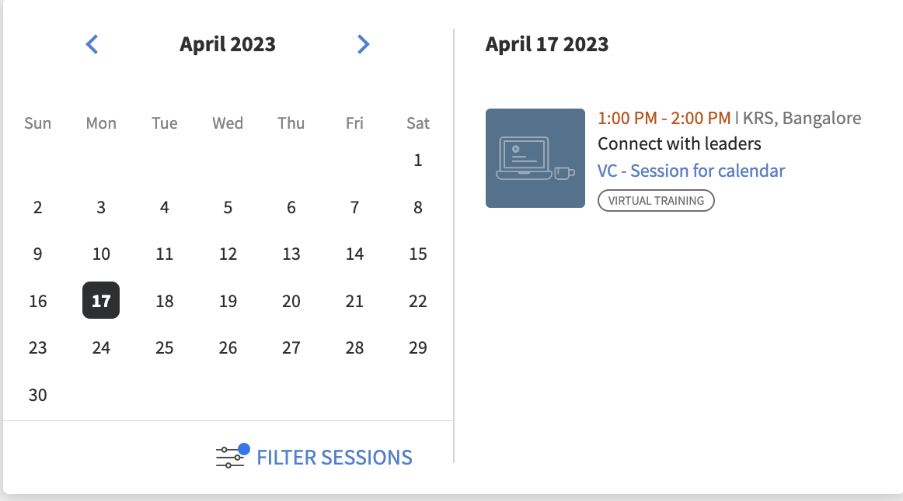

# Novità di questa versione (aprile 2023)

## Adobe dell’app Learning Manager per Microsoft Teams

La nuova app Learning Manager per Microsoft Teams di Adobe è progettata per promuovere l’apprendimento nel flusso di lavoro e aumentare l’apprendimento sociale. Gli Allievi potranno accedere ai contenuti di apprendimento all’interno della piattaforma Microsoft Teams senza dover passare a un browser. Per la versione beta dell’app Learning Manager per Adobi su MS Teams, contatta il tuo CSAM.

Per ulteriori informazioni, consulta [Adobe dell’app Learning Manager per Microsoft Teams](/help/migrated/adobe-learning-manager-app-microsoft-teams.md).

## Miglioramento dell’esperienza di formazione con istruttore (ILT)

Sono stati apportati diversi miglioramenti all’esperienza di formazione con istruttore (ILT). I miglioramenti principali includono: la possibilità di filtrare le sessioni in base alla posizione, la possibilità di cambiare istanza (VILT) senza perdere i progressi, un nuovo &quot;Assistente alla pianificazione&quot; per la gestione dei conflitti nelle sessioni di prenotazione, la possibilità di allegare &quot;Abilità&quot; agli Istruttori e scegliere Istruttori in base alle abilità.

### Cosa è cambiato

* La pagina Abilità dell’app di amministrazione consente di caricare la mappatura Abilità-Istruttore.
* Nella pagina Abilità è disponibile una nuova colonna, Istruttori. La colonna mostra il numero di istruttori rispetto all’abilità. Se fai clic sul numero nella colonna Istruttori, verrai reindirizzato a una finestra a comparsa che mostra il numero di istruttori assegnati a un’abilità.

Per ulteriori informazioni, consulta [Assegnare abilità agli Istruttori](/help/migrated/administrators/feature-summary/skills-levels.md#assign-skills-to-instructors).


### Assistente alla pianificazione

Gestisci i conflitti nella prenotazione di istruttori e classi o classi virtuali. Se desideri sapere in quale data e ora è disponibile un istruttore prima di assegnarlo al corso, utilizza l’Assistente alla pianificazione.

Autori, Amministratori e Amministratori/Autori personalizzati possono utilizzare l&#39;Assistente alla pianificazione.

Per ulteriori informazioni, consulta [Assistente alla pianificazione](/help/migrated/authors/feature-summary/courses.md#scheduling-assistant).

## Nuovo Adobe di app mobile Learning Manager

La nuovissima app mobile Adobe Learning Manager per Android e iOS che offre agli Allievi un accesso senza problemi all’apprendimento in mobilità. L’app consente agli Allievi di seguire i corsi di formazione sui dispositivi mobili e di riprenderli successivamente sul desktop. Con il supporto per notifiche, caricamento di file, facilità di aggiunta di segnalibri e condivisione di contenuti di apprendimento, apprendimento sociale e altro ancora, l’app mobile offre maggiore flessibilità agli Allievi e supporta l’apprendimento just-in-time.


Scarica il dispositivo mobile da Google Play Store e Apple App Store. Agli utenti della versione precedente dell’app verrà richiesto di scaricare e installare la nuova app.

In questa versione, l’app supporta le seguenti funzioni:

La nuova app per dispositivi mobili supporta le seguenti funzionalità chiave in questa versione:

* Ricerca avanzata, inclusa la visualizzazione delle ricerche recenti dell’Allievo e delle ricerche più comuni nell’organizzazione nella casella di immissione della ricerca.
* Possibilità di scaricare le Trascrizioni Allievi.
* Centro notifiche improvvisato: fornisce aggiornamenti importanti agli Allievi come notifiche all’interno dell’app
* Possibilità di ordinare e filtrare gli oggetti di apprendimento nelle pagine Catalogo/Il mio apprendimento
* Possibilità di aggiungere segnalibri agli oggetti di apprendimento (LO): gli LO con segnalibro saranno disponibili nella sezione &quot;Salvati da me&quot; nella pagina principale dell’Allievo.
* Supporto per LP avanzati
* Possibilità di cambiare la lingua dell’interfaccia mobile in qualsiasi lingua supportata da Learning Manager di Adobe.
* Supporto per il caricamento di file in certificazioni esterne, sessioni in aula virtuale e moduli di attività.
* Possibilità di inviare feedback sui corsi L1 all’interno dell’app.
* Supporto per collegamenti diretti.
* Supporto per Apprendimento sociale.
* Supporto per i distintivi.
* Supporto per l&#39;accesso utente esterno.

**Cosa non è supportato in questa versione**

* Supporto per tentativi multipli di un modulo quiz in un corso quando viene seguito dall’app mobile.
* Opzioni di ricerca che consentono di specificare i parametri di ricerca, ad esempio i metadati del corso, i tag e le abilità per specificare l’ambito di ricerca.
* Annunci personalizzati abilitati per gli amministratori che vengono visualizzati come popup per l&#39;utente nell&#39;app per dispositivi mobili.
* Non puoi aggiungere abilità alla pagina delle abilità nell’app.
* Seguire corsi in modalità offline.

Per ulteriori informazioni, consulta [Adobe dell’app mobile Learning Manager](/help/migrated/learners/feature-summary/ipad-android-tablet-users.md).

## Usa qualsiasi app di scansione di codici QR per acquisire i codici QR di Learning Manager

Adobe Learning Manager ora supporta un modo più intuitivo di scansionare i codici QR con l’aiuto dell’app per fotocamera nativa, senza dover scaricare un’app per la scansione di un codice QR.

Per supportare il flusso di lavoro precedente, in cui era possibile eseguire la scansione di un codice QR utilizzando il menu dell’app ALM, in questa versione sono state fornite informazioni su come passare al nuovo flusso di lavoro.

Con i miglioramenti ai flussi di lavoro basati su codici QR, i vecchi codici QR generati prima di questa versione non saranno più supportati. Pertanto, se hai generato un codice QR con una versione precedente di Learning Manager per una sessione in aula o in aula virtuale che verrà condotta dopo questa versione, devi generare un nuovo codice QR.

### Miglioramenti all’annuncio dei consigli

In questa versione, abbiamo aggiornato la striscia dei consigli di un’organizzazione in una raccomandazione basata sul gruppo di utenti, di cui fa parte l’Allievo, per mostrare i corsi pertinenti per l’Allievo.

Gli Amministratori possono indirizzare determinati corsi o corsi di formazione agli Allievi in base ai loro profili. Gli Allievi possono quindi cercare i corsi in base al profilo di cui fanno parte.

**Cosa è cambiato**

Nella pagina Annuncio è disponibile un’opzione che mostra agli Allievi i motivi per cui questo corso o corso di formazione era loro consigliato.


### Nuova impostazione amministratore

L’Amministratore ha una nuova opzione denominata Gruppi in Impostazioni > Mostra pannelli filtri. Quando Gruppi è abilitato, viene visualizzato il filtro Gruppi nella pagina principale dell’Allievo. L’Allievo può quindi scegliere di visualizzare i corsi in base ai gruppi di utenti.

|   | Quando l’opzione è attivata | Quando l’opzione è disattivata |
|--- |--- |--- |
| L’opzione Gruppi è abilitata | <ul><li> Visualizza il gruppo di utenti nel riquadro insieme al collegamento alla pagina del catalogo.</li><li> Il gruppo di utenti viene visualizzato nel filtro del catalogo.</li></ul> | <ul><li>Il nome del gruppo di utenti non viene visualizzato nella sezione.</li><li>Il gruppo di utenti non viene elencato nel filtro del catalogo.</li></ul> |
| L&#39;opzione Gruppi è disabilitata | <ul><li>Visualizza in testo normale il nome del gruppo di utenti nel riquadro del corso.</li><li>Il gruppo di utenti non viene elencato nel filtro del catalogo.</li></ul> | <ul><li>Nel riquadro del corso non viene visualizzato il testo o il nome del gruppo di utenti.</li><li>Il gruppo di utenti non viene elencato nel filtro del catalogo.</li></ul> |

**Come funziona**

L’Amministratore crea un annuncio aggiungendo il corso per qualsiasi gruppo di utenti e lo pubblica.

Ciò che vede un Allievo è una striscia con i corsi consigliati nella pagina principale e un collegamento al corso nel riquadro.


Quando l’Allievo fa clic sul collegamento o sul pulsante Vai al catalogo, viene reindirizzato alla pagina del catalogo del corso. L’Allievo visualizza quindi l’elenco dei gruppi di utenti da filtrare in base ai gruppi di utenti nel catalogo e nella pagina Il mio apprendimento.


## Cercare sessioni utilizzando percorsi

### Gestire le aule

A volte, si desidera che un Allievo imposti un filtro su una sessione nel calendario in base alla posizione. Dopo aver aggiunto un’aula tramite la finestra di dialogo Aule o il file CSV, l’Allievo può filtrare l’iscrizione.


Per ulteriori informazioni, consulta [Aggiungere aule](/help/migrated/administrators/feature-summary/settings.md#classroom-locations).

### Widget Calendario

In qualità di Allievo, puoi filtrare le sessioni assegnate all’Allievo in base alla posizione. Accedi al widget del calendario, seleziona Filtra sessioni e seleziona il percorso.




Inoltre, il percorso di formazione ora viene visualizzato nella pagina della panoramica del corso se viene aggiunto dall’Autore durante la creazione del corso.

### Amministratore

In qualità di Amministratore, puoi controllare se un Allievo può filtrare i corsi in base alle posizioni. In Impostazioni > Generali, abilita o disabilita i Percorsi di formazione.

Per ulteriori informazioni, consulta [Impostazioni amministratore](/help/migrated/administrators/feature-summary/settings.md).

## Modifiche all’esperienza di prova

Dopo la creazione dell’account di prova, i corsi nel marketplace dei contenuti diventano disponibili senza indugio.

## Chatbot

Parla in chat con uno o più agenti utilizzando un chatbot. Questa funzione può essere utilizzata solo dagli amministratori e dagli amministratori personalizzati degli account di prova.

Il chatbot:

* Benvenuto con un messaggio.
* Fornisci un&#39;opzione per informazioni sul prodotto o una demo del prodotto.
* Trasferisci la chat a un agente dal vivo.
* Mantieni la cronologia chat.


## Miglioramenti alla lista di controllo delle osservazioni

Gli Autori ora possono selezionare i Manager e i Manager dello Store/Location Manager come Revisori per gli elenchi di controllo. I Manager e i Manager punto vendita/ubicazione, se vengono selezionati come Revisori, possono inoltre visualizzare e completare gli elenchi di controllo dei propri team senza dover passare ai ruoli di Istruttore. Gli istruttori continuano a rivedere le liste di controllo. Una nuova notifica &quot;Elenco di controllo revisione&quot; viene inviata ai revisori (Istruttori/Manager) di un’istanza per l’elenco di controllo sulle iscrizioni.

Se un Manager viene aggiunto come revisore nel modulo dell’elenco di controllo, sarà in grado di rivedere l’elenco di controllo nell’app Manager. Gli istruttori continuano a rivedere la lista di controllo come previsto.

Per ulteriori informazioni, consulta [Checklist osservazione](/help/migrated/authors/feature-summary/courses.md#observation-checklist).

## Altri miglioramenti

### Ricerca Allievi

I risultati della ricerca sono anche categorizzati come:

* Ricerche recenti
* Ricerche più frequenti nella tua organizzazione

La funzionalità di ricerca è stata migliorata anche per gli Allievi. Gli Allievi ora possono utilizzare le virgolette doppie &quot;...&quot;, più &quot;+&quot; e meno &quot;-&quot; operatori per trovare più rapidamente i risultati pertinenti e avere un’esperienza di ricerca di google.

* Utilizza le virgolette (&quot;...&quot;) per cercare i corsi che contengono la frase o la parola esatta. Ad esempio, inserendo &quot;scienza dei dati&quot; verranno restituiti i corsi che iniziano con la frase scienza dei dati.
* Utilizzare l&#39;operatore + per assicurarsi che vengano visualizzati solo i risultati che contengono la frase o la parola specifica. Ad esempio, Programmazione computer +pitone mostrerà solo quei corsi di programmazione computer che contengono la parola &quot;pitone&quot;.
* Utilizzare l&#39;operatore - per assicurarsi che vengano visualizzati solo i risultati che non contengono la frase o la parola specifica. Ad esempio, Programmazione computer -python mostrerà tutti i corsi di programmazione computer ad eccezione di quelli che contengono la parola &quot;python&quot;.

### Popup in conflitto per gli oggetti di apprendimento

Quando un Allievo ha sessioni in conflitto, nella pagina Panoramica viene visualizzata una finestra a comparsa all’iscrizione. Se un Allievo si iscrive alla pagina del catalogo o della panoramica e ha già sessioni in conflitto, viene attivato un popup in conflitto con i dettagli della sessione in conflitto. Anche se un Allievo ha una sessione in conflitto, può iscriversi alla nuova sessione.


Tieni presente che questo messaggio è solo un avviso. Puoi comunque iscriverti a un corso.

### Nuovo modello

È stato aggiunto un nuovo modello e-mail denominato Sessione annullata a causa dell’annullamento dell’iscrizione. Quando un utente viene annullato dall’iscrizione a un corso di formazione, riceve l’e-mail di annullamento.

### Nuova funzione di determinazione dei prezzi per i corsi

Gli amministratori ora possono impostare la valuta per l’account nella sezione Impostazioni amministratore > Informazioni di base. Gli amministratori possono specificare sia il simbolo che il codice valuta ISO, ad esempio USD, GBP e così via. L&#39;impostazione predefinita per tutti i nuovi account sarà $. Questa modifica è applicabile solo alle app non Allievi. Gli Amministratori possono visualizzare la modifica quando visualizzano in anteprima il corso come Allievi. Il simbolo di valuta viene visualizzato anche nelle Trascrizioni allievi e nei report sui corsi di formazione.

Per ulteriori informazioni, consulta [Impostazioni amministratore](/help/migrated/administrators/feature-summary/settings.md).

### Cambia istanze

Un Allievo iscritto a una determinata istanza di un corso può visualizzare un elenco di tutte le istanze disponibili del corso e passare a un’altra istanza che funzioni meglio per lui. Il motivo del passaggio potrebbe essere che l’Allievo non ha partecipato all’istanza precedente oppure la tempistica della sessione per la nuova istanza è più adatta o può essere qualcos’altro.

Eventuali progressi compiuti dall’Allievo nell’ambito del corso, punteggi dei quiz degli Allievi, ecc., vengono riportati nella nuova istanza. Questa funzione è pensata principalmente per i corsi in aula e misti, ma supporteremo tutti i tipi di corsi, inclusi quelli di autoapprendimento.

L’opzione Visualizza tutte le istanze viene visualizzata indipendentemente dalle impostazioni di Cambio di istanza. Gli Allievi ora visualizzeranno un’opzione per visualizzare tutte le istanze se sono presenti più istanze di un corso.

Se l’opzione Cambio istanza è abilitata, gli allievi possono passare a varie istanze fino a quando non completano il corso. Se l’opzione è disattivata, gli allievi possono visualizzare le istanze ma non potranno iscriversi al corso.

Quando l’Allievo seleziona **Visualizza tutte le istanze**, l’allievo può visualizzare tutte le istanze del corso.


Un Amministratore può cambiare le istanze per gli Allievi.


Non puoi cambiare istanza finché nessuna istanza del corso non viene completata dall’app per Allievi o Amministratori.

Gli Autori, durante la creazione di un corso, possono alternare l’attivazione o la disattivazione di &quot;Instance Switch&quot;. Il passaggio all’istanza è disponibile solo per i corsi gratuiti.

Per ulteriori informazioni, consulta [Configurazione dell&#39;istanza](/help/migrated/authors/feature-summary/courses.md).

**Allievi**

Gli allievi possono passare da un’istanza del corso in lista d’attesa a un’altra istanza. Possono anche cambiare un’istanza del corso in un percorso di apprendimento o in una certificazione.

Dopo l’iscrizione al percorso di apprendimento o alla certificazione, nella pagina del corso gli allievi possono fare clic su Visualizza istanze, quindi cambiare istanza.

>[!NOTE]
>
>La configurazione dello switch di istanza non è supportata per i tipi di iscrizione nominati dal manager.
>
>Se si stanno cambiando istanze da un programma di apprendimento di Flex, l&#39;avanzamento verrà trasferito all&#39;altra istanza.

### Prova di verifica utente

Il report di prova di verifica dell’utente acquisirà informazioni sugli Allievi che hanno cambiato istanza, &quot;da istanza&quot; a &quot;istanza&quot;, cambiato per ora, data, ecc.


Per ulteriori informazioni, consulta [Report di prova di verifica dell’utente](/help/migrated/administrators/feature-summary/reports.md#useraudittrailreports).

### Report sull’utilizzo degli istruttori

Questo report acquisisce il tempo (in minuti) trascorso giornalmente da un Istruttore durante l’insegnamento delle sessioni assegnate. Il report può essere scaricato per un periodo di tre mesi dalla data di inizio selezionata.

Per ulteriori informazioni, consulta [Rapporto Utilizzo Istruttore](/help/migrated/administrators/feature-summary/reports.md#instructor-utilization-report).


### Report risorse formative

Un nuovo report per tenere traccia delle risorse formative presenti nell’account e di varie informazioni sulle risorse formative, come lingua, tipo, durata, autore, tag e così via.

Per ulteriori informazioni, consulta [Report di iscrizione risorse formative](/help/migrated/administrators/feature-summary/reports.md).

### E-mail ad hoc indirizzate agli Allievi iscritti a un’istanza specifica del corso

Amministratori e Autori potranno inviare comunicazioni e-mail ad hoc agli Allievi iscritti a un’istanza specifica di un corso. L’opzione per inviare e-mail a livello di istanza è stata aggiunta per Corsi e Programmi di apprendimento.


*Invia e-mail a livello di istanza*

Nella finestra di dialogo Crea annuncio, l’opzione Digita e-mail e formazione, insieme all’istanza, è selezionata per impostazione predefinita. Specificate l’oggetto, digitate il messaggio e fate clic su Salva.

Per ulteriori informazioni, consulta [E-mail a livello di istanza](/help/migrated/administrators/feature-summary/courses.md#send-instance-level-emails).

### E-mail ad hoc mirate agli Allievi tramite annunci dell’Amministratore

Per gli Amministratori, è stato aggiunto un nuovo tipo di annuncio: &quot;Come e-mail&quot;. Questa opzione può essere utilizzata per inviare e-mail ad hoc agli Allievi di un gruppo di utenti selezionato o agli Allievi iscritti a un corso di formazione specifico.

Amministratore personalizzato e Autori possono anche visualizzare questa opzione a livello di istanza, se dispongono dell’accesso necessario.

Per ulteriori informazioni, consulta [Annunci](/help/migrated/administrators/feature-summary/announcements.md#as-email).

### Nuovi modelli e-mail

In questa versione, sono stati aggiunti modelli e-mail per i Manager di livello occasionale. Questi modelli sono pensati per quando i Manager ricevono e-mail relative ai report di secondo livello senza alcun corso, percorso di apprendimento o scadenza di certificazione. Inoltre, riceveranno e-mail quando i loro report di secondo livello si avvicinano a qualsiasi scadenza di completamento per questi corsi, percorsi di apprendimento o certificazioni.

* Ignora l’escalation a livello di completamento del corso - Prima della scadenza
* Ignora l’escalation del livello per la scadenza del corso non rispettata
* Ignora l’escalation a livello di completamento del percorso di apprendimento: prima della scadenza
* Ignora l’escalation del livello per la scadenza del percorso di apprendimento non rispettata
* Ignora l&#39;escalation a livello di completamento della certificazione - Prima della scadenza
* Ignora l&#39;escalation a livello di certificazione per le scadenze non rispettate

Le opzioni sono attivate per impostazione predefinita.

## Modifiche API in questa versione

### Nuovi report

È stato aggiunto un nuovo attributo, jobType, all&#39;API dei processi. L&#39;attributo accetta i valori seguenti:

* **generateInstructorUtilisationReport**: restituisce il report sull&#39;utilizzo di un istruttore.
* **generateJobAidMetadataReport**: restituisce i metadati di un report Risorsa formativa.

**Endpoint**: POST /primeapi/v2/jobs

richiesta generateJobAidMetadataReport:

```javascript {line-numbers="true"}
{ 
    "data": { 
        "type": "job", 
            "attributes": { 
                "description": "description of your choice", 
                "jobType": "generateJobAidMetadataReport" 
            } 
    }
} 
```

risposta generateJobAidMetadataReport:

```javascript {line-numbers="true"}
{ 
  "links": { 
    "self": "https://learningmanagerstage1.adobe.com/primeapi/v2/jobs" 
  }, 
  "data": { 
    "id": "31126", 
    "type": "job", 
    "attributes": { 
      "dateCreated": "2023-02-28T18:36:48.000Z", 
      "description": "description of your choice", 
      "jobType": "generateJobAidMetadataReport", 
      "status": { 
        "code": "Submitted" 
      } 
    } 
  } 
} 
```

generatorUtilisationReport, richiesta:

```javascript {line-numbers="true"}
{
    "data": { 
        "type": "job", 
            "attributes": { 
                "description": "description of your choice", 
                "jobType": "generateInstructorUtilisationReport", 
                "payload": { 
                    "year": "2023", 
                    "month": "2" 
                } 
            } 
    } 
}
```

risposta generateInstructorUtilisationReport:

```javascript {line-numbers="true"}
{ 
  "links": { 
    "self": "https://learningmanagerstage1.adobe.com/primeapi/v2/jobs" 
  }, 
  "data": { 
    "id": "31130", 
    "type": "job", 
    "attributes": { 
      "dateCreated": "2023-02-28T18:43:43.000Z", 
      "description": "description of your choice", 
      "jobType": "generateInstructorUtilisationReport", 
      "payload": { 
        "month": "2", 
        "year": "2023" 
      }, 
      "status": { 
        "code": "Submitted" 
      } 
    } 
} 
} 
```

Per ulteriori informazioni, consultate [Documento di riferimento API](https://captivateprime.adobe.com/docs/primeapi/v2/).

### Passaggio all’istanza dell’Allievo

L’API per Allievi con iscrizione consente di accedere a tutte le istanze disponibili e di passare a un’altra istanza di un corso. La nuova istanza eredita tutte le proprietà del corso precedente.

È stato aggiunto un nuovo parametro di query, enrollmentID, per il quale vengono richieste le informazioni.

>[!NOTE]
>
>Il corpo è necessario solo per i seguenti scenari:
>
>1. Piano di apprendimento flessibile
>1. Passaggio all’istanza del corso

### Account

La risposta contiene un nuovo attributo, currencyCode.

**Endpoint**: GET /primeapi/v2/account

### Associazione di competenze e livelli di abilità per istruttori

Abbiamo introdotto una nuova funzione che acquisisce l’esperienza degli istruttori, ovvero, per ogni istruttore, la sua esperienza viene mantenuta e può essere resa disponibile per operazioni a valle come la ricerca e il filtraggio.

Sono aggiunti i seguenti attributi:

* instructorSkills
* instructorSkillLevel

**Endpoint**: GET /primeapi/v2/account /&lt;account_id>/instructorskill/search

### Modifiche ILT

| Descrizione | Nuovo parametro/risposta | Endpoint |
|--- |--- |--- |
| Elenca tutte le città | filter.cityName=true/false | GET /primeapi/v2/data |
| Cerca e filtra città | filter.cityName=city_name<br>Supporta anche un elenco di città separate da virgole |
| GET /primeapi/v2/search |
| Dettagli sala resi | include=room | GET /primeapi/v2/users/`<id>`/calendario |
| Oggetto di apprendimento per filtrare le città | filter.cityName=city_name <br> Supporta anche un elenco di città separate da virgole. | GET /primeapi/v2/learningObjects |
| Aggiungi pannello Città | La risposta contiene un nuovo attributo, filterPanelSetting=true/false. | GET /primeapi/v2/account |

### Sessioni degli Allievi in conflitto

Recupera un elenco di tutte le sessioni in conflitto per un&#39;istanza.

Sono stati aggiunti i seguenti campi:

* loID
* loInstanceID

**Endpoint**: `GET /primeapi/v2/learningObjects/{loId}/instances/loInstanceId/conflictingSessions?page[offset]=0&page[limit]=10`

### Aula in aula virtuale

Eseguire una ricerca basata sulla posizione per i corsi VC. Nel modello di risorse è presente un nuovo attributo roomLocation che indica la posizione a mano libera fornita durante la creazione di un corso VC.

Sono state apportate le seguenti modifiche:

**LO**

Un nuovo parametro di query, filter.loFormat=Virtual Classroom per l’API learningObjects.

**Endpoint**: GET /primeapi/v2/learningObjects

**Calendario**

Nuovo parametro di query, filter.allSessions=false per l&#39;API del calendario. Il valore predefinito del parametro è false. Se è true, l’API restituisce tutte le sessioni del calendario di un Allievo.

**Endpoint**: `GET /primeapi/v2/users/<id>/calendar?filter.allSessions=false`

### Cronologia ricerche Allievi

**Cerca**

Nuovo parametro di query, persistSearchHistory. Il valore predefinito è true, che persiste la query per i suggerimenti di ricerca.

**Endpoint**: GET /primeapi/v2/search?persistSearchHistory=true

**Suggerimenti**

Nuovo parametro di query, sugionType. I valori accettati sono:

* learnerHistory (impostazione predefinita)
* accountHistory

**Endpoint**: GET /primeapi/v2/search/suggestions/?sugionType=learnerHistory

### Filtraggio gruppo di utenti

Le API di Oggetti di apprendimento e Ricerca forniranno filtri per recuperare tutti gli Oggetti di apprendimento che appartengono al gruppo di utenti tramite filtri specificati. Le API supportano i filtri come elenchi separati da virgole.

È stato fornito un nuovo filtro, filter.lo.announcingGroups, per recuperare tutti gli LO che appartengono ai filtri del gruppo di utenti forniti.

Questo può essere un elenco multivalore separato da virgole per la flessibilità e l&#39;elaborazione si basa sull&#39;operazione &quot;OR&quot; tra i diversi gruppi. ad esempio, ottenere tutti gli LO che rientrano nei gruppi di utenti specificati.

### Gruppo personalizzato

Puoi aggiungere e rimuovere utenti esterni da e verso i gruppi personalizzati tramite API.

**POST**

POST /userGroups/{id}/users

**Corpo**

```javascript {line-numbers="true"}
"data": [ 
     { 
           "type": "user",  
           "id": "{id}"   
     }  
]  
```

**DELETE**

DELETE /userGroups/{id}/users

**Corpo**

```javascript {line-numbers="true"}
"data": [  
     {  
          "type": "user",  
           "id": "11218291"  
     }  
]   
```

### Annuncio filtraggio gruppi di utenti per perdite nell’app per Allievi

* Il parametro GET /users/{userId}L’API /userGroups dispone di un nuovo parametro, filter.announGroupsOnly, che accetta un valore booleano (true/false). Questo filtra solo i gruppi di utenti annunciati dall’amministratore. Il valore predefinito di questo parametro è false.
* L’API GET /learningObjects include un nuovo parametro, filter.announGroups, che accetta gli ID dei gruppi di annunci per filtrare i risultati.
* GET L’API /search dispone di un nuovo parametro, filter.announGroups, che accetta gli ID dei gruppi di annunci per filtrare i risultati.

Esempio di risposta:

```javascript {line-numbers="true"}
{
  "links": {
    "self": "https://learningmanagerstage1.adobe.com/primeapi/v2/recommendations?page[offset]=0&page[limit]=10&strip=1&filter.recType=announcement&filter.loTypes=course"
  },
  "data": [
    {
      "id": "course:5836866_10855885_recommendation",
      "type": "recommendation",
      "attributes": {
        "reason": [
          "Based on your Group - UGforAnnouncement"
        ],
        "reasonModel": [
          {
            "modelId": 1781592,
            "modelType": "userGroup",
            "modelValues": {
              "group_name": "UGforAnnouncement"
            },
            "template": "Based on your Group - {{group_name}}"
          }
        ]
      },
      "relationships": {
        "learningObject": {
          "data": {
            "id": "course:5836866",
            "type": "learningObject"
          }
        }
      }
    },
    {
      "id": "course:7013328_10855885_recommendation",
      "type": "recommendation",
      "attributes": {
        "reason": [
          "Based on your Group - All Learners"
        ],
        "reasonModel": [
          {
            "modelId": 1410724,
            "modelType": "userGroup",
            "modelValues": {
              "group_name": "All Learners"
            },
            "template": "Based on your Group - {{group_name}}"
          }
        ]
      },
      "relationships": {
        "learningObject": {
          "data": {
            "id": "course:7013328",
            "type": "learningObject"
          }
        }
      }
    },
    {
      "id": "course:6408989_10855885_recommendation",
      "type": "recommendation",
      "attributes": {},
      "relationships": {
        "learningObject": {
          "data": {
            "id": "course:6408989",
            "type": "learningObject"
          }
        }
      }
    },
    {
      "id": "course:6409761_10855885_recommendation",
      "type": "recommendation",
      "attributes": {},
      "relationships": {
        "learningObject": {
          "data": {
            "id": "course:6409761",
            "type": "learningObject"
          }
        }
      }
    },
    {
      "id": "course:6979586_10855885_recommendation",
      "type": "recommendation",
      "attributes": {},
      "relationships": {
        "learningObject": {
          "data": {
            "id": "course:6979586",
            "type": "learningObject"
          }
        }
      }
    }
  ]
}
```

## Note sulla versione

Per informazioni sulle versioni correnti e precedenti dell’app Web e per dispositivi di Learning Manager, consulta la [Note sulla versione](/help/migrated/release-note/release-notes.md).

## Correzioni di bug

Per visualizzare i bug risolti in questo aggiornamento, consultare [Elenco bug corretti](release-note/release-notes.md#bugs-fixed-in-this-release).

## Requisiti di sistema

[Requisiti di sistema di Learning Manager](/help/migrated/system-requirements.md)
