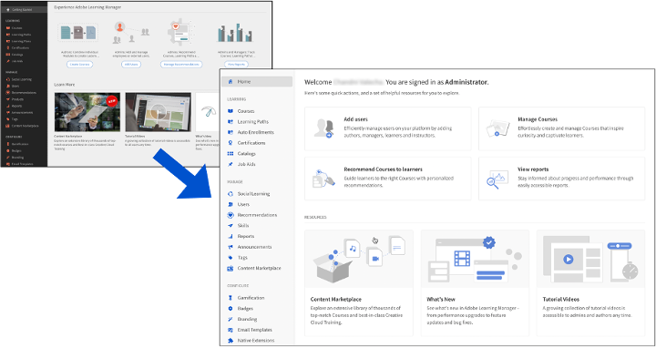

# Novità di questa versione

## Interfaccia utente rinnovata

L’interfaccia utente di Learning Manager di Adobe è stata aggiornata per offrire un’esperienza più moderna e pulita. Le pagine di destinazione per i ruoli Amministratore e Autore sono state rinnovate e sono stati apportati aggiornamenti al tema dell’interfaccia utente per tutti i ruoli. Tuttavia, non è stata apportata alcuna modifica alla posizione di menu, pulsanti o collegamenti e potrai trovarli esattamente nella posizione in cui si trovavano prima.

Gli aggiornamenti del tema verranno applicati automaticamente agli account che utilizzano il tema predefinito. Gli aggiornamenti del tema dell&#39;interfaccia utente non influiranno sugli account che hanno apportato modifiche all&#39;utilizzo di un tema personalizzato. Tali account devono tornare al tema predefinito per ottenere i nuovi aggiornamenti del tema.

### Informazioni su questa modifica

**Quali sono le modifiche apportate in questa versione?**

Nell’intestazione è presente un nuovo modello che ridimensiona automaticamente il logo in base a dimensioni e posizione fisse mantenendo le proporzioni del logo. La modifica mira a migliorare l’aspetto visivo degli Allievi.

Il nome dell’organizzazione nell’intestazione viene ridimensionato automaticamente anche a 336 (minimo) x 680 (massimo) px per gli Allievi.

**Qual è la dimensione consigliata del logo?**

La larghezza massima del logo è di 210 px. I logo con larghezza superiore a 210 px o altezza superiore a 42 px vengono ridimensionati a 42x210 px.

Se le dimensioni del logo sono inferiori a quelle consigliate, il logo viene caricato senza modifiche ed è allineato al centro.

**Qual è l&#39;impatto?**

I nomi di società più lunghi verranno tagliati e un puntino di sospensione riempirà lo spazio.

**Cosa consigliamo?**

* Ridimensionate l&#39;immagine mantenendo intatte le proporzioni. La dimensione massima consigliata per un logo è 42 px (verticale) x 210 px (orizzontale).
* Per molti account, questa opzione viene applicata automaticamente; non è richiesta alcuna modifica.

## Estendibilità nativa

Configura esperienze personalizzate all’interno della versione nativa di Adobe Learning Manager, consentendoti di non utilizzare headless in casi meno complicati. Puoi anche creare app personalizzate e inserirle in vari punti nella versione nativa dei flussi di lavoro di Allievo, Manager, Amministratore, Autore o Istruttore.

Un Allievo può utilizzare un’app personalizzata o un’estensione creata da un Amministratore.

Visualizza [Estendibilità nativa](/help/migrated/administrators/feature-summary/native-extensibility.md) per ulteriori informazioni.

## Strumento per la creazione di quiz

Ora sarai in grado di creare valutazioni in Learning Manager con il nuovo strumento di creazione dei quiz nella pagina Libreria dei contenuti. Le valutazioni create diventano parte della Libreria dei contenuti e possono essere aggiunte a una cartella &quot;pubblica&quot; per consentire il riutilizzo del corso.

Visualizza [Creare un quiz](/help/migrated/authors/feature-summary/content-library.md) per ulteriori informazioni.

## Segnalazione delle modifiche in questa versione

### Modifiche nel report di iscrizione alle risorse formative

Nelle versioni precedenti di Adobe Learning Manager, il report di iscrizione alle risorse formative non disponeva di filtri. Adobe Learning Manager ha scaricato tutti i dati di un account.

In questa versione, è stato aggiunto un menu a discesa nella finestra di dialogo Report risorse formative.

### Modifiche nel report di annuncio delle notifiche

Nelle versioni precedenti di Adobe Learning Manager, il report Annuncio notifica non disponeva di filtri. Adobe Learning Manager ha scaricato tutte le notifiche dell’account.

In questa versione è stato aggiunto un filtro per data, con cui è possibile scaricare le notifiche entro un periodo di tempo specificato.  Tuttavia, puoi scaricare il report solo per gli ultimi sei mesi.

### Modifiche nei dati di rivisita del corso nel report di iscrizione

In questa versione, puoi scaricare le informazioni sulla ripetizione del corso in un report di iscrizione specificando un’ora. Il periodo di download sarà limitato a sei mesi per gli account con più di cinque milioni di iscrizioni. Per tutti gli altri account, il periodo sarà di 15 mesi.

Puoi scaricare il report da **[!UICONTROL Report]** > **[!UICONTROL Report personalizzati]** > **[!UICONTROL Report cronologici]** > **[!UICONTROL Report di accesso al corso]**.

### Modifiche della trascrizione Allievo

Nelle versioni precedenti dell’Adobe di Learning Manager, se un Amministratore personalizzato aveva un ambito Utente, la Trascrizione di apprendimento conteneva gli utenti eliminati. In questa versione, la trascrizione di apprendimento conterrà gli utenti eliminati se l’Amministratore personalizzato ha l’ambito Utente o l’accesso a tutti i gruppi di utenti.

### Modifiche del report di partecipazione

Il report di frequenza sulla pagina di partecipazione dei corsi nell’app per Amministratori e sulla pagina degli Allievi della sessione dell’app per Istruttori veniva scaricato in modo sincrono. In questa versione, il report verrà scaricato in modo asincrono tramite una notifica.

Per ulteriori informazioni sui report, vedere [Report](/help/migrated/administrators/feature-summary/reports.md) nell’Adobe Learning Manager.

## Smantellamento dei Contenuti del marketplace

I corsi scaduti nel catalogo del marketplace dei contenuti importato (corsi di formazione Enterprise) verranno eliminati automaticamente una volta scaduti. I corsi verranno impostati per essere ritirati quando il contenuto è contrassegnato per la disattivazione. Gli Allievi già iscritti possono fruirli entro un periodo di tempo limitato, trascorso il quale verranno eliminati. In questo modo il catalogo non verrà alterato e gli utenti non verranno visualizzati corsi scaduti.

## Nuovi consigli basati sulle competenze

L’Adobe di Learning Manager migliora i consigli per gli account abilitati per i clienti e i partner. Questo miglioramento dell’algoritmo di raccomandazione con la modifica dell’algoritmo di classificazione per corsi, percorsi di apprendimento e certificazioni offre una migliore esperienza utente nell’individuazione dei contenuti.

L’algoritmo non consentirà più raccomandazioni basate su peer. La modifica non interesserà gli utenti esistenti, ma l’opzione Allineato al settore continuerà a esistere. Per l’opzione Personalizzato, l’Adobe Learning Manager non consentirà più la selezione personalizzata basata su peer.

Il gruppo di colleghi diventa ora un account e gli allievi vedranno una stringa che mostra gli argomenti di tendenza nel gruppo. Tutti i consigli sono spiegabili. Ad esempio, se stai visualizzando qualcosa su un soggetto, la scheda sulla striscia mostrerà il motivo del corso.

## Miglioramenti del flusso di lavoro Amministratore personalizzato

Gli amministratori personalizzati avranno ora una maggiore parità con i ruoli di amministratore per quanto riguarda l’accesso ai report. Gli amministratori potranno configurare l’accesso alla reportistica con un migliore controllo.

In un Adobe di Learning Manager, solo le trascrizioni di apprendimento e di gamification sono disponibili per un Amministratore personalizzato. In questa versione, un Amministratore personalizzato può accedere a tutti i report personalizzati, ad eccezione dei report xAPI e e-mail, che sono ancora disponibili solo per l’Amministratore. L’accesso a tutti i report è soggetto al catalogo e all’ambito utente di cui dispone l’amministratore personalizzato. Sono disponibili pochi report solo con ambito completo. Si tratta di:

<table>
    <tbody>
        <tr>
            <td>
    
<b>Report</b>
</td>
   <td>
    
<b>Disponibile</b>
</td>
   <td>
    
<b>Ambito</b>
</td>
        </tr>
    <tr>
   <td>
    
Prova di verifica del contenuto
</td>
   <td>
    
Sì
</td>
   <td>
    
Catalogo completo
</td>
  </tr>
  <tr>
   <td>
    
Prova di verifica dell’utente
</td>
   <td>
    
Sì
</td>
   <td>
    
Utente completo
</td>
  </tr>
  <tr>
   <td>
    
Accesso
</td>
   <td>
    
Sì
</td>
   <td>
    
Utente completo
</td>
  </tr>
    </tbody>
</table>

**Nuovi controlli di sola lettura**

Nella pagina Ruoli personalizzati, sono state aggiunte le seguenti opzioni di Sola lettura per consentire agli amministratori di fornire opzioni più flessibili all’Amministratore personalizzato: L’Amministratore personalizzato avrà ora un’autorizzazione aggiuntiva di Sola lettura per Utenti, Modelli e-mail e Piani di apprendimento.

**Utenti**:

Se selezioni Sola lettura, l’Amministratore personalizzato potrà visualizzare tutti gli utenti, ma non potrà modificare i dati degli utenti e creare un portale di registrazione autonoma per gli utenti.

**Piani di apprendimento**:

Se selezioni Sola lettura, un Amministratore personalizzato non può aggiungere o modificare un piano di apprendimento. Possono scaricare un report del piano di apprendimento e visualizzarne i dettagli. Ma non possono modificare i dettagli del corso.

>[!NOTE]
>
>I piani di apprendimento saranno aggiuntivi di sola lettura con controllo completo.

**Modelli e-mail**

Se selezioni Sola lettura, un amministratore personalizzato può visualizzare i modelli e-mail. Non possono abilitare o disabilitare le impostazioni dei modelli e-mail, ma possono scaricare i report di accesso alle e-mail.

### Trascrizioni Allievi

Se è selezionata l’opzione Autorizzazione utente o Tutto il gruppo di utenti e l’Amministratore personalizzato tenta di scaricare le Trascrizioni allievi, l’opzione Includi allievi eliminati restituirà nel report tutti gli allievi eliminati.

### Report

Un Amministratore personalizzato può accedere ai seguenti report in base all’ambito definito:

| Report | Disponibile | Ambito |
|--- |--- |
| Prova di verifica del contenuto | Sì | Catalogo completo |
| Prova di verifica dell’utente | Sì | Utente completo |
| Accesso | Sì | Utente completo |

## Integrazione avanzata di Connect

Gli istruttori possono personalizzare la propria esperienza di sessione selezionando le stanze specifiche per loro. In questa versione, sono stati apportati i seguenti miglioramenti:

### Importa trascrizioni

Potrai importare le trascrizioni di sessione da Connect e analizzare le trascrizioni. Gli Allievi riceveranno la trascrizione dopo la registrazione, che potranno scaricare in un secondo momento.

### Modificare i video

Gli istruttori possono modificare il video e migliorare l’esperienza di visualizzazione degli Allievi. Gli istruttori vedranno un collegamento nella pagina della panoramica della sessione per passare alla pagina di accesso di Adobe Connect. Dopo l’accesso, l’istruttore vedrà il collegamento per la registrazione. Facendo clic sul collegamento, vengono reindirizzati al video che possono tagliare.

## Limitazione dei report del dashboard agli utenti con ruolo di Manager

Gli amministratori possono cercare solo i manager nei report del dashboard.

## Limita elaborazione report dashboard legacy

Quando un Amministratore tenta di tracciare un report del dashboard e il tracciamento del report richiede troppo tempo (più di 2,5 min), in un Adobe di Learning Manager viene visualizzato il seguente messaggio:

*Messaggio di errore quando il report richiede troppo tempo*

I report di tale entità non possono essere visualizzati nell’interfaccia utente, ma l’amministratore può scaricarli.

## Supporto per la migrazione di etichette del catalogo

Il flusso di lavoro di migrazione ora supporta le etichette dei cataloghi. I file CSV di migrazione possono essere utilizzati per importare le chiavi delle etichette dei cataloghi e i valori delle etichette dei cataloghi e associarli a corsi, percorsi di apprendimento, certificazioni e risorse formative. Il flusso di lavoro può anche essere utilizzato per eliminare valori e chiavi errati, se necessario.

## Miglioramenti delle API per un filtraggio complesso dei corsi

Sarà ora possibile filtrare in modo avanzato i corsi per tag e etichette del catalogo (utilizzando una combinazione di condizioni &quot;AND&quot; e &quot;OR&quot;) tramite le API di Learning Manager.

## Modifiche API in questa versione

### Convalida nell’API dei processi

In questa versione, se il report Risorsa formativa supera i 10 milioni generati utilizzando l’API del processo, la risposta conterrà il messaggio: &quot;Nel report richiesto sono presenti troppi dati da generare, provare ad applicare i filtri della risorsa formativa!&quot;.

### Notifica per un post eliminato

Adobe Nelle versioni precedenti di Learning Manager, se un corso, una certificazione o un piano di apprendimento viene eliminato e viene visualizzata una notifica, puoi comunque accedere al corso, alla certificazione o al piano di apprendimento visitando la notifica.

In questa versione, ci assicureremo che un post eliminato non sia più accessibile. Se si specifica l&#39;ID in /posts/{id} e l’ID del post non è più disponibile, viene visualizzato il messaggio &quot;Post non trovato per la risorsa specificata&quot;.

### Scadenza per il completamento delle API degli Allievi

Nelle versioni precedenti, l’Adobe Learning Manager ha recuperato la scadenza dalla tabella di iscrizione. In questa versione, un Adobe di Learning Manager calcolerà la scadenza dalla tabella delle istanze del corso. Se la scadenza non è disponibile, verrà ripristinata la tabella di iscrizione.

### Flag Sostituisci

Nella versione di novembre 2023 di Adobe Learning Manager, stiamo interrompendo la sostituzione del flag dalle API. Il flag di esclusione non fa parte della specifica API pubblica ed è destinato al test back-end. Il flag per le API degli Allievi ora non è più disponibile. Tuttavia, il flag è ancora valido per le API degli amministratori.

Il motivo per cui il flag per le API degli Allievi viene rimosso è perché il flag di esclusione recuperava una grande quantità di dati tramite le API degli Allievi.

In futuro, la seguente API Allievo non funzionerà più perché ha il flag di esclusione.

`https://captivateprime.adobe.com/primeapi/v2/users?page[offset]=0&page[limit]=10&sort=id&override=TRUE`

### Evidenzia risultati

Nella prossima versione di Adobe di Learning Manager, ad esempio, nell’API /search, l’impostazione predefinita per highlightResults viene modificata in false.

Inoltre, modificheremo l’impostazione predefinita di snippetTypes in courseName. In questo modo i nomi dei corsi verranno evidenziati nella ricerca solo se highlightResults è True.

### Nuovo tipo di risorsa per il quiz

La `instances.loResources.resources` l&#39;endpoint restituirà `ResourceContentType` con quiz.

## Avviso di deprecato

Il 30 novembre 2023, LinkedIn GET Learning annullerà l’utilizzo del metodo HTTP per ottenere un token OAuth. Dopo la rimozione, sarai in grado di generare un token OAuth solo utilizzando il metodo HTTP POST.
Adobe Learning Manager sospenderà BlueJeans a febbraio 2024. Tutti i nuovi account dopo febbraio 2024 non includeranno il connettore BlueJeans.

## Note sulla versione

Per informazioni sulle versioni correnti e precedenti dell’app Web e per dispositivi di Learning Manager, consulta la [Note sulla versione](release-note/release-notes.md).

## Bug corretti in questa versione

* La miniatura di un corso, prerequisito per un percorso di apprendimento o un altro corso, non viene visualizzata quando un Allievo apre la pagina di anteprima del percorso di apprendimento o del corso.
* Se le opzioni Calendario, Gamification e Apprendimento sociale non sono selezionate, l’impostazione della Dashboard Allievo non mantiene l’impostazione successiva. Le opzioni come Consigliato nelle tue aree di interesse e Sfoglia per catalogo non vengono visualizzate come selezionate, ma vengono visualizzate nell&#39;anteprima.
* Anche dopo che un Allievo ha completato un corso VC, riceve un promemoria via e-mail per completare il corso.
* Per gli account condivisi tra pari, non è possibile scaricare i report del dashboard.
* L’eliminazione e l’aggiunta di un modulo di un elenco di controllo in un corso genera un errore interno.
* Nel caso dei modelli di invito alla sessione, l’ID e-mail del mittente contiene il testo captivatePrime invece di AdobeLearning Manager.
* Quando utilizzi l’efficacia del corso come asse Y secondario, il download del report non riesce con un’eccezione Puntatore Null.
* Se a un Allievo viene assegnato un ruolo di Amministratore personalizzato, per impostazione predefinita passa al profilo di Amministratore personalizzato. Tuttavia, quando nell’account è impostato un URL di reindirizzamento per gli Allievi, l’Amministratore personalizzato viene indirizzato a una destinazione diversa e non al profilo Ruolo amministratore personalizzato.
* L’ambito di gamification non funziona come previsto se disabled_sub_groups è impostato su un numero elevato.
* In alcuni casi, gli utenti eliminati attivano una migrazione.
* Un Allievo non può riprodurre i corsi LinkedIn nell’app MS Teams.
* L’API di iscrizione non restituisce le iscrizioni a un piano di apprendimento Flex o a un piano di apprendimento incorporato come previsto.
* Nell’app mobile, i nomi di un corso, una certificazione o un piano di apprendimento vengono visualizzati in minuscolo.
* Adobe Nelle versioni precedenti di Learning Manager, se un corso, una certificazione o un piano di apprendimento viene eliminato e viene visualizzata una notifica, puoi comunque accedere al corso, alla certificazione o al piano di apprendimento visitando la notifica. In questa versione, ci assicureremo che un post eliminato non sia più accessibile. Se si specifica l&#39;ID in /posts/{id} e l’ID del post non è più disponibile, viene visualizzato il messaggio &quot;Post non trovato per la risorsa specificata&quot;.
* Nell’API dell’Allievo, il campo della scadenza di completamento non viene visualizzato nella risposta dell’API di iscrizione.
* Nell’API per la richiesta di iscrizione degli Allievi, i dettagli dell’iscrizione vengono visualizzati anche dopo aver specificato un ID istanza errato.

## Problemi noti in questa versione

* Una nuova iscrizione o l’aggiornamento di un’iscrizione non riesce quando un piano di apprendimento Flex si trova all’interno di un altro piano di apprendimento Flex.
* L’URL della trascrizione non visualizza le registrazioni della sessione nelle sessioni di Adobe Connect.
* Un Allievo può svolgere un quiz offline nell’app per dispositivi mobili anche in caso di esito negativo.

## Requisiti di sistema

[Requisiti di sistema di Learning Manager](system-requirements.md)

## Versioni precedenti di Adobe Learning Manager

* [Versione di luglio 2023](whats-new-2023-july.md)
* [Versione di aprile 2023](whats-new-2023-april.md)
* [Versione di novembre 2022](whats-new-2022-november.md)
