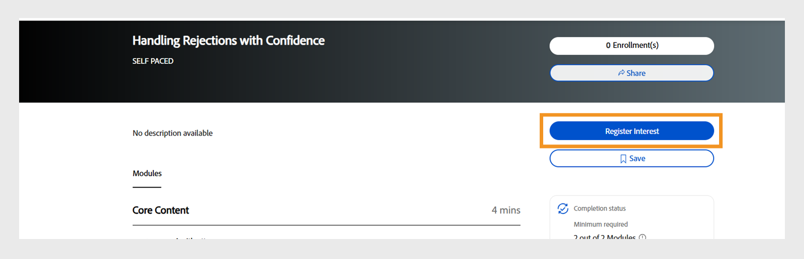

# Novità della versione di ottobre 2025 di Adobe Learning Manager

La versione di ottobre 2025 di Adobe Learning Manager introduce miglioramenti significativi progettati per migliorare la precisione dei report, espandere le funzionalità di integrazione e migliorare l’esperienza di apprendimento per Amministratori, Autori e Allievi.

* Experience Builder: progetta portali di apprendimento basati su ruoli e con marchio completo, personalizzati in base alle esigenze dell’organizzazione. Crea portali di apprendimento con marchio, basati sui ruoli con widget, menu e pagine.
* Tag social nelle bacheche di apprendimento: gli Allievi possono ora assegnare tag ai colleghi utilizzando @username in post e commenti, consentendo una collaborazione e notifiche mirate all’interno delle community di apprendimento sociale.
* Autorizzazioni di annuncio con ambito: gli amministratori personalizzati possono creare annunci limitati ai gruppi di utenti o ai cataloghi assegnati, garantendo una comunicazione mirata e riducendo il sovraccarico di informazioni.
* Monitoraggio dell’avanzamento basato sulla lingua: l’avanzamento dell’Allievo viene ora salvato in modo indipendente per ciascuna lingua, consentendo di passare da una lingua all’altra senza perdere l’avanzamento.
* Gestione incrementale dei ruoli personalizzati: gli amministratori possono ora gestire i ruoli personalizzati in modo più efficiente con il supporto per le importazioni incrementali e multi-incrementali in Adobe Learning Manager.
* API migliorate per l’analisi e la migrazione: le API nuove e migliorate offrono un migliore tracciamento delle prestazioni dei quiz, il monitoraggio dello stato della migrazione e il supporto per l’assegnazione di tag agli utenti nell’apprendimento sociale.

## Experience Builder

>[!IMPORTANT]
>
>Siamo lieti di annunciare che Experience Builder, lo strumento innovativo per la creazione di portali di apprendimento personalizzabili, sarà disponibile a partire dalla versione di ottobre 2025 di Adobe Learning Manager.
>
>Continua a seguirci per ricevere informazioni aggiornate in vista della data di rilascio. Ti aspettiamo per scoprire come utilizzare Experience Builder per trasformare i tuoi portali di apprendimento.
>
>Per qualsiasi domanda o informazione aggiuntiva, contatta il tuo Customer Success Manager.

Experience Builder è uno strumento senza codice o a basso codice in Adobe Learning Manager che consente di creare portali di apprendimento personalizzati. Consente di progettare portali di apprendimento di marca e intuitivi senza dover possedere competenze tecniche o conoscenze approfondite in materia di codifica.
Con Experience Builder, gli Amministratori possono creare facilmente pagine, menu e widget per offrire esperienze di apprendimento personalizzate per il proprio pubblico.

Prima di Experience Builder, le organizzazioni si trovavano ad affrontare diverse sfide:

1. **Personalizzazione limitata**: i portali hanno corretto i progetti con poche opzioni per riflettere il tuo marchio. Gli amministratori potevano solo apportare modifiche di base, ad esempio modificare intestazioni, piè di pagina o colori, che limitavano la possibilità di creare esperienze uniche.
2. **Costo**: la creazione di portali personalizzati ha richiesto sviluppatori costosi e tempi lunghi, il cui completamento richiede spesso dai 6 ai 9 mesi. Questo approccio ha aumentato il costo totale di proprietà e ritardato l&#39;installazione.
3. **Esperienze generiche**: tutti hanno visto lo stesso contenuto, anche se non pertinente al loro ruolo o alle loro esigenze. Questa mancanza di personalizzazione ha ridotto il coinvolgimento e la soddisfazione degli Allievi.
4. **Barriere tecniche**: gli amministratori non tecnici hanno avuto difficoltà a creare o aggiornare i portali perché necessitavano di conoscenze sulla codifica o supporto esterno.

Experience Builder risolve questi problemi fornendo una soluzione semplice, senza codice/a basso codice per la creazione di portali personalizzati con marchio.

Consente agli amministratori di progettare portali che soddisfino le esigenze della propria organizzazione senza affidarsi a competenze tecniche o sviluppatori esterni.

**Casi di utilizzo**

* **Portali con marchio**: crea un portale che corrisponda al sito Web della tua azienda con loghi, colori e layout. Ad esempio, un&#39;azienda del settore sanitario può progettare un portale che rifletta il proprio marchio aziendale e fornisca al contempo contenuti didattici.
* **Apprendimento basato sui ruoli**: crea pagine personalizzate per ruoli specifici. I team di vendita possono visualizzare i corsi di formazione sui prodotti, mentre i tecnici accedono ai corsi tecnici.
* **Formazione sul prodotto**: configura pagine dedicate per diversi prodotti, ad esempio Photoshop o Illustrator, con widget che visualizzano corsi, certificazioni e risorse correlate.

Per ulteriori informazioni sulla creazione di pagine personalizzate mediante widget, consulta [Experience Builder](/help/migrated/administrators/feature-summary/experience-builder/overview.md).

## Stato di avanzamento dell’Allievo basato sulla lingua

Attualmente, Adobe Learning Manager tiene traccia dell’avanzamento dell’Allievo solo per la lingua locale selezionata, causando una perdita significativa di avanzamento quando si cambia lingua/lingua nel lettore. Questa limitazione può comportare una scarsa esperienza utente, poiché gli Allievi potrebbero perdere i progressi quando accedono a contenuti in lingue diverse. L’avanzamento di ciascun modulo nel lettore viene monitorato a livello utente e di modulo. Ciò porta a una situazione in cui l&#39;avanzamento di un utente viene sovrascritto quando torna a una lingua utilizzata in precedenza per lo stesso modulo.

Ad esempio, se un Allievo ottiene il 75% di avanzamento nella lingua A (inglese) e poi passa alla lingua B (spagnolo), quando ritorna alla lingua A, il suo avanzamento viene ripristinato allo 0% anziché riprendere dal 75%.

Per risolvere queste limitazioni, la funzione è stata migliorata per supportare il tracciamento dell’avanzamento specifico per le impostazioni internazionali:

* **Archiviazione specifica per le impostazioni internazionali**: quando un Allievo cambia le impostazioni internazionali (ad esempio, da Impostazioni internazionali A a Impostazioni internazionali B) all’interno del lettore, Adobe Learning Manager ora salva lo stato di avanzamento separatamente per ciascuna impostazione internazionale del contenuto.
* **Ripresa dell&#39;avanzamento**: quando l&#39;utente torna a una lingua utilizzata in precedenza (dalla lingua B alla lingua A), il contenuto riprende da dove si era interrotto nella lingua specifica.
* **Monitoraggio indipendente dell’avanzamento**: ogni lingua mantiene il proprio stato di avanzamento, consentendo agli Allievi di esplorare i contenuti in più lingue senza perdere l’avanzamento individuale in ciascuna lingua.

I seguenti tipi di contenuto non sono supportati per l’avanzamento dell’Allievo in base alla lingua:

* Il contenuto video e audio non è supportato.
* I contenuti di terze parti, inclusi Go1, LinkedIn Learning, getAbstract e Harvard ManageMentor, non sono supportati.
* Per i contenuti che non inviano dati a Learning Record Store (LRS) non verrà registrato né salvato l’avanzamento.
* Gli utenti dell’app per dispositivi mobili non possono tenere traccia dell’avanzamento di questa funzione durante la modalità offline.

Visualizza [Il mio apprendimento](/help/migrated/learners/feature-summary/courses.md#language-based-progress-management) per ulteriori informazioni sull’avanzamento dell’Allievo basato sulla lingua.

## Supporto incrementale e multi-incrementale per ruoli personalizzati

Adobe Learning Manager ora supporta le importazioni incrementali e a più incrementi per l&#39;assegnazione di ruoli e ruoli personalizzati. Con le importazioni incrementali, gli amministratori possono caricare solo i record nuovi, aggiornati o eliminati degli utenti invece di ricaricare l’intero file CSV.

Le importazioni con più incrementi estendono questa funzionalità consentendo alle grandi organizzazioni di dividere i file incrementali per area geografica o reparto (ad esempio, Stati Uniti, UE, APAC) ed elaborarli in parallelo. Adobe Learning Manager supporta inoltre fino a 20 CSV utente incrementali e i relativi ruoli personalizzati, rendendoli scalabili per operazioni di grandi dimensioni.

Gli amministratori ora possono caricare i file dei ruoli e dei ruoli utente (role.csv e user_role.csv) in modo incrementale, insieme ai file utente (user.csv), anziché eseguire sempre caricamenti completi. Ogni importazione utente (user1.csv) è collegata ai propri file di ruolo e mapping dei ruoli (user1_role.csv, user1_user_role.csv), memorizzati in cartelle FTP separate.

Ai seguenti file CSV sono state aggiunte tre colonne aggiuntive:

* Stato registrazione utente (user.csv): indica lo stato di registrazione corrente dell&#39;utente nel sistema (ad esempio, attivo, inattivo o eliminato).
* Stato ruolo (role.csv): indica se un ruolo personalizzato è attualmente attivo o inattivo nell&#39;account.
* Stato ruolo utente (user_role.csv): definisce lo stato del mapping tra un utente e un ruolo, indicando se l&#39;assegnazione è attiva o è stata rimossa.

Adobe Learning Manager ora acquisisce le azioni di aggiunta, aggiornamento ed eliminazione nei report di audit utente e nei report dei ruoli personalizzati, fornendo agli amministratori una migliore visibilità delle modifiche.

>[!NOTE]
>
>Queste modifiche sono applicabili solo agli account che utilizzano utenti incrementali.

Per ulteriori informazioni sul supporto incrementale e multi-incrementale per i ruoli personalizzati, vedere [Supporto incrementale e multi-incrementale](/help/migrated/integration-admin/feature-summary/configure-role-csv-files.md#incremental-and-multi-incremental-support-for-custom-roles).

## Miglioramenti dell&#39;integrazione Go1

L’integrazione Go1 è stata migliorata per consentire la cura diretta dei corsi Go1 per la creazione di programmi di apprendimento (LP) in Adobe Learning Manager. Questo aggiornamento supporta l’inclusione di corsi Go1 nelle certificazioni ricorrenti e introduce una nuova versione dell’esperienza Hub dei contenuti Go1, consentendo una cura più efficiente dei corsi.

* Crea e gestisci le playlist direttamente in Go1 utilizzando l’assistenza chat basata su IA o la selezione manuale.
* Includi i corsi Go1 nei cicli di certificazione ricorrenti con ripristino automatico dell’avanzamento. Per ulteriori informazioni sulla creazione di certificati, vedere [Certificazioni](/help/migrated/administrators/feature-summary/certifications.md).
* Interfaccia di rilevamento dei contenuti aggiornata per una migliore navigazione e cura dei contenuti.

**Note importanti**

* Tutte le funzionalità Go1 richiedono una licenza Go1 attiva.
* I contenuti gratuiti precedenti di Go1 verranno smantellati. Le organizzazioni devono visualizzare in anteprima e acquistare i bundle di contenuti richiesti.
* Gli Amministratori e gli Autori possono creare e gestire sequenze di riproduzione; gli Allievi possono accedere solo per visualizzarle.

Per ulteriori informazioni sull&#39;aggiunta di corsi Go1 al percorso di apprendimento, consulta [Corsi Go1 al percorso di apprendimento](/help/migrated/administrators/feature-summary/content-marketplace/curate-go1-playlist.md).

## Supporto per URL vimeo nel modulo di attività

Il modulo Attività ora supporta l’incorporamento degli URL Vimeo, in modo simile agli incorporamenti di YouTube. Questo miglioramento consente agli amministratori di aggiungere collegamenti video Vimeo direttamente nel modulo di attività. Quando gli Autori creano un corso e aggiungono un modulo di attività, ora vedono un’opzione per includere un URL Vimeo. In modo simile a come vengono aggiunti i collegamenti YouTube, gli Autori possono incollare un collegamento Vimeo direttamente nella configurazione del modulo. Una volta pubblicato, gli Allievi possono riprodurre il video Vimeo direttamente nell’app senza essere reindirizzati all’esterno della piattaforma.

Visualizza [Aggiungi moduli](/help/migrated/authors/feature-summary/courses.md#add-modules) per ulteriori informazioni sull&#39;aggiunta di moduli ai corsi.

## Informazioni sul fuso orario per i moduli CR/VC

I dettagli del fuso orario vengono ora visualizzati per i moduli Aula (CR) e Aula virtuale (VC) nella pagina Panoramica corso, Istanza, Anteprima Allievo e nel widget Calendario. Gli Allievi e gli Amministratori possono visualizzare chiaramente il fuso orario associato alle sessioni pianificate nelle pagine chiave e negli inviti del calendario. Gli Allievi possono pianificare e partecipare alle sessioni in modo più efficiente, senza fraintendimenti relativi al fuso orario. Questo miglioramento è disponibile solo nell’app per Allievi immersivi.

Gli Allievi possono confermare l’ora della sessione nel fuso orario corretto in aree geografiche diverse. La visualizzazione del fuso orario aiuta a prevenire le sessioni saltate e garantisce una pianificazione accurata del calendario.

## Compilazione automatica del nome dell’Autore durante la creazione di un corso

Durante la creazione del corso, il campo **[!UICONTROL Autore/i]** viene ora compilato automaticamente con il nome degli Autori che stanno creando il corso. Gli autori non devono più immettere manualmente i propri nomi. È comunque possibile aggiungere o aggiornare altri autori in base alle esigenze.

Per le organizzazioni con regole rigorose sulla proprietà dei contenuti, la compilazione automatica garantisce che gli Autori vengano sempre assegnati correttamente. Quando modifichi un corso esistente, gli Autori possono aggiornare o aggiungere coautori senza perdere la voce a compilazione automatica.

Per ulteriori informazioni sulla creazione di un corso, vedere [Creazione di un corso](/help/migrated/authors/feature-summary/courses.md#create-a-course---advanced-workflow).

## Cercare profili esterni durante la modifica del profilo

In precedenza, gli Amministratori scorrevano l’intero elenco di profili esterni e selezionavano manualmente il profilo desiderato quando riassegnavano gli Allievi. Ciò ha reso il processo dispendioso in termini di tempo, in particolare per gli account con molti profili. Con questo miglioramento, gli amministratori e gli amministratori personalizzati possono ora cercare profili esterni direttamente nella scheda durante il flusso di lavoro di modifica del profilo.

**Casi di utilizzo**

* Negli account con centinaia di profili esterni (ad esempio, sedi in franchising, società partner o gruppi regionali), gli amministratori possono ora individuare immediatamente il profilo esatto utilizzando la ricerca, riducendo gli errori e risparmiando tempo.
* Durante i cambiamenti organizzativi, come fusioni o riallineamenti di reparto, potrebbe essere necessario spostare gli Allievi in blocco in nuovi profili esterni. La riassegnazione basata sulla ricerca rende questa attività più fluida e precisa.

Per ulteriori informazioni sulla modifica del profilo, vedere [Modificare il profilo esterno](/help/migrated/administrators/feature-summary/add-users-user-groups.md#change-profile).

## Aggiunta di un coorganizzatore per le sessioni di Microsoft Teams

In precedenza, gli Autori potevano assegnare un solo organizzatore alle sessioni di Microsoft Teams. Con questo miglioramento, gli Amministratori possono ora aggiungere coorganizzatori a una sessione. Nelle sessioni di Microsoft Teams è stato introdotto un nuovo campo, **[!UICONTROL Co-Organizer]**, che consente agli Autori di assegnare altri organizzatori insieme all’organizzatore principale.

Gli autori possono assegnare più coorganizzatori per ogni sessione di Microsoft Teams. I co-organizzatori hanno gli stessi diritti di accesso e le stesse autorizzazioni dell’organizzatore principale. Gli autori possono aggiungere fino a 10 organizzatori per sessione, per una maggiore flessibilità e una migliore gestione delle sessioni.

**Caso di utilizzo**

Durante sessioni su larga scala con molti Allievi, i Co-organizzatori possono gestire la partecipazione, moderare le discussioni e monitorare le chat, mentre l’Organizzatore principale si concentra sulla fornitura dei corsi di formazione.

Per ulteriori informazioni sull’aggiunta di sessioni aula/aula virtuale ai corsi, consulta l’articolo [Aggiungere moduli](/help/migrated/authors/feature-summary/courses.md#add-modules).

## Scarica il report degli Allievi interessati

Quando un Amministratore ritira tutte le istanze del corso (ad esempio, alla fine del ciclo di vita del corso), il pulsante **[!UICONTROL Iscrizione]** nella pagina **[!UICONTROL Panoramica del corso]** viene sostituito con un&#39;opzione [!UICONTROL Registra interesse]. Gli allievi possono selezionare questa opzione per esprimere il loro interesse a seguire il corso. Gli Amministratori ora possono visualizzare ed esportare un elenco di Allievi che hanno registrato un interesse in un corso.

Gli amministratori possono quindi accedere a questo elenco e scaricarlo come report. Un pulsante **[!UICONTROL Allievi interessati]** è stato aggiunto alla pagina del corso quando non sono disponibili istanze attive. Visualizza il nome dell’Allievo e la data in cui ha registrato un interesse nell’interfaccia utente dell’Amministratore.

Gli Amministratori possono selezionare **[!UICONTROL Azioni]**, quindi selezionare **[!UICONTROL Esporta report]** per esportare il **[!UICONTROL report Allievi interessati]**.


_Sezione della panoramica del corso in cui gli Allievi possono visualizzare l’opzione Registra interesse_

Visualizza [Scarica l’Allievo interessato](/help/migrated/administrators/feature-summary/courses.md#download-the-interested-learner-report) per ulteriori informazioni.

## Ripristinare i consigli nell’app Salesforce

In precedenza, gli Allievi che utilizzavano l’app Adobe Learning Manager Salesforce potevano selezionare i ruoli e le preferenze dei consigli solo una volta. Se il loro ruolo cambiava, dovevano passare all&#39;app nativa Adobe Learning Manager per aggiornare il loro profilo e ricevere consigli rilevanti per il corso. Con i miglioramenti più recenti, gli Allievi possono ora reimpostare rapidamente le preferenze direttamente all’interno dell’app Salesforce ogni volta che cambiano ruolo, team o responsabilità.

Questo processo semplificato garantisce che continuino a ricevere raccomandazioni aggiornate e pertinenti sul corso senza uscire da Salesforce. Gli amministratori traggono vantaggio da tassi di completamento dell’apprendimento più elevati e da un migliore allineamento tra i ruoli utente e i contenuti consigliati, senza fornire supporto o indicazioni aggiuntivi sulle piattaforme di passaggio.

Adobe Learning Manager ora dispone di un pulsante **[!UICONTROL Ripristina interessi]** nell’app Salesforce. Gli Allievi possono ora ripristinare i ruoli e le preferenze di apprendimento senza dover lasciare Salesforce o accedere all’app nativa Adobe Learning Manager.

Per ulteriori informazioni sui consigli di reimpostazione nell’app Salesforce[, consulta &#x200B;](/help/migrated/learners/feature-summary/sfdc-app.md#reset-recommendations-in-salesforce-app)Consigli per la reimpostazione.

## Miglioramento del widget Calendario

Gli Allievi possono ora visualizzare sia le sessioni passate che quelle future nel widget Calendario. Possono spostarsi nel calendario a qualsiasi data e controllare i dettagli della sessione. Ciò significa che possono rivedere le sessioni che si sono già svolte, aiutandoli a tenere traccia di ciò che non hanno visto o a cui hanno partecipato. Possono inoltre visualizzare tutte le sessioni per i prossimi 24 mesi, incluso il mese corrente, semplificando la pianificazione in anticipo e la gestione delle pianificazioni.

Visualizzare [Calendario](/help/migrated/learners/feature-summary/learner-home-page.md#calendar) per ulteriori informazioni sul widget Calendario.

## Applicare tag agli utenti nelle bacheche social

Le bacheche social ora supportano la funzionalità di assegnazione di tag agli utenti, consentendo discussioni più mirate e una migliore collaborazione all&#39;interno delle community di apprendimento. Agli Allievi possono essere aggiunti tag nei post e nei commenti di Apprendimento sociale tramite l’app per Allievi, le API e il sito di riferimento di Adobe Learning Manager.

Non è possibile assegnare tag agli utenti esterni all’ambito della bacheca, impedendo notifiche indesiderate. Se un utente con tag viene eliminato dal sistema, la sua menzione viene visualizzata come &quot;anonimo&quot;. L’assegnazione di tag a gruppi di utenti o &quot;@all&quot; non è consentita per impedire la posta indesiderata delle notifiche.

* **@username dei tag**: gli utenti possono assegnare tag ad altri membri della bacheca utilizzando il formato &quot;@username&quot;.
* **Tag con ambito limitato**: solo gli utenti con accesso alla bacheca specifica possono essere contrassegnati, garantendo la privacy e la pertinenza.
* **Notifiche multicanale**: gli utenti con tag ricevono notifiche in-app e e-mail con collegamenti diretti a post o commenti pertinenti.

**Casi di utilizzo**

* Professionisti del settore sanitario in cerca di informazioni da colleghi specifici su casi medici: l&#39;assegnazione di tag consente ai medici e agli infermieri di notificare rapidamente gli specialisti giusti, garantendo consigli tempestivi e accurati sui casi complessi dei pazienti.
* Consultazione di esperti in materia su temi specifici: con l&#39;assegnazione di tag agli esperti, i team possono coinvolgere direttamente le persone giuste, riducendo i tempi di risposta e migliorando il processo decisionale per questioni tecniche o di nicchia.
* Discussioni di gruppo che richiedono il contributo di parti interessate specifiche: l’assegnazione di tag alle parti interessate assicura che i responsabili delle decisioni pertinenti siano a conoscenza degli aggiornamenti e possano fornire il loro contributo, mantenendo i progetti sulla buona strada e in linea con gli obiettivi aziendali.

Per ulteriori informazioni sull&#39;assegnazione di tag agli utenti nelle bacheche social, consulta [Tag degli utenti nelle bacheche social](/help/migrated/learners/feature-summary/social-learning-web-user.md#tag-users-in-social-board-posts).

## Autorizzazioni di annuncio con ambito per amministratori personalizzati

Gli amministratori personalizzati possono ora creare annunci, ma solo per i gruppi di utenti o i cataloghi assegnati. In questo modo si evita la comunicazione involontaria oltre i confini dell’organizzazione. Gli amministratori personalizzati possono creare annunci solo per gli utenti all’interno dell’ambito assegnato. È possibile definire l’ambito degli annunci per specifici gruppi di utenti o cataloghi. Gli amministratori completi mantengono la visibilità e il controllo di tutti gli annunci, inclusi quelli creati da amministratori personalizzati con ambito.

**Vantaggi principali**

* Una comunicazione mirata per garantire che gli annunci raggiungano solo il pubblico di riferimento.
* È stato ridotto il sovraccarico di informazioni impedendo alle notifiche irrilevanti di raggiungere utenti indesiderati.
* Mantiene i confini dell&#39;organizzazione e impedisce la comunicazione incrociata accidentale.

**Note importanti**

* Se l’ambito di un amministratore personalizzato cambia, gli annunci interessati visualizzano un’icona di avviso e richiedono la reimpostazione dei singoli ambiti.
* Ogni annuncio deve essere aggiornato singolarmente quando si verificano modifiche dell’ambito.
* Nel report [Annuncio notifica](/help/migrated/administrators/feature-summary/announcements.md) vengono visualizzati solo gli Allievi nell&#39;ambito assegnato dall&#39;Amministratore personalizzato.

**Casi di utilizzo**

* Organizzazioni di affiliazione in cui i manager regionali devono comunicare solo con i loro affiliati.
* Grandi organizzazioni con amministratori regionali o di reparto che hanno come obiettivo gli annunci ai propri team.

Visualizza [Crea annuncio per l&#39;ambito assegnato](/help/migrated/administrators/feature-summary/announcements.md#create-announcement-for-the-assigned-scope) per ulteriori informazioni sulla creazione dell&#39;annuncio per l&#39;ambito assegnato.

## Selezionare un ruolo personalizzato durante la pubblicazione di un contenuto da Adobe Captivate

Quando un utente pubblica contenuti da Adobe Captivate a Adobe Learning Manager, se ha più ruoli personalizzati, gli verrà chiesto di selezionare il ruolo personalizzato specifico con cui deve essere pubblicato il corso. In questo modo, al corso pubblicato verranno applicate le autorizzazioni e la proprietà corrette dei ruoli.

Per ulteriori informazioni sulla creazione di ruoli personalizzati per gli utenti, vedere [Ruolo personalizzato](/help/migrated/administrators/feature-summary/custom-role.md).

## Miglioramenti del widget Salvato da me

In precedenza, selezionando la striscia **[!UICONTROL Salvato da me]** venivano visualizzati tutti i corsi disponibili nel catalogo. Ora gli Allievi visualizzano solo i corsi contrassegnati nella striscia **[!UICONTROL Salvato da me]** nella pagina principale dell’Allievo. Selezionando questa striscia, gli allievi vengono indirizzati alla pagina del catalogo, in cui vengono visualizzati solo i corsi salvati.

All’interno del catalogo, gli Allievi possono applicare filtri aggiuntivi per affinare la ricerca. Quando viene applicato un filtro, vengono visualizzati solo i corsi che soddisfano i criteri selezionati. I corsi contrassegnati in precedenza vengono visualizzati solo se corrispondono al filtro applicato.

AEM Per ulteriori informazioni sul widget dei corsi salvati nei siti AEM, vedere [Configurare i widget dei corsi salvati](/help/migrated/integrate-aem-learning-manager.md#configure-my-saved-courses-widgets-in-aem-sites).

## Supporto per visualizzare i nomi degli Autori nei corsi condivisi

In precedenza, quando un corso veniva condiviso con un [account condiviso tra pari](/help/migrated/administrators/feature-summary/peer-account.md), l’Autore veniva visualizzato come Autore esterno. Ora i corsi visualizzano il nome dell’Autore, che sia un utente interno dell’account principale o un Autore legacy (ad esempio, qualsiasi nome immesso come stringa nel campo Autori durante la creazione del corso). Selezionando un Autore viene visualizzato il numero di corsi condivisi con l’account condiviso tra pari; tuttavia, questi Autori non sono utenti effettivi nell’account condiviso tra pari.

Se un utente viene eliminato dall’account principale, i suoi dati vengono rimossi da lì, ma le informazioni dell’Autore rimangono in tutti gli account condivisi tra pari in cui i loro contenuti sono stati condivisi.

>[!NOTE]
>
>Questa è una funzione basata su flag. Per attivare questa opzione, contatta il nostro team di assistenza clienti all&#39;indirizzo [learningmanagersupport@adobe.com](mailto:learningmanagersupport@adobe.com).

Per ulteriori informazioni sulla condivisione dei contenuti nell&#39;account condiviso tra pari, visualizza [Account condiviso tra pari](/help/migrated/administrators/feature-summary/peer-account.md).

## Visibilità della ricerca per oggetti di apprendimento di ordine inferiore

In precedenza, nei risultati della ricerca non venivano visualizzati in modo uniforme i singoli corsi quando facevano parte di oggetti di apprendimento di ordine superiore, ad esempio percorsi di apprendimento o certificazioni. Se un Allievo era iscritto solo a un percorso di apprendimento o a una certificazione, la ricerca restituiva solo la struttura di ordine superiore e non il singolo corso.

Con questo miglioramento, gli Allievi possono ora visualizzare i singoli corsi nei risultati di ricerca, anche quando fanno parte di Percorsi di apprendimento o Certificazioni. È stata introdotta una nuova impostazione di amministratore, **[!UICONTROL Mostra tutti i corsi iscritti nei risultati della ricerca]**. Quando questa impostazione è attivata, assicura che la ricerca di un corso specifico visualizzi sempre il corso stesso insieme a tutti i percorsi di apprendimento o le certificazioni correlati.

Per ulteriori informazioni sulle impostazioni generali, vedere [Impostazioni](/help/migrated/administrators/feature-summary/settings.md#general-settings).

## Modifiche API

### Miglioramenti dell’API di migrazione

Adobe Learning Manager ora supporta la migrazione di vari oggetti dati in un account tramite il processo di migrazione. Questo processo può essere avviato sia tramite API che tramite l’interfaccia utente. Quando una migrazione non riesce, gli errori possono essere scaricati dall’interfaccia. Questi errori sono utili per il debug degli errori di migrazione e la gestione delle esecuzioni della migrazione.

Con questa versione, i registri degli errori saranno disponibili anche per il download tramite le API per il rilevamento e il debug efficiente e programmatico degli errori.

**Modifiche API**

È presente una nuova API di migrazione, `runStatus`, che consente agli Amministratori di integrazione di controllare lo stato delle esecuzioni della migrazione attivate tramite l’API, condizione non possibile nelle versioni precedenti di Adobe Learning Manager.

Inoltre, l&#39;API `runStatus` fornisce ora un collegamento diretto per scaricare i registri degli errori (CSV) per le esecuzioni completate. Tieni presente che il collegamento è valido solo per sette giorni e i registri vengono conservati per un mese.

La risposta dell&#39;API `startRun` è stata aggiornata per includere l&#39;ID del progetto di migrazione, l&#39;ID sprint e l&#39;ID esecuzione sprint, necessari per eseguire una query sul nuovo endpoint di stato.

#### API runStatus

**Descrizione**

Recupera lo stato di un&#39;esecuzione di migrazione esistente.

**Endpoint**

```
GET /bulkimport/runStatus
```

**Parametri**

* **migrationProjectId**: (obbligatorio). Identificatore univoco di un progetto di migrazione. Un progetto di migrazione viene utilizzato per trasferire dati e contenuti da un sistema di gestione dell’apprendimento (LMS) esistente a Adobe Learning Manager. Ogni progetto di migrazione può essere costituito da più sprint, ovvero unità più piccole delle attività di migrazione.

* **sprintId**: (obbligatorio). Identificatore univoco di uno sprint all&#39;interno di un progetto di migrazione. Uno sprint è un sottoinsieme delle attività di migrazione che include elementi di apprendimento specifici (ad esempio, corsi, moduli, record dell’Allievo) da migrare da un LMS esistente a Adobe Learning Manager. Ogni sprint può essere eseguito in modo indipendente, consentendo una migrazione graduale.

* **sprintRunId**: (obbligatorio). Identificatore univoco utilizzato per tenere traccia dell&#39;esecuzione di uno sprint specifico in un progetto di migrazione. È associato al processo di migrazione effettivo per gli elementi definiti in uno sprint. Lo sprintRunId consente di monitorare, risolvere e gestire il processo di migrazione.

**Risposta**

```
{
  "sprintId": 2510080,
  "sprintRunId": 2740845,
  "migrationProjectId": 2509173,
  "startTime": 1746524711052,
  "endTime": 1746524711052,
  [
    {
      "id": 2609923,
      "lastHeartbeatTime": 1746524711052,
      "objectName": "content",
      "jobState": "COMPLETED",
      "errorCsvLink": "",
      "errorLogLink": "migration/5830/2509173/2510080/2740845/content_err.csv",
      "sequenceNumber": 1
    },
    {
      "id": 2609922,
      "lastHeartbeatTime": 1746524713577,
      "objectName": "course",
      "jobState": "WAITING_IN_QUEUE",
      "errorCsvLink": "",
      "errorLogLink": null,
      "sequenceNumber": 2
    }
  ]
}
```

#### API startRun

La risposta API `startRun` è stata aggiornata per includere tre campi aggiuntivi: migrationProjectId, sprintId e sprintRunId. Questi campi consentono agli utenti di tenere traccia delle esecuzioni di migrazioni specifiche e di eseguire query sullo stato tramite la nuova API runStatus.

```
curl -X GET --header 'Accept: text/html' 'https://learningmanager.adobe.com/primeapi/v2/bulkimport/runStatus?migrationProjectId=001&sprintId=10001&sprintRunId=7'
```

Fornisce la seguente risposta. La risposta contiene:

* `migrationId`
* `sprintId`
* `sprintRunId`

**Risposta**

```
{
  "status": "OK",
  "title": "BULKIMPORT_RUN_INITIATED_SUCCESSFULLY",
  "source": {
    "info": "Success",
    "migrationInfo": {
      "migrationProjectId": "001",
      "sprintId": "10001",
      "sprintRunId": "7"
    }
  }
}
```

Per ulteriori informazioni sulla migrazione dei contenuti da un sistema LMS esistente, vedere il [manuale di migrazione](/help/migrated/integration-admin/feature-summary/migration-manual.md).

### Modifiche alle API social (tag utente, commenti e risposte)

Adobe Learning Manager ora supporta @user funzionalità di assegnazione tag nelle bacheche sociali, consentendo agli Allievi di citare e notificare i colleghi in post, commenti e risposte. Questa funzione migliora la collaborazione e l&#39;individuazione dei contenuti su tutta la piattaforma.

Questa versione introduce nuove funzionalità API per il supporto delle menzioni utente, tra cui POST ed endpoint GET avanzati, nonché una nuova funzionalità di ricerca per utenti con tag.

**Panoramica sulle modifiche API**

* API di POST aggiornate per la creazione di post/commenti/risposte con menzioni utente
* API GET aggiornate con dati di menzione utente nelle risposte

**Formato delle menzioni utente**

Un utente viene menzionato utilizzando il formato: @(utente:userId)

#### Crea post con menzioni

**Endpoint**

```
POST /primeapi/v2/posts
```

**Descrizione**

Crea un nuovo post di apprendimento sociale con le menzioni dell&#39;utente.

**Corpo della richiesta**

```
{
  "data": {
    "type": "post",
    "attributes": {
      "boardId": 13282,
      "accountId": 11152,
      "text": "<p>This is a new post mentioning @[user:11257229]</p>",
      "createdByUserId": 11257228,
      "postType": "discussion"
    },
    "id": null
  }
}
```

**Risposta**

Risposta standard post-creazione con dati di menzione inclusi nella relazione _userMentions_.

#### Crea commento con menzioni

**Endpoint**

```
POST /primeapi/v2/comments
```

**Descrizione**

Aggiungi un commento a un post con le menzioni dell&#39;utente.

**Corpo della richiesta**

```
{
  "data": {
    "type": "comment",
    "attributes": {
      "postId": 20746,
      "accountId": 11152,
      "text": "<p>Test Comment @[user:11257229]</p>",
      "createdByUserId": 11257228,
      "commentLevel": 0
    },
    "id": null
  }
}
```

#### Crea risposta con menzioni

**Endpoint**

```
POST /primeapi/v2/replies
```

**Descrizione**

Rispondi a un commento con le menzioni dell&#39;utente.

**Corpo della richiesta**

```
{
  "data": {
    "type": "reply",
    "attributes": {
      "postId": 20746,
      "accountId": 11152,
      "text": "<p>Thanks for the update @[user:11257229]</p>",
      "createdByUserId": 11257228,
      "commentLevel": 1,
      "parentCommentId": 55621
    },
    "id": null
  }
}
```

#### Recupera post con menzioni

**Endpoint**

```
GET /primeapi/v2/posts/{id}
```

**Descrizione**

Recupera i dettagli del post, inclusi gli utenti menzionati.

**Risposta**

```
{
  "links": {
    "self": "https://learningmanager.adobe.com/primeapi/v2/posts/7522"
  },
  "data": {
    "id": "7522",
    "type": "post",
    "attributes": {
      "commentCount": 3,
      "dateCreated": "2025-06-10T11:33:29.000Z",
      "dateUpdated": "2025-06-25T14:52:04.000Z",
      "downVote": 0,
      "postingType": "DEFAULT",
      "richText": "<p>my updated fourth post @[user:14707776] second mention my first post</p>",
      "state": "ACTIVE",
      "text": "my updated fourth post @[user:14707776] second mention my first post",
      "upVote": 0,
      "viewsCount": 0
    },
    "relationships": {
      "createdBy": {
        "data": {
          "id": "14707776",
          "type": "user"
        }
      },
      "parent": {
        "data": {
          "id": "3971",
          "type": "board"
        }
      },
      "userMentions": {
        "data": [
          {
            "id": "14707776",
            "type": "user"
          }
        ]
      }
    }
  },
  "included": [
    {
      "id": "14707776",
      "type": "user",
      "attributes": {
        "avatarUrl": "https://cpcontents.adobe.com/public/images/default_user_avatar.svg",
        "binUserId": "45664b87-75a3-43ec-b0b7-5064958eac6f",
        "email": "user@example.com",
        "enrollOnClick": false,
        "fields": {
          "Location": "BLR"
        },
        "gamificationEnabled": true,
        "lastLoginDate": "2025-06-27T11:21:17.000Z",
        "name": "John Doe",
        "pointsEarned": 1690,
        "pointsRedeemed": 0,
        "preferredResolution": "AUTO",
        "profile": "admin",
        "roles": [
          "Learner",
          "Admin",
          "Author",
          "Instructor",
          "Integration Admin",
          "Manager"
        ],
        "state": "ACTIVE",
        "userType": "Internal"
      },
      "relationships": {
        "account": {
          "data": {
            "id": "9238",
            "type": "account"
          }
        }
      }
    }
  ]
}
```

### Modifiche alle API social (ricerca utente)

**Endpoint**

```
GET /primeapi/v2/users/search?q={searchTerm}&context=tagging
```

**Descrizione**

Cerca gli utenti disponibili per i tag in base alle impostazioni dell’ambito social.

**Parametri richiesta**


* q (obbligatorio): Termine di ricerca (minimo 3 caratteri).
* contesto: imposta su &quot;tagging&quot; per ottenere gli utenti idonei per le menzioni.
* boardId (facoltativo): ID bacheca per filtrare gli utenti in base alle autorizzazioni di accesso.

**Risposta**

```
{
  "data": [
    {
      "id": "11257229",
      "type": "user",
      "attributes": {
        "name": "Jane Smith",
        "email": "jane.smith@example.com",
        "avatarUrl": "https://cpcontents.adobe.com/public/images/default_user_avatar.svg",
        "userType": "Internal",
        "state": "ACTIVE"
      }
    }
  ]
}
```

### Miglioramenti delle API degli Allievi per il tracciamento delle prestazioni dei quiz

L&#39;API `GET /loResourceGrades` è stata migliorata per fornire dati dettagliati sulle prestazioni dei quiz, consentendo analisi più sofisticate e processi decisionali automatizzati.

La risposta API ora include due campi aggiuntivi:

* **[!UICONTROL punteggio più alto]**: il punteggio migliore ottenuto da un Allievo in tutti i tentativi di quiz
* **[!UICONTROL maxScore]**: punteggio totale possibile per il quiz

**Esempio di risposta API**

```
{
    "links": {
        "self": "https://learningmanagerstage1.adobe.com/primeapi/v2/loResourceGrades/course:15067_30122_41715_1_3400468"
    },
    "data": {
        "id": "course:15067_30122_41715_1_3400468",
        "type": "learningObjectResourceGrade",
        "attributes": {
            "completed": false,
            "duration": 0,
            "hasPassed": false,
            "highestScore": 0,
            "maxScore": 0,. 
            "progressPercent": 0,
            "score": 0
        },
        "relationships": {
            "loResource": {
                "data": {
                    "id": "course:15067_30122_41715_1",
                    "type": "learningObjectResource"
                }
            }
        }
    }
}
```

In risposta, **corso:15067_30122_41715_1_3400468** è l’ID del livello di risorsa dell’oggetto di apprendimento per il quale vengono richieste le informazioni. È possibile ottenere l&#39;ID `learningObjectResourceGrad`e dall&#39;API `GET /enrollments/{id}`.

### Le risposte API supportano la distinzione tra maiuscole e minuscole per i nomi degli autori

La risposta API ora fornisce l’esatta corrispondenza dei nomi degli Autori precedenti immessi durante la creazione o l’aggiornamento del corso. In questo modo, i nomi vengono visualizzati in modo uniforme nell’interfaccia utente dell’Allievo e nelle API pubbliche.

* Quando viene aggiunto un nuovo nome di autore, il caso viene memorizzato e restituito esattamente come inserito.
* Se un nome Autore esistente viene rimosso e aggiunto nuovamente con un caso diverso, il caso aggiornato verrà rispettato e riflesso in tutti i corsi che utilizzano quel nome Autore.
* Non verrà eseguita alcuna migrazione automatica per i nomi memorizzati in precedenza; solo i nomi aggiunti o aggiornati di recente seguiranno questo comportamento.

### Miglioramento dell’API per il calendario

Il calendario ora carica le sessioni per il mese selezionato dall&#39;utente. Per recuperare sia le sessioni passate che quelle future tramite l’API, è stato aggiunto un nuovo parametro `year` all’endpoint Allievo `GET /users/{id}/calendar`. I parametri `month` e `year` devono essere forniti insieme per recuperare i dettagli della sessione.

**Curva di esempio**

```
curl -X GET --header 'Accept: application/vnd.api+json' --header 'Authorization: oauth a4ae04eb9f06f4bf88abcde17' 'https://abc.adobe.com/primeapi/v2/users/12345678/calendar?month=7&year=2025&currentMonthOnly=false&filter.allSessions=false'
```

### Supporto per contrassegnare il completamento tramite l’API di amministratore

In precedenza, l’API pubblica non supportava il contrassegno di completamento basato su istanza negli scenari di più iscrizioni. Grazie a questo miglioramento, ora puoi includere l’ID istanza del corso nel corpo della richiesta di `POST /users/{userId}/userModuleGrade` e l’amministratore può contrassegnare il completamento per un’istanza specifica.

### Impostare la preferenza ID utente per il reporting SCORM

Alcuni clienti richiedono l’UUID (Universally Unique Identifier) dell’Allievo invece dell’user_id predefinito per il completamento del contenuto SCORM. L’utilizzo dell’UUID fornisce un tracciamento più accurato tra i programmi di apprendimento e impedisce la duplicazione dell’utilizzo delle licenze negli account MAU (Monthly Active User, Utente attivo mensile).

Per supportare questa operazione, è stata aggiunta una nuova impostazione a livello di account, `reporting_userid_preference`. Quando attivata, questa impostazione invia l’UUID al posto di user_id ogni volta che gli Allievi completano il contenuto SCORM.

>[!NOTE]
>
> Per configurare questa impostazione, contatta il nostro team di assistenza clienti all&#39;indirizzo [learningmanagersupport@adobe.com](mailto:learningmanagersupport@adobe.com).

Il nuovo attributo `reportingUserIdPreference` è stato introdotto per `get /account` tenere traccia delle preferenze dell&#39;ID utente.

### Informazioni sull’Autore nei corsi condivisi

Nell’API Oggetti di apprendimento, la modalità di restituzione delle informazioni dell’Autore è stata aggiornata per distinguere tra corsi per account principale e corsi condivisi con account condivisi tra pari:

* Corsi condivisi (account condiviso tra pari): i dettagli dell’Autore vengono ora restituiti con un nuovo attributo, `authorDetails`. Questo attributo fornisce il nome dell’Autore anche quando il corso proviene da un altro account.

* Corsi per account principale: le informazioni sull’autore continuano a essere restituite con l’attributo `authors` esistente, senza modifiche al comportamento corrente.

Questa modifica garantisce la coerenza del modo in cui i dati dell’Autore vengono esposti tramite API per i corsi principali e condivisi, preservando al contempo la compatibilità per le integrazioni esistenti.

## Modifiche ai webhook

### Registrare i webhook di LinkedIn Learning utilizzando il connettore

In precedenza, gli Amministratori dovevano registrare manualmente i webhook di LinkedIn Learning in Adobe Learning Manager tramite le API. Con questo miglioramento, il connettore LinkedIn Learning (LIL) ora supporta automaticamente la registrazione del webhook durante la nuova configurazione della connessione in ALM. L&#39;**URL del server OAuth** e l&#39;**URL del server tenant** verranno compilati automaticamente nella pagina di configurazione di LinkedIn Learning.

Per ulteriori informazioni sull’integrazione con LinkedIn Learning, consulta [LinkedIn Learning](/help/migrated/integration-admin/feature-summary/connectors.md#linkedin-learning-connector).

### Modifiche all’utilizzo delle licenze MAU in LinkedIn Learning

In precedenza, per gli account MAU (Utenti attivi mensili), quando un Allievo completava un corso di LinkedIn Learning direttamente sulla piattaforma LinkedIn Learning, Adobe Learning Manager non conteggiava l’utilizzo della licenza. Il consumo delle licenze veniva attivato solo per i corsi acquisiti tramite il lettore Adobe Learning Manager, con conseguente tracciamento impreciso degli Utenti attivi mensili (MAU).

Con questo miglioramento, Adobe Learning Manager ora genera un webhook esterno ogni volta che un Allievo segue un corso sulla piattaforma di apprendimento LinkedIn. Quando Adobe Learning Manager riceve questo webhook, calcola l’utilizzo della licenza per garantire un tracciamento accurato su entrambe le piattaforme.

## Segnalazione delle modifiche

### Completamenti contrassegnati dall’Istruttore nelle Trascrizioni allievi

Le Trascrizioni Allievi incrementali ora acquisiscono i completamenti contrassegnati dall’Istruttore, anche se la partecipazione viene registrata dopo la data della sessione.
Questo miglioramento risolve una lacuna critica nelle Trascrizioni Allievi incrementali in cui i completamenti contrassegnati dall’Istruttore non venivano rispettati in precedenza se la partecipazione veniva registrata dopo la data della sessione originale.

Le Trascrizioni allievi incrementali sono report pianificati che acquisiscono solo le modifiche (ad esempio i completamenti o gli aggiornamenti di avanzamento) che si verificano entro un periodo specificato, anziché fornire un dump completo dei dati cronologici. Sono comunemente utilizzati per l’automazione, i dashboard e le integrazioni, consentendo agli utenti di tenere traccia in modo efficiente delle attività di apprendimento recenti senza elaborare ogni volta l’intera cronologia delle trascrizioni.

* **Colonna Contrassegna data di completamento (fuso orario UTC)**: nuova colonna timestamp che acquisisce la data e l’ora esatte in cui un istruttore contrassegna una sessione o un modulo come completato.
* **Monitoraggio avanzato dell’origine del completamento**: tiene traccia dell’istruttore e del modulo specifici (ad esempio, &quot;Aula&quot;) in cui sono stati registrati i completamenti.

Queste modifiche garantiscono che i completamenti contrassegnati dopo la data della sessione vengano riflessi correttamente nelle Trascrizioni Allievi incrementali.

**Casi di utilizzo**

* Organizzazioni con sessioni in aula in cui gli istruttori possono contrassegnare le presenze giorni dopo la sessione effettiva.
* Sistemi automatizzati o dashboard basati su Trascrizioni Allievi incrementali per conformità o reporting.


_Il report Trascrizione Allievo mostra una nuova colonna in giallo che evidenzia le date di completamento individuali per ogni utente_

Per ulteriori informazioni sul report Trascrizione Allievo, visualizza [Trascrizione Allievo](/help/migrated/administrators/feature-summary/learner-transcripts.md).

### Report utente avanzato con campi dati estesi

Il Report utente ora include campi aggiuntivi per migliorare il tracciamento degli utenti e la mappatura dell’organizzazione. Questi aggiornamenti semplificano l&#39;identificazione degli utenti, supportano l&#39;integrazione con i flussi di lavoro di gestione a valle degli utenti, migliorano la comprensione delle relazioni di reporting e mantengono i confini dell&#39;organizzazione per evitare comunicazioni incrociate accidentali.

* Colonna ID utente interno: fornisce identificatori interni univoci per il tracciamento uniforme dell’utente su diversi sistemi ed endpoint API.
* Colonna E-mail Manager: include le informazioni di contatto del Manager diretto per il tracciamento della gerarchia organizzativa.


_Report utente che evidenziano gli ID utente interni e gli indirizzi e-mail del manager per semplificare la gestione degli utenti_

Visualizza [Scarica il report utente](/help/migrated/administrators/feature-summary/add-users-user-groups.md#download-the-user-report) per ulteriori informazioni sul report utente.

### Report utente su FTP, FTP personalizzato e Box

**Panoramica**

Report utente è ora disponibile per i connettori Box, FTP e FTP personalizzato, oltre alle API dei processi esistenti. Questi report forniscono informazioni dettagliate su ID utente interno, e-mail utente, nome, e-mail manager, tipo di utente e altro ancora.

I report possono essere generati on-demand o pianificati, con i dati archiviati nel rispettivo connettore per un facile accesso e analisi. Questo miglioramento migliora il monitoraggio e il controllo delle attività degli utenti, supportando una maggiore sicurezza e il monitoraggio della conformità.

Questi report sono disponibili insieme ai report esistenti, come la registrazione degli utenti, l’accesso ai login, la gamification e la formazione, consentendo agli amministratori di accedere a tutti i report essenziali da un’unica posizione per una gestione e un’analisi dei dati semplificate.

Per ulteriori informazioni sul connettore FTP, FTP personalizzato e Box, vedere [Connettore](/help/migrated/integration-admin/feature-summary/connectors.md).

### Includere gli utenti sospesi nelle Trascrizioni Allievo

**Panoramica**

Le organizzazioni possono ora includere gli utenti sospesi (quelli con profili esterni disattivati) nelle Trascrizioni allievi, garantendo la conservazione completa dei dati storici di apprendimento.

* Flag a livello di account per configurare la visibilità degli utenti sospesi, consentendo la visualizzazione degli utenti sospesi nelle Trascrizioni Allievi.
* Conservazione dei dati cronologica anche dopo la disattivazione dei profili esterni sospesi.

**Requisiti di implementazione**

* Per attivare il flag a livello di account, contatta il Customer Success Manager (CSM).

>[!NOTE]
>
>Questo flag è disabilitato per impostazione predefinita per gli account esistenti e deve essere richiesto esplicitamente per i nuovi account.

Per ulteriori informazioni, leggi l’articolo [Trascrizione Allievo](/help/migrated/administrators/feature-summary/learner-transcripts.md).

### Report risorse formative con collegamenti di accesso diretto

**Panoramica**

Il report Risorse formative è stato migliorato per includere collegamenti diretti al download delle risorse formative, semplificando la gestione dei contenuti e i processi di audit per Amministratori e Autori. Questo miglioramento consente di scaricare direttamente i file e di accedere all’URL dall’interno del report. Eliminazione delle operazioni manuali di individuazione e download delle risorse formative per i controlli di conformità o accessibilità.

* Colonna Collegamento risorsa formativa: accesso diretto ai file della risorsa formativa e agli URL esterni dal report.
* Controllo dell&#39;accesso basato sui ruoli: l&#39;accessibilità del collegamento dipende dai ruoli utente e dalle autorizzazioni del catalogo.
* Le risorse formative eliminate restano accessibili se sono ancora collegate a corsi attivi.

**Casi di utilizzo**

* Gli Autori o gli Amministratori eseguono controlli regolari sull’accessibilità delle risorse formative, come richiesto dalle grandi organizzazioni.
* Qualsiasi scenario in cui sia necessario un accesso rapido e basato sui ruoli ai file delle risorse formative per la revisione o la conformità.


_Nel report Risorse formative sono visualizzati collegamenti diretti per il download, che semplificano l&#39;accesso e il download delle risorse formative in Adobe Learning Manager_

Per ulteriori informazioni sul report Risorse formative, visualizzare il [report Risorse formative](/help/migrated/administrators/feature-summary/reports.md#job-aids-report).

## Bug corretti in questo aggiornamento

* I punteggi dei quiz L2 ora vengono generati correttamente per i quiz non interattivi, inclusi i dettagli degli utenti che li hanno completati.
* La firma viene ora inviata correttamente all’host di destinazione quando il meccanismo di autenticazione è impostato su Firma durante la configurazione della connessione.
* Gli utenti fittizi creati durante le sessioni di Adobe Connect non sono stati eliminati dopo il completamento della sessione. La pipeline SnapLogic ora rimuove correttamente questi utenti, anche quando l&#39;API `principals-delete` ha restituito in precedenza una risposta 200 senza eliminarli.
* `null` `eventDetail` oggetti nelle risposte API non causano più eccezioni. Il sistema ora ignora le voci nulle ed elabora l&#39;intero array, garantendo registrazioni complete.
* La colonna Data del feedback nei report di feedback mostra ora la data corretta. In precedenza, i secondi venivano passati in modo errato al costruttore Date, che prevede millisecondi, e le date venivano visualizzate come gennaio 1970. Questo problema è stato risolto per garantire una visualizzazione accurata della data durante la generazione dei report di feedback.
* Gli Allievi possono ora aggiornare l’iscrizione a un percorso di apprendimento Flex anche se una delle istanze del corso viene ritirata. In precedenza, la selezione di una nuova istanza ha causato un errore di console (Impossibile leggere le proprietà di non definito) e ha impedito l&#39;aggiornamento.
* I nomi delle risorse nei percorsi di apprendimento ora vengono visualizzati correttamente senza interrompere la parola centrale.
* I webhook di linkedIn Learning sono ora abilitati dal connettore LIL durante la creazione di connessioni per nuovi utenti. Il sistema registra inoltre l’account tramite API privata e visualizza ulteriori informazioni di configurazione (URL OAuth e URL tenant) nella pagina di configurazione di LinkedIn Learning.
* I valori degli attributi utente aggiornati tramite flussi di lavoro SAML (`UpdateUserWorkerTask`) ora vengono salvati con le maiuscole/minuscole originali anziché convertiti in minuscole.
* Quando si riordinano i moduli in un corso, il numero di moduli obbligatori non viene più reimpostato su &quot;Tutti&quot;; il conteggio rimane ora come configurato.
* Le pipeline Go1 ora gestiscono i codici della lingua in modo coerente mappando i codici a due lettere sui codici a quattro lettere, in modo simile alle pipeline di LinkedIn Learning.
* Negli account Ritiro+, gli Allievi avevano precedentemente notato &quot;Questo corso non esiste&quot; all’avvio di un corso del percorso di apprendimento dopo l’annullamento dell’iscrizione a una certificazione. Le origini delle iscrizioni ora vengono aggiornate correttamente, consentendo l’avvio dei corsi nei percorsi di apprendimento senza errori.
* Quando il file module_version.csv contiene campi contentType con valori vuoti o nulli, la creazione del corso ora funziona senza problemi.
* I corsi ora vengono visualizzati correttamente quando si filtrano in base al catalogo o all’etichetta del catalogo. In precedenza, l’applicazione di questi filtri nella pagina del corso non visualizzava i corsi, anche se erano associati al catalogo.
* Nell’app per Allievi, la pressione di TAB nel lettore Fluidic si bloccava sul pulsante &quot;Accedi a schermo intero&quot;. La navigazione tramite tastiera ora si sposta correttamente su tutti gli elementi dello schermo.
* Passando il cursore del mouse sui nomi dei corsi lunghi nella dashboard di conformità dell’app Manager ora viene visualizzato il nome completo dei corsi registrati o conformi.
* Per la colonna Visibilità modulo in module.csv sono accettati solo i formati Condiviso o NASCOSTO. Qualsiasi altro valore attiverà un errore durante la migrazione, impedendo gli errori nel back-end.
* La creazione di un nuovo amministratore con un’e-mail con lettere maiuscole e minuscole non genera più voci utente duplicate quando l’UUID è disattivato. Il sistema ora gestisce in modo coerente le e-mail casing per evitare duplicati.
* I PDF di note ora vengono visualizzati correttamente per i corsi in lingue quali arabo, greco, ebraico, hindi, thai e ucraino. In precedenza, i personaggi apparivano distorti nel PDF scaricato anche se venivano visualizzati correttamente nel lettore.

## Requisiti di sistema

Visualizza [requisiti di sistema di Adobe Learning Manager](/help/migrated/system-requirements.md).

## Note sulla versione

Consulta le [note sulla versione](/help/migrated/release-note/release-notes.md) per gli aggiornamenti più recenti.

## Versioni precedenti di Adobe Learning Manager

* [Versione di maggio 2025 di Adobe Learning Manager](/help/migrated/whats-new-may-2025.md)
* [Versione di novembre 2025 di Adobe Learning Manager](/help/migrated/whats-new-nov-24.md)
